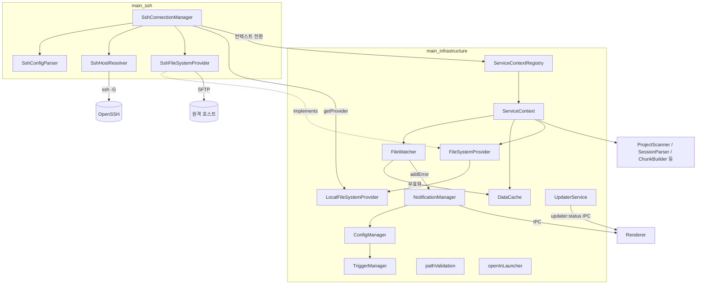
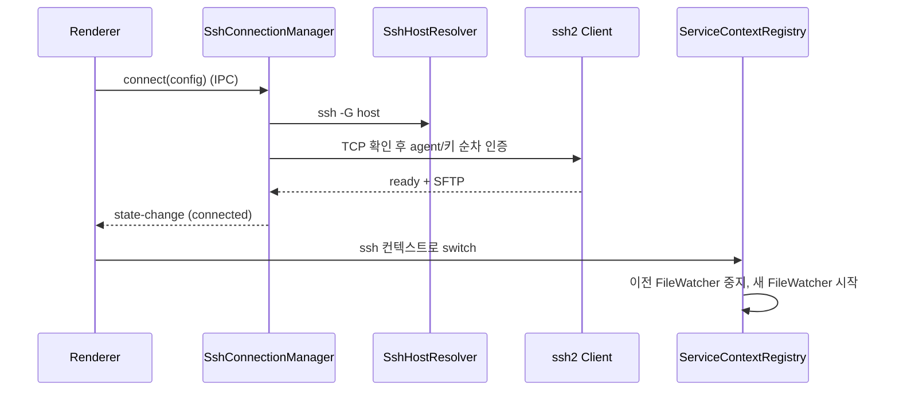

# Platform_Infrastructure_and_Remote_Access 모듈 개요

## 목적

이 모듈은 claude-devtools Electron **메인 프로세스의 플랫폼 인프라 계층**입니다. 코드는 `src/main/services/infrastructure/`에 있습니다. 하위 모듈은 두 개입니다.

- **로컬 인프라** (`main_infrastructure`): 설정 저장, 파일시스템 추상화, 파일 변경 감시, 캐시, 오류 알림, 서비스 컨텍스트 관리, 자동 업데이트, 경로 보안 검증, "Open in..." 런처를 담당합니다.
- **원격 접근** (`main_ssh`): 원격 호스트의 `~/.claude/projects` 세션 파일을 SSH/SFTP로 읽게 해 줍니다. SSH 설정 해석, 인증 후보 탐색, 연결 수명주기 관리, SFTP 기반 `FileSystemProvider` 구현이 여기에 속합니다.

두 하위 모듈은 `FileSystemProvider` 인터페이스로 연결됩니다. 세션 파싱, 탐색, 감시를 하는 상위 서비스는 로컬인지 원격인지 구분하지 않고 같은 코드로 동작합니다.

## 아키텍처

### 전체 구조

### 원격 연결 흐름

## 핵심 동작

- **컨텍스트 분리**: `ServiceContext`가 워크스페이스(local/ssh)마다 서비스 묶음을 따로 만들고, `ServiceContextRegistry`가 활성 컨텍스트를 전환합니다. `local` 컨텍스트는 삭제할 수 없습니다.
- **변경 감시와 캐시**: `FileWatcher`가 100ms 디바운스로 `.jsonl` 변경을 감지하고 `DataCache`(LRU+TTL)를 무효화합니다. 추가된 줄만 증분 파싱해 오류를 감지하고 `NotificationManager`에 넘깁니다. SSH 모드에서는 3초 폴링을 씁니다.
- **원격 연결**: OpenSSH(`ssh -G`)에 설정 해석을 맡기고, 단일 세션에서 `authHandler`로 agent → IdentityFile → 기본 키 순서로 인증합니다. 연결 상태는 `disconnected → connecting → connected / error`로 바뀝니다. 연결이 끊기면 provider는 자동으로 `LocalFileSystemProvider`로 돌아갑니다.
- **보안과 안정성**: `pathValidation`이 민감 경로를 막고 허용 디렉터리 안인지 확인합니다. 사용자 정규식은 ReDoS 검증을 거칩니다. SFTP는 transient 오류에 한해 재시도합니다. 쓰기(설정, 알림)는 항상 로컬에서만 일어납니다.

## 핵심 컴포넌트 문서

| 하위 모듈 | 주요 컴포넌트 | 문서 |
|-----------|---------------|------|
| main_infrastructure | `ConfigManager`, `TriggerManager`, `FileSystemProvider`/`LocalFileSystemProvider`, `DataCache`, `FileWatcher`, `NotificationManager`, `ServiceContext`/`ServiceContextRegistry`, `UpdaterService`, `pathValidation`, `openInLauncher` | [main_infrastructure.md](main_infrastructure.md) |
| main_ssh | `SshConnectionManager`, `SshConfigParser`, `SshHostResolver`, `SshFileSystemProvider` | [main_ssh.md](main_ssh.md) |

## 관련 모듈

- 세션 파싱, 탐색, 오류 감지: [main_analysis_parsing](main_analysis_parsing.md), [main_discovery_search](main_discovery_search.md), [main_error_detection](main_error_detection.md)
- IPC/HTTP 노출 계층: [main_ipc_http](main_ipc_http.md)
- 공유 타입과 API 계약: [main_domain_types](main_domain_types.md), [shared_api_utils](shared_api_utils.md)