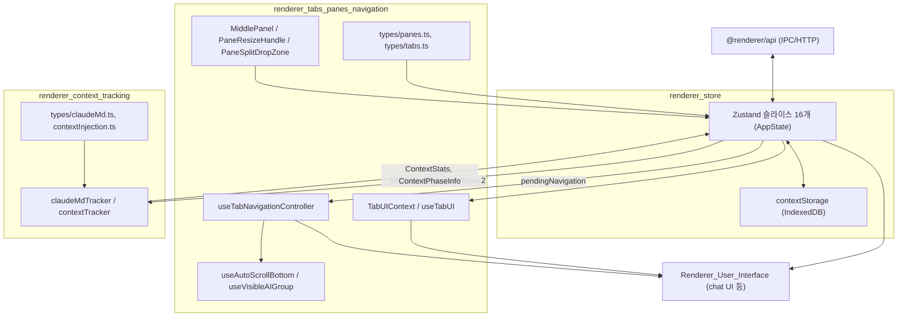
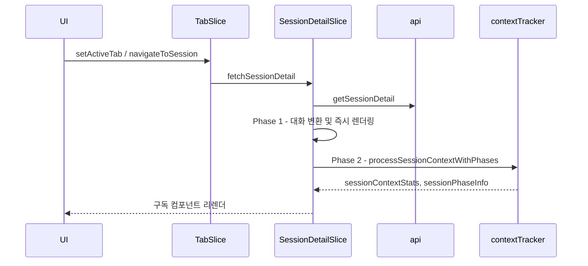

# Renderer_State_and_Navigation 모듈 개요

## 목적

`Renderer_State_and_Navigation`은 claude-devtools 렌더러(React) 프로세스의 **상태 관리, 탭/페인 탐색, 컨텍스트 토큰 추적**을 담당하는 모듈입니다. 구성은 다음과 같습니다.

- 도메인별 Zustand 슬라이스로 전역 상태를 관리합니다. 로컬/SSH 컨텍스트 전환 시에는 IndexedDB 스냅샷을 사용합니다.
- 멀티 페인(최대 4개)과 탭 레이아웃, 탭별 UI 상태 격리, 알림·검색에서 세션 내부 위치로 이동하는 네비게이션, 자동 스크롤을 제공합니다.
- 세션에서 어떤 요소가 컨텍스트 윈도우 토큰을 소비하는지 6개 카테고리로 추정·집계하고, 컴팩션 기준으로 페이즈를 나눕니다.

이 모듈의 상태와 계산 결과는 채팅 UI 등 [Renderer_User_Interface](renderer_chat_ui.md) 계층이 구독해 화면에 표시합니다. 데이터는 `@renderer/api`(IPC/HTTP)를 통해서만 메인 프로세스에서 가져옵니다.

## 아키텍처

### 주요 흐름: 세션 열기와 컨텍스트 통계 계산

## 하위 모듈 요약

| 하위 모듈 | 책임 | 문서 |
|---|---|---|
| `renderer_store` | `AppState`로 합쳐지는 슬라이스(Project, Session, SessionDetail, Tab, Pane, TabUI, Config, Connection, Context, Notification, Update, Memory 등). 2단계 세션 로딩, 경쟁 상태 방어, 로컬/SSH 컨텍스트 스냅샷 전환, 검색, 알림 딥링크 | [renderer_store.md](renderer_store.md) |
| `renderer_tabs_panes_navigation` | `Pane`/`Tab`/`TabNavigationRequest` 타입, `TabUIProvider`/`useTabUI`, `useTabNavigationController`(error/search/autoBottom 요청 처리), `useAutoScrollBottom`, `useVisibleAIGroup`, 페인 리사이즈·드롭 컴포넌트 | [renderer_tabs_panes_navigation.md](renderer_tabs_panes_navigation.md) |
| `renderer_context_tracking` | `ContextInjection` 판별 유니온(6개 카테고리), `claudeMdTracker`, `contextTracker`의 `processSessionContextWithPhases`, 컴팩션 토큰 델타 | [renderer_context_tracking.md](renderer_context_tracking.md) |

## 핵심 설계 포인트

- **탭/페인 파사드**: `PaneSlice.paneLayout`이 진실의 원천이며, `openTabs`·`activeTabId`는 포커스된 페인에서 파생됩니다.
- **탭별 UI 격리**: `tabUIStates`(Map)를 `tabId` 키로 관리하므로, 같은 세션을 여러 탭에서 열어도 확장·스크롤 상태가 독립적입니다.
- **네비게이션 요청 nonce**: 요청마다 새 `id`를 부여하고 `consumeTabNavigation`으로 소비하여 중복 처리를 막습니다.
- **컨텍스트 통계의 메모리 절약**: `accumulatedInjections`는 각 페이즈의 마지막 AI 그룹에만 저장합니다.
- **알려진 불일치**: 프로젝트 `CLAUDE.md`는 팀 카테고리를 `team-coordination`으로 적지만, 실제 코드 식별자는 `task-coordination`(`TaskCoordinationInjection`)입니다.

## 관련 모듈

- [shared_api_utils](shared_api_utils.md): API 타입(`ElectronAPI` 등)
- [main_domain_types](main_domain_types.md): `Project`, `Session`, `SessionDetail` 등
- [main_ipc_http](main_ipc_http.md): `api`의 백엔드
- [renderer_chat_ui](renderer_chat_ui.md): 스토어·훅·통계를 소비하는 채팅 UI

## 테스트

`test/renderer/store/`, `test/renderer/hooks/`, `test/renderer/utils/claudeMdTracker.test.ts`에 테스트가 있으며 `pnpm test`로 실행합니다(`vitest.config.ts`, `happy-dom`).