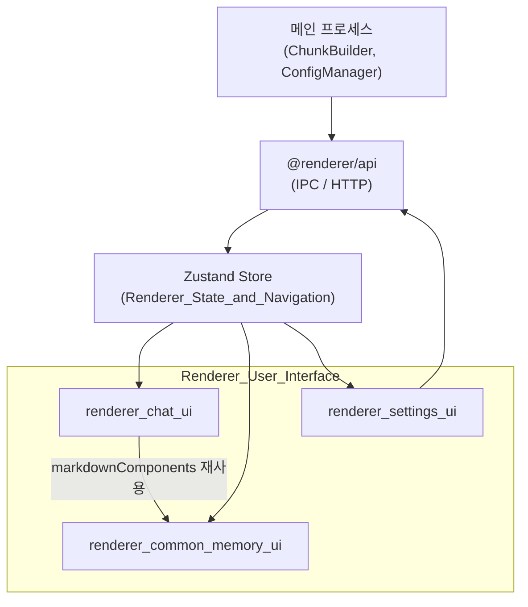
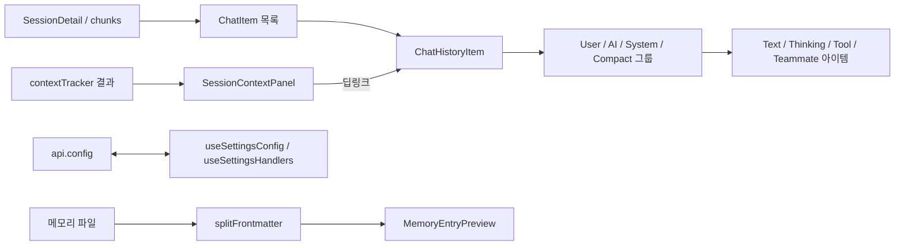

# Renderer_User_Interface 모듈 개요

## 1. 목적

`Renderer_User_Interface`(`src/renderer/components`)는 Electron 렌더러 프로세스의 **화면 계층**입니다. 메인 프로세스가 파싱한 Claude Code 세션 데이터를 사용자가 읽고 탐색할 수 있는 UI로 보여 주고, 앱 설정을 편집하게 합니다. 이 모듈은 표시와 사용자 입력 처리를 맡습니다. 상태 보관, 탭/패널 내비게이션, 컨텍스트 추적은 [Renderer_State_and_Navigation](Renderer_State_and_Navigation.md)이 맡습니다.

하위 모듈은 세 개입니다.

| 하위 모듈 | 경로 | 역할 |
|---|---|---|
| `renderer_chat_ui` | `components/chat` | 세션을 채팅 타임라인으로 렌더링합니다. User/AI/System/Compact 그룹, 도구·사고·팀 메시지 아이템, Visible Context 패널, 검색 하이라이트, 세션 내보내기를 포함합니다. |
| `renderer_common_memory_ui` | `components/common`, `components/memory`, `components/sidebar/memory` | 공용 배지·경로 복사 컴포넌트와, 메모리 `.md` 파일의 frontmatter 파싱 및 미리보기를 제공합니다. |
| `renderer_settings_ui` | `components/settings` | 5개 설정 섹션, 낙관적 갱신 설정 훅, 알림 트리거 생성/편집 폼을 제공합니다. |

## 2. 아키텍처

### 2.1 계층 구조

### 2.2 데이터 흐름

### 2.3 설계 요점

- **채팅 타임라인은 독립 아이템의 평면 리스트입니다.** `ChatHistoryItem`이 `ChatItem.type`에 따라 `UserChatGroup`, `AIChatGroup`, `SystemChatGroup`, `CompactBoundary`로 분기합니다.
- **하이라이트는 검색(노란색), 내비게이션(파란색), 에러 트리거 색 순으로 우선순위를 가집니다.** 컨텍스트 패널은 `onNavigateToTurn`/`onNavigateToTool` 딥링크로 특정 도구까지 이동합니다.
- **설정 변경은 낙관적 갱신을 씁니다.** `useSettingsConfig`가 즉시 반영한 뒤 `api.config.update`를 호출하고, 실패하면 롤백합니다. 성공하면 전역 `appConfig`에 동기화합니다.
- **마크다운 렌더링을 공유합니다.** 메모리 미리보기는 채팅의 `markdownComponents`를 재사용하므로, 별도의 마크다운 스택이 없습니다.
- **테마 대응은 CSS 변수와 Tailwind로 처리합니다.** 다크/라이트 테마를 지원합니다(`.claude/rules/tailwind.md`).

## 3. 핵심 컴포넌트 문서

| 문서 | 주요 내용 |
|---|---|
| [renderer_chat_ui](renderer_chat_ui.md) | `ChatHistoryItem`, `groups.ts` 데이터 모델, `TeammateMessageItem`, `SessionContextPanel`, `searchHighlightUtils`, `slashCommandExtractor`, `sessionExporter` |
| [renderer_common_memory_ui](renderer_common_memory_ui.md) | `ConnectionStatusBadge`, `CopyablePath`, `WorktreeBadge`, `splitFrontmatter`, `MemoryEntryPreview` |
| [renderer_settings_ui](renderer_settings_ui.md) | `SettingsTabs`, `useSettingsConfig`, `useSettingsHandlers`, `NotificationTriggerSettings` (모드/색상/정규식/저장소 범위 폼, 트리거 훅) |

## 4. 관련 모듈

- [Renderer_State_and_Navigation](Renderer_State_and_Navigation.md): Zustand 슬라이스, 탭/패널, 컨텍스트 추적
- [Session_Parsing_and_Analysis_Pipeline](Session_Parsing_and_Analysis_Pipeline.md): 청크 생성
- [Shared_Domain_Contracts](Shared_Domain_Contracts.md): 공유 타입과 API 계약