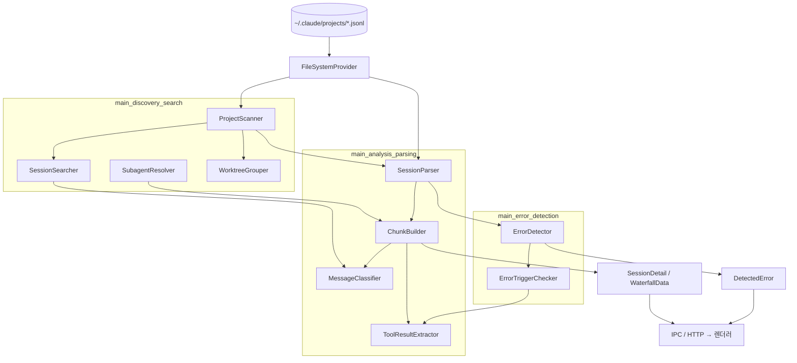
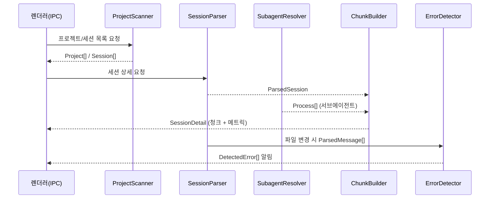

# Session_Parsing_and_Analysis_Pipeline 개요

## 1. 목적

이 모듈(`src/main/services`)은 Electron main 프로세스에서 Claude Code 세션 파일(`~/.claude/projects/{encoded-path}/*.jsonl`)을 처리하는 파이프라인이다. 크게 세 가지 일을 한다.

- **발견·검색**: 프로젝트, 세션, 서브에이전트 파일을 찾고 git 워크트리 단위로 묶으며 전문 검색을 제공한다.
- **파싱·분석**: JSONL을 `ParsedMessage`로 스트리밍 파싱한 뒤 `Chunk`(User/AI/System/Compact)와 메트릭, 워터폴 데이터로 변환한다.
- **에러 감지**: 사용자 정의 `NotificationTrigger` 규칙으로 메시지를 검사해 `DetectedError`를 만든다.

파일 접근은 모두 `FileSystemProvider`를 거치므로 로컬과 SSH를 모두 지원한다.

## 2. 아키텍처

## 3. 처리 흐름

## 4. 하위 모듈

| 모듈 | 경로 | 핵심 컴포넌트 | 설명 |
|------|------|---------------|------|
| main_analysis_parsing | `src/main/services` | `SessionParser`, `MessageClassifier`, `ChunkBuilder`, `ToolResultExtractor`, `ClaudeMdReader`, `GitIdentityResolver` | JSONL 스트리밍 파싱, requestId 중복 제거, 메시지 분류(hardNoise → compact → system → user → ai), 청크·워터폴 생성, 진행 중 세션 판별, 컨텍스트 소비량 계산 |
| main_discovery_search | `src/main/services/discovery` | `ProjectScanner`, `ProjectPathResolver`, `SubprojectRegistry`, `WorktreeGrouper`, `SessionSearcher`, `SubagentResolver`, `MemoryReader` | 프로젝트·세션 스캔과 커서 페이지네이션, 서브프로젝트 분리, 워크트리 그룹화, LRU 캐시 기반 검색, Task 호출과 서브에이전트 연결 |
| main_error_detection | `src/main/services/error` | `ErrorDetector`, `ErrorTriggerChecker`, `ErrorMessageBuilder`, `ErrorTriggerTester`, `regexValidation` | `error_status`, `content_match`, `token_threshold` 트리거 평가, 저장소 범위 필터, 트리거 미리보기, ReDoS 방어 |

## 5. 설계 요점

- **독립 청크**: 청크는 서로 독립적이다. User-AI 쌍을 만들지 않고, `ai` 메시지를 버퍼에 모았다가 다음 `user`/`system`/`compact`를 만나면 `AIChunk`로 내보낸다.
- **isMeta 구분**: `isMeta: false`는 실제 사용자 메시지이고 `true`는 내부 메시지다.
- **성능**: 스트리밍 파싱, mtime+size 기반 캐시, 일괄 처리 동시성 제한, SSH 전용 경량 경로를 쓴다.
- **오류 처리**: try/catch 후 로그를 남기고 안전한 기본값을 반환한다.
- **의존 모듈**: 도메인 타입은 `main_domain_types`, 파일시스템 추상화는 `main_infrastructure`와 `main_ssh`, 전달 계층은 `main_ipc_http`에 있다.

## 6. 핵심 컴포넌트 문서

- [main_analysis_parsing](main_analysis_parsing.md)
- [main_discovery_search](main_discovery_search.md)
- [main_error_detection](main_error_detection.md)