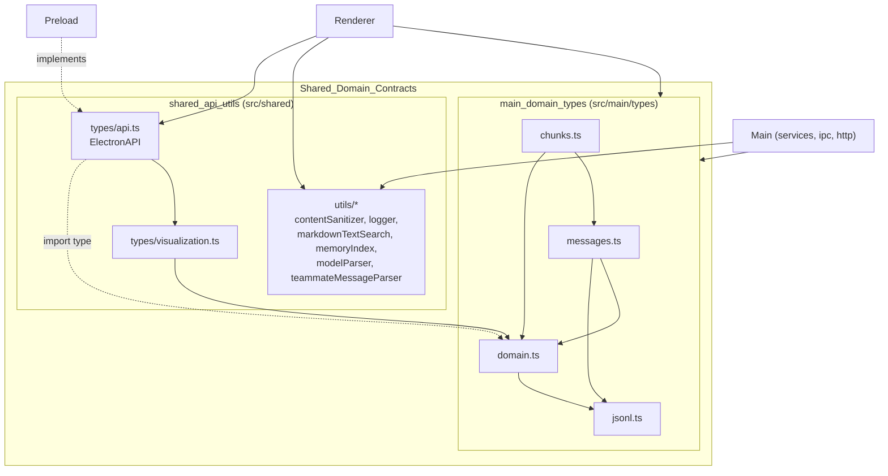
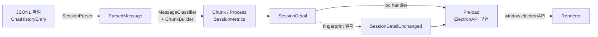

# Shared_Domain_Contracts 개요

## 1. 목적

`Shared_Domain_Contracts`는 Electron의 main / preload / renderer 프로세스가 **공통으로 의존하는 타입 계약과 순수 유틸리티**를 모은 모듈입니다. 두 가지 책임을 가집니다.

- **도메인 타입 계약** (`src/main/types`): Claude Code의 원시 JSONL 항목 → 파싱된 메시지 → 시각화용 Chunk → Project/Session 엔티티까지, 데이터 변환 파이프라인 각 단계의 형태를 고정합니다.
- **API 계약과 공유 유틸** (`src/shared`): `window.electronAPI`(`ElectronAPI`)의 IPC/HTTP 인터페이스, 워터폴 시각화 타입, 콘텐츠 정제·로깅·마크다운 검색·메모리 인덱스·모델 문자열·팀원 메시지 파서를 제공합니다.

인터페이스는 이 모듈에 두고, 구현은 `src/preload/index.ts`(IPC)와 `src/renderer/api/httpClient.ts`(HTTP)에 둡니다. 이렇게 세 프로세스가 같은 형태를 보장받습니다.

## 2. 하위 모듈 구성

| 하위 모듈 | 경로 | 역할 | 문서 |
|---|---|---|---|
| `main_domain_types` | `src/main/types` | `jsonl.ts`, `messages.ts`, `domain.ts`, `chunks.ts` 도메인 타입과 메시지/청크 타입 가드 | [main_domain_types.md](main_domain_types.md) |
| `shared_api_utils` | `src/shared` | `ElectronAPI` 및 하위 API 계약, 시각화 타입, 순수 유틸리티 | [shared_api_utils.md](shared_api_utils.md) |

## 3. 아키텍처

### 3.1 모듈 구조와 의존 관계

도메인 타입 내부의 의존은 단방향(`jsonl` → `domain` → `messages` → `chunks`)이며 순환이 없습니다. `api.ts`는 `import type`만 사용하므로 런타임 의존성이 생기지 않습니다.

### 3.2 데이터 변환과 API 흐름

`getSessionDetail`은 렌더러가 보낸 `knownFingerprint`가 현재 파일 상태와 같으면 전체 payload 대신 `{ unchanged: true, fingerprint }`를 반환해 IPC 직렬화 비용을 줄입니다.

## 4. 핵심 구성 요소

**main_domain_types** ([상세](main_domain_types.md))
- `ChatHistoryEntry`: 원시 JSONL 엔트리 유니온
- `ParsedMessage`와 분류 가드(`isParsedUserChunkMessage`, `isParsedHardNoiseMessage`, `isParsedCompactMessage` 등)
- `Chunk` 유니온(`UserChunk` / `AIChunk` / `SystemChunk` / `CompactChunk`), `Process`, `SemanticStep`, `SessionDetail`
- `Project`, `Session`, `SessionMetrics`, `RepositoryGroup`, 검색·페이지네이션 타입

**shared_api_utils** ([상세](shared_api_utils.md))
- `ElectronAPI`와 하위 API: `NotificationsAPI`, `ConfigAPI`, `SessionAPI`, `UpdaterAPI`, `SshAPI`, `HttpServerAPI`, `MemoryAPI`
- `normalizeSshAuthMethod`: SSH 인증 방식을 `sshConfig | password`로 정규화
- `WaterfallData` / `WaterfallItem`: 워터폴 차트 타입
- 유틸: `sanitizeDisplayContent`, `createLogger`, `findMarkdownSearchMatches`, `parseMemoryIndex`, `parseModelString`, `parseAllTeammateMessages`

## 5. 변경 시 참고

- `ElectronAPI`에 메서드를 추가하면 preload 구현, HTTP 클라이언트/라우트, IPC 핸들러를 함께 갱신합니다.
- 렌더러도 `src/main/types`를 import하므로, 새 필드는 가능한 한 선택적(`?`)으로 추가해 IPC 호환성을 유지합니다.
- `MemoryEntry`/`MemoryIndex`는 `api.ts`와 `memoryIndex.ts`에 중복 정의되어 있어 함께 수정해야 합니다.
- 변경 후 `pnpm typecheck`, `pnpm test`(`test:chunks`, `test:semantic`, `test:noise`, `test:task-filtering` 포함)를 실행합니다.

## 6. 관련 모듈

[main_analysis_parsing](main_analysis_parsing.md) · [main_discovery_search](main_discovery_search.md) · [main_ipc_http](main_ipc_http.md) · [main_ssh](main_ssh.md) · [renderer_store](renderer_store.md) · [renderer_chat_ui](renderer_chat_ui.md)