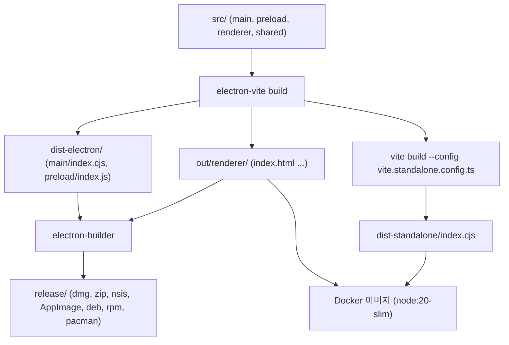
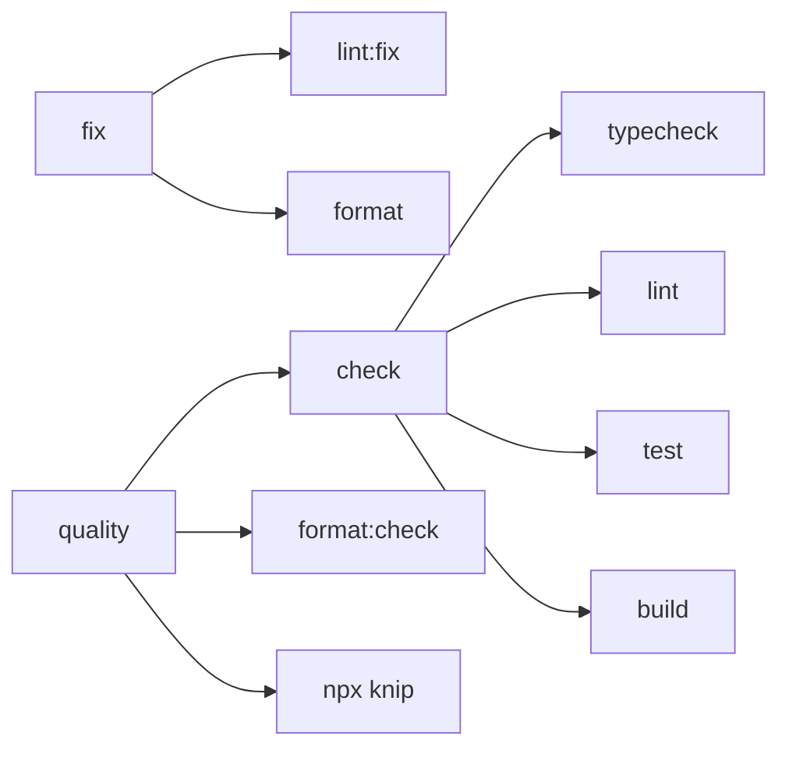
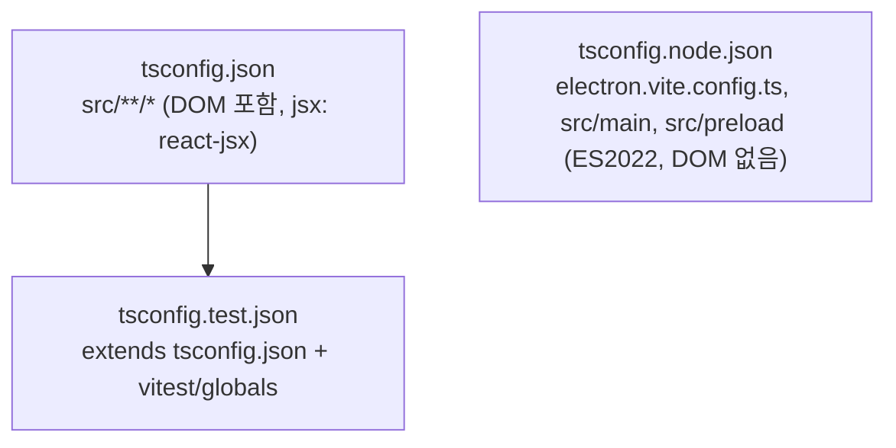
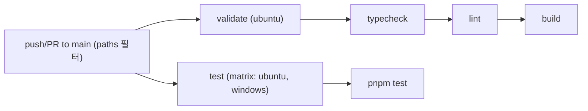
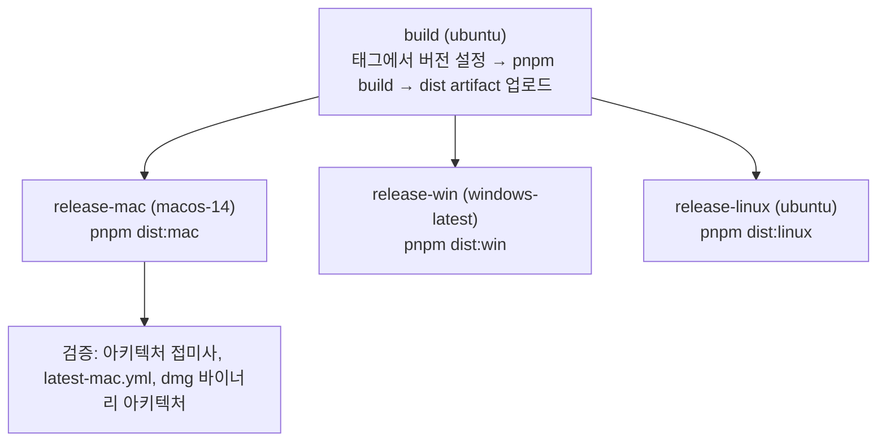
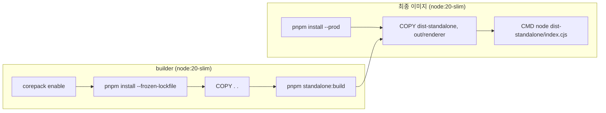
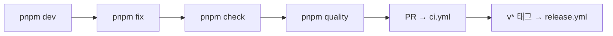

# build_and_config 모듈

`build_and_config`는 claude-devtools의 **빌드, 패키징, CI/CD, 컨테이너 배포, 코드 품질, 테스트 설정**을 담당하는 설정 모듈입니다. 애플리케이션 로직은 포함하지 않으며, 소스 코드(`src/main`, `src/preload`, `src/renderer`, `src/shared`)를 Electron 데스크톱 앱 또는 독립 실행형(standalone) HTTP 서버로 만들어 내는 과정을 정의합니다.

관련 모듈:
- [Platform_Infrastructure_and_Remote_Access](Platform_Infrastructure_and_Remote_Access.md) — standalone 서버/Electron 메인 프로세스가 사용하는 서비스
- [main_ipc_http](main_ipc_http.md) — Docker 이미지가 노출하는 HTTP 서버 및 preload 계층
- [Shared_Domain_Contracts](Shared_Domain_Contracts.md) — `@shared/*` 별칭이 가리키는 공용 타입/유틸

---

## 1. 구성 파일 한눈에 보기

| 영역 | 파일 | 역할 |
|------|------|------|
| 패키지 매니페스트 | `package.json` | 스크립트, 의존성, electron-builder(`build`) 설정 |
| 패키지 매니저 | `pnpm-workspace.yaml` | `electron`, `esbuild`를 `ignoredBuiltDependencies`로 지정 |
| 런타임 버전 | `.nvmrc` | Node.js `20` |
| TypeScript | `tsconfig.json`, `tsconfig.node.json`, `tsconfig.test.json` | 타입 검사 및 경로 별칭 |
| 테스트 | `vitest.config.ts` | Vitest + `happy-dom` |
| 포맷/스타일 | `.editorconfig`, `.prettierrc.json` | 에디터/Prettier 규칙 |
| 미사용 코드 탐지 | `knip.json` | 엔트리/프로젝트/별칭 정의 |
| CI | `.github/workflows/ci.yml` | 타입 검사, lint, 빌드, 테스트 |
| 릴리스 | `.github/workflows/release.yml` | 태그 기반 멀티 OS 패키징/배포 |
| 컨테이너 | `Dockerfile`, `docker-compose.yml` | standalone 서버 이미지 |
| 설치 스크립트 | `resources/afterInstall.sh` | Linux deb 설치 후 sandbox 권한 수정 |

---

## 2. 아키텍처 개요

두 가지 산출물(Electron 앱, standalone 서버)이 동일한 소스에서 생성됩니다.

- `pnpm build` → `electron-vite build` (Electron 앱용 main/preload/renderer 번들)
- `pnpm standalone:build` → `electron-vite build && vite build --config vite.standalone.config.ts` (renderer 출력 + standalone 서버 번들)
- `pnpm dist:*` → `electron-builder`로 설치 파일 생성

---

## 3. package.json

### 3.1 스크립트

| 그룹 | 스크립트 | 동작 |
|------|----------|------|
| 개발 | `dev` | `electron-vite dev` (핫 리로드) |
| | `preview` | `electron-vite preview` |
| 빌드 | `build` | `electron-vite build` |
| 패키징 | `dist` | `electron-builder --mac --win --linux` |
| | `dist:mac` | `--mac --arm64 --x64 --publish always` (한 번에 두 아키텍처) |
| | `dist:mac:arm64`, `dist:mac:x64` | 단일 아키텍처 |
| | `dist:win`, `dist:linux` | `--publish always` |
| 품질 | `typecheck` | `tsc --noEmit` |
| | `lint`, `lint:fix` | `eslint src/` |
| | `format`, `format:check` | `prettier` (`src/**/*.{ts,tsx,js,jsx,json,css}`) |
| | `check` | typecheck → lint → test → build |
| | `fix` | `lint:fix` + `format` |
| | `quality` | `check` + `format:check` + `npx knip` |
| 테스트 | `test` | `vitest run` |
| | `test:watch` | `vitest` |
| | `test:coverage` | `vitest run --coverage` |
| | `test:coverage:critical` | `--config vitest.critical.config.ts` |
| | `test:chunks`, `test:semantic`, `test:noise`, `test:task-filtering` | `tsx test/test-*.ts` 스크립트 직접 실행 |
| Standalone | `standalone` | `tsx src/main/standalone.ts` |
| | `standalone:build` / `standalone:start` | 빌드 / `node dist-standalone/index.cjs` |

> 참고: `vitest.critical.config.ts`는 이번 모듈의 제공 컴포넌트에 포함되어 있지 않습니다. 프로젝트 지침은 항상 `pnpm` 사용을 요구하며, `packageManager`는 `pnpm@10.25.0`으로 고정되어 있습니다.

### 3.2 electron-builder 설정 (`build` 키)

- 공통: `appId: com.claudecode.context`, 출력 `release/`, 포함 파일 `out/renderer/**`, `dist-electron/**`, `package.json`, `asar: true`(`out/renderer/**`는 unpack), `npmRebuild: false`, `extraMetadata.main = dist-electron/main/index.cjs`
- macOS: `dmg` + `zip`, `hardenedRuntime`, `notarize: true`, entitlements 파일, `artifactName: ${productName}-${version}-${arch}.${ext}`
- Windows: `nsis`(oneClick 비활성, 설치 경로 변경 허용, perMachine 아님), `artifactName`에 `Setup` 포함
- Linux: `AppImage`, `deb`, `rpm`, `pacman`; `deb.afterInstall = resources/afterInstall.sh`
- 배포: GitHub provider, `releaseType: draft`

### 3.3 주요 의존성 구분

- 런타임: `fastify`, `@fastify/cors`, `@fastify/static`(standalone HTTP 서버), `ssh2`, `ssh-config`(원격 접근), `electron-updater`, `react`, `zustand`, `mermaid` 등
- 개발: `electron`, `electron-builder`, `electron-vite`, `vite`, `vitest`, `eslint` 플러그인군(boundaries, security, sonarjs 등), `prettier`, `knip`, `tsx`

---

## 4. TypeScript 설정

| 파일 | target | 포함 범위 | 비고 |
|------|--------|-----------|------|
| `tsconfig.json` | ES2020 | `src/**/*` | `strict`, `noEmit`, `moduleResolution: bundler` |
| `tsconfig.node.json` | ES2022 | 빌드 설정, main, preload | `@renderer/*` 별칭 없음 |
| `tsconfig.test.json` | (상속) | `test/**/*`, `src/**/*` | `types: ["node", "vitest/globals"]` |

경로 별칭: `@main/*`, `@renderer/*`, `@preload/*`, `@shared/*`. 이 별칭은 `tsconfig.json`, `knip.json`에 정의되어 있고, `vitest.config.ts`는 `@shared`, `@main`, `@renderer`만 정의합니다(`@preload` 없음).

---

## 5. 테스트 설정 (`vitest.config.ts`)

- `globals: true`, `environment: happy-dom`, `testTimeout: 15000`
- `setupFiles: ./test/setup.ts`, `include: test/**/*.test.ts`
- 커버리지: `v8` provider, `text/json/html` 리포터, `src/**/*.ts(x)` 대상, `*.d.ts`, `src/main/index.ts`, `src/preload/index.ts` 제외

테스트 구조와 규칙은 프로젝트의 `.claude/rules/testing.md`를 참고하세요.

---

## 6. 코드 스타일 및 정적 분석

- `.editorconfig`: UTF-8, LF, 공백 2칸, 마지막 줄 개행, 후행 공백 제거(`*.md`는 제외)
- `.prettierrc.json`: `semi`, `singleQuote`, `printWidth: 100`, `trailingComma: es5`(JSON은 `none`), `prettier-plugin-tailwindcss` 사용, `*.md`는 `proseWrap: preserve`
- `knip.json`: 엔트리 `src/main/index.ts`, `src/main/standalone.ts`, `src/preload/index.ts`, `src/renderer/main.tsx`, `electron.vite.config.ts`, `vite.standalone.config.ts`; 프로젝트 `src/**/*.{ts,tsx}!`; 바이너리 `pkg` 무시

---

## 7. CI 워크플로 (`.github/workflows/ci.yml`)

`main` 브랜치 push와 PR에서 실행되며, `src/**`, `test/**`, `package.json`, `pnpm-lock.yaml`, `tsconfig*.json`, `vite*.config.*`, `vitest*.config.*`, `tailwind.config.*`, `eslint.config.*` 변경 시에만 트리거됩니다.

- 두 잡 모두 Node 20, pnpm 캐시, `pnpm install --no-frozen-lockfile`
- `test` 잡은 `fail-fast: false`로 Windows 호환성까지 검증

---

## 8. 릴리스 워크플로 (`.github/workflows/release.yml`)

`v*` 태그 push 또는 `workflow_dispatch`로 실행됩니다. 권한은 `contents: write`.

핵심 동작:
- **버전 주입**: 태그 `vX.Y.Z`에서 `pnpm pkg set version="X.Y.Z"` 실행
- **입력 검증**: `dist-electron/main/index.cjs`, `dist-electron/preload/index.js`, `out/renderer/index.html` 존재 확인
- **macOS 단일 잡 빌드**: arm64/x64를 한 번의 electron-builder 호출로 빌드합니다. 아키텍처별로 잡을 나누면 각 업로드가 `latest-mac.yml`을 덮어써 `electron-updater`가 잘못된 아키텍처 dmg를 배포하는 문제(#186)가 생기기 때문입니다.
- **macOS 사후 검증 3단계**:
  1. 산출물 이름에 `-arm64`/`-x64` 접미사 존재
  2. `latest-mac.yml`에 두 아키텍처 dmg 모두 기재
  3. 각 dmg를 마운트해 `file` 명령으로 바이너리 아키텍처 일치 확인
- **서명/공증 시크릿**(macOS): `CSC_LINK`, `CSC_KEY_PASSWORD`, `APPLE_ID`, `APPLE_APP_SPECIFIC_PASSWORD`, `APPLE_TEAM_ID`; 공통으로 `GH_TOKEN`
- Linux: `libarchive-tools`, `rpm` 설치(pacman/rpm 타깃용); mac/win/linux 모두 Python 3.11 설정(node-gyp)

---

## 9. 컨테이너 배포

### 9.1 Dockerfile (멀티 스테이지)

- 프로덕션 스테이지는 `fastify`, `@fastify/cors`, `@fastify/static`이 번들에서 externalize되므로 `--prod` 의존성만 설치합니다.
- 환경 변수: `NODE_ENV=production`, `CLAUDE_ROOT=/data/.claude`, `HOST=0.0.0.0`, `PORT=3456`; 포트 `3456` 노출
- 실행: `docker run -p 3456:3456 -v ~/.claude:/data/.claude:ro claude-devtools`

### 9.2 docker-compose.yml

서비스 `claude-devtools`는 로컬 `Dockerfile`로 빌드하고, `${PORT:-3456}:3456` 포트 매핑, `${CLAUDE_DIR:-~/.claude}`를 `/data/.claude`에 **읽기 전용**으로 마운트하며 `restart: unless-stopped`로 동작합니다. 서버는 외부 네트워크 호출(텔레메트리, 업데이터)이 없으므로 `network_mode: "none"` 주석을 해제하면 완전 격리가 가능합니다.

HTTP 서버 구현은 [main_ipc_http](main_ipc_http.md), 세션 데이터를 읽는 파이프라인은 [Session_Parsing_and_Analysis_Pipeline](Session_Parsing_and_Analysis_Pipeline.md)을 참고하세요.

---

## 10. resources/afterInstall.sh

Linux `deb` 설치 후 실행되어 `/opt/${productFilename}/chrome-sandbox`의 소유자를 `root:root`, 권한을 `4755`(SUID)로 설정합니다. 이는 Electron SUID sandbox 요구사항(electron/electron#17972) 때문입니다.

---

## 11. 개발자 워크플로 요약

빌드 문제 발생 시: `rm -rf dist dist-electron node_modules && pnpm install && pnpm build`.

## 12. 알아둘 점

- CI와 릴리스는 `--no-frozen-lockfile`을 사용하지만 Docker 빌드는 `--frozen-lockfile`을 사용합니다. 잠금 파일이 어긋나면 Docker 빌드만 실패할 수 있습니다.
- `package.json`의 `main`은 `dist-electron/main/index.cjs`이며 릴리스 검증 단계와 일치해야 합니다.
- `electron.vite.config.ts`, `vite.standalone.config.ts`, `eslint.config.*`는 이 모듈의 제공 컴포넌트에 없지만 위 스크립트와 CI 경로 필터가 참조합니다.
