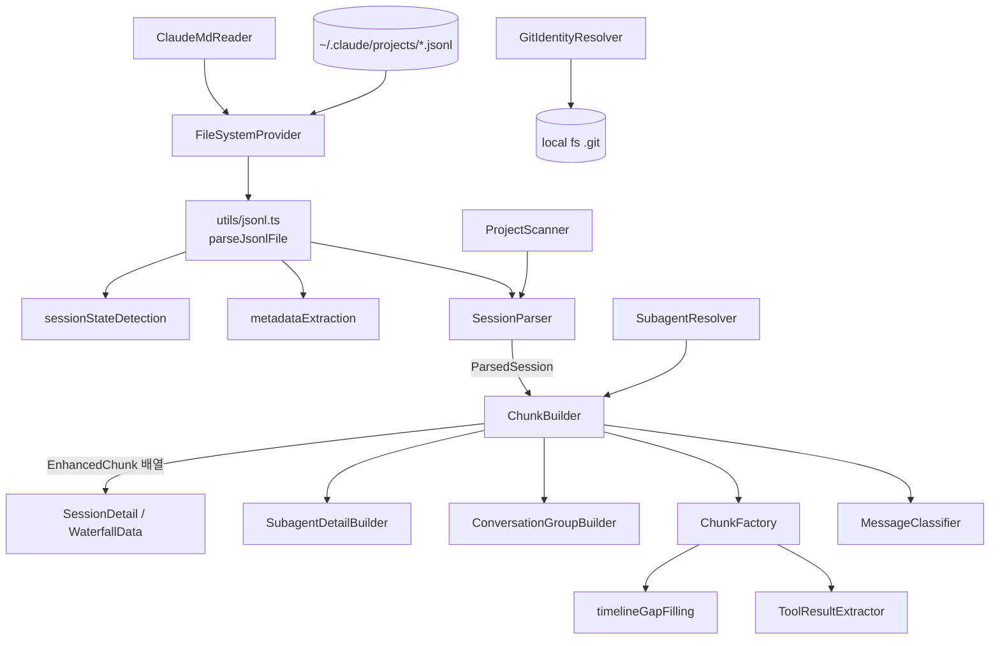
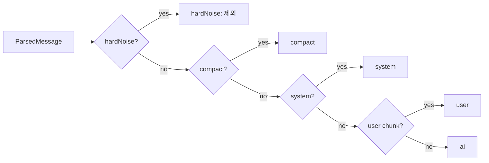
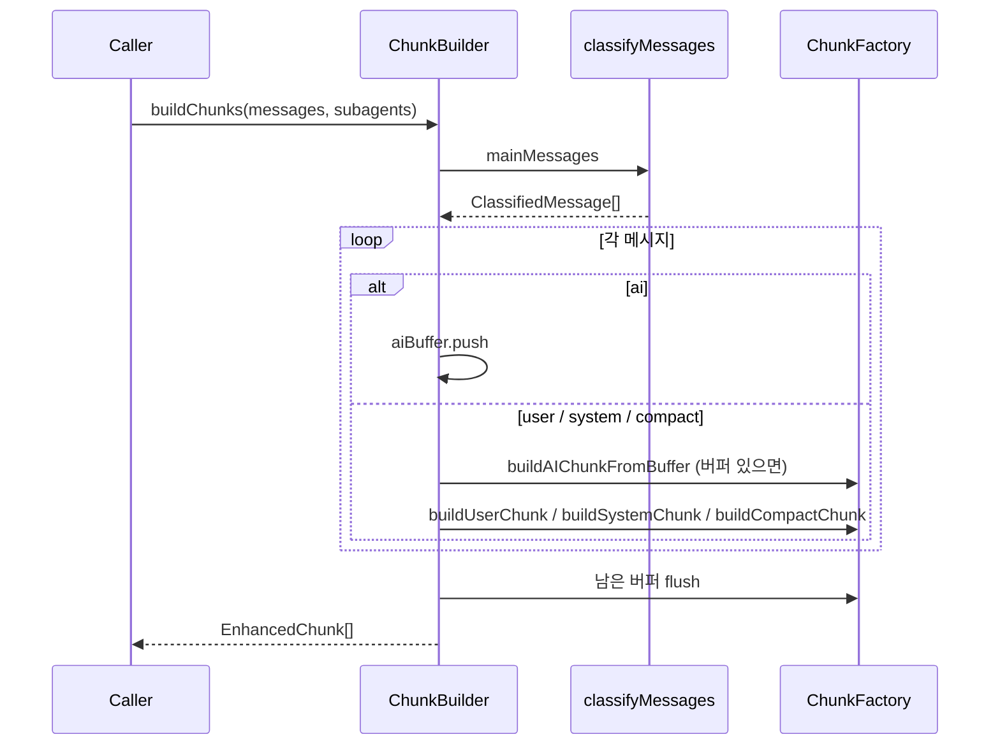
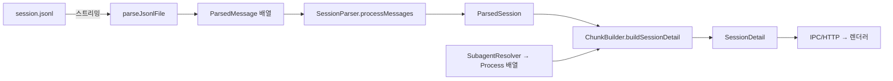

# main_analysis_parsing 모듈

Claude Code 세션 JSONL 파일(`~/.claude/projects/{encoded-path}/*.jsonl`)을 읽어 구조화된 메시지로 파싱하고, 시각화용 청크(Chunk)와 메트릭으로 변환하는 **메인 프로세스 분석·파싱 파이프라인**이다. 이 문서는 `Session_Parsing_and_Analysis_Pipeline`의 하위 모듈 중 `main_analysis_parsing`만 다루며, 나머지는 아래 링크를 참조한다.

- 탐색/검색: [main_discovery_search](main_discovery_search.md)
- 에러 감지: [main_error_detection](main_error_detection.md)
- 도메인 타입(`ParsedMessage`, `Chunk`, `Process` 등): [main_domain_types](main_domain_types.md)
- 파일시스템 추상화(`FileSystemProvider`): [main_infrastructure](main_infrastructure.md)
- 공유 유틸(`logger`, `contentSanitizer`): [shared_api_utils](shared_api_utils.md)

## 1. 구성 요소 개요

| 파일 | 핵심 요소 | 역할 |
|------|-----------|------|
| `services/parsing/SessionParser.ts` | `SessionParser`, `ParsedSession` | JSONL → `ParsedMessage[]`, 타입별 분류, 메트릭, 스레드/서브에이전트 파싱 |
| `utils/jsonl.ts` | `SessionFileMetadata` 외 | 스트리밍 파싱, requestId 중복 제거, `calculateMetrics`, 단일 패스 메타데이터 분석 |
| `utils/metadataExtraction.ts` | `MessagePreview` | `extractCwd`, `extractFirstUserMessagePreview` |
| `utils/sessionStateDetection.ts` | `Activity` | `checkMessagesOngoing` (진행 중 세션 판별) |
| `services/parsing/MessageClassifier.ts` | `ClassifiedMessage` | 메시지를 5개 카테고리로 분류 |
| `services/analysis/ChunkBuilder.ts` | `ChunkBuilder` | 청크 생성, 세션 상세, 워터폴 데이터, 서브에이전트 상세 |
| `services/analysis/ToolResultExtractor.ts` | `ExtractedToolResult`, `ToolResultInfo`, `ToolUseInfo` | tool_use/tool_result 맵, 토큰 추정, 결과 추출 |
| `utils/timelineGapFilling.ts` | `GapFillingInput` | 시맨틱 스텝의 타임라인 공백 채우기 |
| `services/parsing/ClaudeMdReader.ts` | `ClaudeMdFileInfo`, `ClaudeMdReadResult` | CLAUDE.md 계열 파일 읽기 및 토큰 추정 |
| `services/parsing/GitIdentityResolver.ts` | `GitIdentityResolver` | git/worktree 저장소 식별 |

## 2. 아키텍처

`ChunkFactory`, `ConversationGroupBuilder`, `SubagentDetailBuilder` 등은 이 모듈의 핵심 컴포넌트 목록에는 없지만 `ChunkBuilder`가 위임하는 협력 모듈이다.

## 3. 주요 컴포넌트

### 3.1 JSONL 파싱 (`utils/jsonl.ts`, `SessionParser`)
- `parseJsonlFile(filePath, fsProvider)`: `readline`으로 한 줄씩 스트리밍(대용량 파일을 통째로 메모리에 올리지 않음). 빈 줄은 건너뛰고, 파싱 실패 줄은 로그만 남기고 무시한다.
- `parseChatHistoryEntry`: `uuid`가 없거나 알 수 없는 `type`인 항목은 `null`로 버린다. 지원 타입: `user`, `assistant`, `system`, `summary`, `file-history-snapshot`, `queue-operation`. `isMeta`, `isSidechain`, `isCompactSummary`, `toolUseResult`, `sourceToolUseID` 등을 `ParsedMessage`로 옮긴다.
- `deduplicateByRequestId`: 스트리밍 중 같은 `requestId`로 여러 줄이 기록되므로 **마지막 항목만** 유지한다. `calculateMetrics`는 이 중복 제거 후 토큰을 합산한다 (`totalTokens = input + cacheCreation + cacheRead + output`).
- `SessionParser.processMessages`: 단일 패스로 `byType`(user/realUser/internalUser/assistant/system/other)과 `mainMessages`/`sidechainMessages`를 분류하고 `taskCalls`를 추출해 `ParsedSession`을 반환한다.
- 보조 기능: `getResponses`, `buildMessageTree`, `getThread`(조상+자손), `parseAllSubagents`(`agent-{id}.jsonl` 파일명에서 ID 추출).

### 3.2 세션 메타데이터 단일 패스 분석 (`analyzeSessionFileMetadata`)
세션 목록 표시 시 파일을 여러 번 읽지 않도록 한 번의 스트림에서 다음을 계산하고 `SessionFileMetadata`로 반환한다.
- 첫 사용자 메시지(커맨드 출력/중단 메시지 제외, `/command` 폴백), `messageCount`, `gitBranch`, `hasDisplayableContent`
- `isOngoing`: 마지막 "종료 이벤트"(텍스트 출력, `ExitPlanMode`, 승인된 `SendMessage` shutdown_response, 사용자 거부/중단) 이후에 thinking/tool_use/tool_result 활동이 있는지 여부
- 컨텍스트 소비량: 메인 스레드 assistant의 입력 토큰(input + cache read + cache creation)을 추적하고, `isCompactSummary` 시점마다 phase를 나눠 `phaseBreakdown`(`PhaseTokenBreakdown`)과 `compactionCount`, `contextConsumption`을 계산한다.

`sessionStateDetection.checkMessagesOngoing`은 동일한 진행 중 판별 로직을 `ParsedMessage[]`(서브에이전트 포함)에 적용하는 버전이다.

### 3.3 MessageClassifier

판별 순서는 hardNoise → compact → system → user → ai이며, 나머지(assistant, tool result 등)는 모두 `ai`가 된다.

### 3.4 ChunkBuilder
`buildChunks(messages, subagents)`는 `isSidechain`이 아닌 메시지만 분류한 뒤, `ai` 메시지를 버퍼에 쌓다가 `user`/`system`/`compact`를 만나면 버퍼를 `AIChunk`로 flush한다. 모든 청크는 서로 **독립적**이다(User-AI 쌍 없음).

그 외 메서드:
- `buildGroups`: `ConversationGroupBuilder`에 위임하는 대체 그룹화 전략(Task 실행 분리).
- `buildSessionDetail`: 청크 + `calculateMetrics` + 서브에이전트를 묶어 `SessionDetail` 반환.
- `buildWaterfallData`: 청크(level 0), 도구 실행·서브에이전트(level 1)를 `WaterfallItem`으로 만들고, 어떤 AI 청크에도 붙지 않은 프로세스는 방어적으로 추가한 뒤 시작 시간순 정렬. 항목이 없으면 `now` 기준 빈 데이터를 반환한다.
- `getTotalChunkMetrics`, `findChunkByMessageId`, `findChunkBySubagentId`, `buildSubagentDetail`(drill-down, `buildChunks`를 콜백으로 전달).

### 3.5 ToolResultExtractor
- `buildToolUseMap`: `tool_use_id → ToolUseInfo{name,input}` (content 블록과 `toolCalls` 모두 확인).
- `buildToolResultMap`: `tool_use_id → ToolResultInfo{content,isError}` (content 블록, `toolResults`, `toolUseResult`+`sourceToolUseID` 세 경로).
- `extractToolResults`: 세 가지 저장 패턴을 모두 처리해 `ExtractedToolResult[]`(트리거 매칭용, [main_error_detection](main_error_detection.md)에서 사용)를 반환.
- `estimateTokens`: 공용 tokenizer(`countContentTokens`)로 UI와 일관된 토큰 수 계산.

### 3.6 timelineGapFilling
`fillTimelineGaps`는 스텝을 시작 시각순으로 정렬하고, 각 스텝의 `effectiveEndTime`을 다음 스텝 시작(100ms 이내 병렬 스텝은 건너뜀)까지 늘린다. 100ms 초과 지속 시간이 있는 `subagent` 스텝은 실제 시간을 유지(`isGapFilled=false`)한다. 마지막 스텝은 청크 종료 시각까지 확장된다.

### 3.7 ClaudeMdReader
`readAllClaudeMdFiles(projectRoot, fsProvider)`는 다음 위치를 `Map<string, ClaudeMdFileInfo>`로 반환한다: `enterprise`(OS별 경로), `user`, `project`, `project-alt`, `project-rules`(`.claude/rules/*.md` 재귀), `project-local`, `user-rules`, `auto-memory`(MEMORY.md 앞 200줄만). `~`는 `app.getPath('home')`로 확장하며, 파일이 없거나 읽기 실패 시 `exists: false`의 안전한 기본값을 반환한다. `readDirectoryClaudeMd`는 파일 읽기에서 감지된 디렉터리별 CLAUDE.md용이다. 이 결과는 렌더러의 컨텍스트 추적([renderer_context_tracking](renderer_context_tracking.md))에서 소비된다.

### 3.8 GitIdentityResolver
싱글톤 `gitIdentityResolver`가 저장소 정체성을 해석한다.
- `resolveIdentity`: 상위 디렉터리로 올라가며 `.git` 탐색 → 파일이면 worktree(`gitdir:` 파싱 후 메인 `.git` 추출), 디렉터리면 메인 저장소 → `realpath` 정규화 → `[remote "origin"]` URL 읽기 → SHA-256 앞 12자 ID 생성. 파일시스템에 없으면 경로 패턴 휴리스틱(`resolveIdentityFromPath`)으로 폴백(삭제된 worktree 대응).
- ID 생성: 원격 URL이 있으면 로컬 디렉터리명 기반(worktree 그룹화), 없으면 전체 경로 기반(동명 저장소 충돌 방지).
- `detectWorktreeSource`: `vibe-kanban`, `conductor`, `auto-claude`, `21st`, `claude-desktop`, `ccswitch`, `git`를 경로 패턴만으로 판별(`@main/constants/worktreePatterns` 사용).
- `isWorktree`, `getBranch`(detached HEAD 처리), `getWorktreeDisplayName`도 제공. 사용처는 [main_discovery_search](main_discovery_search.md)의 `WorktreeGrouper`.

## 4. 데이터 흐름

## 5. 설계상 주의점
- **isMeta**: `false`는 실제 사용자 메시지(새 청크 생성), `true`는 tool result 등 내부 메시지.
- Task tool_use 필터링(서브에이전트가 있으면 제거, 고아 Task는 유지)은 청크 생성 단계(`ChunkFactory`/`ProcessLinker`)에서 수행된다.
- 오류 처리: 메인 프로세스 규칙에 따라 try/catch + 로그 후 안전한 기본값 반환.
- 파일 접근은 `FileSystemProvider`를 통해 로컬/SSH 모두 지원한다(`GitIdentityResolver`는 예외로 로컬 `fs` 직접 사용).
- 테스트: `test/main/services/analysis/`(ChunkBuilder), `test/main/services/parsing/`(SessionParser, MessageClassifier), `test/main/utils/jsonl.test.ts`. 실행은 `pnpm test`, `pnpm test:chunks`, `pnpm test:noise` 등(`vitest.config.ts`, `package.json` 참조).
