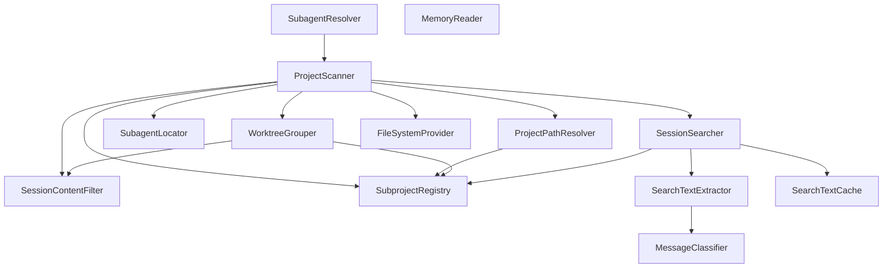
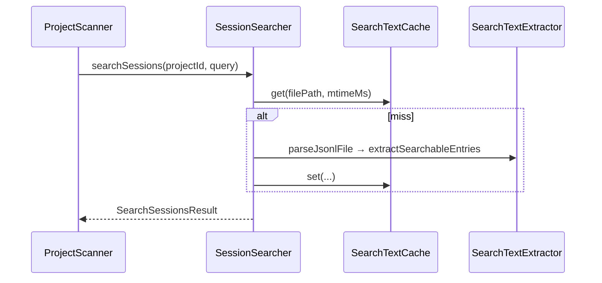

# main_discovery_search 모듈

## 개요

`main_discovery_search`는 Electron main 프로세스에서 `~/.claude/projects/{encoded-path}/*.jsonl` 세션 파일을 **발견(discovery)**하고 **검색(search)**하는 서비스 집합이다 (`src/main/services/discovery/`). 담당 기능:

- 프로젝트/세션 목록 스캔, 페이지네이션, 메타데이터 생성 (`ProjectScanner`)
- 프로젝트 경로 해석 (`ProjectPathResolver`), cwd 불일치 시 서브프로젝트 분리 (`SubprojectRegistry`)
- git 저장소/워크트리 단위 그룹화 (`WorktreeGrouper`)
- 노이즈 전용 세션 필터링 (`SessionContentFilter`)
- 세션 전문 검색 (`SessionSearcher`, `SearchTextExtractor`, `SearchTextCache`)
- 서브에이전트 파일 탐색 및 Task 호출 연결 (`SubagentLocator`, `SubagentResolver`)
- 프로젝트별 memory 디렉터리 읽기 (`MemoryReader`)

모든 파일 접근은 `FileSystemProvider`(로컬 `LocalFileSystemProvider` 또는 SSH)를 통하며, SSH일 때는 배치 크기·검사 범위를 줄이는 별도 최적화가 적용된다. 파서/청크 빌더는 [main_analysis_parsing](main_analysis_parsing.md), 파일 시스템 추상화는 [main_infrastructure](main_infrastructure.md) 및 [main_ssh](main_ssh.md), 도메인 타입(`Project`, `Session`, `Process` 등)은 [main_domain_types](main_domain_types.md)를 참고한다.

## 아키텍처

## 컴포넌트 설명

### ProjectScanner
진입점 파사드. 주요 기능:
- `scan()`: 프로젝트 디렉터리를 순회해 `Project[]` 반환 (최근 활동순). 한 디렉터리 내 세션들의 `cwd`가 둘 이상이면 `subprojectRegistry`로 서브프로젝트(복합 ID)로 분할. SSH에서는 본문을 읽지 않으므로 분할하지 않음.
- `scanWithWorktreeGrouping()`: `WorktreeGrouper`에 위임.
- `listSessions()` / `listSessionsPaginated()`: base64 커서(`timestamp`+`sessionId`) 기반 페이지네이션. `light`/`deep` 메타데이터 수준, 노이즈 세션 제외, SSH에서는 deep 실패 시 light로 폴백.
- 캐시: `contentPresenceCache`, `sessionMetadataCache`(mtime+size 키), 검색용 프로젝트 목록 30초 캐시. `invalidateCachesForProject()`는 FileWatcher가 호출.
- `searchSessions()`, `searchAllProjects()`, `findSessionById()`, `findSessionsByPartialId()`, `loadTodoData()`(`~/.claude/todos/{sessionId}.json`).
- 5분 이상 쓰기 없는 "진행 중" 세션은 종료된 것으로 처리(`isOngoing`).
- `collectFulfilledInBatches()`로 동시성 제한(SFTP 과부하 방지).

### ProjectPathResolver
프로젝트 ID → 실제 경로. 우선순위: 레지스트리 cwd → `cwdHint` → 세션 JSONL의 cwd(`extractCwd`) → `decodePath` 폴백(손실 가능). projectId별 메모이즈, `invalidateProject()`/`clear()` 제공.

### SubprojectRegistry
싱글톤(`subprojectRegistry`). 복합 ID `{encodedDir}::{sha256(cwd).slice(0,8)}`와 cwd, 소속 sessionId 집합을 관리. `register`, `getBaseDir`, `isComposite`, `getSessionFilter`, `getCwd`, `clear`.

### WorktreeGrouper
`gitIdentityResolver`로 저장소 identity·브랜치를 구해 프로젝트를 `RepositoryGroup`/`Worktree`로 묶음. 메인 워크트리 우선·최근 활동순 정렬, 세션 없는 워크트리 제외. 노이즈 필터는 기본 꺼짐(`CLAUDE_DEVTOOLS_STRICT_SESSION_FILTER=1`일 때만 활성).

### SessionContentFilter
정적 메서드로 세션에 표시 가능한 콘텐츠가 있는지 판단(`hasNonNoiseMessages`, `isDisplayableEntry`). 하드 노이즈: `system`/`summary`/`file-history-snapshot`/`queue-operation` 엔트리, sidechain, `<synthetic>` 모델, `<local-command-caveat>`/`<system-reminder>`만 있는 사용자 메시지. ChunkBuilder의 분류와 일관되게 유지된다.

### 검색: SessionSearcher / SearchTextExtractor / SearchTextCache

- `SearchTextExtractor`: ChunkBuilder의 분류 루프를 가볍게 재현. 사용자 텍스트와 AI 버퍼의 **마지막 text 블록**만 `SearchableEntry`로 추출(도구 실행·메트릭 계산 생략). 첫 사용자 텍스트 100자가 `sessionTitle`.
- `SearchTextCache`: 파일 경로별 LRU(기본 1000개), 조회 시 mtime 불일치면 무효화.
- `SessionSearcher`: 대소문자 무시 `indexOf` 매칭, 전후 50자 컨텍스트. SSH "fast mode"는 단계(40/140/320개)·4.5초 예산으로 부분 결과(`isPartial`) 반환.

### SubagentLocator / SubagentResolver
- `SubagentLocator`: 신규 구조 `{projectId}/{sessionId}/subagents/agent-*.jsonl`과 레거시 `{projectId}/agent-*.jsonl`(첫 줄의 `sessionId`로 소속 확인) 모두 지원.
- `SubagentResolver`: 서브에이전트 파일을 파싱해 `Process`로 변환(Warmup, `acompact*` 제외). Task 호출 연결 3단계: (1) tool result의 `agentId` 매칭, (2) 팀 멤버는 Task 설명과 `<teammate-message summary>` 매칭, (3) 남은 것은 시간순 위치 매칭. `parentUuid` 체인으로 팀 메타데이터를 연속 파일에 전파, 색상은 `teammate_spawned` 결과에서 보강. 시작 시각 100ms(`PARALLEL_WINDOW_MS`) 이내면 병렬로 표시.

### MemoryReader
`~/.claude/projects/<id>/memory/`의 `MEMORY.md` 인덱스와 `.md` 파일을 읽음(`hasMemory`, `readIndex`, `readFile`). 경로 구분자, `..`, 비 `.md` 이름을 거부해 디렉터리 이탈을 방지.

## 설계 메모
- 오류 처리: try/catch 후 로깅하고 빈 결과 등 안전한 기본값 반환.
- 성능: mtime+size 기반 메모이제이션, 배치 동시성 제한, SSH 전용 경량 경로.
