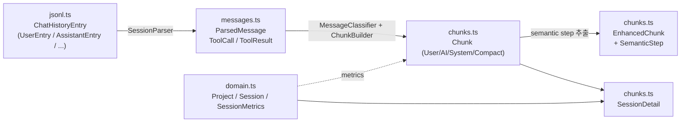
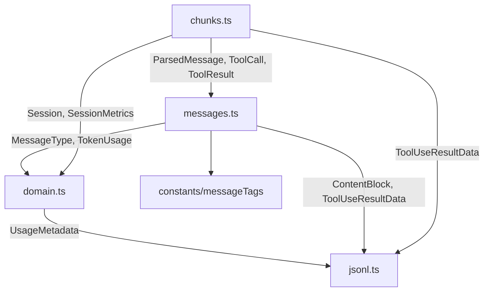
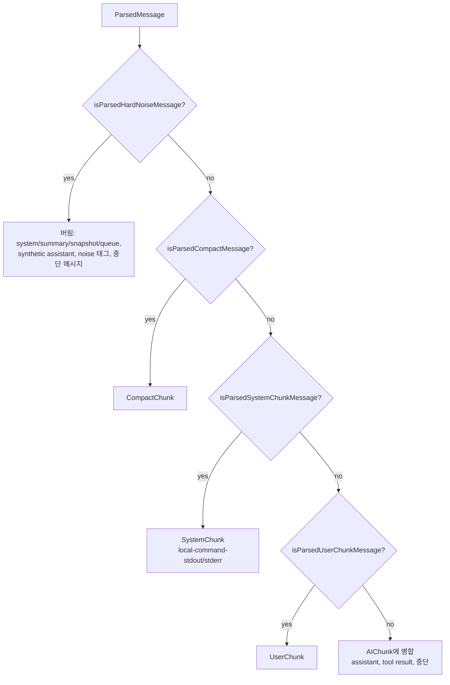
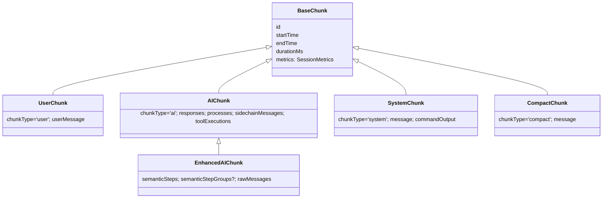
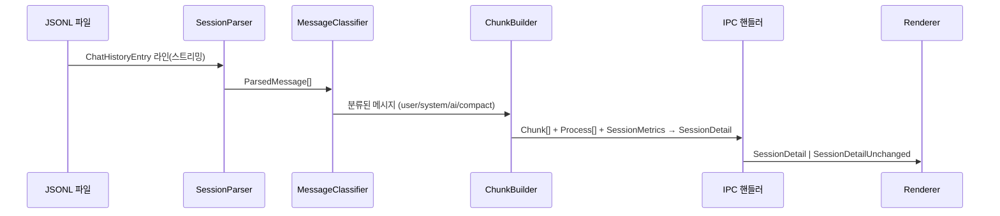

# main_domain_types 모듈

`main_domain_types`는 메인 프로세스(및 IPC를 통해 렌더러)가 공유하는 **핵심 도메인 타입 계약**을 정의하는 모듈이다. Claude Code가 남기는 원시 JSONL 항목부터, 파싱된 메시지, 시각화용 청크(Chunk), 프로젝트/세션 도메인 엔티티까지 데이터 변환 파이프라인의 각 단계 형태를 타입으로 고정한다.

구성 파일:

| 파일 | 역할 |
|------|------|
| `src/main/types/jsonl.ts` | `~/.claude/projects/{project}/{session}.jsonl`의 원시 구조 |
| `src/main/types/messages.ts` | 파싱된 내부 표현 `ParsedMessage` + 분류 타입 가드 |
| `src/main/types/domain.ts` | Project/Session/Worktree/검색/페이지네이션/메트릭 |
| `src/main/types/chunks.ts` | Chunk, Process, SemanticStep, SessionDetail 등 시각화 타입 |

상위 모듈 [Shared_Domain_Contracts](Shared_Domain_Contracts.md)에 속하며, 형제 모듈 [shared_api_utils](shared_api_utils.md)는 IPC/Electron API 계약을 담당한다.

## 1. 아키텍처: 데이터 변환 단계별 타입

파싱/분류/청크 빌드 구현은 [main_analysis_parsing](main_analysis_parsing.md), 프로젝트·세션 탐색은 [main_discovery_search](main_discovery_search.md)을 참고한다.

## 2. 의존 관계

의존은 단방향(`jsonl` → `domain` → `messages` → `chunks`)이며 순환이 없다.

## 3. `jsonl.ts` — 원시 JSONL 타입

- **콘텐츠 블록**: `TextContent`, `ThinkingContent`, `ToolUseContent`, `ToolResultContent`, `ImageContent` → 유니온 `ContentBlock`. (`BaseContent`는 `type` 판별자만 가진 공통 베이스.)
- **`UsageMetadata`**: `input_tokens`, `output_tokens`, 선택적 `cache_read_input_tokens`/`cache_creation_input_tokens`.
- **메시지**: `UserMessage`(content는 `string | ContentBlock[]`), `AssistantMessage`(model, usage, stop_reason 포함).
- **엔트리**: `BaseEntry`(type/timestamp/uuid) → `ConversationalEntry`(parentUuid, `isSidechain`, cwd, sessionId, gitBranch …) → `UserEntry`, `AssistantEntry`, `SystemEntry`. 비대화형: `SummaryEntry`, `FileHistorySnapshotEntry`, `QueueOperationEntry`.
- **`ChatHistoryEntry`**: 위 모든 엔트리의 유니온. `isConversationalEntry`, `isTextContent`, `isToolResultContent` 가드 제공.
- **`ToolUseResultData`**: `Record<string, unknown>`. 도구별로 구조가 크게 달라 손실 없이 보존한다.

핵심 규칙 (주석 및 CLAUDE.md 기준):

- `UserEntry`는 두 용도로 쓰인다. `isMeta: false` + 문자열 content = 실제 사용자 입력(새 청크 시작), `isMeta: true` + `tool_result` 배열 = 내부 메시지(도구 결과).
- 서브에이전트: `isSidechain: true`, `sessionId`가 부모 세션 UUID를 가리킨다. 디렉터리 구조는 신규(`{session_uuid}/agent_*.jsonl`)와 레거시(루트의 `agent_*.jsonl`) 둘 다 지원된다.
- 도구 연결: `tool_use.id` ↔ `tool_result.tool_use_id` (또는 `sourceToolUseID`).

## 4. `messages.ts` — ParsedMessage와 분류 가드

`ParsedMessage`는 원시 엔트리를 정규화한 내부 표현이다. `timestamp`는 `Date`, 추출된 `toolCalls: ToolCall[]`과 `toolResults: ToolResult[]`, 그리고 `isSidechain`, `isMeta`, `isCompactSummary`, `requestId`(스트리밍 중복 제거용), `agentId`, `usage`, `model` 등을 포함한다.

- `ToolCall`: `id`, `name`, `input`, `isTask`, `taskDescription?`, `taskSubagentType?`
- `ToolResult`: `toolUseId`, `content`, `isError`

### 메시지 분류 가드

| 가드 | 의미 |
|------|------|
| `isParsedRealUserMessage` | `type==='user'`, `isMeta` 아님, 문자열 또는 text/image 블록 포함 |
| `isParsedUserChunkMessage` | 실제 UserChunk 시작. `SYSTEM_OUTPUT_TAGS`로 시작하는 내용, `[Request interrupted by user…]`, 팀메이트 메시지 제외. `<command-name>`(슬래시 명령)은 허용 |
| `isParsedSystemChunkMessage` | `<local-command-stdout>`/`stderr`로 시작하는 user 엔트리 |
| `isParsedInternalUserMessage` | `type==='user' && isMeta===true` |
| `isParsedHardNoiseMessage` | 절대 표시하지 않는 메시지 |
| `isParsedCompactMessage` | `isCompactSummary === true` |

비공개 `isParsedTeammateMessage`는 `<teammate-message teammate_id="…">` 정규식으로 팀메이트 메시지를 감지하며, 이런 메시지는 UserChunk에서 제외된다(렌더러에서 `TeammateMessageItem`으로 표시).

## 5. `domain.ts` — 도메인 엔티티

- **별칭**: `TokenUsage = UsageMetadata`, `MessageType`, `MessageCategory`(`user | system | hardNoise | ai | compact`).
- **`Project`**: 인코딩된 디렉터리명(`-Users-name-project`)을 `id`로, 디코딩 경로 `path`, 세션 ID 목록, 생성/최근 활동 타임스탬프.
- **`Session`**: 메타데이터(`firstMessage`, `messageCount`, `hasSubagents`, `isOngoing`, `gitBranch`), `metadataLevel`(`'light' | 'deep'`), 컨텍스트 소비(`contextConsumption`, `compactionCount`, `phaseBreakdown: PhaseTokenBreakdown[]`).
- **`PhaseTokenBreakdown`**: 컴팩션 인식 단계별 `phaseNumber`, `contribution`, `peakTokens`, `postCompaction?`.
- **`SessionMetrics`**: `durationMs`, 토큰 4종(`inputTokens`, `outputTokens`, `cacheReadTokens`, `cacheCreationTokens`) + `totalTokens`, `messageCount`, `costUsd?`.
- **저장소 그룹화**: `RepositoryIdentity`(원격 URL/메인 git 디렉터리 기반) ← `Worktree`(`source: WorktreeSource`, `isMainWorktree`) ← `RepositoryGroup`. 비-git 프로젝트는 단일 worktree 그룹. `WorktreeSource`는 `vibe-kanban`, `conductor`, `auto-claude`, `21st`, `claude-desktop`, `ccswitch`, `git`, `unknown`. 구현은 `WorktreeGrouper`([main_discovery_search](main_discovery_search.md)).
- **검색**: `SearchResult`(세션/프로젝트, 매치 텍스트·컨텍스트, in-session 이동용 `groupId`/`itemType`/`matchIndexInItem`/`matchStartOffset`), `SearchSessionsResult`(`isPartial` 포함), `FindSessionByIdResult`, `FindSessionsByPartialIdResult`.
- **페이지네이션**: `SessionCursor`(timestamp + sessionId 복합 커서), `PaginatedSessionsResult`, `SessionsPaginationOptions`(`includeTotalCount`, `prefilterAll`, `metadataLevel`), `SessionsByIdsOptions`(기본값은 SSH=light, 로컬=deep).

## 6. `chunks.ts` — 시각화 타입

### Chunk 유니온

- `Chunk = UserChunk | AIChunk | SystemChunk | CompactChunk`는 `chunkType`으로 판별된다. AIChunk는 독립적이며 부모 UserChunk를 참조하지 않는다.
- `BaseChunk`는 export되지 않는 내부 인터페이스다.
- `EnhancedUserChunk` / `EnhancedSystemChunk` / `EnhancedCompactChunk`는 디버그 사이드바용 `rawMessages`를 추가하고, `EnhancedChunk`는 이들의 유니온이다.
- 가드: `isUserChunk`, `isAIChunk`, `isEnhancedAIChunk`(`'semanticSteps' in chunk`), `isSystemChunk`, `isCompactChunk`.
- `EMPTY_METRICS` 상수는 메트릭 초기화용.

### Process, ToolExecution, TaskExecution

- **`Process`**: 해석된 서브에이전트. 파일 경로, 메시지, 시간, `metrics`, `description`/`subagentType`(Task 호출에서), `isParallel`, `parentTaskId`, `isOngoing`, 메인 세션 컨텍스트에 미치는 영향 `mainSessionImpact`(call/result/total 토큰), 팀 메타데이터 `team?: { teamName, memberName, memberColor }`. 해석 로직은 `SubagentResolver`.
- **`ToolExecution`**: `toolCall` + 선택적 `result` + 타이밍.
- **`TaskExecution`**: Task 호출 ↔ 서브에이전트(`Process`) ↔ 결과 메시지 연결.
- **`ConversationGroup`**: 실제 사용자 메시지 1개 + 이후 AI 응답/프로세스/도구 실행/Task 실행을 묶는 단순화된 대안 그룹(`type: 'user-ai-exchange'`).

### SemanticStep

`SemanticStepType`: `thinking | tool_call | tool_result | subagent | output | interruption`. `SemanticStep`은 타입별 `content`, 토큰 귀속(`tokens`, `tokenBreakdown`), 병렬 정보(`isParallel`, `groupId`), `context: 'main' | 'subagent'`, 갭 채우기 결과(`effectiveEndTime`, `effectiveDurationMs`, `isGapFilled`), 컨텍스트 누적(`contextTokens`, `accumulatedContext`)을 담는다. `SemanticStepGroup`은 같은 assistant 메시지(`sourceMessageId`)의 스텝을 접이식 UI용으로 묶는다.

> Task `tool_use`는 대응 서브에이전트가 있으면 스텝 추출 시 필터링되고, 짝 없는 Task 호출은 가시성을 위해 유지된다.

### 세션 상세

- **`SessionDetail`**: `session`, `messages`, `chunks`, `processes`, `metrics`, 선택적 `fingerprint`(mtimeMs+size 기반 불투명 문자열).
- **`SessionDetailUnchanged`** `{ unchanged: true, fingerprint }`: 렌더러가 보낸 `knownFingerprint`가 현재와 같을 때 반환되어 재변환·재렌더를 생략하게 한다.
- **`SessionDetailResponse`** = `SessionDetail | SessionDetailUnchanged` (`null`은 오류/미발견).
- **`SubagentDetail`**: 드릴다운 모달용 서브에이전트 청크·그룹·요약 메트릭.
- **`FileChangeEvent`**: `add | change | unlink`, `path`, `projectId?`, `sessionId?`, `isSubagent` (FileWatcher 이벤트, [main_infrastructure](main_infrastructure.md)).

## 7. 시스템 내 위치와 데이터 흐름

- 구현 모듈: [main_analysis_parsing](main_analysis_parsing.md) (파싱/분류/청크), [main_discovery_search](main_discovery_search.md) (프로젝트·세션·서브에이전트 탐색, 검색).
- 전송 계층: [main_ipc_http](main_ipc_http.md)이 위 타입을 IPC/HTTP로 전달한다.
- 소비자: 렌더러는 청크를 `AIGroup`/`UserGroup` 등으로 변환해 표시한다 ([renderer_chat_ui](renderer_chat_ui.md)). 컨텍스트 추적은 [renderer_context_tracking](renderer_context_tracking.md) 참고.

## 8. 유지보수 참고

- 타입 변경 후에는 `pnpm typecheck`와 `pnpm test:chunks`, `pnpm test:semantic`, `pnpm test:noise`, `pnpm test:task-filtering`을 실행한다 (`package.json` 스크립트).
- 메시지 분류 가드 수정은 `MessageClassifier`/`ChunkBuilder` 동작을 직접 바꾸므로 `test/main/services/parsing`, `test/main/services/analysis` 테스트를 반드시 확인한다.
- 이 모듈의 `src/main/types/*`는 메인 프로세스 경로이지만 렌더러도 타입을 import하므로, 새 필드는 가능한 한 선택적(`?`)으로 추가해 IPC 호환성을 유지한다.
