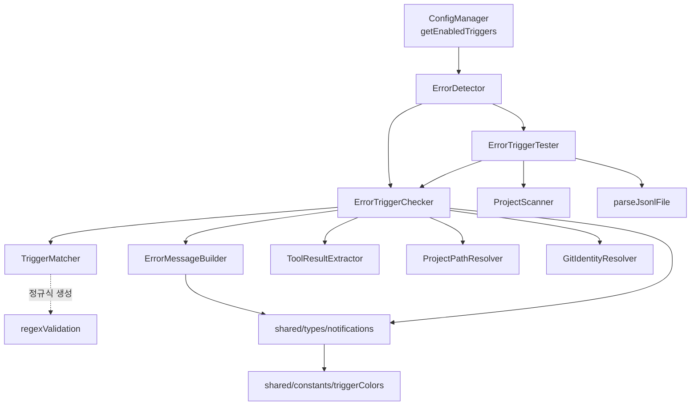
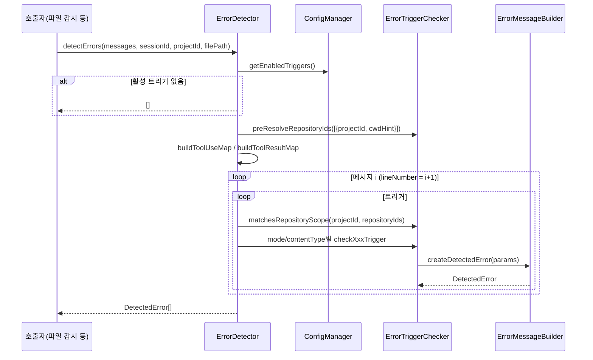
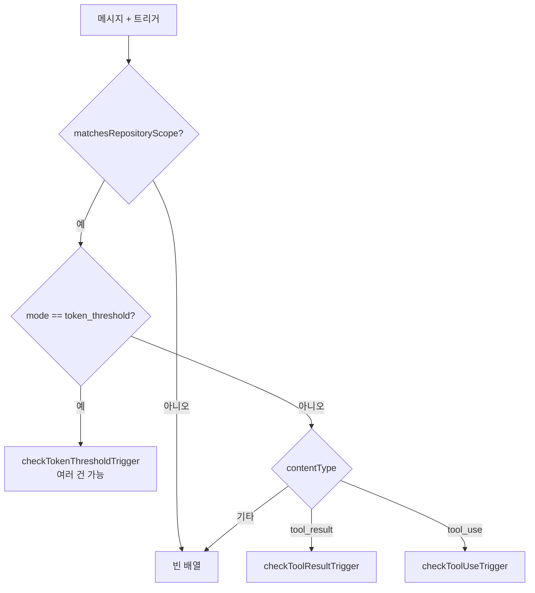
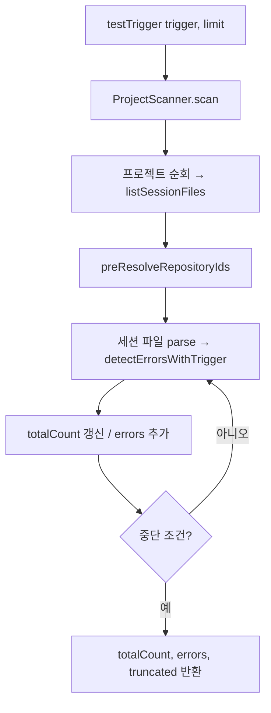

# main_error_detection 모듈

## 개요

`main_error_detection`은 Claude Code 세션 JSONL(`ParsedMessage[]`)을 사용자 정의 **트리거(NotificationTrigger)** 규칙으로 검사하여 알림 대상 `DetectedError`를 생성하는 Main 프로세스 모듈입니다. 세 가지 모드를 지원합니다.

- `error_status`: `tool_result.is_error === true`일 때 발생
- `content_match`: 정규식(`matchPattern`)이 `tool_result` 내용 또는 `tool_use` 입력 필드에 일치할 때 발생
- `token_threshold`: 개별 `tool_use`(호출 + 결과)의 추정 토큰 수가 임계값을 초과할 때 발생

또한 설정 화면의 "트리거 미리보기"를 위해 과거 세션을 스캔하는 `testTrigger` 기능과, 사용자가 입력한 정규식의 ReDoS 위험을 막는 `regexValidation` 유틸을 포함합니다.

## 구성 요소

| 파일 | 역할 |
|------|------|
| `src/main/services/error/ErrorDetector.ts` | 오케스트레이터. 싱글턴 `errorDetector` 제공. `detectErrors()`, `testTrigger()` |
| `src/main/services/error/ErrorTriggerChecker.ts` | 트리거 유형별 검사(`checkToolResultTrigger`, `checkToolUseTrigger`, `checkTokenThresholdTrigger`)와 저장소 범위(`matchesRepositoryScope`, `preResolveRepositoryIds`, `RepositoryScopeTarget`) |
| `src/main/services/error/ErrorMessageBuilder.ts` | `DetectedError` 생성(`createDetectedError`, `CreateDetectedErrorParams`), 오류 메시지 추출, 툴 이름 조회, 500자 절단 |
| `src/main/services/error/ErrorTriggerTester.ts` | 과거 세션 대상 트리거 미리보기(`testTrigger`, `TestState`) |
| `src/main/utils/regexValidation.ts` | `validateRegexPattern`, `createSafeRegExp`, `RegexValidationResult` |
| `src/shared/types/notifications.ts` | `NotificationTrigger`, `DetectedError`(렌더러용), `TriggerTestResult`, `AppConfig` |
| `src/shared/constants/triggerColors.ts` | `TriggerColorDef`, 색상 프리셋/하이라이트 클래스 |

> 코드에서 import되지만 이 모듈 소유가 아닌 `TriggerMatcher`(`matchesPattern`, `matchesIgnorePatterns`, `extractToolUseField`, `getContentBlocks`)와 `ToolSummaryFormatter`(`getToolSummary`, `formatTokens`)는 제공된 컴포넌트에 포함되지 않아 상세를 기술하지 않습니다.

## 아키텍처

- `ToolResultExtractor`는 [main_analysis_parsing](main_analysis_parsing.md), `ProjectScanner`/`ProjectPathResolver`는 [main_discovery_search](main_discovery_search.md), `ConfigManager`/`TriggerManager`는 [main_infrastructure](main_infrastructure.md)를 참고하세요.
- 공유 도메인 타입(`ParsedMessage`)은 [main_domain_types](main_domain_types.md)에 있습니다.

## 탐지 데이터 흐름

### 트리거 라우팅 (`ErrorDetector.checkTrigger`)

`thinking`/`text` contentType은 타입에는 있으나 현재 라우터에서 처리되지 않아 빈 배열을 반환합니다.

## 핵심 동작 상세

### 저장소 범위(Repository Scope)
- `repositoryIdCache`(모듈 수준 `Map`)에 `projectId → repositoryId`를 캐시합니다.
- `matchesRepositoryScope`는 **동기**이며 캐시만 조회합니다. 캐시에 없으면 `null`로 간주하여 `repositoryIds`가 지정된 트리거는 **매칭 실패**합니다. 따라서 검사 전에 반드시 `preResolveRepositoryIds`로 캐시를 채워야 합니다(`ErrorDetector`와 `ErrorTriggerTester` 모두 수행).
- `repositoryIds`가 비어 있으면 모든 저장소에 적용됩니다.

### checkToolResultTrigger
1. `requireError`가 true면 `isError`인 결과만 대상으로 `extractErrorMessage` → `ignorePatterns` 검사 → `DetectedError` 반환.
2. 아니면 `toolName`이 지정된 경우 `toolUseMap`으로 호출 툴 이름을 확인하고, `matchField === 'content'`이며 `matchPattern`이 있을 때 내용 일치/무시 패턴을 검사합니다. 메시지는 `Tool result matched: <앞 200자>`.
3. 메시지당 최대 1건을 반환합니다.

### checkToolUseTrigger
`assistant` 메시지의 `tool_use` 블록에서 `toolName`, `matchField` 값(없으면 입력 JSON 전체), `matchPattern`, `ignorePatterns`를 차례로 검사하며 첫 일치 시 1건 반환합니다.

### checkTokenThresholdTrigger
- 호출 토큰 = `estimateTokens(name + JSON.stringify(input))`, 결과 토큰 = `estimateTokens(toolResult.content)`.
- `tokenType`: `input`(호출만), `output`(결과만), `total`(합, 기본값).
- `content` 배열과 `toolCalls`를 합쳐 id 기준으로 중복 제거 후 각 `tool_use`를 개별 평가합니다. `tokenCount <= threshold`이면 건너뜁니다.
- 메시지 형식: `<Tool> - 
 : ~<토큰>[ input|output] tokens`.

### DetectedError 생성
`createDetectedError`는 `randomUUID()`로 id를 만들고 메시지를 500자로 절단(`...` 추가)하며 `triggerColor/Id/Name`을 채웁니다. `ErrorMessageBuilder.DetectedError`는 Main 내부용이고, `shared/types/notifications.ts`의 `DetectedError`는 `isRead`, `createdAt`이 추가된 알림 저장/렌더러용 타입입니다.

## 트리거 미리보기 (`ErrorTriggerTester`)

`TEST_LIMITS` 안전장치:

| 항목 | 값 | 동작 |
|------|----|------|
| `MAX_ERRORS` | 50 | 반환 개수 상한(`effectiveLimit = min(limit, 50)`), 도달 시 경고 없이 종료 |
| `MAX_TOTAL_COUNT` | 10,000 | `totalCount` 상한, 도달 시 `truncated = true` |
| `TIMEOUT_MS` | 30,000 | 초과 시 경고 로그 + `truncated = true` |

`TestState`가 `errors`, `totalCount`, `sessionsScanned`, `truncated`, `startTime`, `effectiveLimit`를 추적합니다. 파싱 실패 파일은 로그 후 건너뛰며, 전체 예외 시 `{ totalCount: 0, errors: [] }`를 반환합니다. 참고: `shared/types/notifications.ts`의 `TriggerTestResult` 주석에는 "최대 100 세션"이 적혀 있으나 `ErrorTriggerTester`에는 세션 수 제한이 구현되어 있지 않습니다(주석과 구현 불일치).

또한 `ErrorTriggerTester.checkTrigger`는 `ErrorDetector.checkTrigger`와 로직이 중복되어 있으므로 라우팅 규칙 변경 시 양쪽을 함께 수정해야 합니다.

## 정규식 검증 (`regexValidation.ts`)

사용자 정의 패턴의 ReDoS를 방지합니다. `validateRegexPattern`은 다음을 순서대로 검사합니다.

1. 비어 있지 않은 문자열
2. 길이 ≤ 100 (`MAX_PATTERN_LENGTH`)
3. `DANGEROUS_PATTERNS`(중첩 수량자, 겹치는 alternation, 수량자 중첩, 역참조+수량자, 긴 문자 클래스+수량자) 미해당
4. 괄호 균형(`areBracketsBalanced`, 이스케이프/문자 클래스 처리)
5. `new RegExp()` 컴파일 가능

`createSafeRegExp(pattern, flags='i')`는 검증 실패 시 `null`을 반환합니다. 트리거 저장 시 검증은 [main_infrastructure](main_infrastructure.md)의 `TriggerManager`와 IPC 계층([main_ipc_http](main_ipc_http.md))에서 활용됩니다.

## 공유 타입과 색상

- `NotificationTrigger`: `id`, `name`, `enabled`, `contentType`, `mode`, `toolName`, `requireError`, `matchField`, `matchPattern`, `ignorePatterns`, `tokenThreshold`, `tokenType`, `repositoryIds`, `color`, `isBuiltin`.
- `AppConfig`: `notifications`(triggers 포함), `general`, `display`, `sessions`, 선택적 `ssh`, `httpServer`.
- `TriggerColor`는 프리셋 키(`red`…`cyan`) 또는 `#hex`. `triggerColors.ts`는 `getTriggerColorDef`, `resolveColorHex`, `getHighlightProps`, `getToolHighlightProps`를 제공하며 에러 탐색 시 채팅 그룹/툴 항목 하이라이트에 사용됩니다. 기본색은 `red`입니다. UI 쪽은 [renderer_settings_ui](renderer_settings_ui.md), [renderer_chat_ui](renderer_chat_ui.md)를 참고하세요.

## 시스템 내 위치 및 유의점

- 호출은 파일 변경 감시 → 알림 생성 경로([main_infrastructure](main_infrastructure.md)의 `FileWatcher`, `NotificationManager`)에서 이루어지며, 생성된 `DetectedError`는 `lineNumber`, `toolUseId`, `subagentId`로 렌더러에서 딥링크됩니다.
- 오류 처리: Main 프로세스 관례대로 try/catch + 로그 후 안전한 기본값 반환(미리보기), 트리거 없을 때 빈 배열 반환.
- 테스트: `pnpm test`(vitest). 관련 테스트는 `test/main/utils/regexValidation.test.ts` 등에 있습니다.
