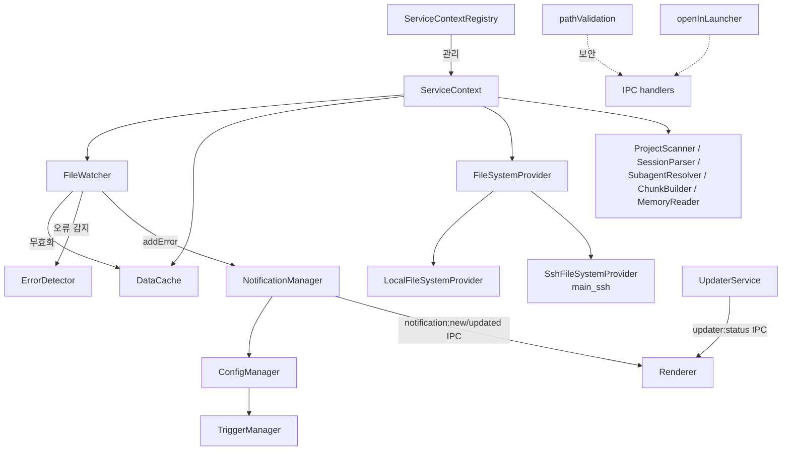
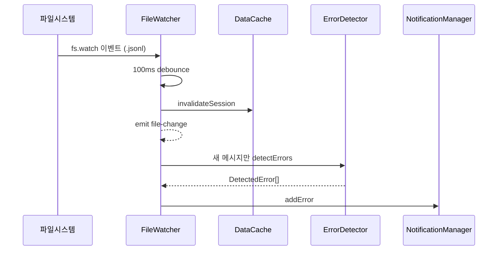

# main_infrastructure 모듈

## 개요

`main_infrastructure`는 Electron 메인 프로세스의 **플랫폼 인프라 계층**입니다. 설정 저장, 파일시스템 추상화, 파일 변경 감시, 캐시, 알림, 서비스 컨텍스트 관리, 자동 업데이트, 경로 보안 검증, "Open in..." 런처를 제공합니다. 모든 서비스는 `src/main/services/infrastructure/`와 `src/main/utils/`에 있습니다.

SSH 관련 구현(`SshConnectionManager`, `SshFileSystemProvider` 등)은 [main_ssh](main_ssh.md)에서, 세션 파싱/탐색/오류 감지는 [main_analysis_parsing](main_analysis_parsing.md), [main_discovery_search](main_discovery_search.md), [main_error_detection](main_error_detection.md)에서 다룹니다. IPC/HTTP 노출 계층은 [main_ipc_http](main_ipc_http.md)를 참고하세요.

## 아키텍처

## 컴포넌트 설명

### ConfigManager (`ConfigManager.ts`)
- `~/.claude/claude-devtools-config.json`을 로드/저장하는 싱글턴. `initializeInstance()`로 비동기 초기화하며, 파일이 없거나 JSON이 깨지면 기본값을 사용합니다.
- `AppConfig`는 `notifications`, `general`, `display`, `sessions`, `ssh`, `httpServer` 섹션으로 구성됩니다 (`NotificationConfig`, `GeneralConfig`, `DisplayConfig`, `SessionsConfig`, `SshPersistConfig`, `HttpServerConfig`).
- `mergeWithDefaults()`로 누락 필드를 채우고, `claudeRootPath`는 절대경로로 정규화한 뒤 `setClaudeBasePathOverride()`에 반영합니다.
- 기능: 무시 정규식/저장소 관리(`addIgnoreRegex`는 `validateRegexPattern`으로 ReDoS 검증), 스누즈(`setSnooze`, `isSnoozed`), 세션 pin/hide(일괄 처리 포함), SSH 프로필 CRUD, `resetToDefaults`, `reload`.
- `getConfig()`는 항상 deep clone을 반환합니다.

### TriggerManager (`TriggerManager.ts`)
- 알림 트리거(`NotificationTrigger`)의 CRUD와 검증. 모드는 `error_status`, `content_match`, `token_threshold`.
- `DEFAULT_TRIGGERS`: `.env File Access Alert`, `Tool Result Error`, `High Token Usage` (모두 기본 비활성, `isBuiltin`).
- 내장 트리거는 삭제 불가(비활성화만 가능), `isBuiltin`은 수정 불가. `mergeTriggers()`는 사용자 수정본을 보존하면서 누락된 내장 트리거를 추가하고 폐기된 내장 트리거를 제거합니다.
- `validate()`는 필수 필드, 모드별 조건, 정규식 안전성을 검사하고 `TriggerValidationResult`를 반환합니다.

### FileSystemProvider / LocalFileSystemProvider
- `FileSystemProvider`는 읽기 전용 파일시스템 추상 인터페이스(`exists`, `readFile`, `stat`, `readdir`, `createReadStream`, `dispose`; `type: 'local' | 'ssh'`). 보조 타입: `FsStatResult`, `FsDirent`, `ReadStreamOptions`.
- `LocalFileSystemProvider`는 Node `fs` 래퍼입니다. `readdir`는 각 항목을 병렬 `stat`하여 `mtimeMs`를 채워 `SessionSearcher`의 캐시 무효화에 사용됩니다.
- 쓰기 작업(ConfigManager, NotificationManager)은 항상 로컬에 머뭅니다.

### DataCache (`DataCache.ts`)
- `SessionDetail`/`SubagentDetail`용 LRU + TTL 캐시 (기본 50개, 10분, 스키마 버전 `CURRENT_VERSION = 2`).
- Map 삽입 순서로 LRU를 구현하며, `get(key, fingerprint)`의 fingerprint(`mtimeMs-size`)가 다르면 무효화합니다 (macOS FSEvents 누락 대비).
- 키: `projectId/sessionId`, 서브에이전트는 `subagent-projectId-sessionId-subagentId`. `invalidateSession`, `invalidateProject`, `cleanExpired`, `startAutoCleanup`, `dispose` 제공. `projectId::...` 복합 ID도 매칭합니다.

### FileWatcher (`FileWatcher.ts`)
- `~/.claude/projects/`(재귀)와 `~/.claude/todos/`를 감시하고 `file-change`, `todo-change`, `memory-change` 이벤트를 발행하는 `EventEmitter`.
- 100ms 디바운스, 디렉터리 부재/오류 시 2초 후 재시도, 30초 주기 catch-up 스캔(최근 1시간 이내 활성 파일).
- SSH 모드(`fsProvider.type === 'ssh'`)에서는 3초 간격 폴링으로 파일 크기 변화를 감지합니다.
- 변경 시 `DataCache`, `ProjectScanner`, `projectPathResolver` 캐시를 무효화하고, 추가된 줄만 증분 파싱(`parseAppendedMessages`)하여 `errorDetector`로 오류를 찾아 `NotificationManager.addError`에 전달합니다. 동시 처리는 `processingInProgress`/`pendingReprocess`로 보호합니다.

### NotificationManager (`NotificationManager.ts`)
- `~/.claude/claude-devtools-notifications.json`에 최대 100개의 오류 이력을 저장하고 네이티브 알림(Electron `Notification`)을 표시합니다.
- `addError`: `toolUseId` 중복 제거(서브에이전트 주석 버전 우선) → 저장 → `notification:new`/`notification:updated` IPC 발송 → `shouldNotify`(활성화/스누즈, 무시 저장소, 무시 정규식, 5초 throttle) 통과 시 토스트 표시. 저장은 무조건, 토스트만 필터링됩니다.
- 페이지네이션 조회(`getNotifications`), 읽음 처리, 삭제, 통계(`getStats`) 제공. Docker/standalone 환경에서는 Notification API 부재를 방어합니다.

### ServiceContext / ServiceContextRegistry
- `ServiceContext`는 한 워크스페이스(local 또는 ssh)의 서비스 묶음을 의존 순서대로 생성합니다: `ProjectScanner` → `MemoryReader` → `SessionParser` → `SubagentResolver` → `ChunkBuilder` → `DataCache` → `FileWatcher`. 수명주기: `start()`, `stopFileWatcher()`/`startFileWatcher()`, `dispose()`. 환경변수 `CLAUDE_CONTEXT_DISABLE_CACHE=1`이면 캐시를 끕니다.
- `ServiceContextRegistry`는 컨텍스트 맵과 활성 ID를 관리합니다. `switch()`는 이전 컨텍스트의 watcher를 중지하고 새 컨텍스트의 watcher를 시작하며, `local` 컨텍스트는 `destroy()` 할 수 없습니다. 활성 컨텍스트가 파괴되면 `local`로 복귀합니다. `replaceContext()`로 같은 ID의 컨텍스트를 교체합니다.

### UpdaterService (`UpdaterService.ts`)
- `electron-updater`의 `autoUpdater` 래퍼. `autoDownload = false`(사용자 확인 필요), `autoInstallOnAppQuit = true`.
- 이벤트를 `updater:status` IPC로 렌더러에 전달(`checking`, `available`, `not-available`, `downloading`, `downloaded`, `error`).

### pathValidation (`utils/pathValidation.ts`)
- 경로 접근 샌드박스. `validateFilePath`는 절대경로, `~` 확장, 민감 패턴(`.ssh`, `.aws`, `.env`, 키/인증서 파일 등) 차단, 허용 디렉터리(프로젝트 또는 Claude 루트) 내 포함 여부, 심볼릭 링크 realpath 재검사를 수행합니다. `validateOpenPath`는 `shell:openPath`용 변형입니다. 결과 타입은 `PathValidationResult`.

### openInLauncher (`utils/openInLauncher.ts`)
- 메모리 뷰어의 "Open in..." 메뉴 백엔드. `TargetSpec`(id, platforms, `detect`, `dispatch`) 배열로 Finder, Cursor, VS Code, Zed, Android Studio, Xcode, Ghostty, iTerm, Terminal, Antigravity, Copy path를 정의합니다.
- `listAvailableOpeners()`는 감지 결과를 프로세스 수명 동안 캐시하고(`invalidateOpenerCache`로 초기화), `openIn()`은 `{success}` 결과를 반환합니다.

## 참고
- 이 모듈의 경로 상수와 캐시 상수는 `@shared/constants`, `@main/utils/pathDecoder`에 의존합니다.
- 타입 정의는 [main_domain_types](main_domain_types.md), [shared_api_utils](shared_api_utils.md)를 참고하세요.
