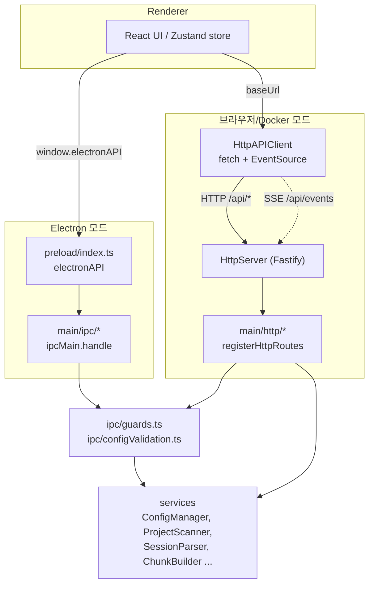
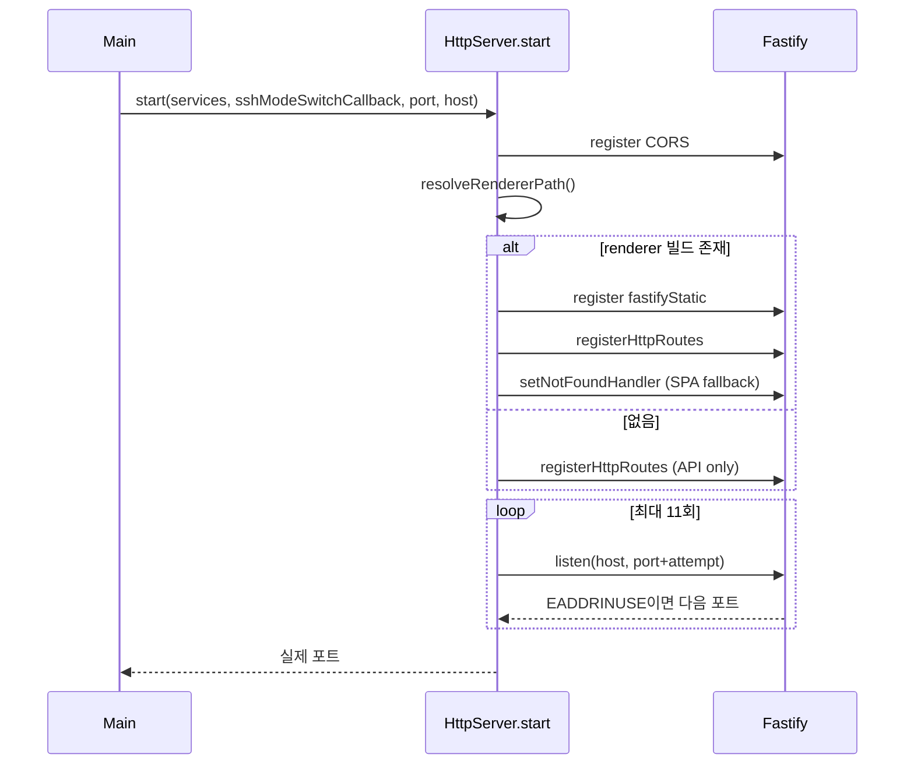
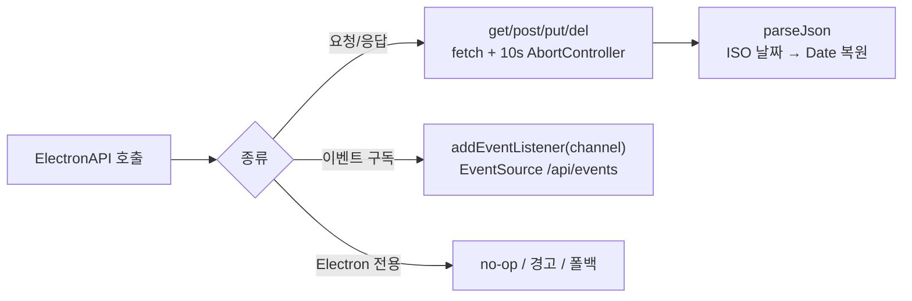
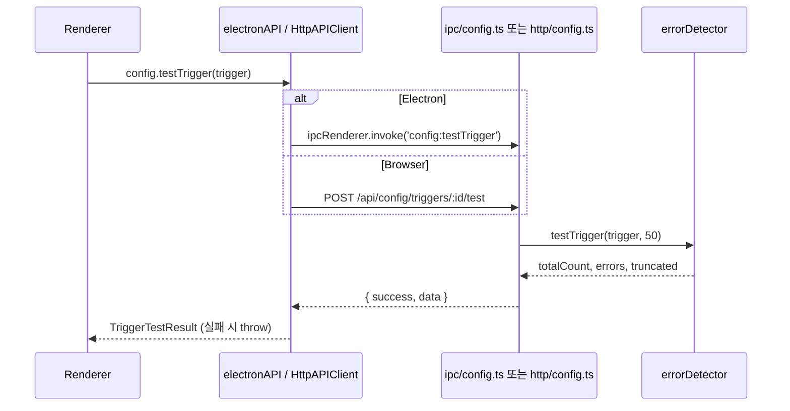

# main_ipc_http 모듈

## 개요

`main_ipc_http`는 claude-devtools의 **전송 계층(transport layer)** 이다. 렌더러(React UI)가 메인 프로세스의 서비스(설정, 프로젝트/세션 스캔, 에러 탐지 등)를 호출하는 두 가지 경로를 제공한다.

1. **Electron IPC 경로** — `src/preload/index.ts`(contextBridge) ↔ `src/main/ipc/*` (`ipcMain.handle`)
2. **HTTP/SSE 경로(브라우저/standalone/Docker 모드)** — `src/renderer/api/httpClient.ts`(`HttpAPIClient`) ↔ `src/main/services/infrastructure/HttpServer.ts`(Fastify) + `src/main/http/*` 라우트

두 경로는 동일한 `ElectronAPI` 인터페이스([shared_api_utils](shared_api_utils.md))를 구현하므로 렌더러 코드는 실행 환경을 구분하지 않는다. 각 HTTP 라우트 파일은 대응하는 IPC 핸들러를 그대로 미러링한다.

## 구성 요소

| 파일 | 핵심 컴포넌트 | 역할 |
|---|---|---|
| `src/preload/index.ts` | `IpcResult`, `IpcFileChangePayload` | `window.electronAPI` 노출, `invokeIpcWithResult` 헬퍼 |
| `src/main/ipc/config.ts` | `ConfigResult` | `config:*` IPC 핸들러 등록/해제 |
| `src/main/ipc/configValidation.ts` | `ValidationSuccess`, `ValidationFailure` | `config:update` 페이로드 런타임 검증 |
| `src/main/ipc/guards.ts` | `ValidationResult` | ID/쿼리/limit 검증·보정 가드 |
| `src/main/http/index.ts` | `HttpServices` | 모든 HTTP 라우트 등록 오케스트레이터 |
| `src/main/http/config.ts` | `ConfigResult` | `/api/config/*` 라우트 |
| `src/main/services/infrastructure/HttpServer.ts` | `HttpServer` | Fastify 서버 수명주기, CORS, 정적 파일, 포트 할당 |
| `src/renderer/api/httpClient.ts` | `HttpAPIClient` | fetch + EventSource 기반 `ElectronAPI` 구현 |

## 아키텍처

## IPC 경로

### Preload (`src/preload/index.ts`)
- `contextBridge.exposeInMainWorld('electronAPI', electronAPI)` 로 렌더러에 API를 노출한다. `ipcRenderer` 전체는 노출하지 않는다.
- 채널 상수는 `./constants/ipcChannels`에서 가져온다(`CONFIG_GET`, `SSH_CONNECT` 등).
- `invokeIpcWithResult<T>()`: 메인이 반환하는 `IpcResult<T>` (`{ success, data?, error? }`)를 언랩하여, `success`가 false면 `Error`를 throw한다. config/ssh/context/httpServer API에서 사용된다. 반면 세션 조회·notifications·memory 등은 `ipcRenderer.invoke` 결과를 그대로 반환한다.
- config 변경 계열(`addIgnoreRegex`, `snooze`, `addTrigger` …)은 변경 후 `CONFIG_GET`을 다시 호출해 갱신된 `AppConfig`를 반환한다.
- 이벤트 구독(`onFileChange`, `onTodoChange`, `onSessionRefresh`, `notifications.onNew` 등)은 모두 **구독 해제 함수**를 반환한다. `IpcFileChangePayload`는 `{ type: 'add'|'change'|'unlink', path, projectId?, sessionId?, isSubagent }`.
- 줌 배율은 `WINDOW_ZOOM_FACTOR_CHANGED_CHANNEL`을 preload 로드 시점부터 캐시한다.

### IPC 핸들러 (`src/main/ipc/config.ts`)
- `registerConfigHandlers(ipcMain)` / `removeConfigHandlers(ipcMain)` 로 `config:*` 채널을 등록/해제한다.
- `initializeConfigHandlers({ onClaudeRootPathUpdated })`: Claude 루트 경로가 변경되면 런타임에 서비스를 재구성하도록 앱 레벨 콜백을 주입한다. 콜백 실패는 로그만 남기고 업데이트 자체는 성공 처리한다.
- 모든 핸들러는 `try/catch` 후 `ConfigResult<T>` 를 반환한다(프로젝트 규칙: "console.error, return safe defaults").
- **Electron 전용 핸들러**: `selectFolders`, `selectClaudeRootFolder`(네이티브 다이얼로그), `openInEditor`($VISUAL → $EDITOR → cursor/code/subl/zed → `shell.openPath` 순), `findWslClaudeRoots`(Windows에서 `wsl.exe`로 배포판 나열 후 `\\wsl.localhost\...` UNC 후보 생성; UTF-16LE 출력 디코딩 처리), `getClaudeRootInfo`.
- `testTrigger`는 `errorDetector.testTrigger(trigger, 50)`을 호출하고 결과를 딥링크용 필드(`toolUseId`, `subagentId`, `lineNumber`)와 함께 매핑한다. 자세한 탐지 로직은 [main_error_detection](main_error_detection.md) 참고.

### 검증 계층
**`guards.ts`** — IPC 경계에서 잘못된 입력을 거부한다.

| 함수 | 규칙 |
|---|---|
| `validateProjectId` | 문자열 + `isValidProjectId`(인코딩된 Claude 프로젝트 경로) |
| `validateSessionId` / `validateSubagentId` / `validateNotificationId` / `validateTriggerId` | `^[a-zA-Z0-9][a-zA-Z0-9._-]{0,127}$` |
| `validateSearchQuery` | 비어있지 않음, 최대 512자 |
| `coerceSearchMaxResults` / `coercePageLimit` | 정수화 후 상한 200으로 클램프, 비정상 값은 기본값(50 / 20) |

모두 `ValidationResult<T>` (`{ valid, value?, error? }`)를 반환한다.

**`configValidation.ts`** — `validateConfigUpdatePayload(section, data)`가 허용된 섹션(`notifications`, `general`, `display`, `httpServer`, `ssh`)과 섹션별 허용 키·타입을 화이트리스트로 검사하고 `ValidationSuccess | ValidationFailure`를 반환한다. 예:
- `httpServer.port`: 1024–65535 정수
- `notifications.snoozeMinutes`: 1–1440 정수
- `general.claudeRootPath`: 절대 경로로 정규화, 빈 문자열은 `null`
- `ssh.profiles`: 레거시 `authMethod`(`auto`, `agent`, `privateKey`)도 허용(읽을 때 `sshConfig`로 정규화)

설정 스키마 자체는 [main_infrastructure](main_infrastructure.md)의 `ConfigManager`가 소유한다.

## HTTP 경로

### `HttpServer` (`services/infrastructure/HttpServer.ts`)

- 기본 바인딩: `127.0.0.1`, 기본 포트 3456부터 `EADDRINUSE` 시 최대 +10까지 순차 시도.
- **CORS**: `CORS_ORIGIN=*` → 전체 허용(Docker/standalone), 콤마 구분 값 → 지정 origin, 미설정 → localhost/127.0.0.1 origin만 허용.
- **정적 파일**: `RENDERER_PATH` 환경변수 → asar.unpacked → asar → standalone → `cwd/out/renderer` 순으로 탐색. 없으면 API 전용으로 동작(`pnpm build` 필요 경고). 존재하면 `/api/`가 아닌 미일치 URL에 캐시된 `index.html`을 반환(SPA fallback), `/api/` 미일치는 404 JSON.
- `broadcast(channel, data)`는 `main/http/events`의 `broadcastEvent`로 SSE 클라이언트에 이벤트를 전달한다.
- `stop()`, `getPort()`, `isRunning()` 제공.
- Docker 배포 설정은 `Dockerfile`, `docker-compose.yml` 참고.

### 라우트 등록 (`main/http/index.ts`)
`registerHttpRoutes(app, services, sshModeSwitchCallback)`가 도메인별 라우트를 등록한다. `HttpServices`는 `projectScanner`, `sessionParser`, `subagentResolver`, `chunkBuilder`, `dataCache`, `memoryReader`, `updaterService`, `sshConnectionManager`를 묶은 의존성 번들이다.

| 등록 함수 | 서비스 의존 |
|---|---|
| `registerProjectRoutes`, `registerSessionRoutes`, `registerSearchRoutes`, `registerSubagentRoutes` | `services` |
| `registerNotificationRoutes`, `registerConfigRoutes`, `registerValidationRoutes`, `registerUtilityRoutes`, `registerEventRoutes` | 싱글턴 직접 사용 |
| `registerSshRoutes` | `sshConnectionManager` + 모드 전환 콜백 |
| `registerUpdaterRoutes`, `registerMemoryRoutes` | `services` |

관련 서비스: [main_discovery_search](main_discovery_search.md), [main_analysis_parsing](main_analysis_parsing.md), [main_ssh](main_ssh.md).

### Config 라우트 (`main/http/config.ts`)
`/api/config` 하위로 IPC `config:*`를 1:1 미러링한다.

| 메서드 | 경로 | 대응 IPC |
|---|---|---|
| GET | `/api/config` | `config:get` |
| POST | `/api/config/update` | `config:update` |
| POST / DELETE | `/api/config/ignore-regex` | `addIgnoreRegex` / `removeIgnoreRegex` |
| POST / DELETE | `/api/config/ignore-repository` | `addIgnoreRepository` / `removeIgnoreRepository` |
| POST | `/api/config/snooze`, `/clear-snooze` | `snooze` / `clearSnooze` |
| GET / POST | `/api/config/triggers` | `getTriggers` / `addTrigger` |
| PUT / DELETE | `/api/config/triggers/:triggerId` | `updateTrigger` / `removeTrigger` |
| POST | `/api/config/triggers/:triggerId/test` | `testTrigger` |
| POST | `/api/config/pin-session`, `unpin-session` | `pinSession` / `unpinSession` |
| POST | `/api/config/hide-session(s)`, `unhide-session(s)` | `hideSession(s)` / `unhideSession(s)` |
| POST | `/api/config/select-folders`, `open-in-editor` | 브라우저에서는 no-op (`[]` / 성공) |

IPC와의 차이점:
- 핸들러 인자가 `request.body` / `request.params`로 이동한다.
- `config:update`에서 `claudeRootPath` 변경 시의 `onClaudeRootPathUpdated` 콜백이 **HTTP 경로에는 없다**.
- `selectClaudeRootFolder`, `getClaudeRootInfo`, `findWslClaudeRoots`용 서버 라우트는 없고, 클라이언트가 자체 폴백을 사용한다.
- 응답은 항상 HTTP 200 + `{ success, data?, error? }` 본문(검증 실패도 200).

## `HttpAPIClient` (`renderer/api/httpClient.ts`)

`ElectronAPI`를 구현해 브라우저에서 IPC를 대체한다.

- **전송**: 모든 요청에 10초 타임아웃. 오류 응답(`!res.ok`)은 `{ error }` 본문으로 `Error`를 throw.
- **날짜 복원**: IPC(structured clone)는 `Date`를 보존하지만 JSON은 문자열로 만들기 때문에, `reviveDates`가 ISO 8601 정규식에 맞는 문자열을 `Date`로 변환한다.
- **SSE**: 생성자에서 `EventSource(`${baseUrl}/api/events`)`를 열고, 채널별 리스너 집합을 한 번만 SSE에 등록한다. 자동 재연결은 EventSource에 위임. 채널: `file-change`, `todo-change`, `notification:new|updated|clicked`, `ssh:status`, `context:changed`. IPC 시그니처 호환을 위해 일부 콜백은 `(null, data)` 형태로 호출한다.
- **config API**: `{ success, data, error }` 언랩 후 실패 시 throw. 변경 후 `config.get()` 재조회(preload와 동일 패턴). 단, `pinSession` 등 일부는 응답 `success`를 검사하지 않는다(서버가 200으로 에러를 반환해도 무시됨).
- **브라우저 폴백**: `selectFolders`/`findWslClaudeRoots`/`openInEditor`/`updater.*`/`openPath`는 경고 후 no-op, `windowControls`는 빈 함수, `getZoomFactor`는 `1.0`, `memory.listAvailableOpeners`는 `copy-path`만 반환, `httpServer.*`는 항상 `running: true`와 현재 baseUrl 포트를 반환.

## 데이터 흐름 예: 트리거 테스트

## 유지보수 가이드

- 새 기능 추가 시 **세 곳을 함께** 수정한다: ① `ipcChannels` 상수 + `ipc/*` 핸들러 + preload, ② `main/http/*` 라우트(+ `registerHttpRoutes`), ③ `HttpAPIClient`. 타입은 `ElectronAPI`([shared_api_utils](shared_api_utils.md))에 먼저 정의한다.
- 사용자 입력이 들어오는 모든 핸들러/라우트는 `guards.ts`를 사용해 ID·쿼리·limit을 검증한다. 현재 `main/http/config.ts`는 일부 필드(`projectId`, `sessionId`)를 `guards.ts` 대신 인라인 `typeof` 검사만 한다.
- `ConfigResult`는 `ipc/config.ts`와 `http/config.ts`에 각각 중복 정의되어 있다(동일 형태 `{ success, data?, error? }`, preload의 `IpcResult`와도 동일).
- 서버는 localhost 바인딩과 CORS 제한이 유일한 보호 수단이며 인증이 없다. `CORS_ORIGIN=*`/`0.0.0.0` 바인딩은 Docker 네트워크 격리를 전제로 한다.
- 관련 설정/타입 모듈: [main_infrastructure](main_infrastructure.md), [main_domain_types](main_domain_types.md).
- 테스트: `test/main/ipc/configValidation.test.ts`, `test/main/ipc/guards.test.ts` (`pnpm test`).
