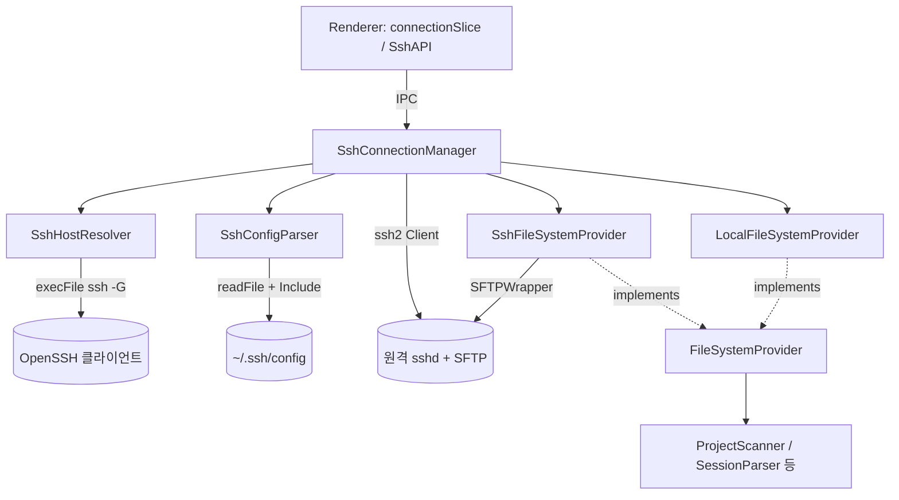
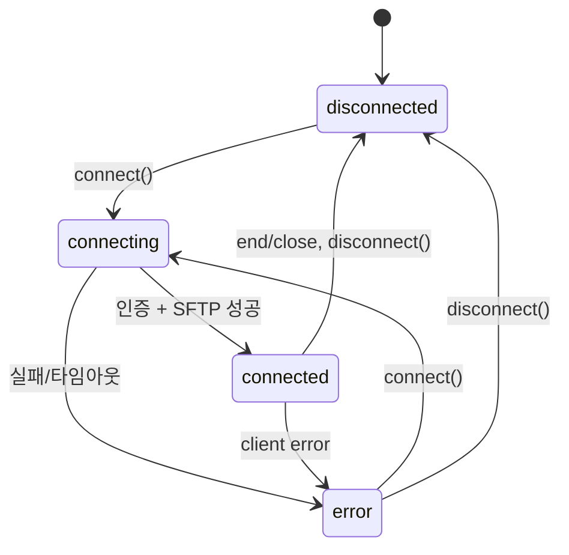
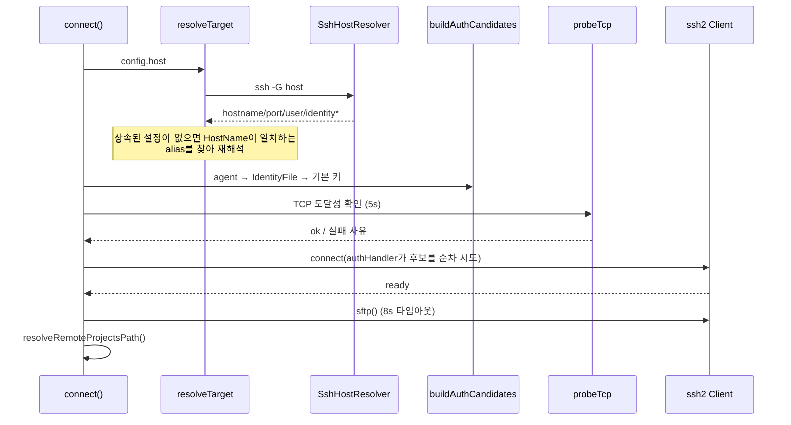

# main_ssh 모듈

`main_ssh`는 claude-devtools가 **원격 호스트의 `~/.claude/projects` 세션 파일을 SSH/SFTP로 읽을 수 있게** 하는 Electron main 프로세스 모듈이다. SSH 설정 해석, 인증 후보 탐색, 연결 수명주기 관리, SFTP 기반 `FileSystemProvider` 구현을 담당한다.

상위 모듈: Platform_Infrastructure_and_Remote_Access → [main_infrastructure](main_infrastructure.md) (`FileSystemProvider`, `LocalFileSystemProvider`, `ServiceContext` 등)

## 구성 요소

| 파일 | 컴포넌트 | 역할 |
|------|----------|------|
| `SshConfigParser.ts` | `SshConfigParser` | `~/.ssh/config`를 읽어 Host 별칭 목록(`getHosts`)과 별칭 상세(`resolveHost`)를 제공 |
| `SshHostResolver.ts` | `SshHostResolver`, `ResolvedSshHost` | 시스템 `ssh -G <host>`를 실행해 OpenSSH가 최종 해석한 값을 파싱 |
| `SshConnectionManager.ts` | `SshConnectionManager`, `SshConnectionConfig`, `SshConnectionStatus`, `AuthAttempt`, `ResolvedTarget`, `Timings` | 연결 수명주기, 인증 체인, 진단, 로컬/원격 provider 전환 |
| `SshFileSystemProvider.ts` | `SshFileSystemProvider` | ssh2 `SFTPWrapper`를 `FileSystemProvider` 인터페이스로 감쌈(재시도 포함) |

## 아키텍처

`SshConnectionManager`는 `EventEmitter`를 상속하며 상태 변경마다 `state-change` 이벤트(`SshConnectionStatus`)를 발행한다. 연결 전에는 `LocalFileSystemProvider`를, 연결 성공 후에는 `SshFileSystemProvider`를 `getProvider()`로 노출하므로 하위 서비스(예: [main_discovery_search](main_discovery_search.md), [main_analysis_parsing](main_analysis_parsing.md))는 로컬/원격 구분 없이 동일 인터페이스를 사용한다. 컨텍스트 전환은 [main_infrastructure](main_infrastructure.md)의 `ServiceContext`/`ServiceContextRegistry`와 연동된다. 공유 타입(`SshAPI`, `SshConnectionConfig` 등)은 [shared_api_utils](shared_api_utils.md)에 정의되어 있다.

## 연결 상태

## 연결 흐름 (`connectChain`)

바깥 25초(`CONNECT_TIMEOUT_MS`) 타임아웃이 전체 체인을 감싼다. ssh2 `readyTimeout`은 22초로 더 짧게 두어 바깥 타임아웃이 마지막에 발동하도록 한다.

### 핵심 설계

- **OpenSSH 위임**: `ssh -G`로 Host/Match/Include/IdentityAgent를 해석해 "터미널에선 되는데 앱에선 안 됨" 문제를 줄인다. `ssh`는 PATH에서 찾고 `execFile`로 호출(쉘 보간 없음), 타임아웃 5초. 실패 시 `null`을 반환하고 호출자가 기본값으로 대체한다.
- **단일 SSH 세션 + `authHandler`**: 후보마다 연결을 새로 만들지 않고, 한 세션에서 거절될 때마다 다음 후보로 넘어간다. `tryKeyboard: false`로 GUI가 응답할 수 없는 keyboard-interactive에 갇히지 않는다.
- **에이전트 탐색 순서**: `IdentityAgent` → `SSH_AUTH_SOCK` → 1Password 소켓 → (macOS) `launchctl getenv SSH_AUTH_SOCK` → `~/.ssh/agent.sock` → (Linux) systemd/gnome-keyring 소켓. 경로 기준 중복 제거.
- **키 후보**: `ssh -G`의 `IdentityFile` 후 `id_ed25519`, `id_rsa`, `id_ecdsa` 기본 키. 암호화된 개인키(PEM/PKCS#8/OpenSSH)는 passphrase를 받을 수 없으므로 건너뛰고 진단에 "use ssh-agent"를 남긴다. `authMethod === 'password'`면 비밀번호 후보 하나만 사용한다.
- **TCP 사전 탐지**: 앱별 VPN 등으로 Electron 프로세스만 호스트에 닿지 못하는 경우를 빠르게 구분해 안내 메시지를 낸다.
- **진단**: `AuthAttempt`(source/outcome/reason)와 `Timings`(단계별 소요 ms, 진행 중 단계 포함)를 `enrichAuthError`가 에러 메시지에 덧붙인다.
- **원격 경로**: `printf %s "$HOME"`를 `exec`로 실행해 `~/.claude/projects`를 구하고, 없으면 `/home/<user>`, `/Users/<user>`, `/root` 후보를 확인한 뒤 기본값으로 폴백한다. 결과는 `remoteProjectsPath`로 노출.

## SshConfigParser

두 가지 용도로 서로 다른 파서를 쓴다.

- `getHosts()`: 드롭다운 자동완성용. 줄 단위의 관대한 스캐너(`parseHostListing`)를 사용한다. `ssh-config` 라이브러리가 일부 구성(혼합 들여쓰기, 주석 많은 블록, Include)에서 호스트를 누락했기 때문이다. `*`/`?` 패턴 Host는 제외하고, `Host a b c`의 여러 별칭은 같은 본문을 공유한다. `key=value`와 `key value` 형식 모두 지원한다.
- `resolveHost(alias)`: `ssh-config` 라이브러리(`compute`)로 상세 해석. `Match`와 다중 별칭을 이해한다. 기본값(포트 22, HostName==alias)은 `undefined`로 정규화하고 `~`를 홈 디렉터리로 치환한다. 정의되지 않은 별칭이면 `null`.

두 메서드 모두 `Include`(글롭 `*`, `?` 포함)를 텍스트로 펼친 뒤 처리하며, 읽을 수 없는 include는 조용히 건너뛴다. 오류 시 빈 배열/`null`을 반환한다(안전한 기본값 원칙).

## SshFileSystemProvider

`FileSystemProvider`(`type = 'ssh'`) 구현. 메서드: `exists`, `readFile`, `stat`, `readdir`, `createReadStream`, `dispose`.

- SFTP 오류를 `not_found`(code 2/`ENOENT`), `transient`(code 4, `EAGAIN`, `ECONNRESET`, `ETIMEDOUT`, `EPIPE`), `permanent`로 분류한다.
- `readFile`/`stat`/`readdir`는 transient 오류에 한해 최대 3회, `75ms × attempt` 지연으로 재시도한다.
- `exists`는 `not_found`만 `false`; transient 오류는 거짓 음성을 피하려고 `true`로 처리한다.
- 파일 종류는 mode 비트마스크(`S_IFMT`/`S_IFREG`/`S_IFDIR`)로 판정하며, SFTP에는 birth time이 없어 `birthtimeMs`는 `mtimeMs`로 대체한다.
- `createReadStream`은 SFTP 스트림을 `PassThrough`로 감싸 Node `Readable` 호환성을 보장하고, 오류를 전파한다.

## 사용 시 유의점

- 서버에 `Subsystem sftp`가 없거나 chroot/제한 셸이면 SFTP 열기가 8초 후 실패하며, 메시지에 원인과 확인 방법이 포함된다.
- passphrase가 있는 키는 지원되지 않는다. ssh-agent 사용을 권장한다.
- `testConnection()`은 연결 체인만 수행하고 즉시 종료하며 provider 상태를 바꾸지 않는다.
- `disconnect()`/원격 종료 시 provider는 자동으로 `LocalFileSystemProvider`로 복귀한다. `dispose()`는 리스너까지 제거한다.
- 파일 변경 감시와 캐시 등 provider를 소비하는 쪽 동작은 [main_infrastructure](main_infrastructure.md)를 참고한다.
