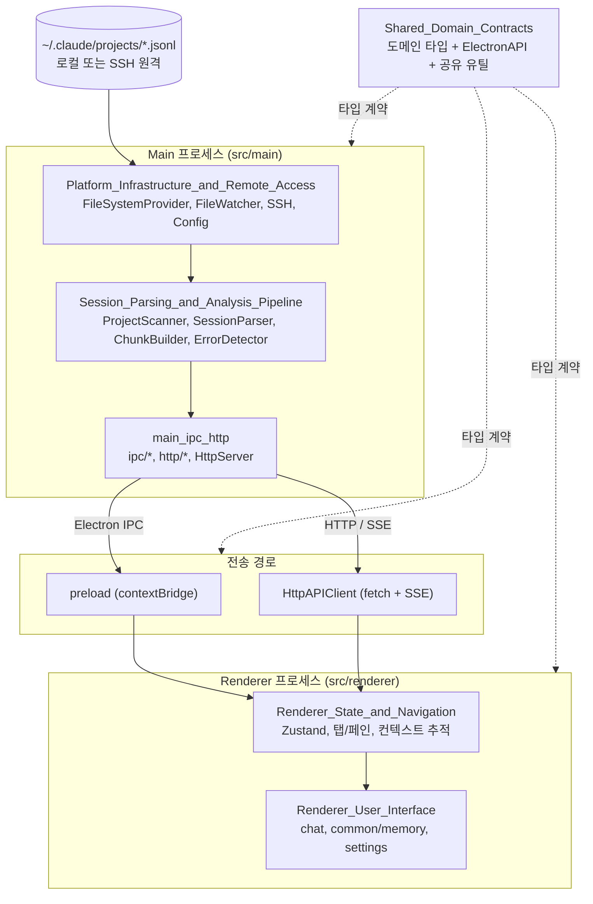
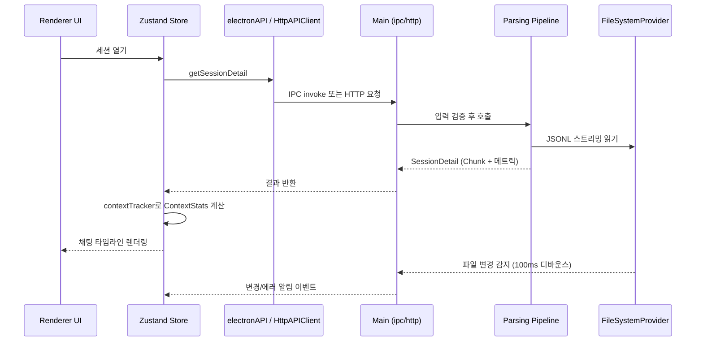

# claude-devtools 개요

## 1. 목적

`claude-devtools`는 Claude Code가 남긴 세션 기록을 시각화하는 Electron 앱입니다. 세션 파일은 `~/.claude/projects/{encoded-path}/*.jsonl`에 있고, todo 데이터는 `~/.claude/todos/{sessionId}.json`에 있습니다. 앱은 이 파일들을 읽어 다음 기능을 제공합니다.

- JSONL을 파싱해 User / AI / System / Compact **Chunk** 타임라인으로 바꾸고, 도구 실행, 서브에이전트, 에이전트 팀 메시지를 보여 줍니다.
- 컨텍스트 윈도우 토큰을 6개 카테고리(Visible Context)로 추적합니다.
- 사용자 정의 트리거로 에러를 감지해 알림을 보냅니다.
- SSH/SFTP로 원격 호스트의 세션을 읽습니다.
- Electron 데스크톱 앱 또는 브라우저/Docker 기반 standalone HTTP 서버로 실행할 수 있습니다.

기술 스택은 Electron 28, React 18, TypeScript 5, Tailwind CSS 3, Zustand 4입니다.

## 2. 전체 아키텍처

### 요청 처리 흐름

핵심 설계는 다음과 같습니다.

- Electron IPC와 HTTP는 같은 `ElectronAPI` 인터페이스를 구현하므로, 렌더러는 실행 환경을 구분하지 않습니다.
- 파일 접근은 모두 `FileSystemProvider`를 통합니다. 로컬과 SSH를 같은 코드로 처리합니다.
- 성능을 위해 LRU 캐시, JSONL 스트리밍 파싱, 가상 스크롤을 씁니다.

## 3. 핵심 모듈 문서

| 모듈 | 경로 | 설명 | 문서 |
|---|---|---|---|
| Session_Parsing_and_Analysis_Pipeline | `src/main/services` | 프로젝트/세션 탐색과 검색, JSONL 파싱, Chunk 빌드, 에러 감지 | [Session_Parsing_and_Analysis_Pipeline.md](Session_Parsing_and_Analysis_Pipeline.md) |
| Platform_Infrastructure_and_Remote_Access | `src/main/services/infrastructure` | 설정, 파일 감시, 캐시, 알림, 서비스 컨텍스트, SSH/SFTP 원격 접근 | [Platform_Infrastructure_and_Remote_Access.md](Platform_Infrastructure_and_Remote_Access.md) |
| main_ipc_http | `src/main`, `src/preload` | IPC 핸들러, Fastify HTTP 라우트와 SSE, 입력 검증 | [main_ipc_http.md](main_ipc_http.md) |
| Shared_Domain_Contracts | `src/main/types`, `src/shared` | JSONL → 메시지 → Chunk 타입, `ElectronAPI` 계약, 공유 유틸 | [Shared_Domain_Contracts.md](Shared_Domain_Contracts.md) |
| Renderer_State_and_Navigation | `src/renderer` | Zustand 슬라이스, 탭/페인, 네비게이션, 컨텍스트 토큰 추적 | [Renderer_State_and_Navigation.md](Renderer_State_and_Navigation.md) |
| Renderer_User_Interface | `src/renderer/components` | 채팅 타임라인, 공용/메모리 UI, 설정 화면 | [Renderer_User_Interface.md](Renderer_User_Interface.md) |
| build_and_config | 저장소 루트 | 빌드, 패키징, CI/CD, Docker, 코드 품질 설정 | [build_and_config.md](build_and_config.md) |

## 4. How it is built and run

- **빌드**: `pnpm`을 사용합니다(Node 20, `.nvmrc`). `pnpm build`는 `electron-vite`로 main, preload, renderer를 번들합니다. `pnpm standalone:build`는 여기에 standalone 서버 번들(`vite.standalone.config.ts`)을 더합니다.
- **테스트와 품질**: Vitest와 `happy-dom`으로 테스트합니다. `pnpm check`는 typecheck, lint, test, build를 실행합니다. Prettier, EditorConfig, knip으로 코드 품질을 관리합니다.
- **패키징**: `electron-builder`가 `pnpm dist:*`로 dmg, zip, nsis, AppImage, deb, rpm, pacman을 만듭니다. deb 설치 후에는 `resources/afterInstall.sh`가 실행됩니다.
- **CI/릴리스**: `.github/workflows/ci.yml`이 검증과 테스트를 실행합니다. `release.yml`은 태그를 기준으로 mac, Windows, Linux 릴리스를 빌드합니다.
- **배포**: `Dockerfile`과 `docker-compose.yml`이 standalone HTTP 서버 이미지를 만듭니다. 이 서버는 브라우저에서 접속하는 용도입니다.

자세한 스크립트, 워크플로, 컨테이너 설정은 [build_and_config.md](build_and_config.md)를 참고하세요. standalone 서버의 내부 동작은 [main_ipc_http.md](main_ipc_http.md)와 [Platform_Infrastructure_and_Remote_Access.md](Platform_Infrastructure_and_Remote_Access.md)에 있습니다.