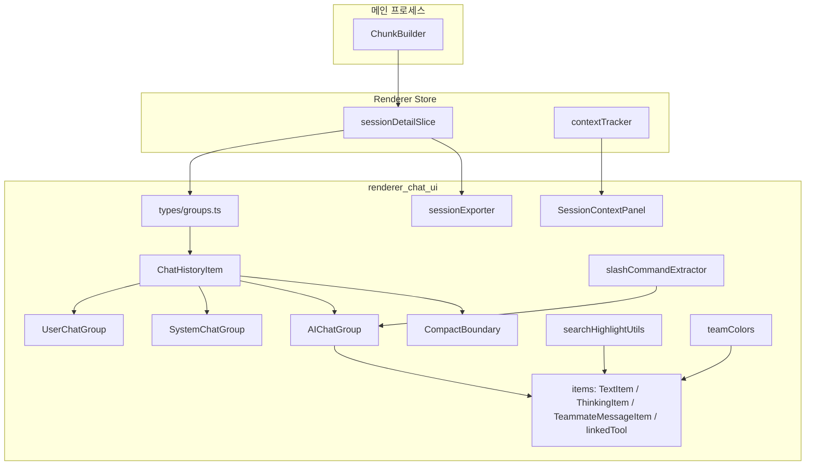
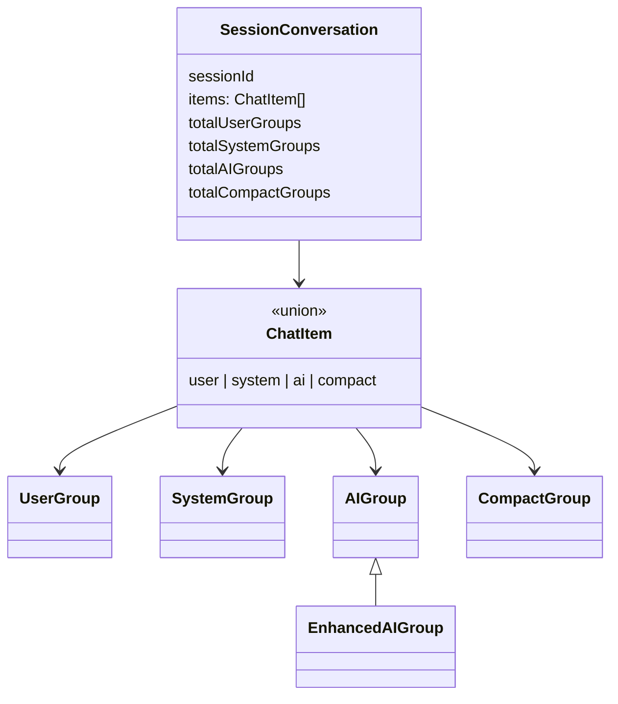
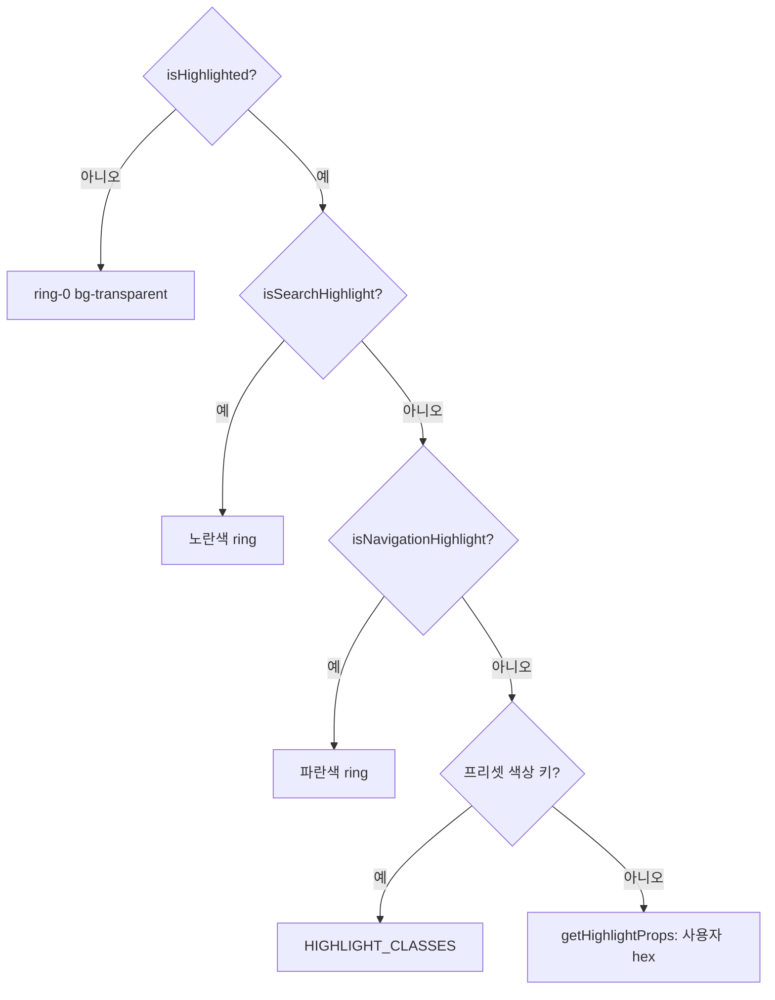
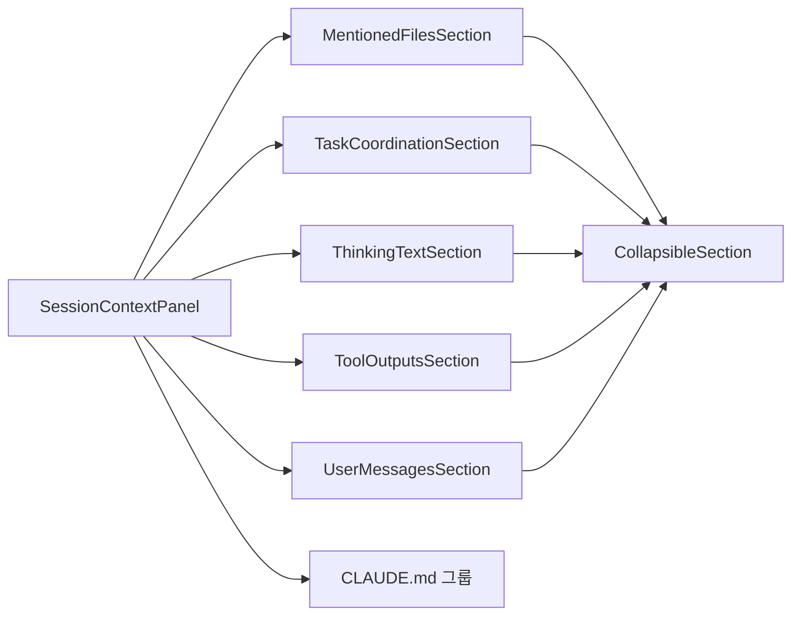
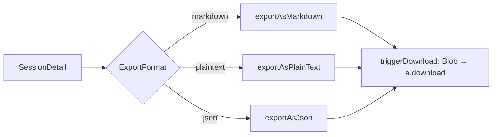
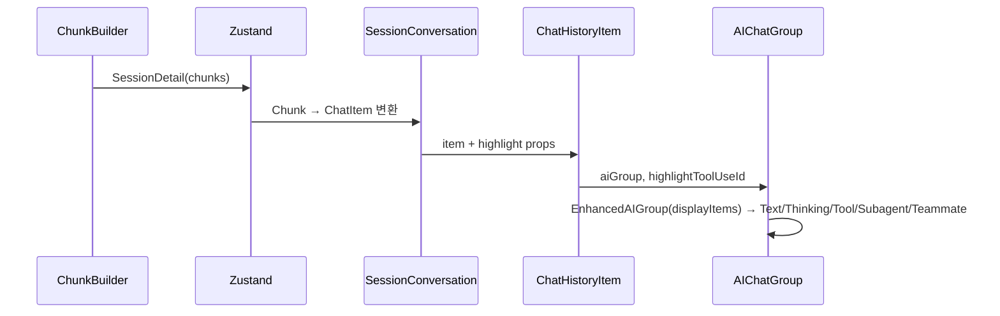

# renderer_chat_ui 모듈

`renderer_chat_ui`는 Electron 렌더러 프로세스에서 Claude Code 세션을 **채팅 형태로 렌더링**하는 UI 계층입니다. 메인 프로세스가 만든 청크(chunk)를 렌더러가 `ChatItem`/`UserGroup`/`AIGroup` 등 표시용 그룹으로 변환한 뒤, 이 모듈의 컴포넌트·타입·유틸이 이를 화면에 그립니다. 검색 하이라이트, 팀(teammate) 메시지 카드, 컨텍스트 패널(Visible Context), 세션 내보내기도 포함됩니다.

관련 모듈:
- 청크 생성: [Session_Parsing_and_Analysis_Pipeline](Session_Parsing_and_Analysis_Pipeline.md)
- 도메인 타입(`ParsedMessage`, `Process`, `SemanticStep`, `SessionDetail`): [Shared_Domain_Contracts](Shared_Domain_Contracts.md)
- Zustand 슬라이스·탭/패널·컨텍스트 추적: [Renderer_State_and_Navigation](Renderer_State_and_Navigation.md)
- 상위 모듈: [Renderer_User_Interface](Renderer_User_Interface.md)
- 형제 모듈: `renderer_common_memory_ui`, `renderer_settings_ui` (Renderer_User_Interface 하위)

---

## 1. 아키텍처 개요

핵심 원칙: **독립 아이템의 평면(flat) 리스트**. 과거의 "턴(user+AI 쌍)" 구조는 폐기되었고, 각 아이템이 독립적으로 렌더링됩니다.

---

## 2. 데이터 모델 (`src/renderer/types/groups.ts`)

### 2.1 최상위 구조

| 타입 | 역할 |
|---|---|
| `SessionConversation` | 세션 전체의 `ChatItem[]`과 그룹별 총계 |
| `UserGroup` / `UserGroupContent` | 사용자 입력 1건. `text`, `rawText`, `commands: CommandInfo[]`, `images: ImageData[]`, `fileReferences: FileReference[]` |
| `SystemGroup` | 커맨드 출력(`commandOutput`, 선택적 `commandName`) — AI처럼 렌더링 |
| `AIGroup` | 어시스턴트 응답 1사이클: `turnIndex`, `steps`, `tokens: AIGroupTokens`, `summary: AIGroupSummary`, `status`, `processes`, `responses`, `isOngoing` |
| `CompactGroup` | 컨텍스트 컴팩션 지점 (`tokenDelta`, `startingPhaseNumber`) |
| `EnhancedAIGroup` | `AIGroup` + 렌더링용 계산값: `lastOutput`, `displayItems`, `linkedTools`, `itemsSummary`, `mainModel`, `subagentModels`, `claudeMdStats` |

### 2.2 AI 그룹 보조 타입

- **`AIGroupExpansionLevel`**: `'collapsed' | 'items' | 'full'` — 접힘/아이템 목록/전체 내용 3단계.
- **`AIGroupStatus`**: `'complete' | 'interrupted' | 'error' | 'in_progress'`.
- **`LinkedToolItem`**: tool_use와 tool_result를 짝지은 항목. `callTokens`, `result`(`isError`, `tokenCount`), `inputPreview`(100자), `outputPreview`(200자), `isOrphaned`, `skillInstructions` 등.
- **`SlashItem`**: `<command-name>/<command-message>/<command-args>` 형식의 모든 슬래시 호출(스킬, 내장 명령, 플러그인, MCP, 사용자 정의). 후속 `isMeta:true` 메시지를 `instructions`로 보관.
- **`TeammateMessage`**: 팀 멤버 에이전트에게서 온 메시지 (`teammateId`, `color`, `summary`, `replyToSummary`, `replyToToolId`).
- **`AIGroupDisplayItem`** (시간순 평탄화 유니온): `thinking`, `tool`, `subagent`, `output`, `slash`, `teammate_message`, `subagent_input`, `compact_boundary`.
- **`AIGroupLastOutput`**: 사용자가 "답변"으로 보는 마지막 출력. `type`은 `text | tool_result | interruption | ongoing | plan_exit`.

---

## 3. 컴포넌트

### 3.1 `ChatHistoryItem` (`components/chat/ChatHistoryItem.tsx`)

`ChatItem.type`에 따라 `UserChatGroup`, `SystemChatGroup`, `AIChatGroup`, `CompactBoundary`로 분기하는 `React.memo` 디스패처입니다.

주요 props(`ChatHistoryItemProps`):
- `item`, `highlightedGroupId`, `highlightToolUseId`
- `isSearchHighlight`, `isNavigationHighlight`, `highlightColor`
- `registerChatItemRef`, `registerAIGroupRef`, `registerToolRef` — 스크롤 타깃팅용 ref 등록 콜백(도구 단위까지 정밀 스크롤)

하이라이트 우선순위 (`getHighlight`):

- 에러 하이라이트 기본색은 `red`이며 트리거 색상은 `@shared/constants/triggerColors`에서 옵니다.
- `highlightToolUseId`는 검색 하이라이트가 아닐 때만 모든 AI 그룹에 전달됩니다. 각 그룹이 자신이 해당 도구를 포함하는지 확인해 확장합니다. 네비게이션 하이라이트 중에도 허용되므로 컨텍스트 패널의 도구 딥링크가 동작합니다.

### 3.2 아이템 컴포넌트 (`components/chat/items/`)

| 컴포넌트 | 설명 |
|---|---|
| `TextItem` | 출력 텍스트 스텝. `BaseItem` + `MarkdownViewer`, 아이콘 `MessageSquare`, 요약 60자 |
| `ThinkingItem` | 사고 스텝. `Brain` 아이콘, 구조는 `TextItem`과 동일. 토큰은 `step.tokens.output` → `step.content.tokenCount` 순 |
| `TeammateMessageItem` | 팀 메시지 카드 (아래 상세) |
| `linkedTool/CollapsibleOutputSection` | 기본 접힘 출력 섹션 (`StatusDot` + 쉐브론) |
| `linkedTool/ToolErrorDisplay` | `result.isError`일 때만 에러 출력 표시 (`renderOutput` 사용) |

**TeammateMessageItem** 동작:
- `detectNoise()`: `idle_notification`, `shutdown_approved`, `teammate_terminated`, `shutdown_request` 같은 운영 노이즈(또는 200자 미만 `system` 메시지)는 카드 없이 흐린 한 줄로 렌더링.
- `isResendMessage()`: `/\bresend/i` 등 패턴으로 재전송 메시지 감지 → 투명도 0.6과 "Resent" 배지.
- 좌측 3px 색상 보더(`getTeamColorSet`), `replyToSummary`가 있으면 reply 표시 후 hover 시 `onReplyHover(toolId)`로 원본 `SendMessage` 도구 강조.
- 확장 시 `MarkdownViewer`로 내용 표시, 주입 토큰 수(`~N tokens`) 표시.

### 3.3 `SessionContextPanel`

Visible Context(토큰을 소비하는 6개 카테고리)를 전체 패널로 보여줍니다. 추적 로직은 [Renderer_State_and_Navigation](Renderer_State_and_Navigation.md)의 `renderer_context_tracking`에 있고, 이 모듈은 표시만 담당합니다.

- `SessionContextPanelProps`: `injections`, `projectRoot`, `onNavigateToTurn`, `onNavigateToTool(turnIndex, toolUseId)`, `onNavigateToUserGroup`, `totalSessionTokens`, `phaseInfo`, `selectedPhase`, `onPhaseChange`, `onClose`.
- 각 `*Section`은 동일 패턴: `injections.length === 0`이면 `null`, 아니면 `CollapsibleSection`(title/count/tokenCount/isExpanded/onToggle) 안에 `*Item` 목록 렌더링. `MentionedFilesSection`만 `projectRoot`를 추가로 받습니다.
- `types.ts`: 섹션 상수(`SECTION_CLAUDE_MD` 등)와 `SectionType`, `ContextViewMode`(`'category' | 'ranked'`), `CLAUDE_MD_GROUP_CONFIG`/`CLAUDE_MD_GROUP_ORDER`.
  - `global`: enterprise, user-memory, user-rules, auto-memory
  - `project`: project-memory, project-rules, project-local
  - `directory`: directory
- `DirectoryTree/types.ts`의 `TreeNode`: `name`, `path`, `isFile`, `tokens`, `firstSeenInGroup`, `children: Map<string, TreeNode>` — 파일 경로를 트리로 보여주기 위한 구조.

---

## 4. 유틸리티

### 4.1 `searchHighlightUtils.ts`
ReactMarkdown 렌더 트리를 유지한 채 텍스트 노드의 검색어를 `<mark>`로 감쌉니다.

- `createSearchContext(query, itemId, matches, currentIndex)` → `SearchContext | null` (검색 비활성이면 `null`).
- `SearchContext`: `itemId`, `query`, `lowerQuery`, 가변 `matchCounter`, `isCurrentItem`, `currentMatchIndexInItem`.
- `highlightSearchInChildren()`가 `React.Children.map`으로 재귀 처리. 이미 만든 `mark[data-search-result]`는 건너뛰어 중복 카운트를 방지.
- 현재 매치는 `--highlight-bg`, 나머지는 `--highlight-bg-inactive` 스타일. `data-search-*` 속성으로 스크롤 대상 식별.
- `EMPTY_SEARCH_MATCHES`: 안정된 빈 배열(선택자 리렌더 방지).
- 검색 로직 전반은 [Renderer_State_and_Navigation](Renderer_State_and_Navigation.md)의 `SearchMatch` 참고.

### 4.2 `teamColors.ts`
- `TeamColorSet { border, badge, text }`; 8개 이름 색(blue, green, red, yellow, purple, cyan, orange, pink).
- `getTeamColorSet(name)`: 이름 → 세트, `#hex`면 `${hex}26`을 badge로 생성, 그 외 blue 기본값.
- `getSubagentTypeColorSet(type, agentConfigs?)`: 에이전트 설정 색이 있으면 사용, 없으면 문자열 해시로 결정적 색 선택.

### 4.3 `slashCommandExtractor.ts`
`extractSlashes(responses, precedingSlash?)`:
1. `isMeta:true` + `parentUuid` + `sourceToolUseID` 없음 + 배열 content인 메시지를 `parentUuid` 기준 맵(후속 지시문)으로 수집.
2. `PrecedingSlashInfo`(직전 `UserGroup`의 슬래시 호출)가 있으면 후속 지시문을 연결해 `SlashItem` 생성(타임스탬프는 후속 메시지 우선).
3. 폴백: 응답 안의 `<command-name>` 사용자 메시지도 `SlashItem`으로 변환(중복 uuid 제외).

토큰 수는 `aiGroupHelpers.estimateTokens`로 추정합니다.

### 4.4 `sessionExporter.ts`
`SessionDetail`을 파일로 내보냅니다.

- `extractTextFromContent(content, { includeThinking })` — `ExtractOptions`. text/thinking/tool_use/tool_result/image 블록을 평문화(tool_result는 재귀).
- 도구 결과는 평문 500자, Markdown 2000자로 잘림.
- 파일명: `session-{id}.{md|json|txt}`.

---

## 5. 주요 흐름

### 5.1 렌더링

### 5.2 컨텍스트 패널 → 채팅 딥링크
패널 항목 클릭 → `onNavigateToTurn`/`onNavigateToTool` → 탭 네비게이션 컨트롤러(`useTabNavigationController`, [Renderer_State_and_Navigation](Renderer_State_and_Navigation.md)) → `highlightedGroupId`/`highlightToolUseId` 설정 → `ChatHistoryItem`이 ref로 스크롤하고 파란 네비게이션 하이라이트(3000ms 전환) 적용.

---

## 6. 설계 메모

- **스타일**: 색상은 CSS 변수(`--card-*`, `--tool-item-*`, `--code-*`, `--highlight-*`)를 사용해 다크/라이트 테마를 지원합니다 (`.claude/rules/tailwind.md`).
- **성능**: `ChatHistoryItem`, `TextItem`, `ThinkingItem`은 `React.memo`. `useMemo`로 노이즈/재전송 감지 결과를 캐시.
- **테스트**: `test/renderer/` 하위(훅, 스토어, 유틸)에 있으며 Vitest + `happy-dom` 환경 (`vitest.config.ts`). 이 모듈의 순수 유틸(`slashCommandExtractor`, `sessionExporter`)은 같은 위치에 테스트를 추가하기 적합합니다.
- **팀/서브에이전트**: 팀 메시지는 UserChunk에서 제외되고 `TeammateMessageItem`으로 렌더링됩니다 (감지 로직은 `isParsedTeammateMessage()`, [Shared_Domain_Contracts](Shared_Domain_Contracts.md) 참고).
