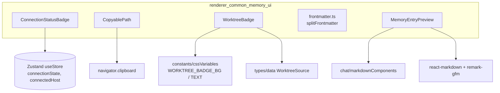
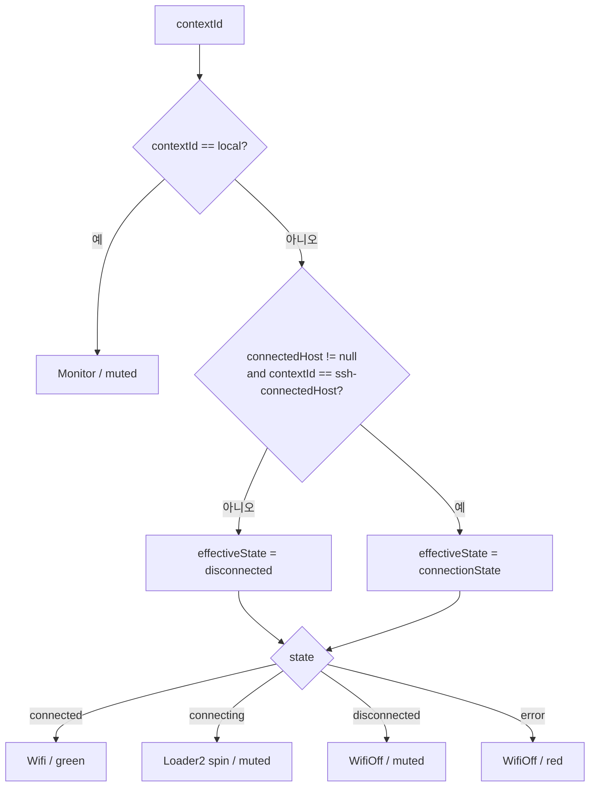
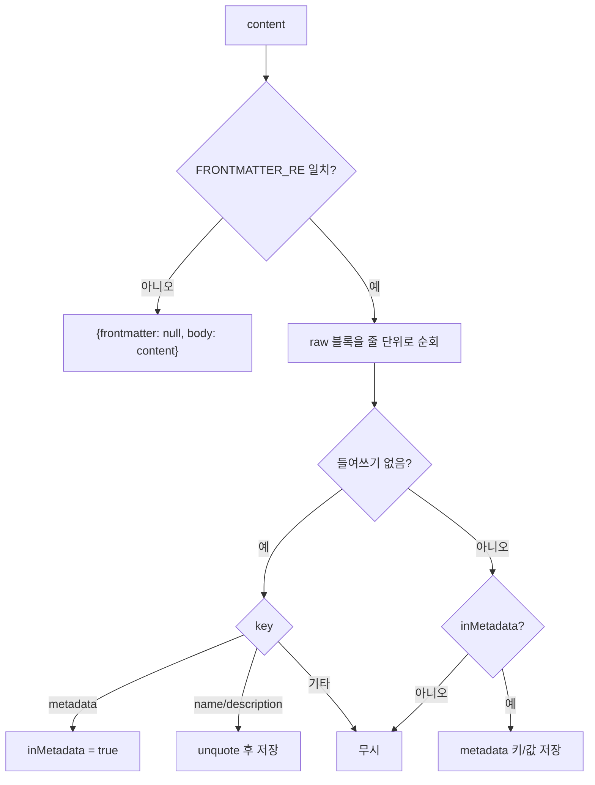
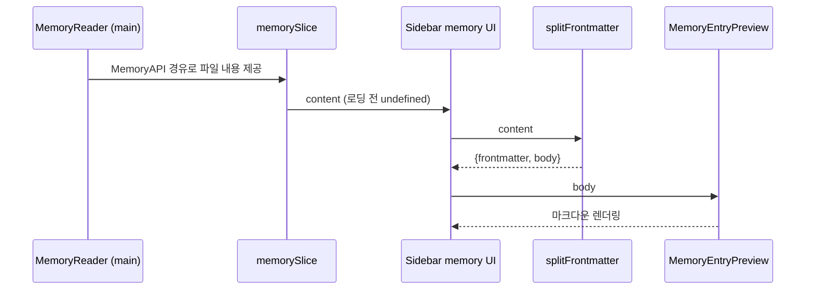

# renderer_common_memory_ui 모듈

## 개요

`renderer_common_memory_ui`는 Renderer UI 계층(`Renderer_User_Interface`)에 속한 소규모 모듈로, 여러 화면에서 재사용되는 **공용 표시 컴포넌트**와 **메모리(Memory) 패널용 표시/파싱 유틸리티**를 제공한다.

| 파일 | 핵심 구성요소 | 역할 |
|------|---------------|------|
| `src/renderer/components/common/ConnectionStatusBadge.tsx` | `ConnectionStatusBadgeProps` | 워크스페이스(로컬/SSH) 연결 상태 아이콘 |
| `src/renderer/components/common/CopyablePath.tsx` | `CopyablePathProps` | 클릭 시 전체 경로를 클립보드에 복사하는 경로 표시 |
| `src/renderer/components/common/WorktreeBadge.tsx` | `SourceConfig`, `WorktreeBadgeProps` | worktree 출처(vibe-kanban, conductor 등) 배지 |
| `src/renderer/components/memory/frontmatter.ts` | `FrontmatterSplit`, `MemoryFrontmatter` | 메모리 `.md` 파일의 YAML frontmatter 경량 파서 |
| `src/renderer/components/sidebar/memory/MemoryEntryPreview.tsx` | `MemoryEntryPreviewProps` | 펼친 메모리 항목의 마크다운 렌더링 |

## 아키텍처



- 모든 컴포넌트는 props 기반의 프레젠테이션 컴포넌트이며, 상태 의존은 `ConnectionStatusBadge`의 Zustand 구독뿐이다.
- 스타일은 Tailwind 및 CSS 변수(`--prose-body`, `--color-text-muted` 등)를 사용해 다크/라이트 테마를 따른다.

## 컴포넌트 상세

### ConnectionStatusBadge

`contextId`(`'local'` 또는 `ssh-<host>`)를 받아 상태별 lucide 아이콘을 렌더링한다.



핵심: 전역 `connectionState`는 현재 연결된 호스트 하나에만 적용된다. 다른 SSH 컨텍스트는 항상 `disconnected`로 간주한다. 상태 소스는 `connectionSlice`이며 [renderer_store](renderer_store.md)를 참고한다.

### CopyablePath

- `displayText`(축약 경로)를 보여 주고 `copyText`(절대 경로)를 `navigator.clipboard.writeText`로 복사한다.
- 클릭 시 `stopPropagation`/`preventDefault`로 부모 행의 클릭(선택 등)과 충돌을 막는다.
- 복사 성공 시 `Check` 아이콘을 1.5초간 표시한다. 클립보드 API 실패는 조용히 무시한다.
- 아이콘은 `group-hover/copypath`에서만 나타나는 시각적 힌트이다.

### WorktreeBadge

- `source`(`WorktreeSource`)별 `SourceConfig`(`label`, `bgColor`, `textColor`)를 `SOURCE_CONFIG`에서 조회한다.
- `isMain`이 true면 `Default` 배지를 우선 표시한다(브랜치 `main`과의 혼동 방지).
- `git`, `unknown` 또는 label이 비어 있으면 `null`을 반환한다.
- worktree 출처 판별은 백엔드 `WorktreeGrouper`에서 이루어진다. 자세한 내용은 [main_discovery_search](main_discovery_search.md)를 참고한다.

### frontmatter.ts

메모리 파일은 다음 형식으로 시작한다.

```
---
name: ...
description: "..."
metadata:
  node_type: memory
  type: project
---
본문
```

`splitFrontmatter(content): FrontmatterSplit`:



- 전체 YAML 라이브러리를 쓰지 않고 고정 포맷(평면 키 + 들여쓰기된 `metadata:` 블록)만 처리한다.
- 인식하지 못한 줄은 버리며, frontmatter가 없으면 본문을 그대로 반환한다.
- `MemoryFrontmatter.raw`는 대체 렌더링용 원본 문자열이다.
- 중첩 구조나 배열 값은 지원하지 않는다.

### MemoryEntryPreview

- `content === undefined`이면 `Loading…`을 표시한다(비동기 로딩 중).
- 그 외에는 `ReactMarkdown` + `remarkGfm` + 채팅 뷰의 `markdownComponents`로 렌더링하여, 세션 메시지와 동일한 마크다운 스타일을 재사용한다(별도 마크다운 스택 없음). 관련 내용은 [renderer_chat_ui](renderer_chat_ui.md)를 참고한다.

## 데이터 흐름 (메모리)



메모리 파일 읽기는 [main_discovery_search](main_discovery_search.md)의 `MemoryReader`, 타입(`MemoryEntry`, `MemoryIndex`, `MemoryAPI`)은 [shared_api_utils](shared_api_utils.md), 상태는 [renderer_store](renderer_store.md)의 `memorySlice`가 담당한다. 이 모듈은 표시 계층만 제공한다.

## 의존성 요약

| 의존 대상 | 사용처 |
|-----------|--------|
| `@renderer/store` (`useStore`) | `ConnectionStatusBadge` |
| `@renderer/constants/cssVariables` | `WorktreeBadge` |
| `@renderer/types/data` (`WorktreeSource`) | `WorktreeBadge` |
| `@renderer/components/chat/markdownComponents` | `MemoryEntryPreview` |
| `react-markdown`, `remark-gfm` | `MemoryEntryPreview` |
| `lucide-react` | 배지/복사 아이콘 |

## 유지보수 참고

- 새 worktree 출처를 추가하면 `WorktreeSource` 타입과 `SOURCE_CONFIG`를 함께 갱신해야 한다(`Record<WorktreeSource, …>`이므로 누락 시 타입 오류).
- 새 연결 상태를 추가하면 `ConnectionStatusBadge`의 `switch`에 case를 추가한다.
- `splitFrontmatter`의 스키마가 바뀌면(메모리 작성 스킬 변경 등) 파서가 해당 키를 조용히 버리므로 주의한다.
- 이 모듈에는 전용 테스트가 없다. `frontmatter.ts`는 순수 함수라 vitest 단위 테스트를 추가하기 쉽다(`.claude/rules/testing.md` 참고).
