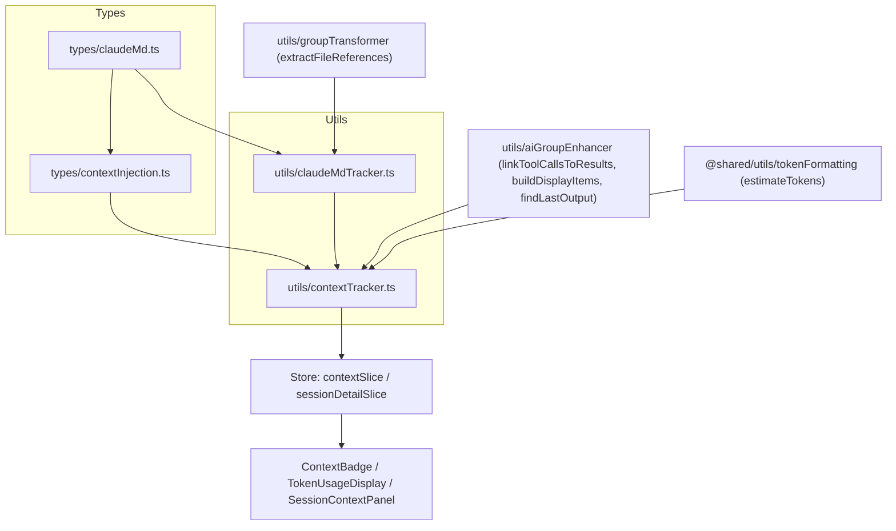
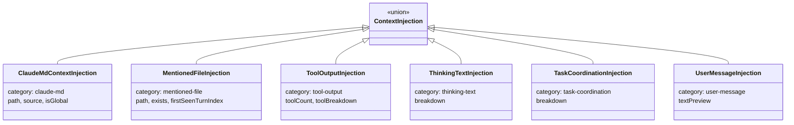
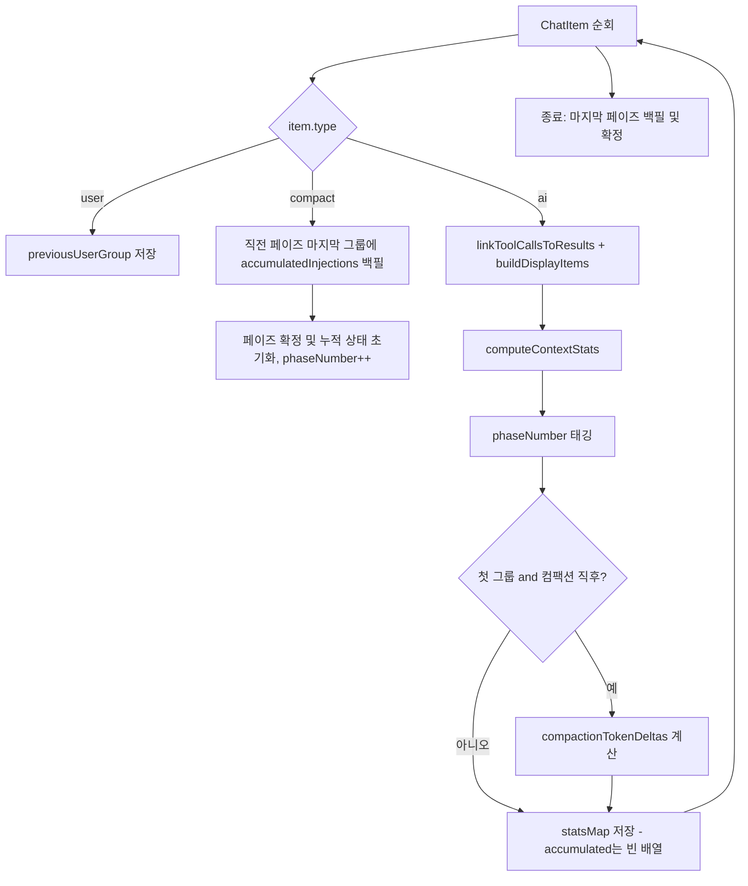
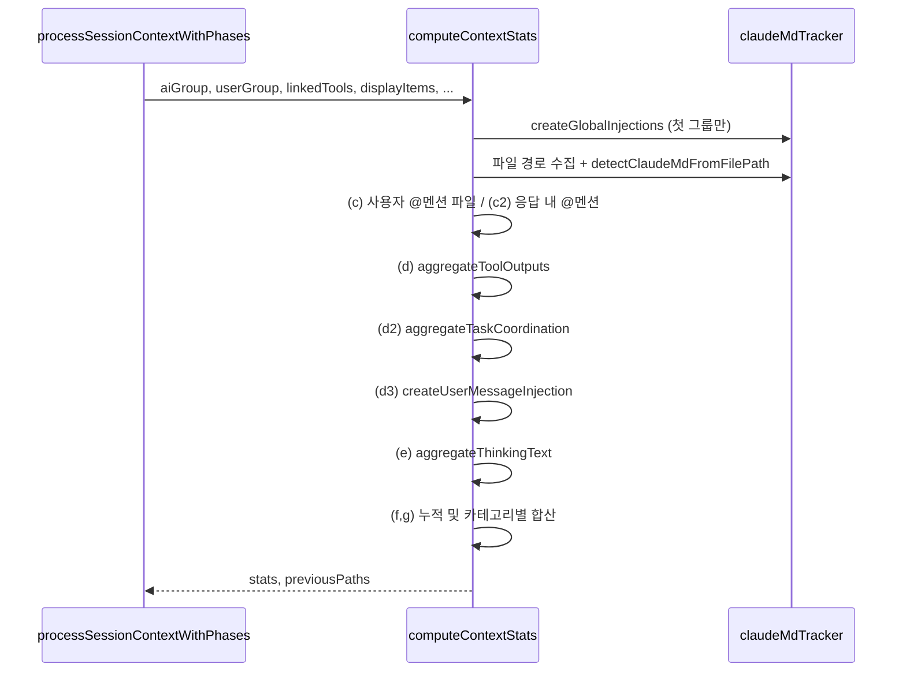

# renderer_context_tracking 모듈

## 개요

`renderer_context_tracking`은 Claude Code 세션에서 **어떤 요소가 컨텍스트 윈도우 토큰을 소비하는지** 렌더러 측에서 추정·집계하는 모듈입니다(“Visible Context Tracking”). AI 그룹(턴)마다 새로 주입된 항목과 누적 항목을 계산하고, 컴팩션(compaction) 이벤트를 기준으로 컨텍스트 *페이즈*를 나눕니다. 결과는 `ContextBadge`, `TokenUsageDisplay`, `SessionContextPanel` 등의 UI에서 사용됩니다.

| 파일 | 역할 |
|------|------|
| `src/renderer/types/claudeMd.ts` | CLAUDE.md 주입 타입 (`ClaudeMdInjection`, `ClaudeMdStats`, `ClaudeMdSource`) |
| `src/renderer/types/contextInjection.ts` | 통합 컨텍스트 주입 타입, 통계/페이즈 타입, `MAX_MENTIONED_FILE_TOKENS` |
| `src/renderer/utils/claudeMdTracker.ts` | CLAUDE.md 전용 추적기, 경로 유틸, 전역 주입 생성 |
| `src/renderer/utils/contextTracker.ts` | 6개 카테고리를 모두 다루는 통합 추적기 + 페이즈 처리 |

## 아키텍처



- 타입 계층: `ClaudeMdInjection`은 `category: 'claude-md'`가 붙은 `ClaudeMdContextInjection`으로 래핑되어 `ContextInjection` 유니온에 포함됩니다.
- `contextTracker.ts`는 `claudeMdTracker.ts`의 export(`createGlobalInjections`, `detectClaudeMdFromFilePath`, `extractReadToolPaths`, `extractUserMentionPaths`, `extractFileRefsFromResponses`, `generateInjectionId`, `getDisplayName`)를 재사용합니다.
- 입력 타입(`AIGroup`, `UserGroup`, `ChatItem`, `LinkedToolItem`)은 [renderer_chat_ui](renderer_chat_ui.md)의 `groups.ts`에, `ClaudeMdFileInfo`/`SemanticStep`은 [main_domain_types](main_domain_types.md) 및 [shared_api_utils](shared_api_utils.md)에 정의되어 있습니다. 저장·표시 쪽은 [renderer_store](renderer_store.md)를 참고하세요.

## 컨텍스트 주입 타입

`ContextInjection`은 `category` 필드로 구분되는 판별 유니온입니다.



| category | 타입 | ID 형식 | 출처 |
|----------|------|---------|------|
| `claude-md` | `ClaudeMdContextInjection` | `cmd-<hash>` | 전역 CLAUDE.md 소스 + 디렉터리별 CLAUDE.md |
| `mentioned-file` | `MentionedFileInjection` | `mf-<hash>` | 사용자 @멘션 파일 (및 isMeta 응답 내 @멘션) |
| `tool-output` | `ToolOutputInjection` | `tool-output-ai-<n>` | 도구 호출/결과/스킬 토큰, `/slash` 지침 토큰 |
| `thinking-text` | `ThinkingTextInjection` | `thinking-text-ai-<n>` | thinking + 텍스트 출력 |
| `task-coordination` | `TaskCoordinationInjection` | `task-coord-ai-<n>` | SendMessage, TeamCreate, TaskCreate 등 + teammate 메시지 |
| `user-message` | `UserMessageInjection` | `user-msg-ai-<n>` | 턴별 사용자 프롬프트 |

> 참고: 프로젝트 `CLAUDE.md`는 팀 카테고리를 `team-coordination`으로 적고 있으나, 이 모듈의 실제 코드 식별자는 `task-coordination`(`TaskCoordinationInjection`)입니다.

### 통계 / 페이즈 타입

- `ContextStats`: `newInjections`, `accumulatedInjections`, `totalEstimatedTokens`, `tokensByCategory`(`TokensByCategory`), `newCounts`/`accumulatedCounts`(`NewCountsByCategory`), `phaseNumber?`.
  - `accumulatedInjections`는 **각 페이즈의 마지막 AI 그룹에만** 채워지고, 중간 그룹은 빈 배열입니다(메모리 절약).
- `ContextPhase`, `ContextPhaseInfo`: `phases`, `compactionCount`, `aiGroupPhaseMap`(aiGroupId → phase), `compactionTokenDeltas`(compactGroupId → `CompactionTokenDelta`).
- `ClaudeMdStats`: CLAUDE.md 전용 통계(`newInjections`, `accumulatedInjections`, `percentageOfContext` 등).
- `MentionedFileInfo`: IPC로 얻는 파일 메타데이터(`exists`, `charCount`, `estimatedTokens`).

## claudeMdTracker.ts

### 전역 주입 (`createGlobalInjections`)
세션의 **첫 AI 그룹**에서만 생성되며, 토큰이 0보다 큰 소스만 포함합니다. 토큰 값은 `tokenData[key].estimatedTokens`, 없으면 기본값 `DEFAULT_ESTIMATED_TOKENS = 500`입니다.

| 순서 | tokenData 키 | source | 경로 |
|------|--------------|--------|------|
| 1 | `enterprise` | `enterprise` | `/Library/Application Support/ClaudeCode/CLAUDE.md` (또는 tokenData 경로) |
| 2 | `user` | `user-memory` | `~/.claude/CLAUDE.md` |
| 3 | `project` | `project-memory` | `{projectRoot}/CLAUDE.md` |
| 3b | `project-alt` | `project-memory` | `{projectRoot}/.claude/CLAUDE.md` |
| 4 | `project-rules` | `project-rules` | `{projectRoot}/.claude/rules/*.md` |
| 5 | `project-local` | `project-local` | `{projectRoot}/CLAUDE.local.md` |
| 6 | `user-rules` | `user-rules` | `~/.claude/rules/**/*.md` |
| 7 | `auto-memory` | `auto-memory` | `~/.claude/projects/.../memory/MEMORY.md` |

### 디렉터리 CLAUDE.md 감지
`Read` 도구의 `file_path`(`extractReadToolPaths`), 사용자 @멘션(`extractUserMentionPaths`), isMeta 사용자 메시지의 파일 참조(`extractFileRefsFromResponses`)에서 파일 경로를 모읍니다. 각 경로에 대해 `detectClaudeMdFromFilePath`가 파일 디렉터리부터 `projectRoot`까지 올라가며 `CLAUDE.md` 후보 경로를 만듭니다. 이미 본 경로와 전역 경로(루트 `CLAUDE.md`, `.claude/CLAUDE.md`, `CLAUDE.local.md`)는 건너뜁니다.

### 유틸
`generateInjectionId`(32비트 해시 기반), `getDisplayName`(경로 그대로 반환), `getDirectory`, `getParentDirectory`, 그리고 Windows/UNC/POSIX 경로를 처리하는 내부 `joinPaths`(`@`, `./`, `../` 처리).

### 세션 처리
`processSessionClaudeMd(items, projectRoot, tokenData?)`는 `ChatItem[]`을 순회하며 `aiGroupId → ClaudeMdStats` 맵을 반환합니다. `compact` 항목을 만나면 누적 상태를 초기화합니다. `percentageOfContext`는 `aiGroup.tokens.input` 대비 비율입니다.

## contextTracker.ts

### 핵심 흐름: `processSessionContextWithPhases`

```ts
processSessionContextWithPhases(
  items, projectRoot, claudeMdTokenData?, mentionedFileTokenData?, directoryTokenData?
): { statsMap: Map<string, ContextStats>; phaseInfo: ContextPhaseInfo }
```



### `computeContextStats` 단계



각 단계의 규칙:

- **디렉터리 CLAUDE.md**: `directoryTokenData`가 제공되면 존재하고 토큰 > 0인 파일만 포함하고 검증된 토큰 값을 사용합니다. 제공되지 않으면 기본 500 토큰(레거시 동작)입니다.
- **멘션 파일**: `mentionedFileTokenData`에 정보가 있고 `exists`이며 `estimatedTokens <= MAX_MENTIONED_FILE_TOKENS`(25000)인 경우만 포함합니다.
- **도구 출력**: 도구별 `callTokens + result.tokenCount + skillInstructionsTokenCount`. 태스크 협업 도구는 제외합니다. `Task`는 `Task (Subagent)`로 표시하며, 사용자가 호출한 `/slash`의 `instructionsTokenCount`도 포함합니다. 합계가 0이면 `null`.
- **태스크 협업**: `SendMessage`, `TeamCreate`, `TeamDelete`, `TaskCreate`, `TaskUpdate`, `TaskList`, `TaskGet` (`TASK_COORDINATION_TOOL_NAMES`) + `teammate_message` 표시 항목. `SendMessage`의 라벨은 `SendMessage → {recipient}`입니다.
- **사용자 메시지**: `rawText ?? text`를 `estimateTokens`로 추정하며, 미리보기는 80자에서 `…`로 자릅니다.
- **thinking/text**: 표시 항목 중 `thinking`과 `output`의 `tokenCount`를 합산합니다.
- **카운트 규칙**: `tool-output`은 `toolCount`, `task-coordination`은 `breakdown.length`만큼, 나머지는 주입당 1씩 증가합니다.

### 컴팩션 토큰 델타
컴팩션 이후 첫 AI 그룹에서 `preCompactionTokens`(이전 페이즈 마지막 그룹의 *마지막* assistant usage 합) 와 `postCompactionTokens`(새 페이즈 첫 그룹의 *첫* assistant usage 합)를 계산하고 `delta = post - pre`(음수면 컨텍스트가 비워진 것)를 `compactionTokenDeltas`에 저장합니다. usage 합은 `input + output + cache_read + cache_creation` 토큰입니다.

## 설계 메모

- **O(N²) 회피**: `previousInjections` 배열과 `previousPaths` Set을 그룹 간에 *변경 가능한 상태*로 이어 넘기고, 전체 누적 스냅샷은 페이즈 마지막 그룹에만 저장합니다. 반면 `processSessionClaudeMd`는 그룹마다 스냅샷을 복사합니다.
- **토큰 추정**: CLAUDE.md/멘션 파일은 대략 `chars / 4`, 사용자 메시지는 `estimateTokens`를 사용합니다. 정확한 API 토큰이 아닌 추정치입니다.
- **중복 코드**: `joinPaths`와 관련 헬퍼(`isAbsolutePath` 등)가 두 추적기 파일에 각각 구현되어 있으며, `contextTracker.ts`의 `isAbsolutePath`는 `~` 시작 경로도 절대 경로로 취급한다는 차이가 있습니다. `createDirectoryInjection`도 양쪽에 있습니다.
- **네비게이션**: `firstSeenInGroup`과 `aiGroupId`는 `ai-<turnIndex>` 형식으로, UI에서 해당 턴으로 이동하는 데 쓰입니다.

## 관련 문서

- [renderer_store](renderer_store.md): 통계를 보관하는 `contextSlice`, `sessionDetailSlice`
- [renderer_chat_ui](renderer_chat_ui.md): `AIGroup`/`UserGroup` 타입, `SessionContextPanel` 및 각 섹션 컴포넌트
- [main_domain_types](main_domain_types.md): `ParsedMessage`, `SemanticStep`
- [shared_api_utils](shared_api_utils.md): `ClaudeMdFileInfo` 및 IPC API 타입
- 테스트: `test/renderer/utils/claudeMdTracker.test.ts` (실행: `pnpm test`, 설정은 `vitest.config.ts`)
