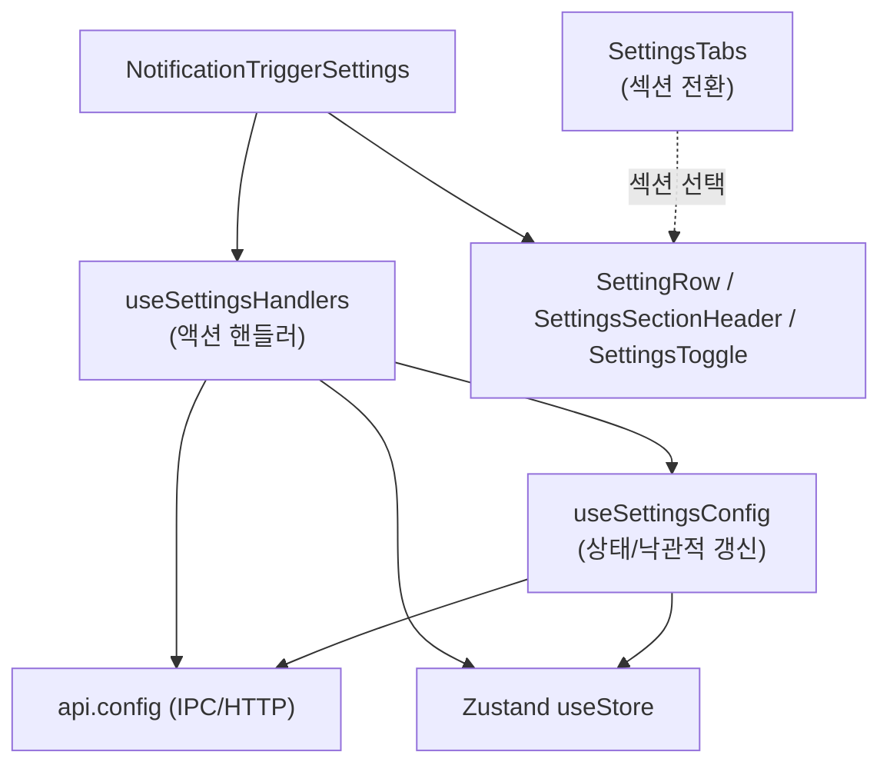
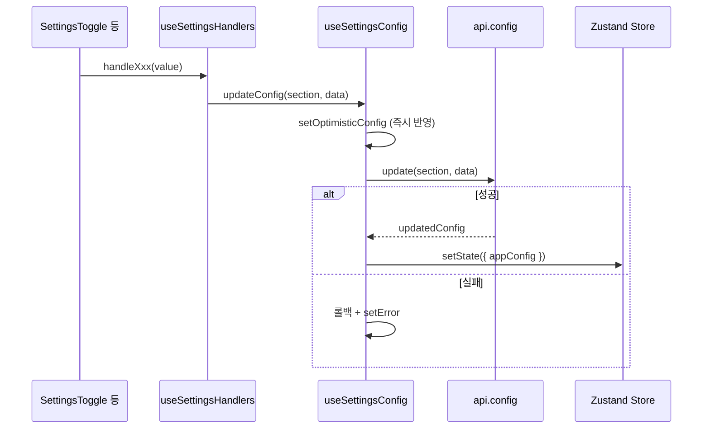
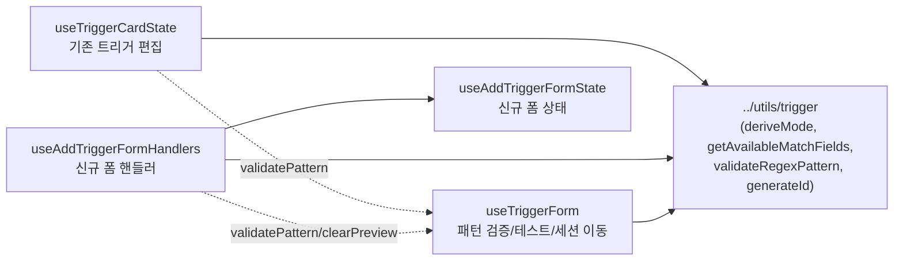
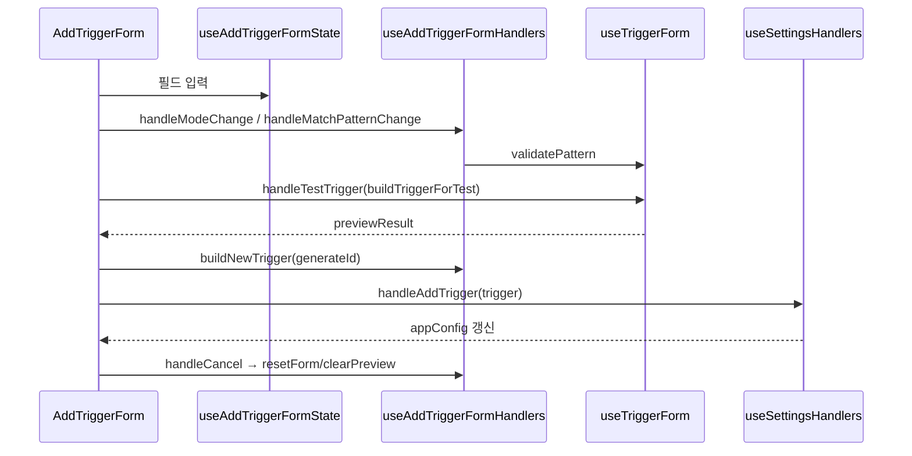

# renderer_settings_ui 모듈

## 개요

`renderer_settings_ui`는 claude-devtools 렌더러(React)의 **설정 화면 UI**를 구성하는 모듈이다. 다섯 개의 설정 섹션(General / Connection / Workspaces / Notifications / Advanced)을 탭으로 전환하고, 설정 값을 로드·낙관적 갱신·저장하는 훅과 알림 트리거(NotificationTrigger)를 생성/편집하는 폼 컴포넌트를 제공한다.

핵심 책임:
- **설정 상태 관리**: `useSettingsConfig`가 `api.config.get()`으로 설정을 읽고, 낙관적(optimistic) 상태를 유지하며 안전한 기본값(`SafeConfig`)을 제공.
- **액션 핸들러**: `useSettingsHandlers`가 섹션별 변경, 스누즈, 트리거 CRUD, 초기화, 가져오기/내보내기를 담당.
- **재사용 UI 프리미티브**: `SettingRow`, `SettingsSectionHeader`, `SettingsToggle`, `SettingsTabs`.
- **알림 트리거 편집 UI**: `NotificationTriggerSettings/` 하위의 컴포넌트·훅·타입.

관련 모듈 문서:
- 설정 영속화/검증(메인): [main_infrastructure](main_infrastructure.md) (`ConfigManager`, `TriggerManager`), [main_ipc_http](main_ipc_http.md)
- 트리거 도메인 타입/테스트: [main_error_detection](main_error_detection.md) (`NotificationTrigger`, `TriggerTestResult`, `triggerColors`)
- API 계약: [shared_api_utils](shared_api_utils.md) (`ConfigAPI`)
- 전역 스토어: [renderer_store](renderer_store.md) (`appConfig`, `repositoryGroups`, `navigateToError`)

## 아키텍처



### 디렉터리 구조

```
components/settings/
├── SettingsTabs.tsx
├── components/        # SettingRow, SettingsSectionHeader, SettingsToggle
├── hooks/             # useSettingsConfig, useSettingsHandlers
└── NotificationTriggerSettings/
    ├── types.ts
    ├── components/    # ColorPaletteSelector, IgnorePatternsSection, ModeSelector,
    │                  # RepositoryScopeSection, SectionHeader
    └── hooks/         # useTriggerForm, useTriggerCardState,
                       # useAddTriggerFormState, useAddTriggerFormHandlers
```

## 핵심 컴포넌트

### SettingsTabs
`SettingsSection = 'general' | 'connection' | 'workspace' | 'notifications' | 'advanced'`. `TabConfig.electronOnly`가 true인 탭(Connection, Workspaces)은 `isElectronMode()`가 false(브라우저/HTTP 모드)일 때 숨겨진다. 색상은 `--color-*` CSS 변수를 사용한다.

### 설정 UI 프리미티브
| 컴포넌트 | 역할 |
|---|---|
| `SettingRow` | label/description + 우측 컨트롤의 일관된 행 레이아웃 |
| `SettingsSectionHeader` | 대문자 소형 섹션 제목 |
| `SettingsToggle` | `role="switch"` 접근성 토글 (`enabled`, `onChange`, `disabled`) |

### useSettingsConfig
- 마운트 시 `api.config.get()` 호출 → `config`와 `optimisticConfig` 설정.
- `repositoryGroups`가 비어 있으면 `fetchRepositoryGroups()` 호출 (저장소 드롭다운용).
- `updateConfig(section, data)`: 낙관적 반영 → `api.config.update` → 성공 시 `config`, `optimisticConfig`, 전역 `appConfig`(`useStore.setState`) 동기화, 실패 시 `config`로 롤백하고 `error` 설정.
- `safeConfig`: `general`/`notifications`/`display`에 대해 null-safe 기본값 제공 (예: `theme: 'dark'`, `snoozeMinutes: 30`).
- 파생 값: `ignoredRepositoryItems`(ID → `RepositoryDropdownItem`, 못 찾으면 placeholder), `excludedRepositoryIds`, `isSnoozed`.

### useSettingsHandlers
`SettingsHandlers`는 섹션별로 묶인다.

| 그룹 | 핸들러 |
|---|---|
| General | `handleGeneralToggle`, `handleThemeChange`, `handleDefaultTabChange` |
| Notifications | `handleNotificationToggle`, `handleSnooze`, `handleClearSnooze`, `handleAddIgnoredRepository`, `handleRemoveIgnoredRepository` |
| Triggers | `handleAddTrigger`, `handleUpdateTrigger`(낙관적), `handleRemoveTrigger` |
| Display | `handleDisplayToggle` |
| Advanced | `handleResetToDefaults`, `handleExportConfig`, `handleImportConfig`, `handleOpenInEditor` |

세부 사항:
- `configRef`를 사용해 롤백 시 오래된 클로저(stale closure) 문제를 피한다.
- 모든 서버 응답은 `setConfig` / `setOptimisticConfig` / `setStoreState({ appConfig })` 세 곳에 반영된다.
- `handleResetToDefaults`는 `confirm` 후 내장 트리거 2종(`builtin-tool-result-error`, `builtin-bash-command`)과 기본 설정을 `notifications`, `general`, `display` 순서로 개별 `api.config.update` 호출한다.
- `handleImportConfig`는 JSON 파일을 읽어 존재하는 섹션만 업데이트 후 `api.config.get()`으로 재조회한다. `handleExportConfig`는 Blob 다운로드로 `claude-devtools-config.json`을 저장한다.

## 설정 변경 데이터 흐름



## NotificationTriggerSettings

트리거는 세 가지 모드(`TriggerMode`)를 가진다: `error_status`, `content_match`, `token_threshold`. `types.ts`는 `NotificationTriggerSettingsProps`(`triggers`, `saving`, `onUpdateTrigger`, `onAddTrigger`, `onRemoveTrigger`), `PreviewResult`(테스트 결과, `truncated` 포함), `ModeConfig`를 정의한다.

### 컴포넌트
| 컴포넌트 | 설명 |
|---|---|
| `ModeSelector` | `MODE_OPTIONS` 기반 세그먼트 컨트롤 |
| `ColorPaletteSelector` | `TRIGGER_COLORS` 프리셋 + 커스텀 hex 입력. **blur/Enter 시에만** `onChange` 호출(`HEX_RE = /^#[0-9a-fA-F]{3,8}$/`)해 입력 중 저장을 방지 |
| `IgnorePatternsSection` | 접이식 제외 정규식 목록. Enter 시 `new RegExp`로 검증 후 `onAdd`, 잘못된 정규식은 무시 |
| `RepositoryScopeSection` | 공용 `RepositoryDropdown`으로 트리거 적용 저장소 제한; 비어 있으면 전체 적용 |
| `SectionHeader` | 폼 섹션 제목 |

### 훅


- **useTriggerForm**: `validatePattern`(정규식 오류 문자열 관리), `handleTestTrigger`(`api.config.testTrigger`로 과거 데이터 테스트; 메인 프로세스가 최대 50 에러/10,000 count/100 세션/30초로 제한), `handleViewSession`(`navigateToError`로 딥링크 이동), `buildTriggerForTest`(`test-` 접두 ID의 임시 트리거 생성).
- **useTriggerCardState**: 기존 `TriggerCard`의 로컬 상태(이름 편집, 패턴, 모드, 토큰 임계값)와 `onUpdate` 호출 핸들러. 패턴·임계값·이름은 로컬 편집 후 **blur/저장 시 커밋**, 모드·콘텐츠 타입 변경 시 `matchField`/`requireError` 등 기본값을 재설정.
- **useAddTriggerFormState**: 신규 트리거 폼의 `useState` 묶음. `resetForm`은 마지막 사용 색상을 **의도적으로 유지**한다.
- **useAddTriggerFormHandlers**: 모드 변경 시 `error_status` → `tool_result` 고정, 콘텐츠 타입/툴 이름 변경 시 `matchField` 재설정, 숫자 외 문자 제거(`tokenThreshold`), `buildNewTrigger`(ID `custom-` 접두, 모드별 조건부 필드 포함).

### 신규 트리거 생성 흐름


## 의존성 및 참고

- `@renderer/api`(`api.config.*`, `isElectronMode`), `@renderer/store`(`useStore`), `@shared/constants/triggerColors`, `@shared/utils/logger`.
- 타입은 `@renderer/types/data`(`AppConfig`, `NotificationTrigger` 등)에서 가져온다.
- 파일에서 참조되지만 본 모듈 범위 밖인 항목: `../utils/constants`(`MODE_OPTIONS`), `../utils/trigger`, `@renderer/components/common/RepositoryDropdown`.
- 스타일은 Tailwind 테마 변수를 따른다(프로젝트의 `.claude/rules/tailwind.md` 참고).
- 주의: `handleResetToDefaults`/`handleImportConfig`는 `sessions` 섹션을 갱신하지 않으며, 여러 `update` 호출이 원자적이지 않다.
