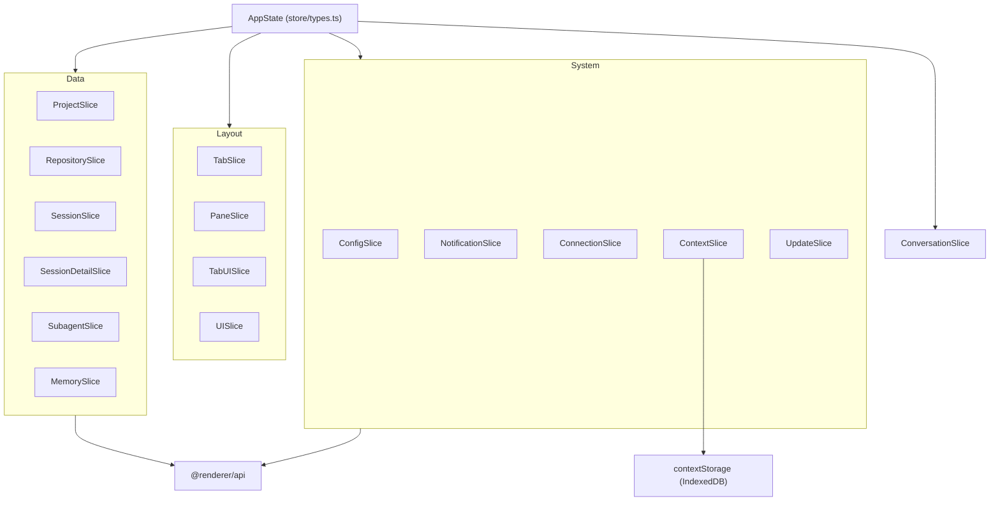
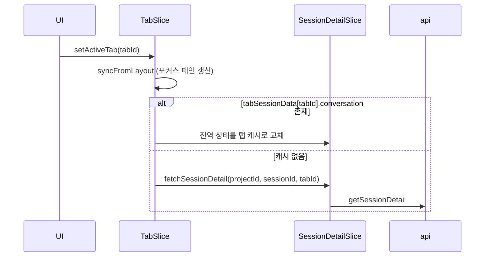
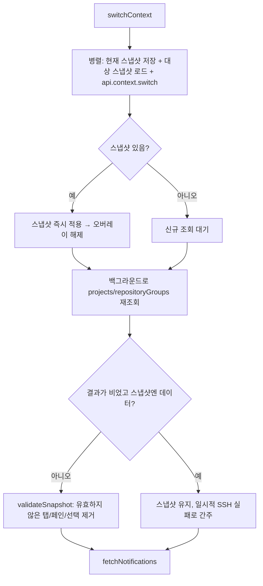

# renderer_store 모듈

## 개요

`renderer_store`는 claude-devtools 렌더러 프로세스의 전역 상태 계층입니다. Zustand 슬라이스 패턴으로 구성되며, `src/renderer/store/slices/*`의 16개 슬라이스가 `src/renderer/store/types.ts`의 `AppState` 교차 타입(intersection)으로 합쳐집니다. 또한 컨텍스트(로컬/SSH) 전환용 IndexedDB 스냅샷 저장소 `src/renderer/services/contextStorage.ts`를 포함합니다.

각 도메인 슬라이스는 데이터, 선택된 항목 ID, 로딩 상태, 에러 상태를 가지며, 메인 프로세스와는 `@renderer/api`(IPC 또는 HTTP 클라이언트)로만 통신합니다.

관련 모듈:
- [renderer_tabs_panes_navigation](renderer_tabs_panes_navigation.md): `Tab`, `Pane`, `PaneLayout` 타입, `TabUIContext`, 탐색 훅
- [renderer_context_tracking](renderer_context_tracking.md): `processSessionContextWithPhases`, `processSessionClaudeMd`
- [shared_api_utils](shared_api_utils.md): `ElectronAPI`, `SshConnectionConfig`, `MemoryIndex` 등 API 타입
- [main_domain_types](main_domain_types.md): `Project`, `Session`, `SessionDetail`, `RepositoryGroup`
- [main_ipc_http](main_ipc_http.md): `api`의 백엔드 (IPC/HTTP)
- [renderer_chat_ui](renderer_chat_ui.md): 스토어를 구독하는 채팅 UI (`SessionConversation`, `AIGroup`)

## 아키텍처

각 슬라이스는 `StateCreator<AppState, [], [], XxxSlice>` 형태이므로 `get()`을 통해 다른 슬라이스의 액션을 직접 호출할 수 있습니다. 이 교차 호출이 슬라이스 간 결합의 핵심입니다.

## 슬라이스 요약

| 슬라이스 | 주요 상태 | 주요 액션 / 역할 |
|---|---|---|
| `ProjectSlice` | `projects`, `selectedProjectId`, `_sessionCache` (`SessionCacheEntry`) | `fetchProjects`(최근 세션 순 정렬), `selectProject`(캐시 즉시 적용 후 항상 백그라운드 재조회) |
| `RepositorySlice` | `repositoryGroups`, `selectedRepositoryId/WorktreeId`, `viewMode` | `selectRepository`(main worktree 우선 자동 선택), `selectWorktree`, `setViewMode` |
| `SessionSlice` | `sessions`, 커서 페이지네이션, `pinnedSessionIds`, `hiddenSessionIds`, 다중 선택, `sessionSortMode` | `fetchSessionsInitial/More`(20개, `metadataLevel: 'light'`), `refreshSessionsInPlace`, pin/hide 낙관적 업데이트 + 롤백 |
| `SessionDetailSlice` | `sessionDetail`, `conversation`, 컨텍스트 통계, `agentConfigs`, `tabSessionData` (`TabSessionData`) | `fetchSessionDetail`, `refreshSessionInPlace`, `setVisibleAIGroup`, `cleanupTabSessionData` |
| `SubagentSlice` | `drillDownStack` (`BreadcrumbItem[]`), `currentSubagentDetail` | `drillDownSubagent`, `navigateToBreadcrumb`, `closeSubagentModal` |
| `ConversationSlice` | 확장 상태(Map/Set), 검색 상태, `activeDetailItem` (`ActiveDetailItem`) | `setSearchQuery`, `syncSearchMatchesWithRendered`, `next/previousSearchResult` |
| `TabSlice` | `openTabs`, `activeTabId`, `selectedTabIds`, `activeProjectId` | `openTab`, `closeTab`, `setActiveTab`, `navigateToSession`, 탐색 요청 큐 |
| `PaneSlice` | `paneLayout` | `splitPane`, `closePane`, `moveTabToPane`, `resizePanes` |
| `TabUISlice` | `tabUIStates: Map<tabId, TabUIState>` | 탭별 확장/스크롤/컨텍스트 패널 상태 완전 격리 |
| `UISlice` | `commandPaletteOpen`, `sidebarCollapsed` | 팔레트·사이드바 토글 |
| `NotificationSlice` | `notifications`, `unreadCount` | CRUD, `navigateToError`(딥링크), `openNotificationsTab` |
| `ConfigSlice` | `appConfig`, `pendingSettingsSection` | `fetchConfig`, `updateConfig`, `openSettingsTab` |
| `ConnectionSlice` | `connectionMode`, `connectionState`, `sshConfigHosts`, `lastSshConfig` | `connectSsh`, `disconnectSsh`, `testConnection` |
| `ContextSlice` | `activeContextId`, `isContextSwitching`, `availableContexts` | `switchContext`, `initializeContextSystem` |
| `UpdateSlice` | `updateStatus`, `downloadProgress`, 다이얼로그/배너 플래그 | `checkForUpdates`, `downloadUpdate`, `installUpdate` |
| `MemorySlice` | 프로젝트별 memory 존재/인덱스/확장 항목, `fileContents` 캐시 | `loadMemoryForProject`, `toggleMemoryEntry`(지연 로딩), `openMemoryTab` |

공유 타입(`store/types.ts`): `BreadcrumbItem`(서브에이전트 드릴다운), `SearchMatch`(사용자 메시지와 AI `lastOutput`만 검색), `SearchNavigationContext`(커맨드 팔레트 → 세션 이동).

## 핵심 설계

### 1. 탭/페인 파사드

`PaneSlice.paneLayout`이 진실의 원천(source of truth)입니다. `openTabs`, `activeTabId`, `selectedTabIds`는 포커스된 페인에서 파생되며 `syncFocusedPaneState`(`utils/paneHelpers`)로 동기화됩니다(하위 호환용). `TabSlice`와 `PaneSlice`는 각각 `syncFromLayout`/`syncRootState` 헬퍼로 이를 수행합니다.

`setActiveTab`은 세션 탭의 경우 사이드바 상태(저장소/워크트리/프로젝트/세션 선택)를 함께 맞춥니다. 탭별 캐시(`tabSessionData`)가 있으면 재조회 없이 전역 상태를 교체하고, 없으면 `fetchSessionDetail`을 호출합니다.

### 2. 세션 상세 로딩 (2단계)

`fetchSessionDetail`은 다음 순서로 동작합니다.

1. **Phase 1**: `transformChunksToConversation`으로 대화를 만들어 즉시 렌더링합니다. 원본 `chunks`/`processes`는 메모리 절약을 위해 비웁니다(`slimDetail`).
2. **Phase 2**(SSH가 아닐 때, fire-and-forget): CLAUDE.md 토큰, 디렉터리 CLAUDE.md, @멘션 파일을 `batchAsync`(동시성 5)로 읽은 뒤 `processSessionClaudeMd`와 `processSessionContextWithPhases`로 통계를 계산하여 `sessionContextStats`, `sessionPhaseInfo`를 채웁니다. 자세한 내용은 [renderer_context_tracking](renderer_context_tracking.md)을 참고하세요.

경쟁 상태 방어:
- `sessionDetailFetchGeneration`: 최신 요청이 아닌 응답은 폐기
- `refreshSessionInPlace`: `sessionRefreshInFlight`/`sessionRefreshQueued`로 중복 요청 병합, 세대 번호로 오래된 응답 폐기
- `sessionFileFingerprint`: 메인이 `unchanged` 응답을 반환하도록 파일 지문(mtime+size) 전달
- `sessionChunkFingerprint`(`청크수:마지막청크 메시지수:isOngoing`): 변환 생략
- `incrementalUpdateConversation`으로 변경된 꼬리 부분만 재변환하고, 확장 상태는 유지

### 3. 컨텍스트(로컬/SSH) 전환

`ContextSlice.switchContext`는 재진입을 막고(`isContextSwitching`), 다음 단계를 따릅니다.

`contextStorage`(`idb-keyval` 기반)는 `ContextSnapshot`을 `context-snapshot:{contextId}` 키로 저장합니다. TTL은 5분이고 `SNAPSHOT_VERSION`이 다르면 폐기합니다. Map/Set 같은 직렬화 불가능한 상태와 일시적 상태(로딩, 에러, 검색)는 제외합니다. `StoredSnapshot`은 `snapshot`, `timestamp`, `version`을 감싼 내부 타입입니다.

`ConnectionSlice.connectSsh`/`disconnectSsh`는 연결 시 `getFullResetState()`(`utils/stateResetHelpers`)와 함께 탭, 페인, 프로젝트를 초기화한 뒤 데이터를 다시 조회합니다. 비밀번호는 저장하지 않고 `host/port/username/authMethod`만 `lastSshConfig`로 저장합니다.

### 4. 탭별 UI 격리

`TabUISlice`는 `tabId`를 키로 `expandedAIGroupIds`, `expandedDisplayItemIds`, `expandedSubagentTraceIds`, `showContextPanel`, `selectedContextPhase`, `savedScrollTop`을 보관합니다. 같은 세션을 두 탭에서 열어도 UI 상태는 독립적입니다. 탭이 닫히면 `cleanupTabUIState`와 `cleanupTabSessionData`가 호출됩니다. `ConversationSlice`의 전역 확장 상태는 레거시 성격이며 탭 격리 UI는 `TabUISlice`를 사용합니다. 렌더러 측 컨텍스트는 [renderer_tabs_panes_navigation](renderer_tabs_panes_navigation.md)의 `TabUIContext`와 연결됩니다.

### 5. 검색

`ConversationSlice.setSearchQuery`는 단순 `indexOf`로 사용자 메시지와 AI `lastOutput` 텍스트를 스캔하며 `MAX_SEARCH_MATCHES = 500`에서 결과를 자릅니다(`searchResultsCapped`). 렌더링된 `<mark>` 요소의 DOM 순서와 맞추기 위해 `syncSearchMatchesWithRendered`가 매치를 정규화하고 현재 인덱스를 보존합니다. 디버그 로그는 `localStorage['search-debug'] === '1'`로 켭니다.

### 6. 알림 딥링크

`NotificationSlice.navigateToError`는 알림을 읽음 처리하고 `createErrorNavigationRequest`로 nonce가 포함된 요청을 만듭니다. 세션 탭이 이미 열려 있으면 활성화하고, 아니면 새로 열어 `enqueueTabNavigation`으로 큐에 넣습니다. 실제 소비는 `useTabNavigationController`에서 합니다.

## 오류 처리 및 패턴

- 비동기 조회는 대체로 `xxxLoading`/`xxxError` 필드를 갱신하며 예외를 던지지 않습니다.
- 백그라운드 새로고침(`refreshSessionInPlace`, `refreshSessionsInPlace`)은 에러 상태를 설정하지 않고 로그만 남깁니다.
- 핀/숨김 같은 사용자 액션은 낙관적 업데이트 후 실패 시 롤백합니다.
- 알림 mutation은 IPC가 `false`를 반환하면 `fetchNotifications`로 재동기화합니다.
- 설정/알림/메모리 탭은 포커스된 페인에서 싱글턴으로 동작합니다(메모리 탭은 프로젝트별로 모든 페인에서 재사용).
- 모듈 수준 `Map`/`Set`(세대, 지문 캐시)은 스토어 외부에 있으므로 스토어 리셋으로 초기화되지 않습니다.

## 테스트

`test/renderer/store/` 아래에 `notificationSlice`, `paneSlice`, `pathResolution`, `sessionSlice`, `tabSlice`, `tabUISlice` 테스트가 있습니다. 실행은 `pnpm test`(설정은 `vitest.config.ts`, `happy-dom` 환경)입니다. 슬라이스를 수정한 뒤에는 이 테스트를 반드시 실행하세요.
