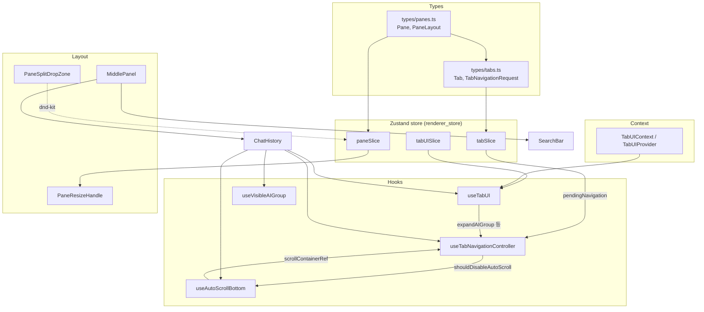
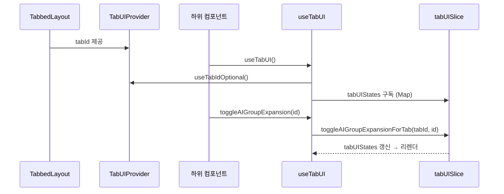
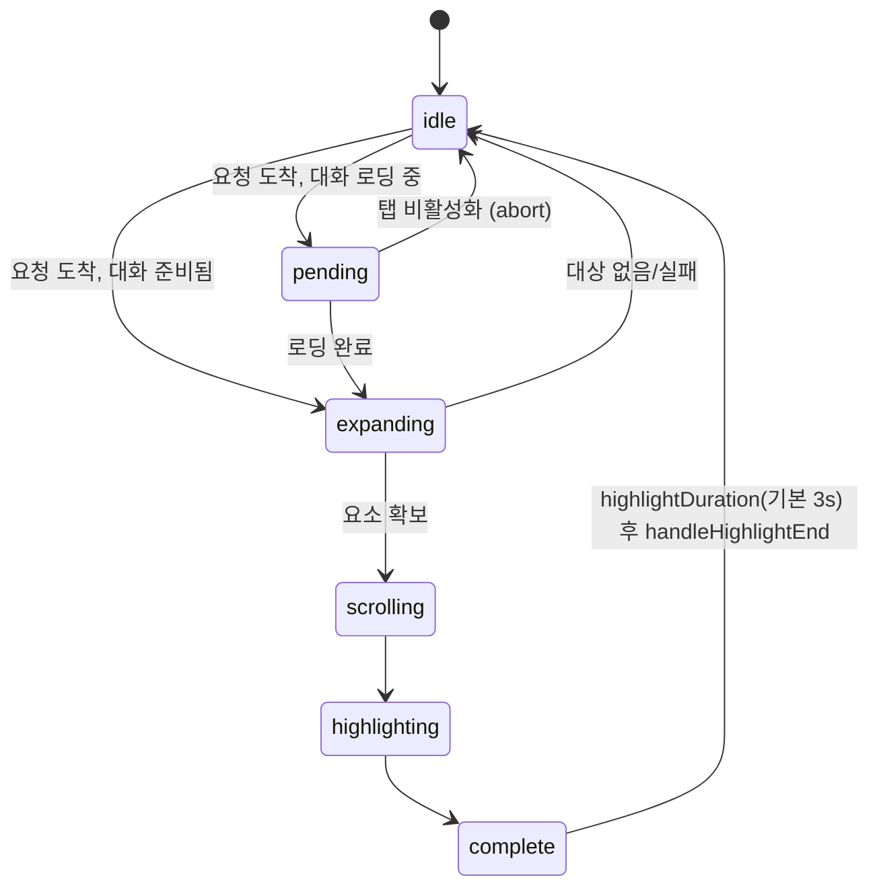
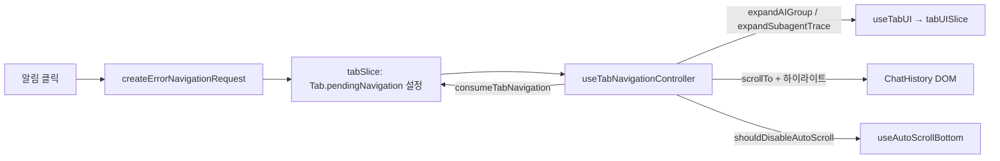

# renderer_tabs_panes_navigation 모듈

## 개요

`renderer_tabs_panes_navigation`은 렌더러(React) 쪽에서 **멀티 페인 레이아웃, 탭, 탭별 UI 상태 격리, 탭 내 네비게이션(에러/검색 이동·하이라이트), 자동 스크롤**을 담당하는 타입·컨텍스트·훅·레이아웃 컴포넌트 묶음입니다. Zustand 슬라이스(`paneSlice`, `tabSlice`, `tabUISlice`)가 상태를 보관하고, 이 모듈은 그 상태의 **타입 계약**과 **소비 계층(훅/컴포넌트)** 을 제공합니다.

슬라이스 자체는 [renderer_store](renderer_store.md), 컨텍스트 토큰 추적은 [renderer_context_tracking](renderer_context_tracking.md), 채팅 렌더링은 [renderer_chat_ui](renderer_chat_ui.md)를 참고하세요.

## 구성 요소

| 파일 | 핵심 심볼 | 역할 |
|------|-----------|------|
| `src/renderer/types/panes.ts` | `Pane`, `PaneLayout`, `MAX_PANES` | 멀티 페인 상태 타입 (최대 4개) |
| `src/renderer/types/tabs.ts` | `Tab`, `TabNavigationRequest`, `ErrorNavigationPayload`, `SearchNavigationPayload`, `OpenTabOptions` | 탭/네비게이션 요청 타입과 헬퍼 |
| `src/renderer/contexts/TabUIContext.tsx` | `TabUIContext`, `TabUIProvider` | 현재 탭 ID를 하위 트리에 제공 |
| `src/renderer/hooks/useTabUI.ts` | `useTabUI`, `UseTabUIReturn` | 컨텍스트(tabId) + `tabUISlice`를 결합한 탭별 UI 상태 훅 |
| `src/renderer/hooks/useTabNavigationController.ts` | `useTabNavigationController`, `NavigationPhase` | 네비게이션 요청 생애주기 컨트롤러 |
| `src/renderer/hooks/useAutoScrollBottom.ts` | `useAutoScrollBottom`, `isNearBottom` | 채팅형 하단 자동 스크롤 |
| `src/renderer/hooks/useVisibleAIGroup.ts` | `useVisibleAIGroup` | IntersectionObserver로 가장 위에 보이는 AI 그룹 추적 |
| `src/renderer/components/layout/MiddlePanel.tsx` | `MiddlePanel` | `SearchBar` + `ChatHistory` 조합 |
| `src/renderer/components/layout/PaneResizeHandle.tsx` | `PaneResizeHandle` | 페인 사이 드래그 리사이즈 |
| `src/renderer/components/layout/PaneSplitDropZone.tsx` | `PaneSplitDropZone` | 탭 드래그로 새 페인 생성하는 드롭 영역 |

## 아키텍처

## 멀티 페인 (`panes.ts`)

- `Pane`: `id`, `tabs`, `activeTabId`, `selectedTabIds`(다중 선택), `widthFraction`(0~1, 전체 합 = 1).
- `PaneLayout`: 좌→우 순서의 `panes`와 키보드/사이드바 동작을 받는 `focusedPaneId`.
- `MAX_PANES = 4`.

### PaneResizeHandle
`#pane-container`의 bounding rect 기준으로 마우스 X를 비율로 환산하고, 왼쪽 페인 앞의 누적 `widthFraction`을 뺀 값을 `resizePanes(leftPaneId, newWidth)`에 전달합니다. 드래그 중에는 `document`에 `mousemove/mouseup`을 등록하고 `cursor: col-resize`, `userSelect: none`을 적용합니다. (Sidebar 리사이즈와 동일 패턴)

### PaneSplitDropZone
`@dnd-kit/core`의 `useDroppable`로 `split-{side}-{paneId}` 드롭 대상(`data.type = 'split-zone'`)을 등록합니다. 페인의 좌/우 절반을 덮으며, `isActive`일 때만 `pointerEvents`가 활성화되고 hover 시 accent 오버레이를 표시합니다. 실제 분할 처리는 상위 DnD 핸들러/`paneSlice`가 합니다.

## 탭과 네비게이션 요청 (`tabs.ts`)

`Tab.type`은 `'session' | 'dashboard' | 'notifications' | 'settings' | 'memory'`. 탭은 `pendingNavigation`, `lastConsumedNavigationId`, `savedScrollTop`, `showContextPanel` 등을 가집니다.

`TabNavigationRequest`:
- `id`: 클릭마다 새로 만드는 nonce (`generateUUID`) → 같은 대상을 반복 클릭해도 새 네비게이션이 됨
- `kind`: `'error' | 'search' | 'autoBottom'`
- `source`: `'notification' | 'triggerPreview' | 'commandPalette' | 'sessionOpen'`
- `highlight`: `TriggerColor | 'yellow' | 'none'`
- `payload`: `ErrorNavigationPayload`(errorTimestamp, toolUseId, subagentId …) 또는 `SearchNavigationPayload`(query, messageTimestamp, targetGroupId, targetMatchIndexInItem …)

헬퍼: `findTabBySession`, `findTabBySessionAndProject`(동일 sessionId라도 프로젝트가 다르면 구분), `truncateLabel`(50자), `createErrorNavigationRequest`(기본 highlight `red`), `createSearchNavigationRequest`(`yellow`), 타입 가드 `isErrorPayload`/`isSearchPayload`.

## 탭별 UI 상태 격리

- `TabUIProvider`는 `{ tabId }`만 제공합니다.
- `useTabUI`는 `tabUIStates` Map을 **직접 구독**합니다(getter 함수는 참조가 안 바뀌어 반응성이 깨지므로). 제공 기능: AI 그룹/표시 아이템/서브에이전트 트레이스 확장, 컨텍스트 패널 표시 및 선택 phase, 스크롤 위치 저장, `initializeTabUI`. 탭 컨텍스트 밖에서는 `tabId = null`이며 액션은 no-op.

## useTabNavigationController

기존 `useNavigationCoordinator` + `useSearchContextNavigation`을 대체하는 단일 컨트롤러입니다. 활성 탭에서만 동작하며 요청을 순차 처리합니다.

처리 규칙:
1. 비활성 탭, 이미 처리 중인 요청 id, 최근 실패(500ms 이내)는 무시.
2. **error**: `subagentId` → `findAIGroupBySubagentId`, 없으면 `findAIGroupByTimestamp`, 그래도 없으면 마지막 AI 그룹. 그룹/서브에이전트 트레이스 확장 후 하이라이트를 먼저 설정하고(스크롤이 불완전해도 보이도록), 요소 안정화 대기(`waitForElementStability`) → 도구 아이템(서브에이전트는 1200ms, 일반 300ms 대기) → `calculateCenteredScrollTop`으로 중앙 스크롤.
3. **search**: `targetGroupId`가 있으면 정확 매칭, 없으면 `findChatItemByTimestamp`. `setSearchQuery`, `selectSearchMatch` 후 노란 하이라이트; 종료 시 검색어 초기화.
4. **autoBottom**: `useAutoScrollBottom`이 처리하므로 요청만 consume.
5. 성공/실패와 관계없이 `consumeTabNavigation(tabId, id)`로 소비 → 재처리 방지. `AbortController`로 탭 전환/언마운트 시 중단.
6. `shouldDisableAutoScroll`은 phase가 idle이 아니거나 활성 탭에 `pendingNavigation`이 있으면 true.

보조 유틸은 `hooks/navigation/utils`(이 모듈의 제공 코드에는 포함되지 않음)에 있습니다.

## useAutoScrollBottom

- 하단 임계값(`threshold`, 기본 100px) 안에 있을 때만 콘텐츠 변경 시 자동 스크롤 → 사용자가 위로 스크롤하면 강제하지 않음.
- `resetKey` 변경(탭/세션 전환) 시 `needsInitialScrollRef`로 첫 로드에서 강제 하단 이동.
- `disabled`(네비게이션 중)·`enabled` 옵션, 이중 `requestAnimationFrame` + cleanup으로 StrictMode 중복 실행 방지, 프로그래매틱 스크롤 중에는 scroll 이벤트 무시.
- `externalRef`로 컨트롤러와 스크롤 컨테이너 ref 공유. 반환: `scrollContainerRef`, `getIsAtBottom`, `scrollToBottom`, `checkIsAtBottom`.

## useVisibleAIGroup

`registerAIGroupRef(id)`가 반환하는 ref 콜백으로 요소를 `IntersectionObserver`에 등록(`data-aigroup-id` 부여). `threshold`(기본 0.5) 이상 보이는 그룹 중 `getBoundingClientRect().top`이 가장 작은 그룹을 `onVisibleChange`로 보고합니다. 중첩 스크롤은 `rootRef`로 지정. 컨텍스트 패널의 phase/턴 동기화 등에 사용됩니다.

## MiddlePanel

`tabId`를 받아 `SearchBar`와 `ChatHistory`에 전달하는 얇은 컨테이너(`relative flex h-full flex-col`). 탭별 스크롤/상태 격리의 진입점입니다.

## 전체 데이터 흐름 예시: 알림 클릭 → 에러 위치 이동

## 관련 사항

- 테스트: `test/renderer/hooks/`(`navigationUtils`, `useAutoScrollBottom`, `useSearchContextNavigation`, `useVisibleAIGroup`), `test/renderer/store/`(`paneSlice`, `tabSlice`, `tabUISlice`) — 테스트 설정은 `vitest.config.ts`(happy-dom).
- 스타일은 CSS 변수 기반(`var(--color-border)`, `--color-accent`)이며 규칙은 `.claude/rules/tailwind.md` 참고.
