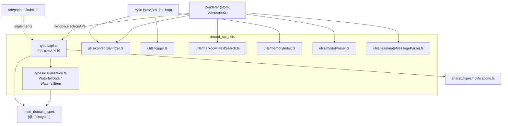
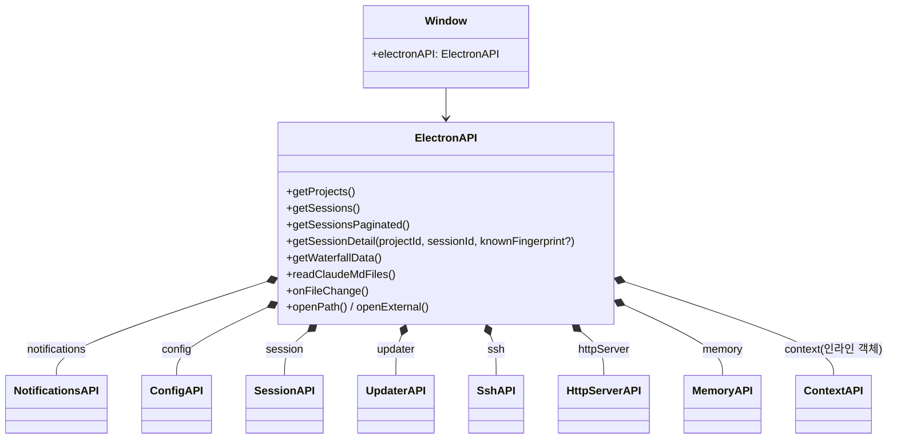
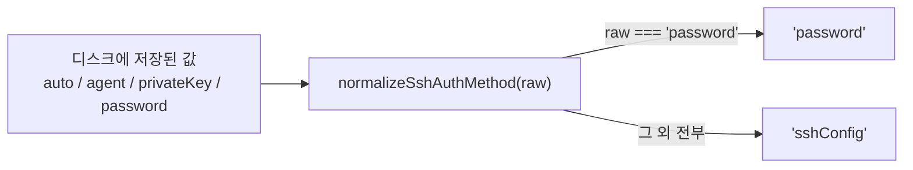
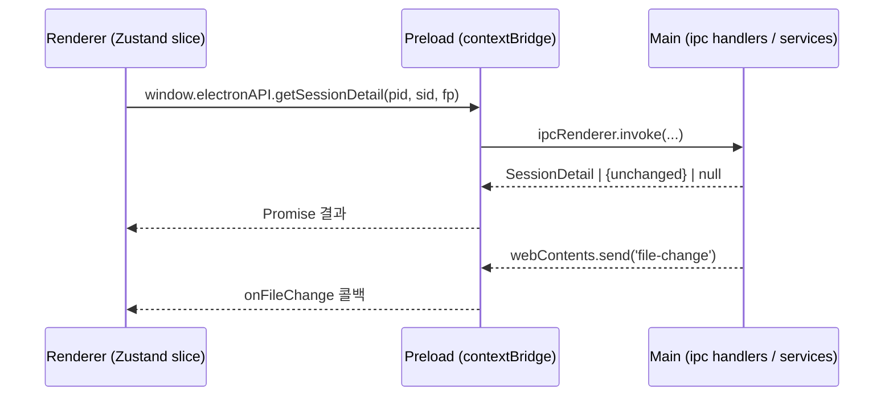
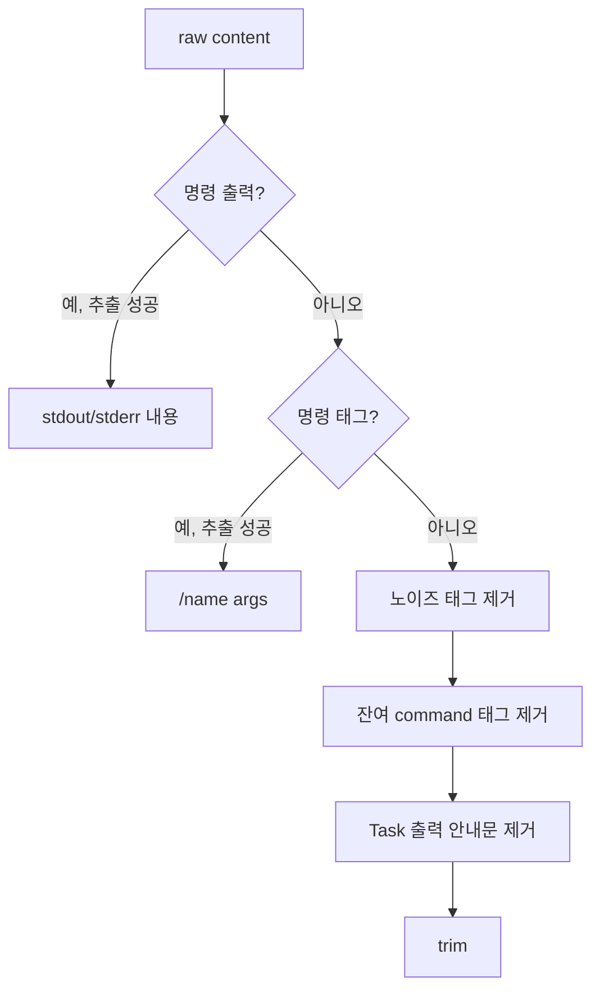

# shared_api_utils 모듈

`shared_api_utils`는 Electron의 main / preload / renderer 세 프로세스가 **공통으로 import**하는 `src/shared` 하위의 타입 계약과 순수 유틸리티 모음입니다. 크게 두 부분으로 나뉩니다.

1. **IPC/HTTP API 계약** — `src/shared/types/api.ts` (`ElectronAPI` 및 하위 API 인터페이스), `src/shared/types/visualization.ts` (워터폴 차트 타입)
2. **순수 유틸리티** — `src/shared/utils/` 아래의 콘텐츠 정제, 로깅, 마크다운 검색, 메모리 인덱스 파서, 모델 문자열 파서, 팀원 메시지 파서

상위 모듈 `Shared_Domain_Contracts`에 속하며, 형제 모듈인 `main_domain_types`(`src/main/types/*`)의 도메인 타입을 참조합니다.

> 관련 문서: [main_domain_types](main_domain_types.md) · [main_ipc_http](main_ipc_http.md) · [main_error_detection](main_error_detection.md) (`notifications.ts` 타입) · [renderer_store](renderer_store.md) · [main_infrastructure](main_infrastructure.md) · [main_ssh](main_ssh.md)

---

## 1. 아키텍처 개요

핵심 설계 원칙:

- **타입 전용 import**: `api.ts`는 `import type`으로 `@main/types`를 참조하므로 런타임 의존성이 없습니다.
- **프로세스 중립성**: 유틸은 Node/Electron API에 의존하지 않는 순수 함수입니다(`logger.ts`의 `process.env.NODE_ENV` 제외).
- **구현 위치 분리**: 인터페이스는 여기, 실제 구현은 `src/preload/index.ts`(IPC) 및 `src/renderer/api/httpClient.ts`(HTTP)에 있습니다. 자세한 내용은 [main_ipc_http](main_ipc_http.md) 참고.

---

## 2. API 계약 (`src/shared/types/api.ts`)

### 2.1 구조

`declare global { interface Window { electronAPI: ElectronAPI } }`로 렌더러에서 `window.electronAPI`를 타입 안전하게 사용합니다.

### 2.2 하위 API 요약

| 인터페이스 | 역할 | 주요 메서드 |
|---|---|---|
| `NotificationsAPI` | 알림 목록/읽음 처리/이벤트 구독 | `get`, `markRead`, `markAllRead`, `delete`, `clear`, `getUnreadCount`, `onNew`, `onUpdated`, `onClicked` |
| `ConfigAPI` | 앱 설정, 트리거, 세션 pin/hide, Claude root 선택 | `get`, `update`, `addTrigger`, `testTrigger`, `selectClaudeRootFolder`, `getClaudeRootInfo`, `findWslClaudeRoots`, `pinSession`, `hideSessions` 등 |
| `SessionAPI` | 딥링크 스크롤 | `scrollToLine` |
| `UpdaterAPI` | 자동 업데이트 | `check`, `download`, `install`, `onStatus` |
| `SshAPI` | SSH 원격 접속 | `connect`, `disconnect`, `getState`, `test`, `getConfigHosts`, `resolveHost`, `saveLastConnection`, `getLastConnection`, `onStatus` |
| `HttpServerAPI` | 사이드카 HTTP 서버 제어 | `start`, `stop`, `getStatus` |
| `MemoryAPI` | 프로젝트별 Claude memory 뷰어 | `hasMemory`, `getIndex`, `readFile`, `listAvailableOpeners`, `openIn`, `copyPath`, `onChanged` |

모든 `on*` 구독 메서드는 **구독 해제 함수**(`() => void`)를 반환합니다. 알림/업데이트 이벤트의 콜백 인자는 preload 계층에서 타입을 알 수 없어 `unknown`으로 선언되어 있으며, 소비자가 `DetectedError` 등으로 캐스팅해야 합니다.

### 2.3 보조 타입

- **Claude root**: `ClaudeRootInfo`(`defaultPath`/`resolvedPath`/`customPath`), `ClaudeRootFolderSelection`, `WslClaudeRootCandidate`(Windows WSL UNC 경로 후보)
- **CLAUDE.md**: `ClaudeMdFileInfo { path, exists, charCount, estimatedTokens }`
- **업데이트**: `UpdaterStatus.type` = `checking | available | not-available | downloading | downloaded | error`
- **컨텍스트**: `ContextInfo { id, type: 'local' | 'ssh' }`
- **에이전트**: `AgentConfig { name, color? }`
- **Open 대상**: `OpenTargetId`(finder, cursor, vscode, zed, …, copy-path), `OpenTarget`
- **Memory**: `MemoryEntry`, `MemoryIndex`, `MemoryReadFileResult`, `MemoryOpenResult`(성공/실패 판별 유니온)

### 2.4 SSH 타입과 인증 방식 정규화

- `SshAuthMethod = 'sshConfig' | 'password'`. `sshConfig`는 시스템 OpenSSH 클라이언트(`~/.ssh/config`, `ssh -G`)에 해석을 위임합니다.
- `privateKeyPath`는 `@deprecated`이며 연결 시 무시됩니다(과거 저장 프로파일의 타입 호환용).
- `SshConnectionConfig`(렌더러→main 전송, password 포함)와 `SshConnectionProfile`/`SshLastConnection`(저장용, **password 없음**)이 분리되어 있습니다.
- `SshConnectionStatus { state, host, error, remoteProjectsPath }`, `state`는 `disconnected | connecting | connected | error`.

런타임 구현은 [main_ssh](main_ssh.md) 문서를 참고하십시오.

### 2.5 `getSessionDetail`의 fingerprint 최적화

`knownFingerprint`가 현재 파일 상태와 일치하면 전체 payload 대신 `{ unchanged: true, fingerprint }` sentinel(`SessionDetailResponse`의 일부)을 반환합니다. 렌더러의 `refreshSessionInPlace`가 변경 없는 새로고침의 IPC 직렬화 비용을 피하기 위한 것입니다. 최초 로드(fingerprint 없음)는 항상 전체 `SessionDetail` 또는 `null`을 받습니다. 도메인 타입은 [main_domain_types](main_domain_types.md) 참고.

### 2.6 요청 흐름

HTTP 모드(브라우저)에서는 `HttpAPIClient`가 동일 `ElectronAPI` 형태를 구현하는 것으로 [main_ipc_http](main_ipc_http.md)에서 다룹니다.

---

## 3. 시각화 타입 (`src/shared/types/visualization.ts`)

- `WaterfallItem`: `id`, `label`, `startTime`/`endTime`(Date), `durationMs`, `tokenUsage`(`TokenUsage`, `@main/types`), `level`(0 = 메인 세션), `type: 'chunk' | 'subagent' | 'tool'`, `isParallel`, `parentId?`, `groupId?`, `metadata?`(`subagentType`, `toolName`, `messageCount`)
- `WaterfallData`: `items`, `minTime`, `maxTime`, `totalDurationMs`

`ElectronAPI.getWaterfallData()`의 반환 타입입니다.

---

## 4. 유틸리티

### 4.1 `contentSanitizer.ts` — JSONL 콘텐츠 표시용 정제

main(`jsonl.ts` 초기 파싱)과 renderer(`groupTransformer.ts`) 양쪽에서 사용됩니다.

| 함수 | 설명 |
|---|---|
| `isCommandContent(content)` | `<command-name>` 또는 `<command-message>`로 시작하는지 (내장 명령/스킬 두 순서 모두 처리) |
| `isCommandOutputContent(content)` | `<local-command-stdout>`/`<local-command-stderr>`로 시작하는지 |
| `sanitizeDisplayContent(content)` | 명령 출력 추출 → 명령 표시(`/model sonnet`) → 노이즈 태그 제거 → 잔여 command 태그 제거 → "Read the output file…" 꼬리 제거 → trim |
| `extractSlashInfo(content)` | `SlashInfo { name, message?, args? }` 반환, 슬래시 명령이 아니면 `null` |
| `parseTaskNotifications(content)` | `<task-notification>` 블록을 `TaskNotification { taskId, status, summary, outputFile }[]`로 파싱 |

제거되는 노이즈 태그: `local-command-caveat`, `system-reminder`, `task-notification`.

### 4.2 `logger.ts` — 네임스페이스 로거

`createLogger(namespace)`가 `Logger`를 반환하며 출력은 `[namespace]` 접두사가 붙습니다. 정적 레벨은 `NODE_ENV === 'production'`이면 `ERROR`, 아니면 `WARN`이 기본값입니다(주석상 "개발 시 전 레벨"이지만 코드 기본값은 `WARN`이므로 `debug`/`info`는 `Logger.setLevel`로 낮춰야 출력됩니다). `setLevel`/`getLevel`로 런타임 변경이 가능합니다. `LogLevel` enum은 export되지 않으며 `Logger`는 타입으로만 export됩니다.

### 4.3 `markdownTextSearch.ts` — 렌더러와 일치하는 마크다운 검색

react-markdown과 **동일한 파이프라인**(`remark-parse` → `remark-gfm` → `mdast-util-to-hast`)으로 HAST를 만들고, `hl()`(highlightSearchInChildren)을 호출하는 요소(`HL_TAGS`: h1–h6, p, code, blockquote, li, th, td) 내부의 text 노드만 세그먼트로 수집합니다. 이렇게 해야 검색 매치 수가 실제 하이라이트 수와 정확히 일치합니다.

- 세그먼트는 텍스트 노드별로 보관(연결하지 않음) — 요소 경계를 넘는 매치는 무효
- `raw` HTML 노드는 건너뜀 (rehype-raw 미사용 시 react-markdown이 버리므로)
- 파서 싱글턴 + 최대 1000개 세그먼트 캐시(가장 오래된 항목 제거)
- 쿼리가 원문에 없으면 파싱 없이 조기 반환

| 함수 | 용도 |
|---|---|
| `collectTextSegments(markdown)` | 세그먼트 배열 |
| `findMarkdownSearchMatches(markdown, query)` | `MarkdownSearchMatch { matchIndexInItem }[]` |
| `countMarkdownSearchMatches(markdown, query)` | 개수만 (할당 절약) |
| `extractMarkdownPlainText(markdown)` | 공백으로 이은 가시 텍스트(컨텍스트 스니펫용) |

> 동기화 주의: `HL_TAGS`는 `createMarkdownComponents()`(markdownComponents.tsx), `createUserMarkdownComponents()`(UserChatGroup.tsx), `createViewerMarkdownComponents()`(MarkdownViewer.tsx)와 일치해야 합니다. 이를 검증하는 테스트가 `test/shared/utils/markdownSearchRendererAlignment.test.ts`입니다. 검색 동작 자체는 `devtools:markdown-search-logic` 스킬 및 `SessionSearcher`([main_discovery_search](main_discovery_search.md))를 참고하십시오.

### 4.4 `memoryIndex.ts` — MEMORY.md 파서

`parseMemoryIndex(markdown, dirListing)` → `MemoryIndex`.

- 대상: `~/.claude/projects/<encoded>/memory/MEMORY.md`
- 항목 형식: `- [Title](file.md) — hook` (`—`, `–`, `-` 구분자 허용, hook 생략 가능)
- `ENTRY_REGEX`는 부정 문자 클래스만 사용해 선형 시간 매칭 보장(ReDoS 방어)
- `rawMarkdown`은 원문 그대로 유지(머리말/섹션 헤더 렌더링용)
- `orphanFiles`: 디렉터리 목록 중 `.md`이면서 `MEMORY.md`가 아니고 인덱스에 링크되지 않은 파일(`localeCompare` 정렬)

참고: `MemoryEntry`/`MemoryIndex`는 `api.ts`와 `memoryIndex.ts`에 **동일한 형태로 중복 정의**되어 있습니다. 한쪽을 바꾸면 반드시 다른 쪽도 맞춰야 합니다.

### 4.5 `modelParser.ts` — 모델 문자열 파서

`parseModelString(model)` → `ModelInfo { name, family, majorVersion, minorVersion } | null`.

| 입력 형식 | 예 | 결과 `name` |
|---|---|---|
| 신형 `claude-{family}-{major}-{minor}-{date}` | `claude-sonnet-4-5-20250929` | `sonnet4.5` |
| 구형 `claude-{major}-{family}-{date}` | `claude-3-opus-20240229` | `opus3` |
| 구형+minor `claude-{major}-{minor}-{family}-{date}` | `claude-3-5-sonnet-20241022` | `sonnet3.5` |

- 비어 있거나 `<synthetic>`, `claude`로 시작하지 않거나 파트가 3개 미만이면 `null`
- family는 알려진 값(`sonnet|opus|haiku`)을 먼저 찾고, 없으면 숫자/8자리 날짜가 아닌 첫 문자열을 사용 → 새 모델 계열도 수용
- `getModelColorClass(family)`: 알려진 계열은 `text-zinc-400`, 그 외 `text-zinc-500`

### 4.6 `teammateMessageParser.ts` — 팀원 메시지 파서

`parseAllTeammateMessages(rawContent)` → `ParsedTeammateContent { teammateId, color, summary, content }[]`.

`<teammate-message teammate_id="..." color="..." summary="...">…</teammate-message>` 블록(0~N개)을 파싱합니다. 호출마다 새 `RegExp`를 만들어 전역 정규식의 `lastIndex` 상태 공유를 피합니다. 렌더러 `displayItemBuilder`와 main 양쪽에서 쓸 수 있는 순수 함수이며, 파싱된 결과는 `TeammateMessageItem` 카드로 렌더링됩니다(Agent Teams 개념은 프로젝트 `CLAUDE.md` 참조, UI는 [renderer_chat_ui](renderer_chat_ui.md)).

---

## 5. 모듈 간 관계 및 사용 지침

| 소비자 | 사용하는 항목 |
|---|---|
| `src/preload/index.ts` | `ElectronAPI` 및 하위 API 구현 |
| `src/renderer/api/httpClient.ts` | 동일 API 형태를 HTTP로 구현 |
| Zustand slices ([renderer_store](renderer_store.md)) | `window.electronAPI`, `SshConnectionStatus`, `UpdaterStatus`, `ContextInfo` 등 |
| 설정 UI ([renderer_settings_ui](renderer_settings_ui.md)) | `ConfigAPI`, `ClaudeRootInfo`, `WslClaudeRootCandidate` |
| Memory UI ([renderer_common_memory_ui](renderer_common_memory_ui.md)) | `MemoryAPI`, `MemoryIndex`, `OpenTarget` |
| 파싱 파이프라인 ([main_analysis_parsing](main_analysis_parsing.md)) | `sanitizeDisplayContent`, `parseModelString`, `createLogger` |

변경 시 체크리스트:

1. `ElectronAPI`에 메서드를 추가하면 **preload 구현**, **HTTP 클라이언트/라우트**, **IPC 핸들러**를 모두 갱신합니다.
2. 경로 별칭은 `@shared/*`를 사용합니다 (`tsconfig.json` 참조).
3. 유틸을 수정하면 `test/shared/utils/`의 테스트(`markdownTextSearch`, `modelParser`, `tokenFormatting` 등)를 실행합니다: `pnpm test`.
4. `knip.json`이 미사용 export를 검사하므로, 쓰이지 않는 export 추가를 피합니다.
