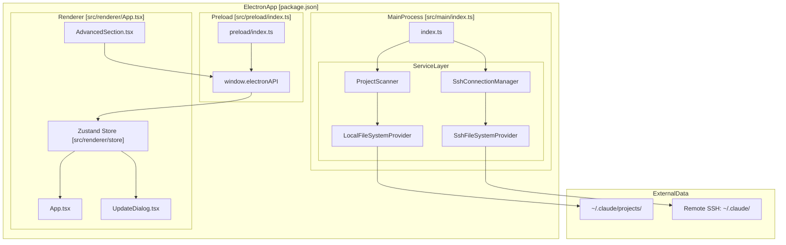
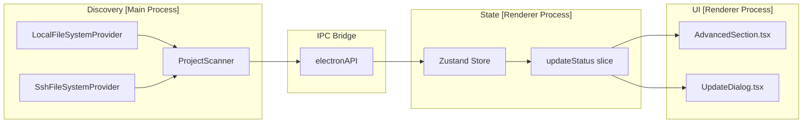

# Overview

Relevant source files

The following files were used as context for generating this wiki page:

- [.github/workflows/release.yml](.github/workflows/release.yml)
- [README.md](README.md)
- [package.json](package.json)
- [pnpm-lock.yaml](pnpm-lock.yaml)
- [public/compact.mp4](public/compact.mp4)
- [public/context.png](public/context.png)
- [public/noti.mp4](public/noti.mp4)
- [resources/afterInstall.sh](resources/afterInstall.sh)
- [src/main/services/infrastructure/SshConnectionManager.ts](src/main/services/infrastructure/SshConnectionManager.ts)
- [src/renderer/components/common/UpdateDialog.tsx](src/renderer/components/common/UpdateDialog.tsx)
- [src/renderer/components/settings/sections/AdvancedSection.tsx](src/renderer/components/settings/sections/AdvancedSection.tsx)

This document provides a high-level introduction to **claude-devtools**: its purpose, core capabilities, and architectural foundations. For detailed information about specific subsystems, refer to the linked sections throughout this page.

**Scope:** This page covers the conceptual model and primary features of claude-devtools. For installation and setup instructions, see [Getting Started](). For deep dives into individual systems like SSH remote access, context reconstruction, or notification triggers, see the Architecture section and its subsections.

---

## Purpose

**claude-devtools** is a desktop application that reconstructs the full execution trace of Claude Code sessions by parsing session log files stored locally at `~/.claude/projects/` [README.md:84-84](). It provides a visual interface for inspecting every file read, tool call executed, token consumed, and context injection that occurred during a Claude Code session—regardless of whether that session ran in a terminal, IDE, or other wrapper tool [README.md:14-17]().

The tool addresses a specific problem: recent Claude Code updates replaced detailed execution output with opaque summaries (`Read 3 files`, `Searched for 1 pattern`), and the context usage indicator became a three-segment bar with no breakdown [README.md:90-94](). The only alternative is `--verbose` mode, which floods terminals with raw JSON and system prompts. claude-devtools extracts the missing information from session logs and presents it in a structured, searchable interface [README.md:96-97]().

**Key principle:** claude-devtools does not wrap, modify, or execute Claude Code. It operates entirely post-hoc by reading JSONL session files that Claude Code already writes to disk [README.md:109-112]().

Sources: [README.md:14-17](), [README.md:84-84](), [README.md:90-94](), [README.md:96-97](), [README.md:109-112]()

---

## Core Capabilities

| Feature | Description |
|---------|-------------|
| **Context Reconstruction** | Reverse-engineers per-turn context window contents from session logs, breaking down token attribution across categories like CLAUDE.md files, skill activations, tool I/O, and thinking [README.md:118-120](). |
| **SSH Remote Sessions** | Connects to remote machines via SSH/SFTP to inspect Claude Code sessions running there [src/main/services/infrastructure/SshConnectionManager.ts:1-10](). Supports multiple authentication methods including agent, key, and password [src/main/services/infrastructure/SshConnectionManager.ts:35-35](). |
| **Notification Triggers** | Real-time monitoring system that watches session files for specific patterns (e.g., `.env` file access or tool errors). Users can define custom regex-based triggers. |
| **Tool Call Inspector** | Specialized viewers for Claude Code tools: syntax-highlighted code, inline diffs, command output, and recursive subagent trees (`Task`). |
| **Team & Subagent Visualization** | Detects and renders Claude Code's team coordination and subagent tool calls as distinct entities, showing teammate messages and subagent sessions as expandable trees [README.md:106-106](). |
| **Auto-Updates** | Integrated update system that detects new versions, displays release notes, and handles downloads [src/renderer/components/common/UpdateDialog.tsx:1-6](). |

Sources: [README.md:118-120](), [src/main/services/infrastructure/SshConnectionManager.ts:1-10](), [src/main/services/infrastructure/SshConnectionManager.ts:35-35](), [README.md:106-106](), [src/renderer/components/common/UpdateDialog.tsx:1-6]()

---

## Technology Stack

claude-devtools is built on **Electron** with a React-based renderer process. Key technologies:

| Layer | Technology | Purpose |
|-------|-----------|---------|
| **Application Framework** | Electron 40.3 | Cross-platform desktop app [package.json:86-86]() |
| **Build System** | electron-vite 2.3 | Vite-based bundler for main, preload, and renderer [package.json:88-88]() |
| **UI Framework** | React 18.3 | Component-based UI in renderer process [package.json:63-63]() |
| **State Management** | Zustand 4.5 | Lightweight store for application state [package.json:71-71]() |
| **SSH Client** | ssh2 1.17 | SSH connection management and SFTP operations [package.json:69-69]() |
| **Styling** | Tailwind CSS 3.4 | Utility-first CSS framework [package.json:108-108]() |
| **Persistence** | idb-keyval 6.2 | IndexedDB wrapper for client-side storage [package.json:60-60]() |
| **Testing** | Vitest 3.1 | Unit testing framework [package.json:113-113]() |

Sources: [package.json:60-113]()

---

## High-Level Architecture

claude-devtools follows Electron's multi-process model with clear separation of concerns:

### System Process Diagram

**Process Roles:**

- **Main Process**: Runs Node.js with full system access. Manages the lifecycle of SSH connections via `SshConnectionManager` [src/main/services/infrastructure/SshConnectionManager.ts:57-57]() and file system abstractions.
- **Preload Script**: Security boundary. Exposes a minimal, type-safe API to the renderer process.
- **Renderer Process**: Sandboxed React application. Communicates with the main process via `window.electronAPI` [src/renderer/components/settings/sections/AdvancedSection.tsx:7-7]().

Sources: [src/main/services/infrastructure/SshConnectionManager.ts:57-57](), [src/renderer/components/settings/sections/AdvancedSection.tsx:7-7](), [src/renderer/App.tsx](), [src/main/index.ts]()

---

## Data Flow: Session Discovery to UI Rendering

The following diagram shows how session data flows from the filesystem to the UI:

### Data Pipeline Diagram

**Flow Stages:**

1. **File System Abstraction**: `SshConnectionManager` provides a `FileSystemProvider` (either local or SSH) to domain services [src/main/services/infrastructure/SshConnectionManager.ts:7-7]().
2. **Discovery**: Services like `ProjectScanner` walk the directory structure to find Claude Code sessions.
3. **IPC Transport**: Data is sent across the process boundary to the renderer.
4. **State Management**: The renderer updates its Zustand store. For example, the `updateStatus` and `availableVersion` are stored to manage application updates [src/renderer/components/common/UpdateDialog.tsx:42-44]().
5. **UI Rendering**: Components like `AdvancedSection` display version info [src/renderer/components/settings/sections/AdvancedSection.tsx:30-32]() and `UpdateDialog` prompts for downloads when `availableVersion` is set [src/renderer/components/common/UpdateDialog.tsx:136-141]().

Sources: [src/main/services/infrastructure/SshConnectionManager.ts:7-7](), [src/renderer/components/common/UpdateDialog.tsx:42-44](), [src/renderer/components/common/UpdateDialog.tsx:136-141](), [src/renderer/components/settings/sections/AdvancedSection.tsx:30-32]()

---

## SSH Remote Access

The `SshConnectionManager` handles the lifecycle of remote connections [src/main/services/infrastructure/SshConnectionManager.ts:2-10](). It allows the application to switch from local mode to remote mode by swapping the underlying `FileSystemProvider`.

- **Authentication**: Supports password, private key, and SSH agent [src/main/services/infrastructure/SshConnectionManager.ts:35-35]().
- **SFTP Integration**: Uses an SFTP channel to read remote files as if they were local [src/main/services/infrastructure/SshConnectionManager.ts:146-155]().
- **Config Resolution**: Can parse and resolve hosts from `~/.ssh/config` [src/main/services/infrastructure/SshConnectionManager.ts:111-120]().

Sources: [src/main/services/infrastructure/SshConnectionManager.ts:2-10](), [src/main/services/infrastructure/SshConnectionManager.ts:35-35](), [src/main/services/infrastructure/SshConnectionManager.ts:146-155](), [src/main/services/infrastructure/SshConnectionManager.ts:111-120]()

---

## Release & Update System

The application includes a robust release pipeline and in-app update mechanism:

- **CI/CD**: GitHub Actions workflows handle multi-platform builds for macOS (arm64/x64), Windows, and Linux [package.json:23-28](), [.github/workflows/release.yml:50-221]().
- **Packaging**: Uses `electron-builder` to generate `.dmg`, `.exe`, `.AppImage`, and other formats [package.json:134-165]().
- **Update Dialog**: When a new version is detected, the `UpdateDialog` component displays normalized release notes and provides a download trigger [src/renderer/components/common/UpdateDialog.tsx:100-181]().

Sources: [package.json:23-28](), [package.json:134-165](), [.github/workflows/release.yml:50-221](), [src/renderer/components/common/UpdateDialog.tsx:100-181]()
