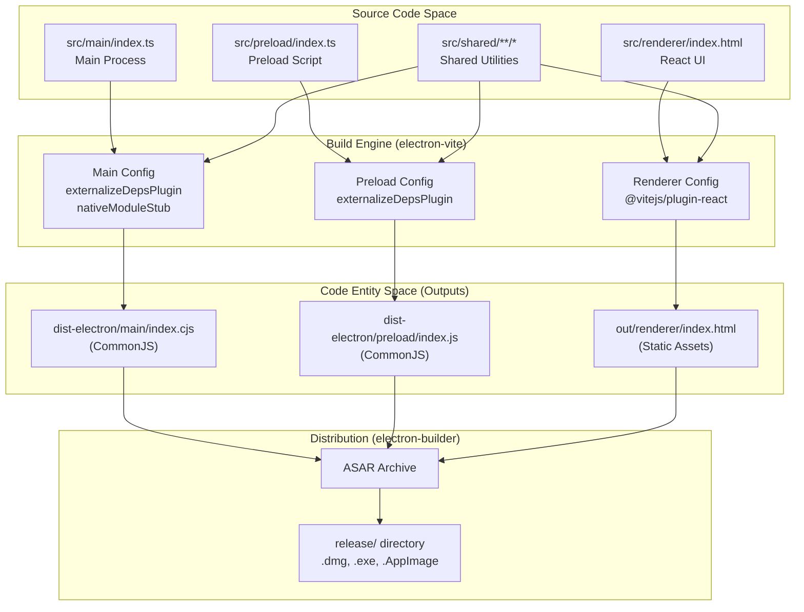
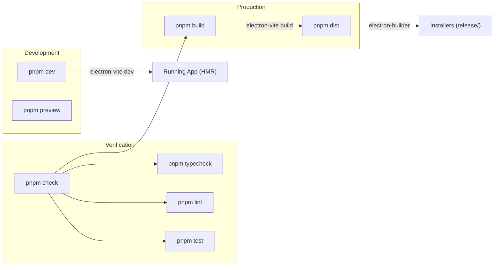

# Build System

Relevant source files

The following files were used as context for generating this wiki page:

- [.github/workflows/release.yml](.github/workflows/release.yml)
- [electron.vite.config.ts](electron.vite.config.ts)
- [package.json](package.json)
- [pnpm-lock.yaml](pnpm-lock.yaml)
- [resources/afterInstall.sh](resources/afterInstall.sh)
- [src/main/services/infrastructure/NotificationManager.ts](src/main/services/infrastructure/NotificationManager.ts)
- [src/main/services/infrastructure/SshConnectionManager.ts](src/main/services/infrastructure/SshConnectionManager.ts)

**Purpose**: This document describes the development tooling, bundling configuration, and build pipeline for `claude-devtools`. It covers how source code is compiled and packaged for development and production, including handling of native modules and dependency management.

For details on Electron-Vite specifics, see [Electron-Vite Configuration](#10.1). For native module strategies, see [Native Module Handling](#10.2). For package details, see [Dependency Management](#10.3).

---

## Overview

Claude-devtools uses **electron-vite** as its build system, which provides optimized Vite-based bundling for Electron's three-process architecture. The build system must handle:

- **Three separate build targets**: main process (Node.js), preload script (sandboxed Node.js), and renderer process (browser) [electron.vite.config.ts:31-100]().
- **Native module complications**: `ssh2` and its dependencies include optional `.node` addons that cannot be bundled; these are handled via a custom stubbing plugin [electron.vite.config.ts:13-29]().
- **Path alias resolution**: TypeScript path mappings for `@main`, `@renderer`, `@preload`, and `@shared` [electron.vite.config.ts:40-44]().
- **Production bundling**: Dependencies are embedded in the main process to avoid pnpm symlink issues with ASAR packaging [electron.vite.config.ts:7-11]().

**Sources**: [package.json:1-182](), [electron.vite.config.ts:1-101]()

---

## Build Pipeline Architecture

The pipeline transforms TypeScript source code into a packaged Electron application through three distinct configurations managed by `electron-vite`.

### Build Flow Diagram

**Sources**: [electron.vite.config.ts:1-101](), [package.json:121-180]()

---

## Core Build Concerns

### Electron-Vite Configuration
The project defines a single `electron.vite.config.ts` that exports a `defineConfig` object containing settings for `main`, `preload`, and `renderer`. 
- The **Main Process** is bundled as CommonJS (`.cjs`) to allow dependencies to use `__dirname` and `require` [electron.vite.config.ts:52-57]().
- The **Preload Script** is also CommonJS but uses the `.js` extension [electron.vite.config.ts:76-79]().
- The **Renderer Process** uses the standard Vite React plugin for HMR and JSX support [electron.vite.config.ts:91]().

For details, see [Electron-Vite Configuration](#10.1).

### Native Module Handling
The application relies on `ssh2` for remote access [package.json:69](). This library attempts to load `.node` binary addons for performance. Because these binaries cannot be bundled into the JavaScript output, the build system uses a `nativeModuleStub` Rollup plugin [electron.vite.config.ts:16-29](). This forces `ssh2` to use its pure JavaScript fallbacks, ensuring cross-platform compatibility without complex binary rebuilds.

For details, see [Native Module Handling](#10.2).

### Dependency Management
The project uses **pnpm** [package.json:181](). To ensure stability during the packaging phase, production dependencies are explicitly read from `package.json` and bundled into the main process code [electron.vite.config.ts:7-11](). This bypasses issues where `electron-builder` might fail to resolve pnpm's symlinked `node_modules` inside an ASAR archive.

For details, see [Dependency Management](#10.3).

---

## Build Scripts & Automation

The system defines a comprehensive set of scripts for development, testing, and distribution.

### Script Relationship Diagram

### Key Commands

| Command | Action | File Reference |
|---------|--------|----------------|
| `pnpm dev` | Starts `electron-vite dev` for hot-reloading development. | [package.json:21]() |
| `pnpm build` | Executes `electron-vite build` for all processes. | [package.json:22]() |
| `pnpm dist` | Runs `electron-builder` to create platform-specific installers. | [package.json:23]() |
| `pnpm check` | Pipeline for CI: runs typecheck, lint, test, and build. | [package.json:35]() |
| `pnpm quality` | Runs `check` plus formatting checks and `knip` dead code analysis. | [package.json:37]() |

**Sources**: [package.json:20-49]()

---

## CI/CD Integration

The build system is automated via GitHub Actions in `.github/workflows/release.yml`. The workflow handles:
1. **Multi-platform runners**: Uses `macos-latest`, `windows-latest`, and `ubuntu-latest` [release.yml:57-62]().
2. **Environment Setup**: Configures Node.js 20, pnpm, and Python (required for `node-gyp` during dependency installation) [release.yml:23-85]().
3. **Code Signing**: Injects `CSC_LINK` and `APPLE_ID` secrets for macOS notarization [release.yml:106-112]().
4. **Artifact Upload**: Uploads the production `dist-electron` and `out/renderer` folders before packaging [release.yml:41-48]().

**Sources**: [.github/workflows/release.yml:1-221]()
