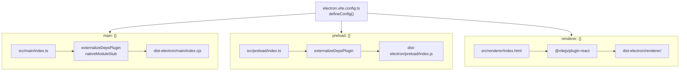
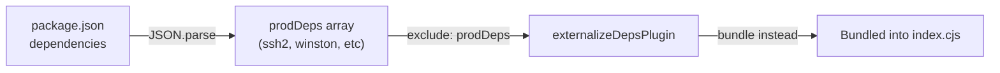
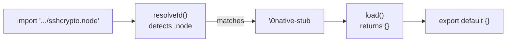
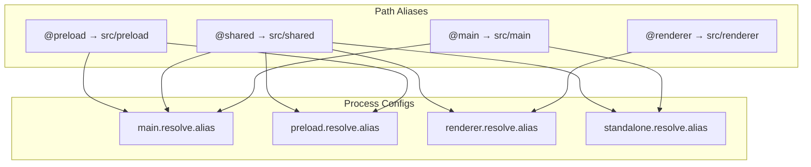

# Electron-Vite Configuration

Relevant source files

The following files were used as context for generating this wiki page:

- [electron.vite.config.ts](electron.vite.config.ts)
- [src/main/services/infrastructure/NotificationManager.ts](src/main/services/infrastructure/NotificationManager.ts)
- [vite.standalone.config.ts](vite.standalone.config.ts)

## Purpose and Scope

This document describes the build configuration for `claude-devtools` using `electron-vite`, covering how the three Electron processes (main, preload, renderer) are bundled, compiled, and output. It also details the specialized configuration for the standalone HTTP sidecar server.

The configuration is primarily defined in [electron.vite.config.ts:1-101]() and orchestrates the entire build pipeline for development and production. A secondary configuration in [vite.standalone.config.ts:1-116]() handles the non-Electron server build.

**Sources:** [electron.vite.config.ts:1-101](), [vite.standalone.config.ts:1-116]()

---

## Configuration Architecture

The `electron-vite` build system extends Vite to handle Electron's three-process architecture. Each process has its own isolated build configuration with different targets, plugins, and output formats.

### Build Process Flow
"Title: Electron-Vite Process Mapping"

**Sources:** [electron.vite.config.ts:31-100]()

---

## Main Process Configuration

The main process runs in Node.js and requires special handling for dependencies and native modules to ensure compatibility with Electron's `asar` packaging.

### Build Settings

The main process configuration uses CommonJS output format with a `.cjs` extension because the project's `package.json` specifies `"type": "module"` [electron.vite.config.ts:53-56]().

| Setting | Value | Reason |
|---------|-------|--------|
| Entry | `src/main/index.ts` | Application lifecycle entry point [electron.vite.config.ts:50]() |
| Output Directory | `dist-electron/main` | Isolated from preload/renderer [electron.vite.config.ts:47]() |
| Format | `cjs` | Required for bundled deps using `__dirname`/`require` [electron.vite.config.ts:55]() |
| File Extension | `.cjs` | Explicit CJS in ESM package context [electron.vite.config.ts:56]() |

### Dependency Bundling Strategy

The main process bundles all production dependencies to avoid `pnpm` symlink issues with `electron-builder`'s `asar` packaging [electron.vite.config.ts:7-9]().

"Title: Main Process Dependency Flow"

The configuration reads `package.json` at build time and passes all dependency names to `externalizeDepsPlugin` via the `exclude` property, forcing them to be bundled rather than externalized [electron.vite.config.ts:10-11](), [electron.vite.config.ts:34-36]().

### Native Module Stubbing

The main process uses a custom `nativeModuleStub` plugin to replace `.node` addon imports with empty modules [electron.vite.config.ts:13-16](). This is necessary because packages like `ssh2` and `cpu-features` use optional native bindings that cannot be bundled, but provide pure JS fallbacks [electron.vite.config.ts:14-15]().

"Title: Native Module Stubbing Logic"

**Sources:** [electron.vite.config.ts:7-29](), [electron.vite.config.ts:32-60]()

---

## Preload Process Configuration

The preload script bridges the main and renderer processes with security isolation.

### Build Settings

| Setting | Value | Notes |
|---------|-------|-------|
| Entry | `src/preload/index.ts` | Context bridge setup [electron.vite.config.ts:74]() |
| Output Directory | `dist-electron/preload` | Separate from main/renderer [electron.vite.config.ts:71]() |
| Format | `cjs` | Required by Electron's preload context [electron.vite.config.ts:77]() |
| File Extension | `.js` | Standard extension for preload [electron.vite.config.ts:78]() |

The preload uses `externalizeDepsPlugin()` without arguments, which externalizes all dependencies, unlike the main process configuration [electron.vite.config.ts:62]().

**Sources:** [electron.vite.config.ts:61-82]()

---

## Renderer Process Configuration

The renderer process is a standard Vite-based React application.

### Build Settings

| Setting | Value | Notes |
|---------|-------|-------|
| Entry | `src/renderer/index.html` | Standard Vite HTML entry [electron.vite.config.ts:95]() |
| Output Directory | `dist-electron/renderer` | Web assets [electron.vite.config.ts:92]() |
| Format | `es` (default) | Modern browser ESM |

### Plugins

The renderer uses `@vitejs/plugin-react` for JSX transformation [electron.vite.config.ts:91](). No bundling or externalization plugins are required as it runs in a Chromium context.

**Sources:** [electron.vite.config.ts:83-99]()

---

## Standalone Server Configuration

A separate configuration exists for the "standalone" mode, which produces a single CJS bundle for the HTTP sidecar server [vite.standalone.config.ts:1-6]().

### Stubbing Strategy

Because the standalone server shares code with the Electron main process, it must stub out Electron-specific modules that are unavailable in a standard Node.js environment.

1.  **`electronStub`**: Intercepts imports for `electron` and `electron-updater`, replacing them with a proxy-based mock that provides no-op functions for `app`, `BrowserWindow`, `ipcMain`, and `Notification` [vite.standalone.config.ts:46-75]().
2.  **`nativeModuleStub`**: Identical to the main process stub, handling `.node` files [vite.standalone.config.ts:28-41]().

### Externalization

Node.js built-ins and specific packages that break when bundled (like the `fastify` ecosystem) are explicitly externalized [vite.standalone.config.ts:14-25](), [vite.standalone.config.ts:103-109]().

**Sources:** [vite.standalone.config.ts:1-116]()

---

## Path Alias Configuration

All processes use path aliases to maintain clean imports across the codebase.

"Title: Path Alias Mapping"

**Sources:** [electron.vite.config.ts:40-44](), [electron.vite.config.ts:64-68](), [electron.vite.config.ts:84-89](), [vite.standalone.config.ts:79-85]()

---

## Build Output Summary

The build system produces two primary output directories:

1.  **`dist-electron/`**: Contains the packaged Electron application components (main, preload, renderer) [electron.vite.config.ts:47,71,92]().
2.  **`dist-standalone/`**: Contains the single-file `index.cjs` bundle for the HTTP sidecar server [vite.standalone.config.ts:92,101]().

| Process | Output Format | Target |
| :--- | :--- | :--- |
| Main | CJS (`.cjs`) | Node.js (Electron) |
| Preload | CJS (`.js`) | Electron Preload |
| Renderer | ESM | Chromium |
| Standalone | CJS (`.cjs`) | Node.js 20 [vite.standalone.config.ts:93]() |

**Sources:** [electron.vite.config.ts:46-99](), [vite.standalone.config.ts:91-102]()
