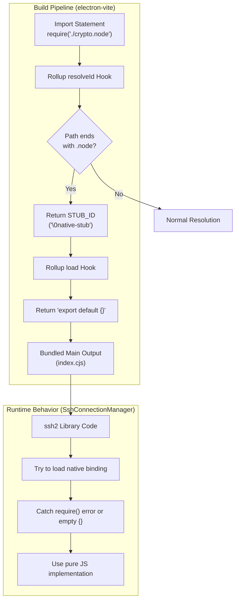
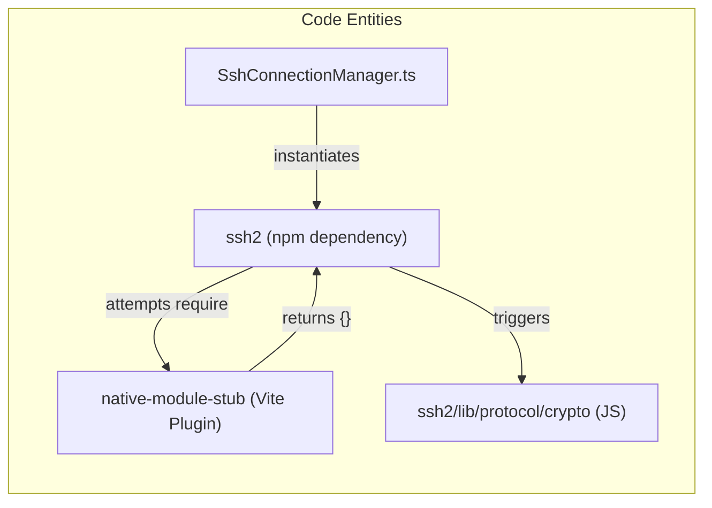

# Native Module Handling

<details>
<summary>Relevant source files</summary>

The following files were used as context for generating this wiki page:

- [.github/workflows/release.yml](.github/workflows/release.yml)
- [electron.vite.config.ts](electron.vite.config.ts)
- [package.json](package.json)
- [pnpm-lock.yaml](pnpm-lock.yaml)
- [resources/afterInstall.sh](resources/afterInstall.sh)
- [src/main/services/infrastructure/NotificationManager.ts](src/main/services/infrastructure/NotificationManager.ts)
- [src/main/services/infrastructure/SshConnectionManager.ts](src/main/services/infrastructure/SshConnectionManager.ts)

</details>


## Purpose and Scope

This document describes how `claude-devtools` handles native Node.js addons (`.node` files) during the build process. Native modules cannot be bundled into Electron's `asar` archive format, so the build system employs a stubbing strategy that forces dependencies to use pure JavaScript fallbacks instead of optional native bindings.

For general build configuration, see [Electron-Vite Configuration](10.1). For SSH-specific functionality that relies on these native module stubs, see [SSH Connection Manager](5.1).

---

## The Problem: Native Addons in Electron

Native Node.js modules compiled to `.node` files pose several challenges in Electron applications:

| Issue | Description |
|-------|-------------|
| **ASAR Incompatibility** | Native `.node` addons cannot be executed directly from Electron's `asar` archive format [package.json:126-130](). |
| **Platform-Specific Builds** | Native modules must be compiled for each target platform and architecture (e.g., `arm64` vs `x64`) [package.json:24-28](). |
| **Symlink Resolution** | `pnpm` symlinks in `node_modules` can break when `electron-builder` creates the `asar` archive [electron.vite.config.ts:7-11](). |
| **Runtime Loading** | Even if excluded from `asar`, native modules require special handling at runtime to be located by the Node.js loader. |

The application uses the `ssh2` library for SSH connections [package.json:69](), which includes optional native crypto bindings. Rather than managing platform-specific builds of native modules, the build system forces `ssh2` to use its pure JavaScript fallback implementation [electron.vite.config.ts:13-15]().

**Sources:** [package.json:69](), [package.json:126-130](), [electron.vite.config.ts:7-15]()

---

## The Solution: Native Module Stubbing

### Overview

The build system implements a Rollup plugin called `nativeModuleStub` that intercepts all imports ending in `.node` and replaces them with empty module stubs [electron.vite.config.ts:16-29](). This causes libraries like `ssh2` and `cpu-features` to gracefully fall back to their pure JavaScript implementations.

**Native Module Resolution Flow**


**Sources:** [electron.vite.config.ts:16-29](), [src/main/services/infrastructure/SshConnectionManager.ts:18]()

---

## Build Configuration

### The nativeModuleStub Plugin

The plugin is defined within `electron.vite.config.ts` to handle virtual module resolution:

[electron.vite.config.ts:16-29]()

| Hook | Logic | Role |
|------|-------|------|
| `resolveId` | `source.endsWith('.node')` | Intercepts module resolution; returns virtual ID `\0native-stub` |
| `load` | `id === STUB_ID` | Provides module contents; returns `export default {}` |

The `\0` prefix is a Rollup convention for virtual modules that do not exist on the physical file system.

**Sources:** [electron.vite.config.ts:16-29]()

---

### Main Process Configuration

The plugin is applied to the `main` process build configuration:

[electron.vite.config.ts:32-38]()

```typescript
main: {
  plugins: [
    externalizeDepsPlugin({
      exclude: prodDeps // Bundle production dependencies into the output
    }),
    nativeModuleStub()   // Apply the .node stubbing plugin
  ],
  // ...
}
```

**Key Points:**
- **Dependency Bundling**: Production dependencies are bundled into the main process output to avoid `pnpm` symlink issues during `asar` packaging [electron.vite.config.ts:7-11]().
- **Output Format**: The main process uses `cjs` (CommonJS) format with a `.cjs` extension because `package.json` specifies `"type": "module"` [electron.vite.config.ts:53-57]().
- **Entry Point**: The main process entry is `src/main/index.ts` [electron.vite.config.ts:50]().

**Sources:** [electron.vite.config.ts:7-11](), [electron.vite.config.ts:32-57](), [package.json:3]()

---

## Affected Dependencies

### Primary Target: ssh2

The `ssh2` library is the primary consumer of this stubbing strategy. It provides SSH and SFTP capabilities for remote session access [src/main/services/infrastructure/SshConnectionManager.ts:18]().

**Code Entity Mapping**


| Dependency | Native Component | Fallback Behavior |
|------------|------------------|-------------------|
| `ssh2` [package.json:69]() | `crypto.node` | Uses internal pure JS crypto implementations [electron.vite.config.ts:14-15](). |
| `cpu-features` | Native CPU detection | Gracefully fails to detect specific CPU features; uses defaults [electron.vite.config.ts:14-15](). |

**Sources:** [package.json:69](), [electron.vite.config.ts:13-15](), [src/main/services/infrastructure/SshConnectionManager.ts:18]()

---

## Fallback Behavior and Performance

### Graceful Degradation

The `SshConnectionManager` relies on `ssh2`'s ability to handle missing native modules. When `SshConnectionManager.connect()` is called, the underlying `Client` attempts to initialize crypto [src/main/services/infrastructure/SshConnectionManager.ts:135-144](). Because the `.node` file returns an empty object from the stub, the library switches to its JS-based protocol implementation.

### Performance Impact

| Operation | Impact of JS Fallback |
|-----------|-----------------------|
| **SSH Handshake** | Negligible; network latency is the primary factor. |
| **SFTP File Listing** | Negligible; involves small metadata transfers. |
| **Large File Read** | Moderate; JS-based decryption is slower than native `openssl` bindings. |

For the purpose of visualizing Claude session logs (typically small JSONL files), this performance trade-off is acceptable compared to the complexity of native module distribution.

**Sources:** [src/main/services/infrastructure/SshConnectionManager.ts:135-155](), [electron.vite.config.ts:13-15]()

---

## Packaging and Distribution

The `electron-builder` configuration ensures that the stubbed artifacts are packaged correctly into the final installer:

[package.json:115-130]()

- **asar**: Enabled (`true`) to package the app into a single archive [package.json:126]().
- **npmRebuild**: Disabled (`false`) because the app does not rely on native modules that need compilation during the build phase [package.json:130]().
- **Main Script**: Points to the bundled CommonJS output: `dist-electron/main/index.cjs` [package.json:19]().

### CI/CD Pipeline
The GitHub Actions release workflow handles cross-platform builds (`macOS`, `Windows`, `Linux`) [ .github/workflows/release.yml:50-221](). Since native modules are stubbed, the build process is uniform across runners, and there is no need for complex cross-compilation of C++ addons.

**Sources:** [package.json:19](), [package.json:115-130](), [ .github/workflows/release.yml:50-221]()

---

## Verification

To verify that native modules are being stubbed correctly, the build output can be inspected for `.node` references:

1. Run `pnpm build` [package.json:22]().
2. Inspect `dist-electron/main/index.cjs`.
3. Search for any strings ending in `.node`. They should resolve to the stubbed virtual module rather than a file path.

Additionally, the `SshConnectionManager.testConnection()` method can be used in the application to verify that the JS fallback is functional by attempting a real SSH handshake [src/main/services/infrastructure/SshConnectionManager.ts:195-225]().

**Sources:** [package.json:22](), [src/main/services/infrastructure/SshConnectionManager.ts:195-225]()
