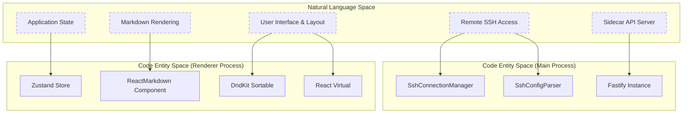
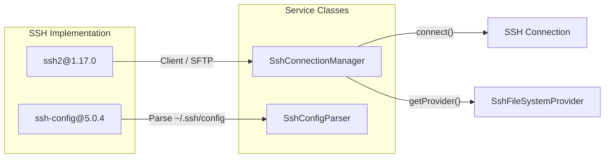

# Dependency Management

<details>
<summary>Relevant source files</summary>

The following files were used as context for generating this wiki page:

- [.github/workflows/release.yml](.github/workflows/release.yml)
- [CONTRIBUTING.md](CONTRIBUTING.md)
- [package.json](package.json)
- [pnpm-lock.yaml](pnpm-lock.yaml)
- [resources/afterInstall.sh](resources/afterInstall.sh)
- [src/main/services/infrastructure/SshConnectionManager.ts](src/main/services/infrastructure/SshConnectionManager.ts)

</details>


## Purpose and Scope

This page documents the dependency management strategy for `claude-devtools`, including the package manager configuration, core runtime dependencies, development tooling, and native module handling. The project uses a centralized `package.json` to manage all dependencies across the Electron main, preload, and renderer processes.

---

## Package Manager: pnpm

`claude-devtools` uses **pnpm** (v10.25.0) as its package manager, configured with a pinned version and integrity hash in [package.json:181]().

**Key pnpm Configuration:**

- **Strict lockfile**: The [pnpm-lock.yaml]() file uses version 9.0 [pnpm-lock.yaml:1]().
- **Auto-install peers**: Enabled to ensure compatible peer dependency trees [pnpm-lock.yaml:4]().
- **Workspace support**: While structured as a single-package repository, the lockfile uses the `importers` structure for potential expansion [pnpm-lock.yaml:7-9]().

**Sources:** [package.json:181](), [pnpm-lock.yaml:1-9]()

---

## Dependency Categories

### Overview Diagram

The following diagram maps high-level system capabilities to the specific libraries and code entities that implement them.



**Sources:** [package.json:50-72](), [src/main/services/infrastructure/SshConnectionManager.ts:57]()

---

## Core Runtime Dependencies

### UI Framework Stack

| Package | Version | Purpose | Key Usage |
|---------|---------|---------|-----------|
| `react` | ^18.3.1 | UI framework | All renderer components [package.json:63]() |
| `zustand` | ^4.5.0 | State management | Global application state [package.json:71]() |
| `lucide-react` | ^0.562.0 | Icon library | UI iconography [package.json:61]() |
| `@dnd-kit/core` | ^6.3.1 | Drag-and-drop | Tab and layout management [package.json:51]() |
| `@tanstack/react-virtual`| ^3.10.8 | Virtualization | Rendering large session lists [package.json:56]() |

**Sources:** [package.json:51-71]()

### SSH & Remote Access

The SSH implementation relies on `ssh2` for low-level protocol handling and `ssh-config` for local configuration parsing.



**Key Implementation Details:**
- **SshConnectionManager**: Manages the `ssh2.Client` lifecycle and switches the system `FileSystemProvider` from local to remote [src/main/services/infrastructure/SshConnectionManager.ts:57-79]().
- **ssh-config**: Used by `SshConfigParser` to resolve host aliases and identities [src/main/services/infrastructure/SshConnectionManager.ts:109-120]().

**Sources:** [package.json:68-69](), [src/main/services/infrastructure/SshConnectionManager.ts:18](), [src/main/services/infrastructure/SshConnectionManager.ts:57-120]()

### Markdown Processing Pipeline

The application reconstructs Claude's messages using a standard `unified` pipeline.

| Package | Version | Role |
|---------|---------|------|
| `unified` | ^11.0.5 | Core processor [package.json:70]() |
| `remark-parse` | ^11.0.0 | Markdown parser [package.json:67]() |
| `remark-gfm` | ^4.0.1 | GitHub Flavored Markdown support [package.json:66]() |
| `mdast-util-to-hast`| ^13.2.1 | AST transformation [package.json:62]() |
| `react-markdown` | ^10.1.0 | React renderer [package.json:65]() |

**Sources:** [package.json:62-70]()

---

## Development & Build Dependencies

### Build Orchestration

The project uses `electron-vite` to coordinate the compilation of three distinct targets: `main`, `preload`, and `renderer`.

- **electron-vite** (^2.3.0): Handles the multi-process build configuration [package.json:88]().
- **electron-builder** (^25.1.8): Packages the application into distributables for macOS, Windows, and Linux [package.json:87]().
- **electron-updater** (^6.7.3): Manages runtime updates [package.json:58]().

**Sources:** [package.json:58](), [package.json:87-88]()

### Quality Control

The project enforces strict quality gates through several devDependencies:

- **TypeScript** (^5.9.3): Used for static type checking across all processes [package.json:110]().
- **ESLint** (^9.39.2): Configured with security, react, and tailwind plugins [package.json:89-101]().
- **Vitest** (^3.1.4): Primary test runner for unit tests [package.json:113]().
- **Knip** (^5.82.1): Detects unused files, dependencies, and exports [package.json:104]().

**Sources:** [package.json:89-113]()

---

## Native Module Handling

Native modules (specifically those required by `ssh2`) present unique challenges in an Electron environment.

```mermaid
graph TB
    subgraph "Native Dependency: ssh2"
        JS["JavaScript API"]
        Native["Native Addons (.node)"]
    end
    
    subgraph "Process Availability"
        Main["Main Process"]
        Preload["Preload Script"]
        Renderer["Renderer Process"]
    end
    
    Native -->|"Linked during build"| Main
    Native -.- x|"Stubbed / Blocked"| Preload
    Native -.- x|"Context Isolated"| Renderer
    
    Main -->|"IPC Bridge"| Preload
    Preload -->|"electronAPI"| Renderer
```

**Implementation Strategy:**
- **Build-time**: `electron-builder` is configured with `npmRebuild: false` to prevent unnecessary re-compilation of native modules during the packaging phase, relying on the `pnpm install` step instead [package.json:130]().
- **Packaging**: The `asar` archive is enabled, but specific renderer outputs are unpacked to maintain performance [package.json:126-129]().
- **Runtime**: Native capabilities are strictly confined to the Main process. The Renderer accesses remote files only through the IPC bridge managed by `SshConnectionManager` [src/main/services/infrastructure/SshConnectionManager.ts:77]().

**Sources:** [package.json:126-130](), [src/main/services/infrastructure/SshConnectionManager.ts:18]()

---

## Scripts and Workflow

The `package.json` defines several critical scripts for dependency and quality management:

| Script | Command | Purpose |
|--------|---------|---------|
| `typecheck` | `tsc --noEmit` | Validates TypeScript integrity [package.json:30]() |
| `quality` | `pnpm check && ... && npx knip` | Comprehensive health check [package.json:37]() |
| `test:coverage` | `vitest run --coverage` | Generates coverage reports [package.json:44]() |
| `dist` | `electron-builder ...` | Builds production installers [package.json:23]() |

**Sources:** [package.json:20-49]()
