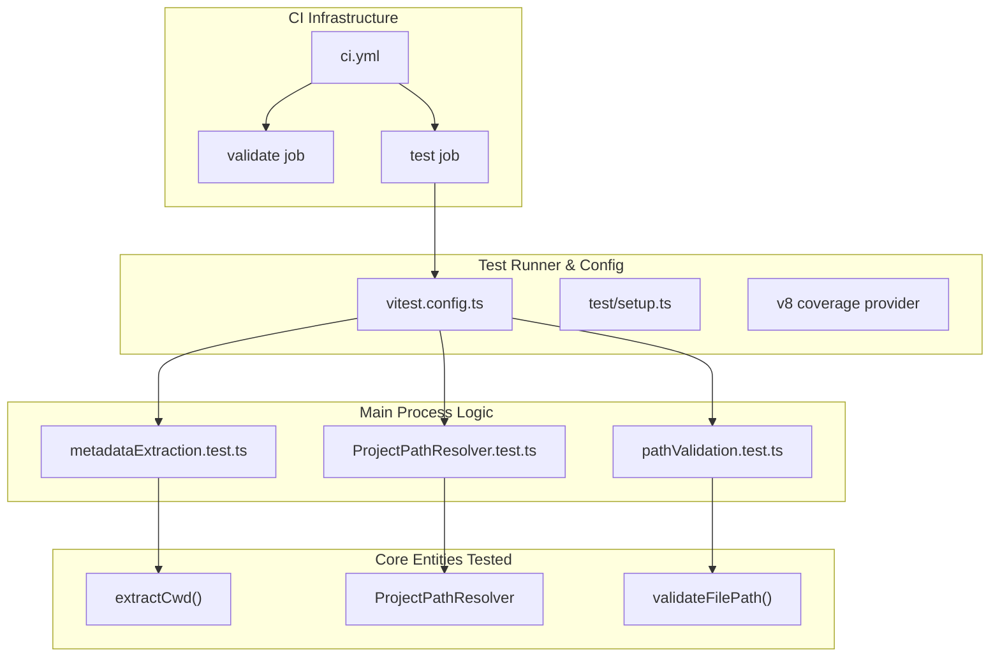
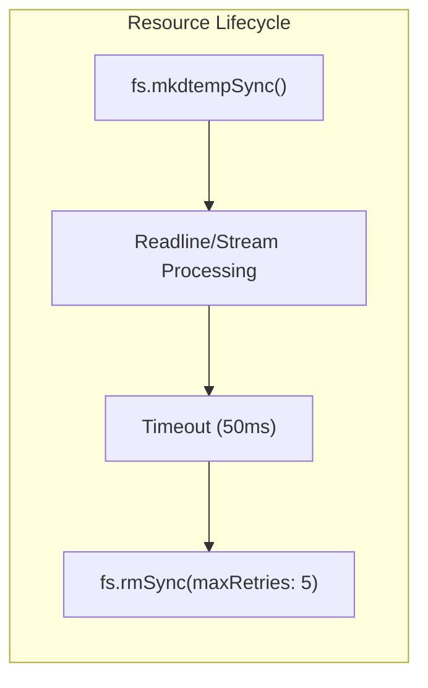

# Testing

Relevant source files

The following files were used as context for generating this wiki page:

- [.github/workflows/ci.yml](.github/workflows/ci.yml)
- [src/main/utils/metadataExtraction.ts](src/main/utils/metadataExtraction.ts)
- [src/renderer/components/chat/ChatHistoryLoadingState.tsx](src/renderer/components/chat/ChatHistoryLoadingState.tsx)
- [src/renderer/index.html](src/renderer/index.html)
- [test/main/services/discovery/ProjectPathResolver.test.ts](test/main/services/discovery/ProjectPathResolver.test.ts)
- [test/main/utils/pathValidation.test.ts](test/main/utils/pathValidation.test.ts)
- [vitest.config.ts](vitest.config.ts)

This page describes the testing infrastructure, patterns, and execution workflows for `claude-devtools`. The test suite validates the main process services, utility functions, and build configuration across multiple platforms.

For information about the CI/CD release workflow, see [CI Pipeline](#11.2). For unit testing details, see [Unit Tests](#11.1).

---

## Test Infrastructure Overview

The application uses **Vitest** as its test runner, with platform-specific test jobs running on both Ubuntu and Windows in GitHub Actions. Tests focus primarily on the main process logic and shared utilities, using `happy-dom` for environment simulation where necessary.

The following diagram bridges the high-level test categories to the specific code entities and configurations that drive them:

### Test System Mapping

**Sources:** [vitest.config.ts:1-25](), [.github/workflows/ci.yml:1-83](), [test/main/services/discovery/ProjectPathResolver.test.ts:1-94]()

---

## Unit Test Patterns

Unit tests are located in the `test/` directory, mirroring the `src/` structure. They leverage Vitest's global APIs and custom setup files to handle Electron-specific requirements.

### Test Environment Configuration
The test suite is configured with a 15-second timeout and uses `happy-dom` to provide a lightweight browser-like environment for shared or renderer-adjacent code.
- **Globals**: Enabled via `globals: true` [vitest.config.ts:6-6]().
- **Environment**: `happy-dom` [vitest.config.ts:7-7]().
- **Setup**: Initialized via `./test/setup.ts` [vitest.config.ts:9-9]().

### Path & File System Testing
Because the application manages sensitive file paths and Claude Code session data, testing path resolution is critical. The `ProjectPathResolver` tests ensure that:
1. Absolute `cwd` hints are prioritized [test/main/services/discovery/ProjectPathResolver.test.ts:34-44]().
2. Session files are correctly parsed to extract working directories [test/main/services/discovery/ProjectPathResolver.test.ts:46-61]().
3. Project IDs are decoded as a fallback [test/main/services/discovery/ProjectPathResolver.test.ts:63-71]().

**Sources:** [vitest.config.ts:1-25](), [test/main/services/discovery/ProjectPathResolver.test.ts:1-94]()

---

## Mocking and Resource Management

### File System Resource Handling
Tests frequently interact with the file system. To ensure cross-platform compatibility (especially on Windows where file locks are strict), tests implement specific cleanup patterns.

In `ProjectPathResolver.test.ts`, an explicit delay is added in `afterEach` to allow `readline` interfaces and file streams to release handles before attempting deletion [test/main/services/discovery/ProjectPathResolver.test.ts:21-32]().

### Security Validation
The `pathValidation.test.ts` suite ensures that the application correctly restricts access to sensitive directories like `~/.ssh`, `~/.aws`, and `.env` files [test/main/utils/pathValidation.test.ts:88-157](). It also validates path traversal prevention using `..` segments [test/main/utils/pathValidation.test.ts:159-168]().

**Sources:** [test/main/services/discovery/ProjectPathResolver.test.ts:21-32](), [test/main/utils/pathValidation.test.ts:88-168]()

---

## CI Pipeline

The project uses GitHub Actions to automate validation and testing on every push to `main` and for all pull requests.

### Pipeline Stages
1. **Validate**: Performs static analysis including `pnpm typecheck`, `pnpm lint`, and a full `pnpm build` to ensure the Electron-Vite configuration is valid [.github/workflows/ci.yml:30-56]().
2. **Test**: Runs the Vitest suite across a matrix of operating systems (`ubuntu-latest`, `windows-latest`) to catch platform-specific pathing or encoding bugs [.github/workflows/ci.yml:58-83]().

For details on the specific steps and environment variables used in CI, see [CI Pipeline](#11.2).

**Sources:** [.github/workflows/ci.yml:1-83]()

---

## Code Coverage

Coverage is tracked using the `v8` provider, targeting all `.ts` and `.tsx` files in the `src/` directory.
- **Included**: `src/**/*.ts`, `src/**/*.tsx` [vitest.config.ts:14-14]().
- **Excluded**: Type definitions, and main/preload entry points which are difficult to test without a full Electron runtime [vitest.config.ts:15-15]().

**Sources:** [vitest.config.ts:11-16]()
