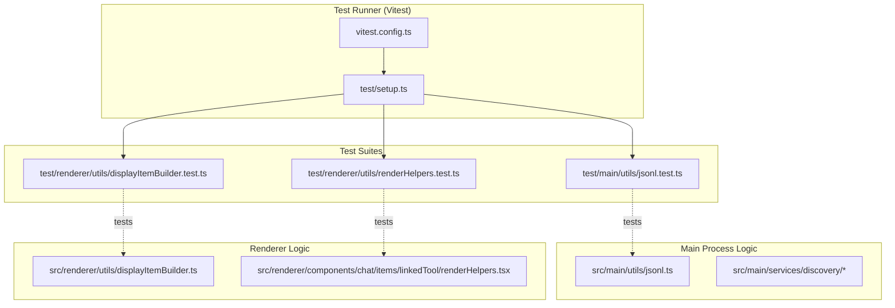
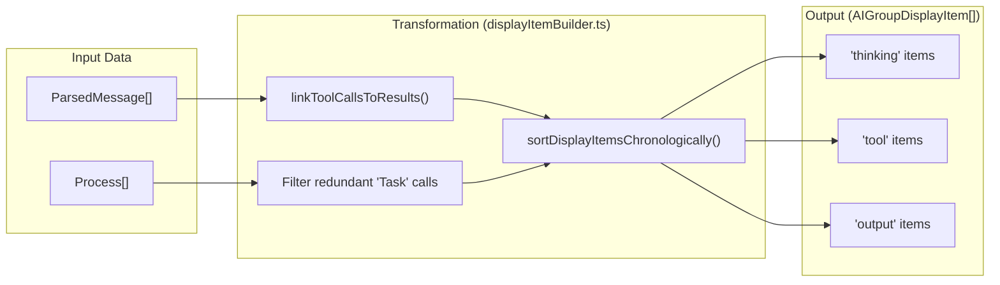

# Unit Tests

<details>
<summary>Relevant source files</summary>

The following files were used as context for generating this wiki page:

- [src/renderer/components/chat/items/linkedTool/renderHelpers.tsx](src/renderer/components/chat/items/linkedTool/renderHelpers.tsx)
- [src/renderer/utils/displayItemBuilder.ts](src/renderer/utils/displayItemBuilder.ts)
- [test/main/utils/jsonl.test.ts](test/main/utils/jsonl.test.ts)
- [test/renderer/components/renderOutput.test.ts](test/renderer/components/renderOutput.test.ts)
- [test/renderer/utils/displayItemBuilder.test.ts](test/renderer/utils/displayItemBuilder.test.ts)
- [test/renderer/utils/renderHelpers.test.ts](test/renderer/utils/renderHelpers.test.ts)
- [vitest.config.ts](vitest.config.ts)

</details>


## Purpose and Scope

This document covers the unit testing infrastructure and patterns used in `claude-devtools`. It explains the test framework, how Electron APIs are mocked, common testing patterns for file system operations, and how tests are executed both locally and in CI. The test suite focuses on main process services, shared utilities, and renderer-side data transformation logic.

---

## Test Framework and Infrastructure

`claude-devtools` uses **Vitest** as its primary test runner. The infrastructure is configured to support both Node.js-based logic (Main process) and DOM-aware logic (Renderer process) using a virtual DOM environment.

### Test Execution Architecture

The following diagram illustrates the relationship between the test configuration and the entities being tested.

**Test Environment to Code Entity Mapping**

**Sources:** [vitest.config.ts:1-25](), [test/main/utils/jsonl.test.ts:1-187]()

### Key Testing Configuration

| Feature | Configuration | Purpose |
|---------|---------------|---------|
| **Environment** | `happy-dom` | Provides a browser-like environment for renderer utility tests. |
| **Globals** | `true` | Enables `describe`, `it`, and `expect` without explicit imports. |
| **Coverage** | `v8` provider | Generates reports for `src/**/*.ts` while excluding entry points. |
| **Aliases** | `@shared`, `@main`, `@renderer` | Maps source directories for clean imports in test files. |

**Sources:** [vitest.config.ts:5-24]()

---

## Mocking Patterns

### Data Factories
To maintain clean tests, "helper" functions are used to generate mock data structures like `ParsedMessage`. This ensures tests don't break when internal data structures grow, as long as the required fields are present.

**Example Factory Pattern:**
```typescript
function createMessage(overrides: Partial<ParsedMessage> = {}): ParsedMessage {
  return {
    uuid: 'test-uuid',
    timestamp: new Date('2024-01-01T10:00:00Z'),
    toolCalls: [],
    toolResults: [],
    // ... defaults
    ...overrides,
  };
}
```
**Sources:** [test/main/utils/jsonl.test.ts:10-24](), [test/renderer/utils/displayItemBuilder.test.ts:8-19]()

### File System Isolation
Tests interacting with the file system utilize temporary directories to prevent side effects and ensure isolation.

**Temporary Directory Pattern:**
1. Create a unique path using `fs.mkdtempSync` and `os.tmpdir()`.
2. Perform operations within that path.
3. Clean up in a `finally` block or `afterEach` hook using `fs.rmSync` with `recursive: true`.

**Sources:** [test/main/utils/jsonl.test.ts:141-183]()

---

## Common Test Patterns

### 1. JSONL Metrics Calculation
Tests for `calculateMetrics` verify the mathematical aggregation of token usage and session duration. This includes handling edge cases like missing usage data or single-message sessions.

| Test Case | Target Logic | Verification |
|-----------|--------------|--------------|
| Token Summation | `calculateMetrics` | Sums `input_tokens`, `output_tokens`, and cache tokens. |
| Duration | `calculateMetrics` | Calculates difference between earliest and latest timestamp. |
| Metadata Extraction | `analyzeSessionFileMetadata` | Validates single-pass extraction of branch, count, and first message. |

**Sources:** [test/main/utils/jsonl.test.ts:27-137](), [src/main/utils/jsonl.ts:1-484]()

### 2. UI Data Transformation
Tests for `buildDisplayItems` ensure that raw Claude session messages are correctly transformed into a flat list of UI-friendly items.

**Display Item Logic Flow**

**Sources:** [src/renderer/utils/displayItemBuilder.ts:94-206](), [test/renderer/utils/displayItemBuilder.test.ts:21-99]()

### 3. Tool Output Formatting
The `extractOutputText` utility is heavily tested to ensure various tool output formats (plain text, JSON strings, content block arrays) are normalized for display.

- **Pretty-printing:** Validates that raw JSON strings are formatted with indentation.
- **Content Blocks:** Ensures text is extracted from `[{ type: 'text', text: '...' }]` structures.
- **Fallback:** Verifies that non-text blocks (like images) are stringified rather than ignored.

**Sources:** [src/renderer/components/chat/items/linkedTool/renderHelpers.tsx:131-171](), [test/renderer/utils/renderHelpers.test.ts:6-58]()

---

## Test Execution

### Local Commands
- `pnpm test`: Runs the full suite.
- `pnpm test:coverage`: Generates coverage reports in `text`, `json`, and `html` formats.

**Sources:** [vitest.config.ts:11-16]()

### Platform-Specific Considerations
Tests involving `fs.rmSync` on Windows may encounter file locking issues if file streams (like those used in `analyzeSessionFileMetadata`) are not properly closed or if the OS is slow to release handles. The cleanup logic in tests often includes `maxRetries` and `retryDelay` to mitigate this.

**Sources:** [test/main/utils/jsonl.test.ts:175-181]()
