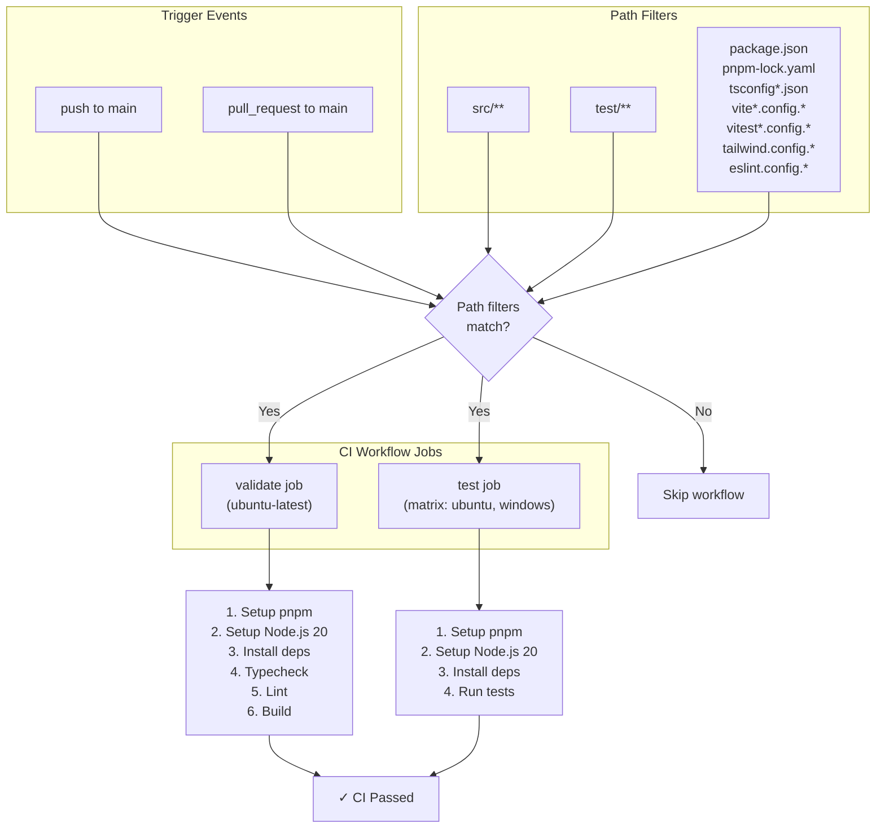
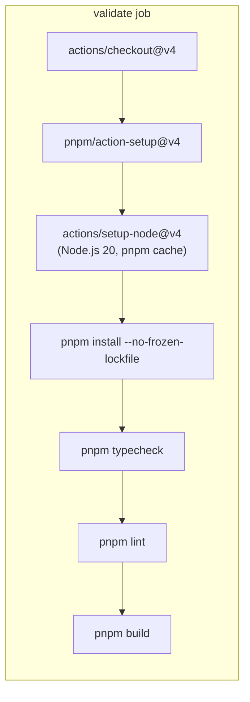
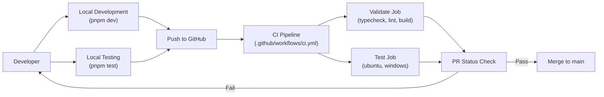

# CI Pipeline

<details>
<summary>Relevant source files</summary>

The following files were used as context for generating this wiki page:

- [.github/ISSUE_TEMPLATE/bug_report.md](.github/ISSUE_TEMPLATE/bug_report.md)
- [.github/ISSUE_TEMPLATE/feature_request.md](.github/ISSUE_TEMPLATE/feature_request.md)
- [.github/workflows/ci.yml](.github/workflows/ci.yml)
- [src/main/utils/metadataExtraction.ts](src/main/utils/metadataExtraction.ts)
- [src/renderer/components/chat/ChatHistoryLoadingState.tsx](src/renderer/components/chat/ChatHistoryLoadingState.tsx)
- [src/renderer/index.html](src/renderer/index.html)
- [test/main/services/discovery/ProjectPathResolver.test.ts](test/main/services/discovery/ProjectPathResolver.test.ts)
- [test/main/utils/pathValidation.test.ts](test/main/utils/pathValidation.test.ts)

</details>


This document describes the continuous integration (CI) pipeline that validates code quality and ensures cross-platform compatibility for `claude-devtools`. The CI workflow runs automated checks on every push and pull request to the main branch.

For information about the release pipeline and multi-platform packaging, see [12. release-workflow](12.1). For local development testing, see [11.1 unit-tests](11.1).

## Purpose and Scope

The CI pipeline serves three primary functions:

1.  **Code Quality Validation** - Type checking, linting, and successful build verification.
2.  **Cross-Platform Testing** - Automated test execution on Ubuntu and Windows.
3.  **Fast Feedback** - Early detection of issues before they reach the release pipeline.

The workflow is defined in [.github/workflows/ci.yml:1-83]() and runs in parallel with path-based filtering to optimize CI resource usage.

**Sources:** [.github/workflows/ci.yml:1-83]()

## Workflow Architecture

The CI workflow consists of two independent jobs that run in parallel: `validate` performs static analysis and build verification, while `test` executes the test suite across multiple platforms.

### CI Execution Flow


**Sources:** [.github/workflows/ci.yml:3-27](), [.github/workflows/ci.yml:29-83]()

## Trigger Conditions

The CI workflow activates on two event types with path-based filtering to avoid unnecessary runs.

### Event Triggers

| Event Type | Branches | Purpose |
| :--- | :--- | :--- |
| `push` | `main` | Validate merged changes |
| `pull_request` | `main` | Pre-merge validation |

**Sources:** [.github/workflows/ci.yml:3-5](), [.github/workflows/ci.yml:16-17]()

### Path Filters

The workflow only runs when changes affect specific paths, including source code, tests, and configuration files such as `vite.config.ts` or `eslint.config.js`. This filtering prevents the CI from running on changes to documentation or unrelated GitHub Actions.

**Sources:** [.github/workflows/ci.yml:6-27]()

## Validate Job

The `validate` job runs on `ubuntu-latest` and performs static analysis and build verification. This job catches issues that do not require cross-platform testing.

### Validation Pipeline


### Validation Steps

1.  **Checkout** - Uses `actions/checkout@v4` to fetch the repository.
2.  **Setup pnpm** - Uses `pnpm/action-setup@v4` to install the package manager.
3.  **Setup Node.js** - Installs Node.js 20 with pnpm cache enabled [.github/workflows/ci.yml:40-44]().
4.  **Install dependencies** - Runs `pnpm install --no-frozen-lockfile` [.github/workflows/ci.yml:47-47]().
5.  **Typecheck** - Runs `pnpm typecheck` to verify TypeScript correctness across all processes [.github/workflows/ci.yml:50-50]().
6.  **Lint** - Runs `pnpm lint` to enforce code style [.github/workflows/ci.yml:53-53]().
7.  **Build** - Runs `pnpm build` to verify that `electron-vite` can successfully bundle the application [.github/workflows/ci.yml:56-56]().

**Sources:** [.github/workflows/ci.yml:30-56]()

## Test Job

The `test` job runs on both Ubuntu and Windows using a matrix strategy to ensure cross-platform compatibility. This is critical for an Electron application that must support multiple operating systems.

### Matrix Configuration

The test job uses GitHub Actions matrix strategy to run tests on multiple platforms:

```yaml
strategy:
  fail-fast: false
  matrix:
    os: [ubuntu-latest, windows-latest]
runs-on: ${{ matrix.os }}
```

**Key configuration:**
*   `fail-fast: false` - Both platforms complete even if one fails, providing complete failure information.
*   Two OS variants ensure platform-specific issues are caught (e.g., path separators, file system case sensitivity).

**Sources:** [.github/workflows/ci.yml:59-63]()

### Test Execution

The `pnpm test` command runs the Vitest test suite, which includes:
*   Unit tests for main process services like `ProjectPathResolver`.
*   Path resolution tests (critical for cross-platform compatibility).
*   JSONL parsing and metadata extraction tests [.main/utils/metadataExtraction.ts:1-209]().

Tests use platform-specific cleanup logic to handle Windows file handle delays, as seen in `ProjectPathResolver.test.ts` where a timeout is used to allow `readline` streams to release handles before directory removal [test/main/services/discovery/ProjectPathResolver.test.ts:21-32]().

**Sources:** [.github/workflows/ci.yml:81-82](), [test/main/services/discovery/ProjectPathResolver.test.ts:21-32]()

## Platform-Specific Considerations

### Windows File System Handling

The CI pipeline accounts for Windows-specific behaviors. For example, `normalizeDriveLetter` is used in metadata extraction to ensure consistent path comparison between the CLI (uppercase drive letters) and VS Code (lowercase) [src/main/utils/metadataExtraction.ts:22-27]().

### Path Encoding and Resolution

Cross-platform testing is essential for the `ProjectPathResolver`, which must handle:
*   Unix paths and Windows paths.
*   WSL mount path translations [src/main/utils/metadataExtraction.ts:64-64]().
*   Extraction of `cwd` from session files to resolve project locations [test/main/services/discovery/ProjectPathResolver.test.ts:46-61]().

### Security and Validation

The CI also validates path security through `pathValidation.test.ts`, ensuring that the application rejects sensitive paths (like `~/.ssh` or `.env` files) and prevents path traversal across different OS environments [test/main/utils/pathValidation.test.ts:89-168]().

## Integration with Development Workflow

The CI pipeline integrates with the development cycle to provide authoritative validation of local checks.

### CI Integration Model


### Performance Optimization

The CI workflow employs several optimizations:
1.  **Parallel Job Execution** - `validate` and `test` jobs run simultaneously.
2.  **Dependency Caching** - pnpm cache reduces installation time [.github/workflows/ci.yml:44-44]().
3.  **Non-Frozen Lockfile** - Runs `pnpm install --no-frozen-lockfile` to allow for minor dependency updates during validation [.github/workflows/ci.yml:47-47]().

**Sources:** [.github/workflows/ci.yml:40-47](), [.github/workflows/ci.yml:59-63]()
