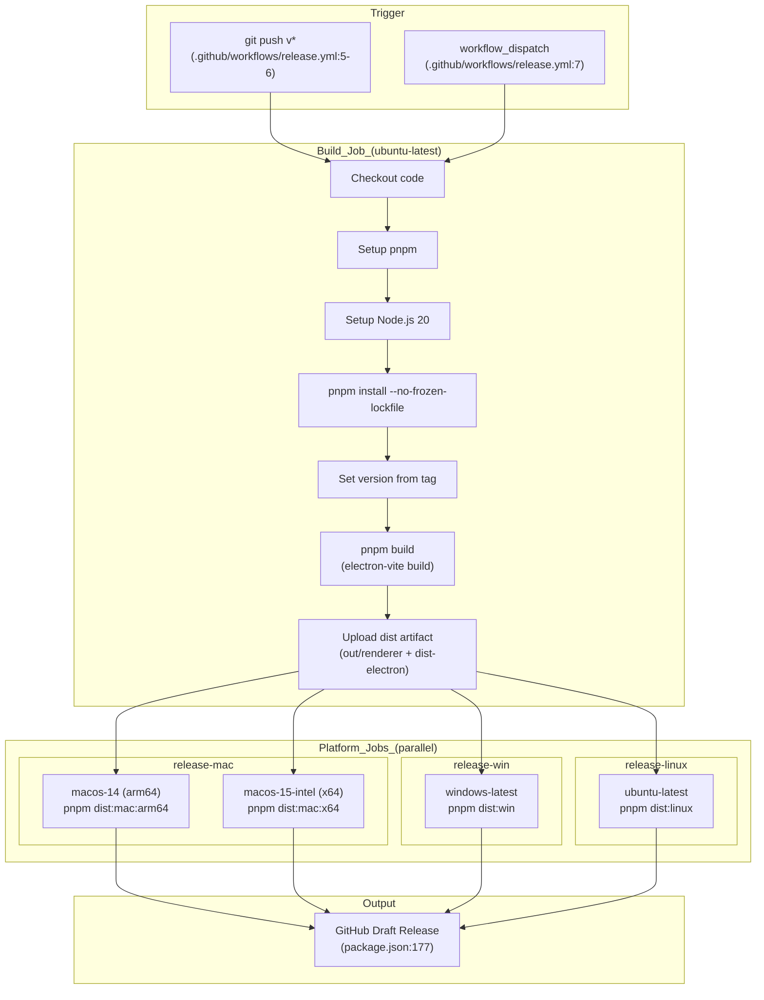

# Release & Distribution

<details>
<summary>Relevant source files</summary>

The following files were used as context for generating this wiki page:

- [.github/workflows/release.yml](.github/workflows/release.yml)
- [electron.vite.config.ts](electron.vite.config.ts)
- [package.json](package.json)
- [pnpm-lock.yaml](pnpm-lock.yaml)
- [resources/afterInstall.sh](resources/afterInstall.sh)
- [src/main/services/infrastructure/NotificationManager.ts](src/main/services/infrastructure/NotificationManager.ts)
- [src/main/services/infrastructure/SshConnectionManager.ts](src/main/services/infrastructure/SshConnectionManager.ts)

</details>


This document describes the release automation, multi-platform packaging, and distribution strategy for `claude-devtools`. It covers the GitHub Actions workflow, `electron-builder` configuration, platform-specific build targets, and artifact generation.

For the detailed GitHub Actions pipeline configuration, see [Release Workflow](#12.1). For macOS code signing and notarization specifics, see [Code Signing & Notarization](#12.2). For the auto-update mechanism and user experience, see [Auto-Updates](#12.3).

---

## Overview

The release process is fully automated through GitHub Actions and `electron-builder`. When a version tag is pushed (e.g., `v0.1.0`), the workflow builds and packages the application for macOS (arm64 and x64), Windows, and Linux, then publishes draft releases to GitHub. The system supports both local development builds and CI-based production releases.

---

## Build Configuration

The application uses **`electron-builder`** for packaging, configured in the `build` field of `package.json` [package.json:115-180](). The configuration specifies platform-specific targets, file inclusion patterns, and publishing settings.

### Core Build Settings

| Property | Value | Purpose |
|----------|-------|---------|
| `appId` | `com.claudecode.context` | macOS bundle identifier [package.json:116]() |
| `productName` | `claude-devtools` | Application display name [package.json:117]() |
| `directories.output` | `release` | Build artifact directory [package.json:119]() |
| `asar` | `true` | Package source into ASAR archive [package.json:126]() |
| `npmRebuild` | `false` | Skip native module rebuild (handled during install) [package.json:130]() |

### File Inclusion

The build packages three primary output directories into the ASAR archive:
- `out/renderer/**` - React UI bundle (from `electron-vite`) [package.json:122]()
- `dist-electron/**` - Main and preload process bundles [package.json:123]()
- `package.json` - Application metadata [package.json:124]()

Sources: [package.json:115-133]()

---

## Platform Targets

### Diagram: Platform Build Targets and Outputs

```mermaid
graph TB
    subgraph "Build_Configuration"
        ["package.json:115-180"] -- "build_config" --> BuildConfig["build: { ... }"]
    end
    
    subgraph "macOS_Targets"
        MacConfig["mac: {<br/>category: developer-tools<br/>hardenedRuntime: true<br/>notarize: true<br/>}"]
        DMG["DMG Installer<br/>(signed & notarized)"]
        ZIP["ZIP Archive<br/>(signed & notarized)"]
        MacConfig --> DMG
        MacConfig --> ZIP
    end
    
    subgraph "Windows_Targets"
        WinConfig["win: {<br/>target: nsis<br/>}"]
        NSIS["NSIS Installer<br/>(.exe)"]
        WinConfig --> NSIS
    end
    
    subgraph "Linux_Targets"
        LinuxConfig["linux: {<br/>category: Development<br/>}"]
        AppImage["AppImage<br/>(portable)"]
        DEB["Debian Package<br/>(.deb)"]
        RPM["RPM Package<br/>(.rpm)"]
        Pacman["Pacman Package<br/>(.pacman)"]
        LinuxConfig --> AppImage
        LinuxConfig --> DEB
        LinuxConfig --> RPM
        LinuxConfig --> Pacman
    end
    
    BuildConfig --> MacConfig
    BuildConfig --> WinConfig
    BuildConfig --> LinuxConfig
```

Sources: [package.json:134-165]()

---

## Distribution Scripts

The `package.json` defines npm scripts for building and distributing on each platform [package.json:23-28]():

| Script | Command | Purpose |
|--------|---------|---------|
| `dist` | `electron-builder --mac --win --linux` | Build all platforms locally [package.json:23]() |
| `dist:mac` | `electron-builder --mac --publish always` | macOS universal build [package.json:24]() |
| `dist:mac:arm64` | `electron-builder --mac --arm64 --publish always` | macOS Apple Silicon [package.json:25]() |
| `dist:mac:x64` | `electron-builder --mac --x64 --publish always` | macOS Intel [package.json:26]() |
| `dist:win` | `electron-builder --win --publish always` | Windows installer [package.json:27]() |
| `dist:linux` | `electron-builder --linux --publish always` | Linux packages [package.json:28]() |

The `--publish always` flag uploads artifacts to the GitHub release specified in the `publish` provider [package.json:174-179]().

Sources: [package.json:20-28](), [package.json:174-179]()

---

## Release Workflow Architecture

### Diagram: GitHub Actions Release Pipeline



The workflow uses a multi-stage approach to ensure consistency:
1. **Build stage**: Runs `pnpm build` (which triggers `electron-vite build` [package.json:22]()) once on Ubuntu to generate platform-agnostic bundles.
2. **Platform stages**: Download the build artifact and run `electron-builder` on native runners.
3. **Publishing**: Each platform job uploads its artifacts to the same draft release using `GH_TOKEN` [.github/workflows/release.yml:107]().

Sources: [.github/workflows/release.yml:1-221](), [package.json:20-28]()

---

## Workflow Jobs

### Build Job

The initial build job [.github/workflows/release.yml:13-48]() compiles the application:
1. Installs dependencies using `pnpm install --no-frozen-lockfile` [.github/workflows/release.yml:30]().
2. Extracts version from the Git tag [.github/workflows/release.yml:35]() and updates `package.json` using `pnpm pkg set version` [.github/workflows/release.yml:36]().
3. Runs `pnpm build` [.github/workflows/release.yml:39]().
4. Uploads `out/renderer` and `dist-electron` as artifacts [.github/workflows/release.yml:45-47]().

### Platform-Specific Jobs

Each platform job depends on the build job completing:

**macOS** [.github/workflows/release.yml:50-113]():
- Uses a matrix strategy for `arm64` and `x64` architectures [.github/workflows/release.yml:54-61]().
- Requires Python 3.11 for `node-gyp` native module compilation [.github/workflows/release.yml:83-85]().
- Requires code signing secrets: `CSC_LINK`, `CSC_KEY_PASSWORD`, `APPLE_ID`, `APPLE_APP_SPECIFIC_PASSWORD`, `APPLE_TEAM_ID` [.github/workflows/release.yml:108-112]().

**Windows** [.github/workflows/release.yml:115-165]():
- Runs on `windows-latest` [.github/workflows/release.yml:117]().
- Executes `pnpm dist:win` [.github/workflows/release.yml:165]().

**Linux** [.github/workflows/release.yml:167-221]():
- Installs packaging dependencies: `libarchive-tools` and `rpm` [.github/workflows/release.yml:197]().
- Executes `pnpm dist:linux` [.github/workflows/release.yml:220]().

Sources: [.github/workflows/release.yml:1-221]()

---

## Version Management

The version is dynamically set during the release process:
1. Developer pushes a tag (e.g., `v0.1.0`) [.github/workflows/release.yml:6]().
2. Workflow extracts the version string (e.g., `0.1.0`) [.github/workflows/release.yml:35]().
3. `pnpm pkg set version="$VERSION"` updates the `version` field in `package.json` [.github/workflows/release.yml:36]().
4. `electron-builder` reads this version to name the final artifacts.

Sources: [.github/workflows/release.yml:32-36](), [package.json:4]()

---

## Native Module Handling

The application includes native dependencies (specifically `ssh2` [package.json:69]()) that require platform-specific compilation. 

1. **Python Setup**: All platform jobs install Python 3.11 [.github/workflows/release.yml:83-85](), [138-140](), [190-192]() to support `node-gyp`.
2. **Bundling Logic**: `electron.vite.config.ts` uses an `externalizeDepsPlugin` but excludes production dependencies [electron.vite.config.ts:34-36]() to bundle them into the main process output.
3. **Native Stubbing**: The `nativeModuleStub` plugin [electron.vite.config.ts:16-29]() stubs out `.node` addon imports with empty modules to prevent bundling errors while allowing pure JS fallbacks to function.

Sources: [electron.vite.config.ts:1-101](), [.github/workflows/release.yml:82-85](), [package.json:69]()

---

## Artifact Outputs

Each platform job produces signed/notarized installers in the `release/` directory [package.json:119]():

- **macOS**: `dmg` and `zip` targets [package.json:136-139](). Includes `hardenedRuntime` and `entitlements` [package.json:140-144]().
- **Windows**: `nsis` installer [package.json:152]().
- **Linux**: `AppImage`, `deb`, `rpm`, and `pacman` [package.json:158-161]().
- **Linux Post-Install**: A script `resources/afterInstall.sh` is executed for `.deb` packages to fix `chrome-sandbox` permissions [package.json:167](), [resources/afterInstall.sh:1-11]().

Sources: [package.json:134-173](), [resources/afterInstall.sh:1-11]()

---

## Auto-Update Integration

The application integrates `electron-updater` [package.json:58]() for background update delivery. 

- **Provider**: GitHub [package.json:176]().
- **Mechanism**: The updater checks for new releases published via the GitHub provider.
- **Renderer UI**: The application provides an `UpdateDialog` (covered in [Auto-Updates](#12.3)) to notify users when a new version is available.

Sources: [package.json:58](), [package.json:174-179]()
