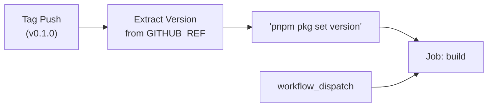
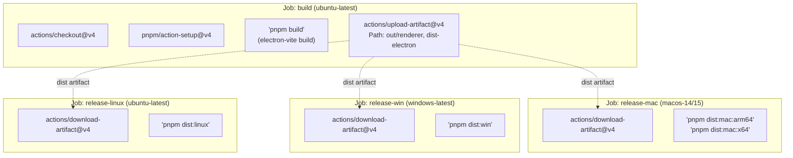

# Release Workflow

<details>
<summary>Relevant source files</summary>

The following files were used as context for generating this wiki page:

- [.github/workflows/release.yml](.github/workflows/release.yml)
- [electron.vite.config.ts](electron.vite.config.ts)
- [package.json](package.json)
- [pnpm-lock.yaml](pnpm-lock.yaml)
- [resources/afterInstall.sh](resources/afterInstall.sh)
- [src/main/services/infrastructure/NotificationManager.ts](src/main/services/infrastructure/NotificationManager.ts)
- [src/main/services/infrastructure/SshConnectionManager.ts](src/main/services/infrastructure/SshConnectionManager.ts)

</details>


This page documents the GitHub Actions release pipeline that automates building, packaging, and distributing `claude-devtools` across multiple platforms. The workflow handles version management, parallel platform builds, and artifact generation using `electron-builder`.

## Overview

The release workflow is defined in [.github/workflows/release.yml:1-221]() and consists of four primary jobs:
1. **build**: Common build step that produces renderer and main process artifacts.
2. **release-mac**: macOS packaging for both `arm64` and `x64` architectures.
3. **release-win**: Windows packaging (NSIS).
4. **release-linux**: Linux packaging (AppImage, deb, rpm, pacman).

Each platform job depends on the `build` job and downloads shared artifacts to minimize redundant compilation and ensure consistency across platforms.

Sources: [.github/workflows/release.yml:1-221](), [package.json:23-28]()

## Release Triggers

The workflow is triggered by two mechanisms:

| Trigger Type | Condition | Use Case |
|-------------|-----------|----------|
| Tag Push | `v*` | Automated release when a version tag (e.g., `v0.1.0`) is pushed. |
| Manual Dispatch | `workflow_dispatch` | Manual testing or emergency releases via GitHub UI. |

When triggered by a version tag, the workflow automatically extracts the version number and updates `package.json` before building.

### Natural Language to Code: Release Initialization

Sources: [.github/workflows/release.yml:3-7](), [.github/workflows/release.yml:32-36]()

## Build Pipeline Architecture

The workflow uses a **build-once, package-many** architecture. The `build` job bundles the application using `electron-vite` and uploads the resulting directories as a GitHub Action artifact.

### Natural Language to Code: Pipeline Data Flow

Sources: [.github/workflows/release.yml:13-49](), [package.json:21-22]()

### Artifact Contents
The `build` job uploads the following directories:
- `out/renderer`: The bundled React frontend.
- `dist-electron`: The compiled Main and Preload process code (CJS format).

Sources: [.github/workflows/release.yml:41-48](), [electron.vite.config.ts:47-59](), [electron.vite.config.ts:71-81]()

## Platform-Specific Packaging

### macOS Builds
The macOS job uses a matrix strategy to target both Apple Silicon and Intel architectures:

| Architecture | Runner | Command |
|--------------|--------|---------|
| `arm64` | `macos-14` | `pnpm dist:mac:arm64` |
| `x64` | `macos-15-intel` | `pnpm dist:mac:x64` |

**Code Signing & Notarization**
macOS builds require specific environment variables for `electron-builder` to sign and notarize the app:
- `CSC_LINK`: Base64-encoded `.p12` certificate.
- `CSC_KEY_PASSWORD`: Password for the certificate.
- `APPLE_ID`, `APPLE_APP_SPECIFIC_PASSWORD`, `APPLE_TEAM_ID`: Credentials for Apple's notarization service.

Sources: [.github/workflows/release.yml:50-114](), [package.json:134-146]()

### Windows Builds
The Windows job runs on `windows-latest` and produces an NSIS installer. It requires Python 3.11 for `node-gyp` to handle native dependencies like `ssh2` if they need rebuilding.

Sources: [.github/workflows/release.yml:115-166](), [package.json:150-155](), [package.json:169-173]()

### Linux Builds
The Linux job produces multiple formats: `AppImage`, `deb`, `rpm`, and `pacman`. It requires `libarchive-tools` and `rpm` system packages on the runner.

Sources: [.github/workflows/release.yml:167-221](), [package.json:156-165]()

## Build Input Verification

To prevent "empty" packages, each platform job performs a verification step before running `electron-builder`. It checks for the existence of critical entry points:

```bash
test -f dist-electron/main/index.cjs
test -f dist-electron/preload/index.js
test -f out/renderer/index.html
```

Sources: [.github/workflows/release.yml:99-103](), [.github/workflows/release.yml:155-160](), [.github/workflows/release.yml:211-215]()

## Release Artifact Generation

The final step of each platform job is running the `dist` command which triggers `electron-builder`.

| Platform | Script | Config Section |
|----------|--------|----------------|
| Mac | `pnpm dist:mac` | `build.mac` |
| Windows | `pnpm dist:win` | `build.win` |
| Linux | `pnpm dist:linux` | `build.linux` |

**Publishing**
`electron-builder` is configured to publish to GitHub. When a tag is pushed, it creates a "Draft" release on GitHub and uploads the installers, DMGs, and update manifests (`latest-mac.yml`, `latest.yml`).

Sources: [package.json:24-28](), [package.json:115-180]()

## Local Build Testing

Developers can simulate the release process locally using the following scripts:

```bash
# Full build of all processes
pnpm build

# Package for current OS (no upload)
pnpm dist

# Package for specific OS with publish attempt
pnpm dist:mac
pnpm dist:win
pnpm dist:linux
```

Sources: [package.json:20-28]()
