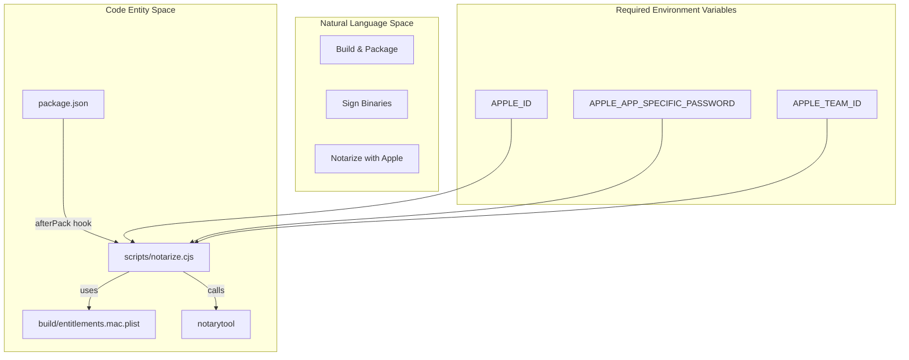
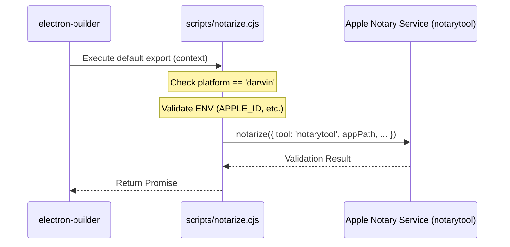
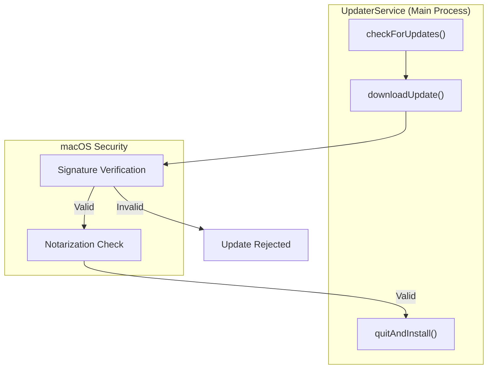

# Code Signing & Notarization

Relevant source files

The following files were used as context for generating this wiki page:

- [build/entitlements.mac.plist](build/entitlements.mac.plist)
- [resources/entitlements.mac.inherit.plist](resources/entitlements.mac.inherit.plist)
- [resources/entitlements.mac.plist](resources/entitlements.mac.plist)
- [scripts/notarize.cjs](scripts/notarize.cjs)
- [src/main/ipc/updater.ts](src/main/ipc/updater.ts)
- [src/main/services/infrastructure/UpdaterService.ts](src/main/services/infrastructure/UpdaterService.ts)

This document covers the macOS code signing and notarization process for claude-devtools. Code signing ensures the application's integrity and authenticity, while notarization is Apple's validation process that allows the app to run on macOS without security warnings. This page focuses specifically on the macOS signing and notarization configuration, the specialized notarization script, and the entitlements required for the Electron environment.

## Overview

macOS requires applications distributed outside the App Store to be both **code signed** with a valid Developer ID certificate and **notarized** by Apple. Without these, users encounter security warnings (Gatekeeper) that prevent easy installation.

The signing and notarization process for claude-devtools involves:

1.  **Code Signing**: Cryptographically signing all executable code with a Developer ID Application certificate.
2.  **Hardened Runtime**: Enabling security features that restrict runtime code injection.
3.  **Entitlements**: Declaring required system capabilities (JIT, unsigned memory) via `.plist` files.
4.  **Notarization**: Submitting the signed build to Apple via `notarytool` for malware scanning.
5.  **Stapling**: Attaching the notarization ticket to the build for offline verification.

**Signing and Notarization Logic Flow**

The following diagram illustrates how the build system transitions from raw source to a notarized app bundle using `notarize.cjs`.

Sources: [scripts/notarize.cjs:1-22](), [build/entitlements.mac.plist:1-12]()

## Entitlements Configuration

To satisfy the **Hardened Runtime** requirements while maintaining the functionality of an Electron application (which uses V8 JIT and may load native modules), specific entitlements must be granted.

The project maintains multiple entitlement profiles depending on the build stage and process type:

| File Path | Key Entitlements | Purpose |
|:---|:---|:---|
| `build/entitlements.mac.plist` | `com.apple.security.cs.allow-jit`, `com.apple.security.cs.allow-unsigned-executable-memory`, `com.apple.security.cs.allow-dyld-environment-variables` | Main build entitlements allowing JIT and DYLD overrides. |
| `resources/entitlements.mac.plist` | `com.apple.security.cs.allow-jit`, `com.apple.security.cs.allow-unsigned-executable-memory`, `com.apple.security.cs.disable-library-validation` | Production entitlements for the main process. |
| `resources/entitlements.mac.inherit.plist` | `com.apple.security.inherit` | Ensures child processes (like utility workers) inherit the parent's security context. |

### Key Entitlements Explained

*   **`com.apple.security.cs.allow-jit`**: Essential for the V8 engine to execute JavaScript efficiently [build/entitlements.mac.plist:5-6]().
*   **`com.apple.security.cs.allow-unsigned-executable-memory`**: Required for loading certain native modules (like `ssh2` or SQLite) that generate code at runtime [resources/entitlements.mac.plist:7-8]().
*   **`com.apple.security.cs.disable-library-validation`**: Allows the app to load frameworks or plugins that aren't signed by the same Team ID, often necessary for complex Electron dependencies [resources/entitlements.mac.plist:9-10]().

Sources: [build/entitlements.mac.plist:1-12](), [resources/entitlements.mac.plist:1-12](), [resources/entitlements.mac.inherit.plist:1-14]()

## Notarization Script (`notarize.cjs`)

The application uses a custom notarization script located at `scripts/notarize.cjs`. This script is typically invoked as an `afterPack` hook by `electron-builder`.

**Implementation Details:**
*   **Platform Check**: The script immediately exits if the platform is not `darwin` [scripts/notarize.cjs:5-5]().
*   **Credential Validation**: It checks for the presence of `APPLE_ID`, `APPLE_APP_SPECIFIC_PASSWORD`, and `APPLE_TEAM_ID`. If missing, notarization is skipped with a log message [scripts/notarize.cjs:7-10]().
*   **Tooling**: It utilizes the modern `notarytool` rather than the legacy `altool` [scripts/notarize.cjs:15-15]().
*   **Targeting**: It targets the `.app` bundle located in the `appOutDir` using the `appBundleId` `com.claudecode.context` [scripts/notarize.cjs:16-17]().

**Notarization Data Flow**

Sources: [scripts/notarize.cjs:1-22]()

## Relationship with Updates

Proper code signing is a prerequisite for the **Auto-Update** system. The `UpdaterService` relies on `electron-updater`, which verifies the signature of downloaded update artifacts before allowing installation.

*   **Verification**: If an update is downloaded but the signature does not match the currently running application's signature, the update will fail to install for security reasons.
*   **Installation**: The `UpdaterService.quitAndInstall()` method triggers the final step of the update process, which assumes the new binary has passed macOS Gatekeeper checks [src/main/services/infrastructure/UpdaterService.ts:63-65]().

**Update Verification Sequence**

Sources: [src/main/services/infrastructure/UpdaterService.ts:39-65](), [src/main/ipc/updater.ts:31-33]()

## Troubleshooting

### Missing Credentials
If the build logs show `Skipping notarization: Apple credentials not set`, ensure that the following environment variables are exported in the CI/CD environment or local shell [scripts/notarize.cjs:7-10]():
*   `APPLE_ID`
*   `APPLE_APP_SPECIFIC_PASSWORD`
*   `APPLE_TEAM_ID`

### Entitlement Conflicts
If the application crashes on launch with a "Code Signature Invalid" or "Trace/BPT trap" error, verify that the entitlements in `resources/entitlements.mac.plist` match the requirements of the native modules being used [resources/entitlements.mac.plist:1-12](). Specifically, ensure `com.apple.security.cs.allow-unsigned-executable-memory` is set to `true` if loading modules like `ssh2` [resources/entitlements.mac.plist:7-8]().

Sources: [scripts/notarize.cjs:7-10](), [resources/entitlements.mac.plist:5-10]()
