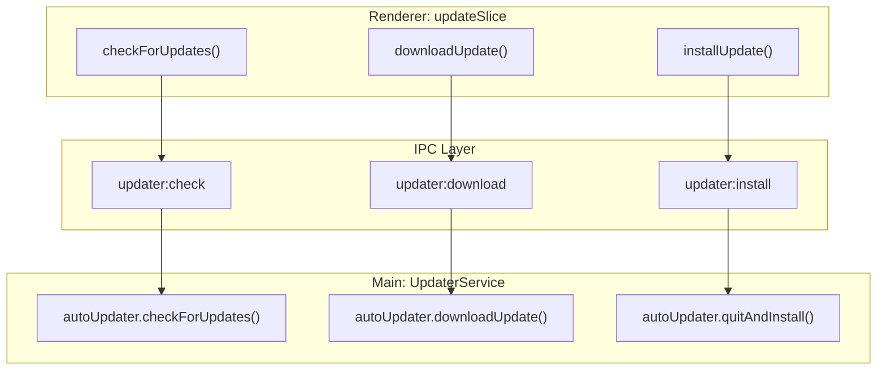
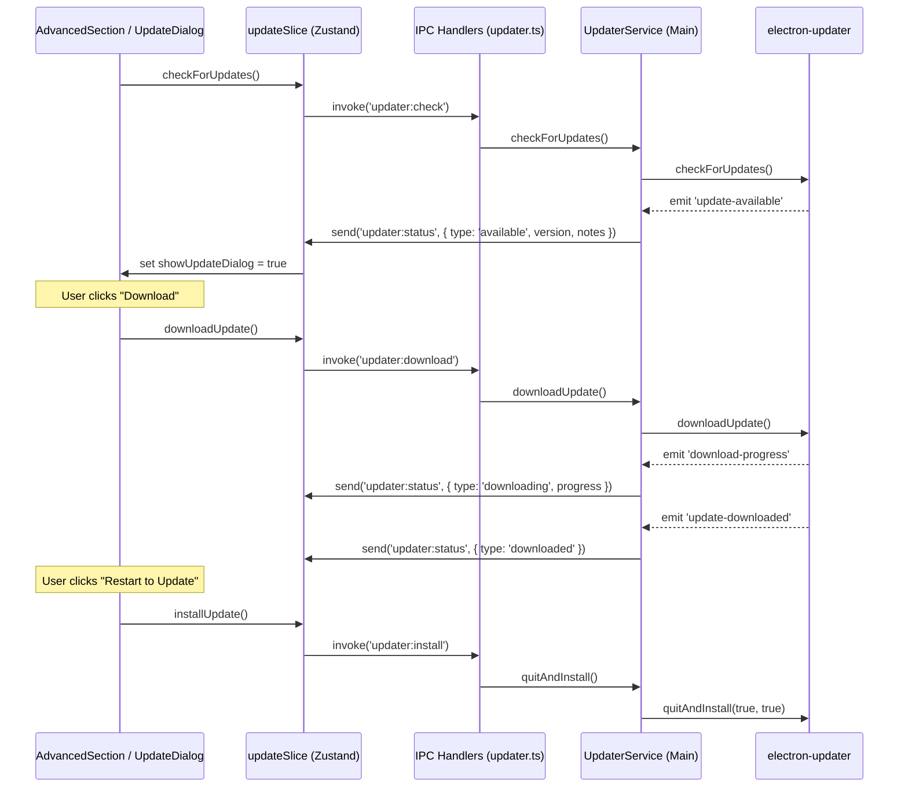

# Auto-Updates

Relevant source files

The following files were used as context for generating this wiki page:

- [README.md](README.md)
- [build/entitlements.mac.plist](build/entitlements.mac.plist)
- [scripts/notarize.cjs](scripts/notarize.cjs)
- [src/main/ipc/updater.ts](src/main/ipc/updater.ts)
- [src/main/services/infrastructure/UpdaterService.ts](src/main/services/infrastructure/UpdaterService.ts)
- [src/renderer/components/common/UpdateDialog.tsx](src/renderer/components/common/UpdateDialog.tsx)
- [src/renderer/components/settings/sections/AdvancedSection.tsx](src/renderer/components/settings/sections/AdvancedSection.tsx)
- [src/renderer/store/slices/updateSlice.ts](src/renderer/store/slices/updateSlice.ts)

This page documents the auto-update system, which handles update detection, download orchestration, and the user interface for version management. The system uses `electron-updater` in the Main process to monitor GitHub Releases and a custom React-based UI in the Renderer to present release notes and progress.

---

## Overview

The auto-update system follows a split architecture between the Main and Renderer processes, coordinated via IPC:

1.  **UpdaterService (Main)**: Wraps `electron-updater` to check for updates, manage downloads, and handle the final installation. [src/main/services/infrastructure/UpdaterService.ts:19-121]()
2.  **updateSlice (Renderer)**: A Zustand store slice that maintains the current update state (e.g., `checking`, `available`, `downloading`). [src/renderer/store/slices/updateSlice.ts:17-83]()
3.  **UpdateDialog (Renderer)**: A modal component that renders release notes and provides the "Download" action. [src/renderer/components/common/UpdateDialog.tsx:41-181]()
4.  **AdvancedSection (Renderer)**: Located in Settings, this provides manual "Check for Updates" functionality and version information. [src/renderer/components/settings/sections/AdvancedSection.tsx:22-196]()

---

## Main Process: UpdaterService

The `UpdaterService` is the core engine for OTA (Over-The-Air) updates. It configures `electron-updater` with specific behaviors to ensure user control.

### Configuration and Lifecycle
The service disables `autoDownload` [src/main/services/infrastructure/UpdaterService.ts:23]() to ensure users must explicitly confirm before the app begins fetching a new version. However, `autoInstallOnAppQuit` is enabled [src/main/services/infrastructure/UpdaterService.ts:24]() to streamline the final update step once a download is complete.

### Event Mapping
The service maps internal `electron-updater` events to a unified `UpdaterStatus` type and forwards them to the Renderer via the `updater:status` IPC channel [src/main/services/infrastructure/UpdaterService.ts:67-71]().

| electron-updater Event | Status Sent to Renderer | Data Included |
| :--- | :--- | :--- |
| `checking-for-update` | `checking` | - |
| `update-available` | `available` | `version`, `releaseNotes` |
| `update-not-available`| `not-available` | - |
| `download-progress` | `downloading` | `percent`, `transferred`, `total` |
| `update-downloaded` | `downloaded` | `version` |
| `error` | `error` | `error` (string) |

**Sources:** [src/main/services/infrastructure/UpdaterService.ts:73-119]()

---

## Renderer Process: State & UI

### Update State Management
The `updateSlice` in the Zustand store manages the global state of the update lifecycle. It provides actions that trigger IPC calls to the Main process.

**Sources:** [src/renderer/store/slices/updateSlice.ts:56-74](), [src/main/ipc/updater.ts:30-34]()

### UpdateDialog Component
When the store's `updateStatus` becomes `available`, the `UpdateDialog` is triggered [src/renderer/components/common/UpdateDialog.tsx:42-43]().

#### Release Notes Normalization
Release notes from GitHub often contain HTML. The `normalizeReleaseNotes` function cleans this data before rendering it as Markdown.
1.  **Block Conversion**: Replaces tags like `
`, ` `, and `
` with newlines [src/renderer/components/common/UpdateDialog.tsx:24-29]().
2.  **Entity Decoding**: Uses `DOMParser` to decode HTML entities (e.g., `&mdash;`) and extract raw text content [src/renderer/components/common/UpdateDialog.tsx:33-35]().
3.  **Markdown Rendering**: Uses `ReactMarkdown` with `remarkGfm` to display the cleaned text [src/renderer/components/common/UpdateDialog.tsx:153-155]().

### Settings Integration
The `AdvancedSection` provides a secondary entry point for updates. It displays the current version (fetched via `api.getAppVersion()` [src/renderer/components/settings/sections/AdvancedSection.tsx:49]()) and a dynamic button that reflects the `updateStatus` [src/renderer/components/settings/sections/AdvancedSection.tsx:56-90]().

---

## Update Flow Diagram

The following diagram illustrates the flow from detection to installation, bridging the UI and Service entities.

**Sources:** [src/main/services/infrastructure/UpdaterService.ts:73-119](), [src/renderer/store/slices/updateSlice.ts:46-83](), [src/main/ipc/updater.ts:53-75]()

---

## Security & Distribution

### Code Signing & Notarization
On macOS, updates are only accepted if the application is properly signed and notarized.
-   **Entitlements**: The app requests `allow-jit` and `allow-unsigned-executable-memory` to support the Electron runtime [build/entitlements.mac.plist:5-8]().
-   **Notarization**: A script (`notarize.cjs`) uses `@electron/notarize` to submit the `.app` bundle to Apple's notary service using `APPLE_ID` and `APPLE_TEAM_ID` environment variables [scripts/notarize.cjs:14-21]().

### Manual Installation
While the auto-updater handles `.dmg` (macOS) and `.exe` (Windows), users on other platforms or those preferring manual installs can download assets directly from GitHub:
-   **macOS**: `.dmg` (Universal/ARM64/x64) [README.md:78-79]()
-   **Linux**: `.AppImage`, `.deb`, `.rpm`, `.pacman` [README.md:80]()
-   **Windows**: `.exe` installer [README.md:81]()

**Sources:** [build/entitlements.mac.plist:1-12](), [scripts/notarize.cjs:1-22](), [README.md:76-83]()
