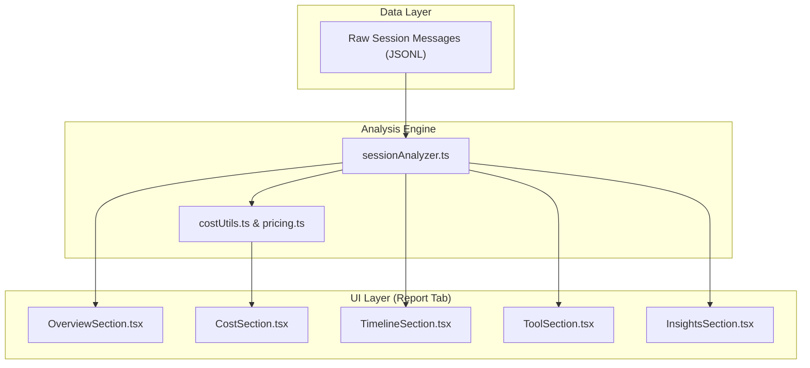

# Session Analysis & Reporting

Relevant source files

The following files were used as context for generating this wiki page:

- [CONTRIBUTING.md](CONTRIBUTING.md)

The **Session Analysis & Reporting** engine is the analytical core of `claude-devtools`. It transforms raw Claude Code session logs (JSONL) into structured metrics, cost estimates, and performance insights. While the application provides a detailed message-by-message view, the Reporting engine aggregates this data to help users understand token consumption, financial costs, and agent behavior across the entire lifecycle of a session.

### High-Level Architecture

The analysis pipeline begins when a session is selected in the UI. The `sessionAnalyzer` processes the raw message array, calculating cumulative totals and identifying specific patterns like tool executions or subagent spawns. This analyzed data is then consumed by the **Report Tab** and its various specialized sections.

Sources: [CONTRIBUTING.md:7-13]()

---

### [Session Analyzer](#13.1)

The `sessionAnalyzer` is a utility responsible for the heavy lifting of data transformation. It iterates through the session history to reconstruct the state of the context window at any given point. It tracks:
- **Token Deltas**: How many tokens were added or removed in each exchange.
- **Context Composition**: The ratio of user input, assistant output, and tool results.
- **Agent Lifecycle**: Detection of when Claude spawns subagents and how they contribute to the overall session.

For details on the analysis logic and metrics extraction, see [Session Analyzer](#13.1).

---

### [Cost & Pricing](#13.2)

One of the primary goals of `claude-devtools` is providing financial visibility into Claude Code usage. The cost engine maps token counts to specific Anthropic model pricing tiers (e.g., Claude 3.5 Sonnet).

| Component | Responsibility |
| :--- | :--- |
| **Pricing Data** | Maintains up-to-date rates for input, output, and cache hits. |
| **Cost Calculator** | Applies pricing logic to the metrics generated by the analyzer. |
| **Formatting** | Handles currency conversion and human-readable token cost displays. |

For details on pricing models and calculation logic, see [Cost & Pricing](#13.2).

---

### [Report Sections](#13.3)

The **Report Tab** in the UI is composed of several modular components, each focusing on a specific dimension of the session. These sections translate complex data into digestible visualizations and summaries.

- **Overview**: High-level summary of duration, total tokens, and primary goal.
- **Timeline**: A visual representation of activity bursts and idle time.
- **Tool Usage**: Statistics on which tools (e.g., `ls`, `grep`, `edit`) were used most frequently and their success rates.
- **Friction & Quality**: Heuristics that identify "loops" (where Claude repeats the same command) or errors that wasted tokens.
- **Git Insights**: Summarizes the changes made to the repository during the session.

For details on individual UI components and their specific metrics, see [Report Sections](#13.3).

Sources: [CONTRIBUTING.md:11-12]()
