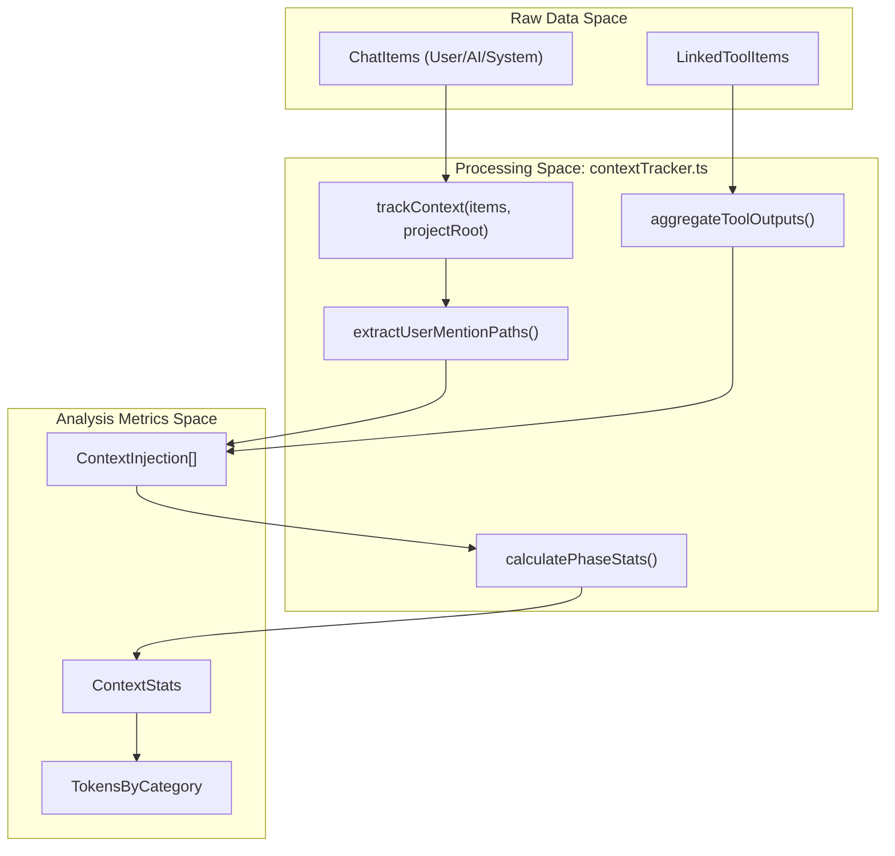

# Session Analyzer

<details>
<summary>Relevant source files</summary>

The following files were used as context for generating this wiki page:

- [src/renderer/components/chat/ChatHistoryItem.tsx](src/renderer/components/chat/ChatHistoryItem.tsx)
- [src/renderer/components/chat/ContextBadge.tsx](src/renderer/components/chat/ContextBadge.tsx)
- [src/renderer/components/chat/SessionContextPanel/components/FlatInjectionList.tsx](src/renderer/components/chat/SessionContextPanel/components/FlatInjectionList.tsx)
- [src/renderer/types/contextInjection.ts](src/renderer/types/contextInjection.ts)
- [src/renderer/utils/contextTracker.ts](src/renderer/utils/contextTracker.ts)

</details>


The **Session Analyzer** is a core utility responsible for transforming raw session data (messages, tool calls, and file mentions) into structured metrics and analysis data. It primarily operates through the `contextTracker.ts` utility to calculate token distributions, identify context injection sources, and track how the conversation state evolves over time.

## Overview

The analysis engine focuses on **Context Tracking**, which identifies what data is consuming the LLM's context window at any given turn. This includes:
*   **CLAUDE.md files**: Project-specific instructions and rules.
*   **Mentioned Files**: Files explicitly added via `@-mentions`.
*   **Tool Outputs**: Data returned from tools like `ls`, `grep`, or `read_file`.
*   **Overhead**: Thinking blocks, task coordination (subagent management), and user prompts.

Sources: `src/renderer/utils/contextTracker.ts:4-10`(), `src/renderer/types/contextInjection.ts:2-5`()

## Implementation & Data Flow

The analysis process is triggered when a session is loaded or updated. It follows a pipeline that enhances raw message groups into a "Context-Aware" state.

### Analysis Pipeline

The following diagram illustrates how raw chat items are processed into `ContextStats` and `ContextInjection` objects used by the UI.

**Data Transformation Flow**

Sources: `src/renderer/utils/contextTracker.ts:250-265`(), `src/renderer/utils/contextTracker.ts:184-189`()

### Key Functions

| Function | File | Description |
| :--- | :--- | :--- |
| `trackContext` | `contextTracker.ts` | The entry point for session analysis. Iterates through all chat groups to build a timeline of context injections. |
| `aggregateToolOutputs` | `contextTracker.ts` | Sums tokens from `callTokens`, `resultTokens`, and `skillInstructionsTokenCount` for all tools in a turn. |
| `extractUserMentionPaths` | `claudeMdTracker.ts` | Regex-based detection of `@path/to/file` patterns in user messages. |
| `calculatePhaseStats` | `contextTracker.ts` | Aggregates injections into `ContextStats` for a specific "Phase" (a slice of the conversation). |

Sources: `src/renderer/utils/contextTracker.ts:250-255`(), `src/renderer/utils/contextTracker.ts:184-190`(), `src/renderer/utils/contextTracker.ts:608-615`()

## Context Tracking Logic

The analyzer distinguishes between "New" context (introduced in the current turn) and "Cumulative" context (total context currently in the window).

### Token Calculation
Tokens are estimated using `estimateTokens` (roughly `charCount / 4`) unless exact counts are provided by the Claude session metadata. 
*   **Mentioned Files**: Capped at `MAX_MENTIONED_FILE_TOKENS` (25,000) to prevent unrealistic estimates for massive files.
*   **Tool Outputs**: Includes the tool call (what Claude sent) and the result (what the tool returned).

Sources: `src/renderer/types/contextInjection.ts:17-18`(), `src/renderer/utils/contextTracker.ts:202-208`()

### Task Coordination vs. Tool Outputs
The analyzer treats subagent management differently from standard tools. Tools defined in `TASK_COORDINATION_TOOL_NAMES` (e.g., `SendMessage`, `TeamCreate`, `TaskCreate`) are filtered out of general tool metrics and categorized as `task-coordination` overhead.

Sources: `src/renderer/utils/contextTracker.ts:63-72`(), `src/renderer/utils/contextTracker.ts:194-197`()

## Transformation to UI Components

The analyzed data is consumed by the `ContextBadge` and `FlatInjectionList` components to provide the user with a "Token Audit."

**Context Entity Relationship**
```mermaid
classDiagram
    class "ContextStats" {
        +TokensByCategory totalTokens
        +NewCountsByCategory newCounts
        +ContextInjection[] newInjections
    }
    class "ContextInjection" {
        <<interface>>
        +string id
        +string category
        +number estimatedTokens
    }
    class "ToolOutputInjection" {
        +number turnIndex
        +ToolTokenBreakdown[] toolBreakdown
    }
    class "MentionedFileInjection" {
        +string path
        +boolean exists
    }

    ContextStats o-- ContextInjection
    ContextInjection <|-- ToolOutputInjection
    ContextInjection <|-- MentionedFileInjection
    ContextInjection <|-- "ClaudeMdContextInjection"
    ContextInjection <|-- "ThinkingTextInjection"
```
Sources: `src/renderer/types/contextInjection.ts:27-44`(), `src/renderer/types/contextInjection.ts:83-98`(), `src/renderer/types/contextInjection.ts:241-255`()

### Denormalization for Reporting
In the "Session Report" tab, the `FlatInjectionList` component flattens the nested `ContextInjection` objects into a list of `FlatRow` items. This allows the UI to sort every individual tool call or file mention by token size descending, making it easy to identify "context hogs."

Sources: `src/renderer/components/chat/SessionContextPanel/components/FlatInjectionList.tsx:58-62`(), `src/renderer/components/chat/SessionContextPanel/components/FlatInjectionList.tsx:159-160`()

## Data Structures

### ContextStats
The primary output of the analyzer for any given point in the session.
```typescript
export interface ContextStats {
  totalTokens: TokensByCategory;
  newCounts: NewCountsByCategory;
  newInjections: ContextInjection[];
  compactionDelta?: CompactionTokenDelta;
}
```
Sources: `src/renderer/types/contextInjection.ts:241-246`()

### TokensByCategory
Tracks the distribution of the context window.
*   `claudeMd`: Tokens from CLAUDE.md files.
*   `mentionedFiles`: Tokens from @-mentions.
*   `toolOutputs`: Tokens from standard tool results.
*   `thinkingText`: LLM thinking blocks and text responses.
*   `taskCoordination`: Subagent/Team overhead.
*   `userMessages`: The user's own prompts.

Sources: `src/renderer/types/contextInjection.ts:211-218`()
