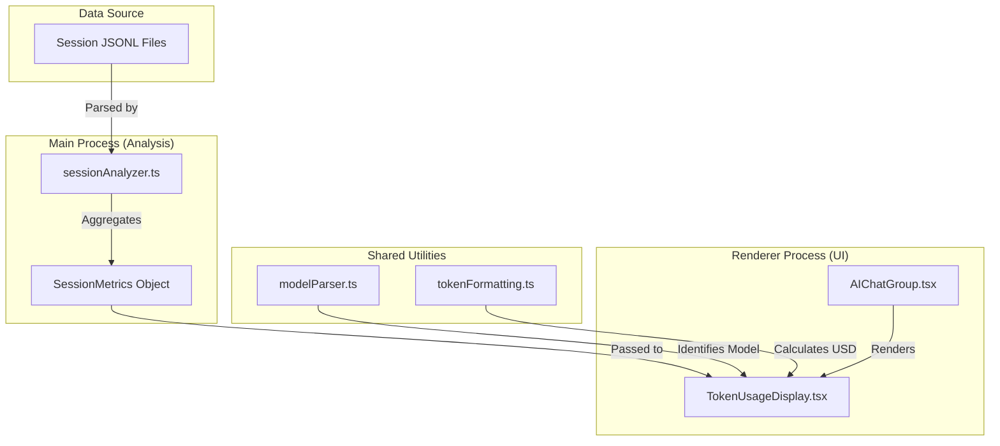
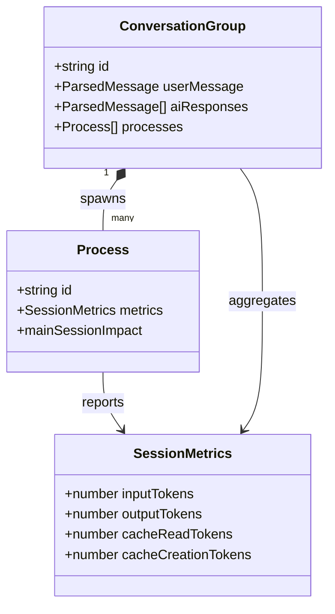

# Cost & Pricing

Relevant source files

The following files were used as context for generating this wiki page:

- [.gitignore](.gitignore)
- [CONTRIBUTING.md](CONTRIBUTING.md)
- [src/main/types/chunks.ts](src/main/types/chunks.ts)
- [src/renderer/components/chat/AIChatGroup.tsx](src/renderer/components/chat/AIChatGroup.tsx)
- [src/renderer/components/common/TokenUsageDisplay.tsx](src/renderer/components/common/TokenUsageDisplay.tsx)

The **Cost & Pricing** system in `claude-devtools` provides transparency into the financial impact of Claude Code sessions. It transforms raw token counts from session metadata into human-readable cost metrics using provider-specific pricing models. This functionality is primarily surfaced in the **Session Report** tab and the **TokenUsageDisplay** component.

## Overview

Claude Code sessions consume tokens across several categories: input (prompt), cache reads, cache writes, and output. `claude-devtools` calculates the cost of these tokens by:
1.  **Parsing Session Metrics**: Extracting token usage from the session's JSONL messages and metadata [src/main/types/chunks.ts:89-90]().
2.  **Applying Pricing Models**: Mapping token counts to USD values based on the model used (e.g., Claude 3.5 Sonnet) [src/shared/utils/tokenFormatting.ts:1-20]().
3.  **Visualizing Impact**: Displaying per-exchange costs in the chat view and aggregated session totals in the reports [src/renderer/components/chat/AIChatGroup.tsx:187-188]().

## Core Logic & Data Flow

The cost calculation follows a flow from the raw session data to the UI components.

### Cost Calculation Pipeline

The pipeline starts with `SessionMetrics` which are aggregated during session analysis.

| Entity | Role |
| :--- | :--- |
| `SessionMetrics` | Interface containing `inputTokens`, `outputTokens`, `cacheReadTokens`, and `cacheCreationTokens` [src/main/types/domain.ts:125-132](). |
| `estimateTokens` | Utility to estimate token counts from raw string content when official metrics are missing [src/shared/utils/tokenFormatting.ts:9-10](). |
| `formatTokensCompact` | Formats large token numbers (e.g., 1.2k) for UI display [src/shared/utils/tokenFormatting.ts:16-16](). |
| `TokenUsageDisplay` | Renderer component that visualizes the breakdown of tokens and associated costs [src/renderer/components/common/TokenUsageDisplay.tsx:25-52](). |

### Cost Data Flow Diagram

This diagram illustrates how token data flows from the session files through the analyzer into the pricing utilities.

Title: Token and Cost Data Flow

Sources: [src/main/types/chunks.ts:89-90](), [src/renderer/components/common/TokenUsageDisplay.tsx:25-52](), [src/shared/utils/tokenFormatting.ts:9-18]()

## Token & Cost Formatting

The application uses a set of shared utilities to ensure consistent pricing calculations across the local and remote sessions.

### Key Formatting Functions

*   **`formatTokensCompact(count: number)`**: Converts raw integers into human-readable strings like "1.5k" or "2.3M" [src/shared/utils/tokenFormatting.ts:16-16]().
*   **`formatTokensDetailed(count: number)`**: Returns the exact comma-separated number for detailed tooltips [src/renderer/components/common/TokenUsageDisplay.tsx:17-17]().
*   **Cost Calculation**: While the codebase currently focuses on token counts, it provides the hooks for USD calculation by categorizing tokens into `input`, `output`, `cache_read`, and `cache_creation` [src/renderer/components/common/TokenUsageDisplay.tsx:27-33]().

### Context Breakdown

The cost is not just a flat rate; it is influenced by how Claude Code manages context. The `SessionContextSection` breaks down where tokens are being spent:

*   **CLAUDE.md**: Tokens consumed by the project instructions [src/renderer/components/common/TokenUsageDisplay.tsx:156-166]().
*   **Mentioned Files**: Tokens from files explicitly added to context via `@` [src/renderer/components/common/TokenUsageDisplay.tsx:168-179]().
*   **Tool Outputs**: Tokens consumed by the results of shell commands or file reads [src/renderer/components/common/TokenUsageDisplay.tsx:181-190]().
*   **Thinking/Text**: Tokens generated by the model during its reasoning phase [src/renderer/components/common/TokenUsageDisplay.tsx:109-110]().

Sources: [src/renderer/components/common/TokenUsageDisplay.tsx:58-120](), [src/shared/utils/tokenFormatting.ts:1-20]()

## Session Report: Cost Section

The Cost section of the session report provides a high-level summary of the entire session's expenditure.

### Implementation Details

The report aggregates `SessionMetrics` from all `ConversationGroup` objects within a session [src/main/types/chunks.ts:194-210]().

Title: Cost Aggregation Logic

Sources: [src/main/types/chunks.ts:26-70](), [src/main/types/chunks.ts:194-210](), [src/main/types/domain.ts:125-132]()

### Subagent Impact

A unique aspect of `claude-devtools` pricing is the `mainSessionImpact` calculation for subagents. When a subagent is spawned, it consumes tokens in two ways:
1.  **Internal Usage**: The tokens the subagent uses for its own internal loop [src/main/types/chunks.ts:54-55]().
2.  **Main Session Impact**: The tokens the `Task` tool call and its eventual result consume in the **parent** session's context window [src/main/types/chunks.ts:56-63]().

The `Process` interface tracks both to provide a complete picture of how "expensive" a subagent was to the main conversation flow [src/main/types/chunks.ts:26-70]().

Sources: [src/main/types/chunks.ts:52-63](), [src/main/types/chunks.ts:89-90]()
