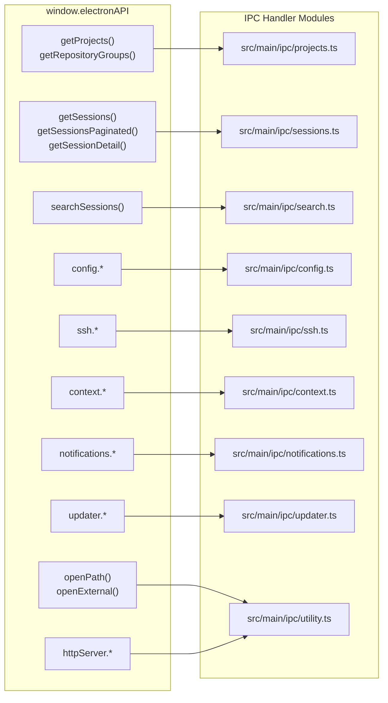
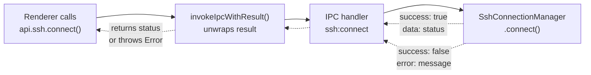
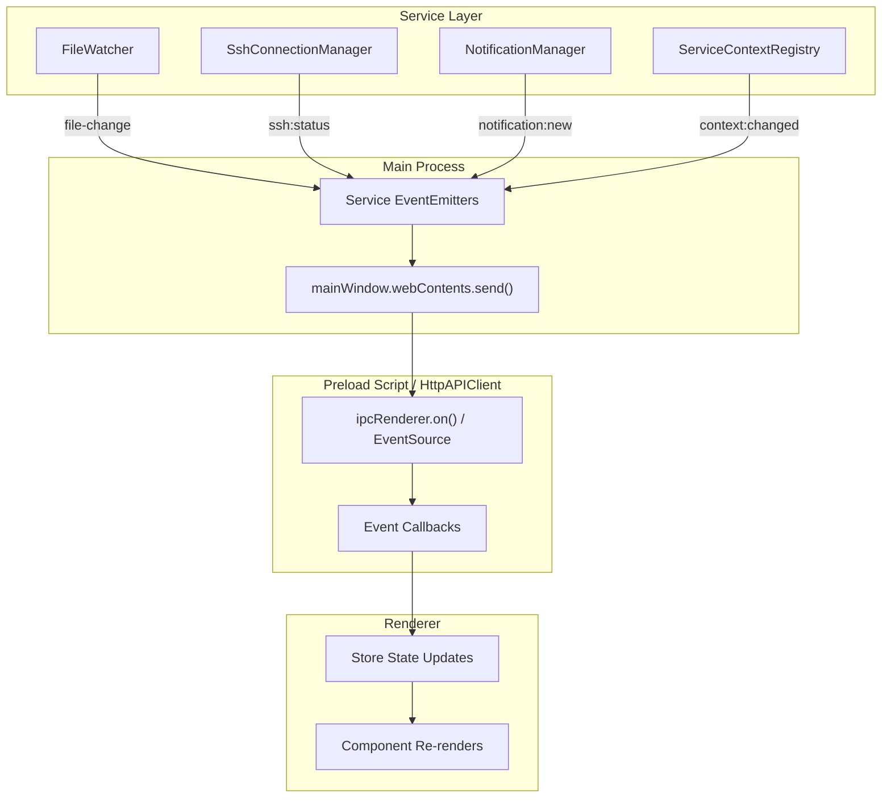
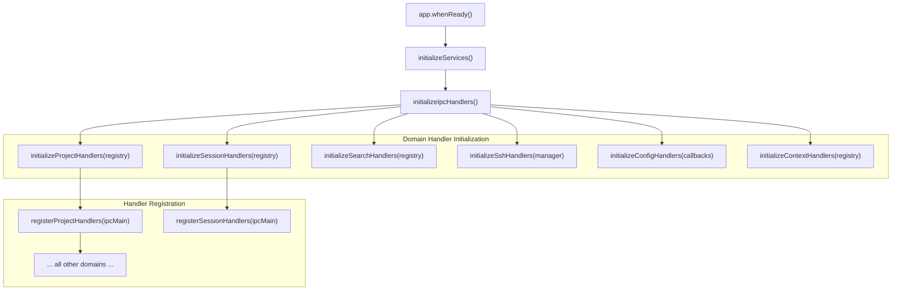
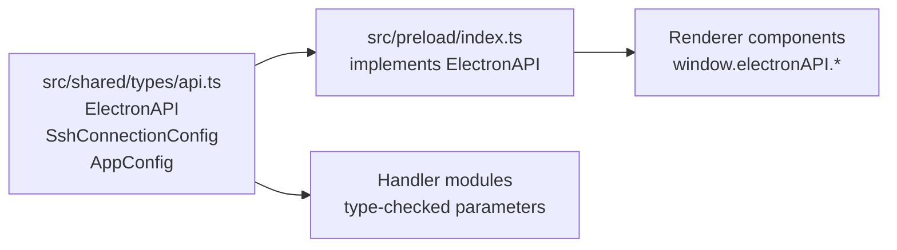

# API Reference

<details>
<summary>Relevant source files</summary>

The following files were used as context for generating this wiki page:

- [src/main/ipc/context.ts](src/main/ipc/context.ts)
- [src/main/ipc/handlers.ts](src/main/ipc/handlers.ts)
- [src/main/ipc/ssh.ts](src/main/ipc/ssh.ts)
- [src/preload/index.ts](src/preload/index.ts)
- [src/renderer/api/httpClient.ts](src/renderer/api/httpClient.ts)
- [src/renderer/store/slices/connectionSlice.ts](src/renderer/store/slices/connectionSlice.ts)
- [src/shared/types/api.ts](src/shared/types/api.ts)

</details>


This document provides a comprehensive overview of the API surface exposed by claude-devtools. The API enables communication between the renderer process (React UI) and the main process (Node.js services) through a type-safe IPC bridge or an optional HTTP sidecar server.

**Scope**: This page covers the overall API architecture, domain organization, and error handling patterns. For detailed method signatures and parameters, see:
- [ElectronAPI Interface](#14.1) — Complete reference of `window.electronAPI` methods and sub-APIs
- [IPC Handler Reference](#14.2) — All IPC channels, their parameters, and return types
- [Service Context API](#14.3) — ServiceContextRegistry, FileSystemProvider, and context lifecycle
- [Path Utilities](#14.4) — Path encoding/decoding functions and project ID management

For information about how the IPC layer fits into the overall architecture, see [IPC Communication Layer](#3.3).

---

## API Architecture

The API follows Electron's security model with three distinct layers that enforce process isolation while maintaining type safety. Additionally, an `HttpAPIClient` allows the renderer to communicate via standard HTTP/SSE when running in browser mode.

### Three-Layer Communication Model

```mermaid
graph TB
    subgraph "Renderer Process (React)"
        ["React Components"]
        ["Zustand Store Actions"]
        ["window.electronAPI"]
    end
    
    subgraph "Preload Script (Security Boundary)"
        ["contextBridge.exposeInMainWorld()"]
        ["invokeIpcWithResult<T>()"]
        ["EventListeners"]
    end
    
    subgraph "Main Process (Node.js)"
        ["ipcMain.handle()"]
        
        subgraph "Handler Modules"
            SSHHandlers["src/main/ipc/ssh.ts"]
            ConfigHandlers["src/main/ipc/config.ts"]
            ContextHandlers["src/main/ipc/context.ts"]
            ProjectHandlers["src/main/ipc/projects.ts"]
            SessionHandlers["src/main/ipc/sessions.ts"]
            NotificationHandlers["src/main/ipc/notifications.ts"]
        end
        
        subgraph "Service Layer"
            SshManager["SshConnectionManager"]
            ConfigManager["ConfigManager"]
            Registry["ServiceContextRegistry"]
            ProjectScanner["ProjectScanner"]
            NotifManager["NotificationManager"]
        end
    end
    
    ["React Components"] --> ["Zustand Store Actions"]
    ["Zustand Store Actions"] --> ["window.electronAPI"]
    ["window.electronAPI"] --> ["contextBridge.exposeInMainWorld()"]
    ["contextBridge.exposeInMainWorld()"] --> ["invokeIpcWithResult<T>()"]
    ["contextBridge.exposeInMainWorld()"] --> ["EventListeners"]
    
    ["invokeIpcWithResult<T>()"] --> ["ipcMain.handle()"]
    ["EventListeners"] -.->|"listen"| ["ipcMain.handle()"]
    
    ["ipcMain.handle()"] --> SSHHandlers
    ["ipcMain.handle()"] --> ConfigHandlers
    ["ipcMain.handle()"] --> ContextHandlers
    ["ipcMain.handle()"] --> ProjectHandlers
    ["ipcMain.handle()"] --> SessionHandlers
    ["ipcMain.handle()"] --> NotificationHandlers
    
    SSHHandlers --> SshManager
    ConfigHandlers --> ConfigManager
    ContextHandlers --> Registry
    ProjectHandlers --> Registry
    SessionHandlers --> Registry
    NotificationHandlers --> NotifManager
```

**Sources**: [src/preload/index.ts:1-449](), [src/main/ipc/handlers.ts:1-123](), [src/renderer/api/httpClient.ts:46-175]()

### Security Boundary

The preload script uses `contextBridge.exposeInMainWorld()` to expose a controlled API surface to the renderer. This ensures the renderer cannot directly access Node.js or Electron APIs.

```typescript
// Preload exposes only specific methods
contextBridge.exposeInMainWorld('electronAPI', electronAPI);
```

**Sources**: [src/preload/index.ts:448]()

---

## Domain Organization

The API is organized into functional domains, each with its own IPC handler module and namespace in the `electronAPI` object.

### API Domain Overview



**Sources**: [src/main/ipc/handlers.ts:64-101](), [src/shared/types/api.ts:307-408]()

### Domain Summary Table

| Domain | Namespace | Purpose | Handler Module |
|--------|-----------|---------|----------------|
| **Projects** | Top-level methods | Project and repository listing | `src/main/ipc/projects.ts` |
| **Sessions** | Top-level methods | Session CRUD, pagination, detail views | `src/main/ipc/sessions.ts` |
| **Search** | `searchSessions()` | Cross-session search | `src/main/ipc/search.ts` |
| **Config** | `config.*` | Application settings, triggers, Claude root | `src/main/ipc/config.ts` |
| **SSH** | `ssh.*` | SSH connection lifecycle | `src/main/ipc/ssh.ts` |
| **Context** | `context.*` | Context switching (local/SSH) | `src/main/ipc/context.ts` |
| **Notifications** | `notifications.*` | Error notification CRUD | `src/main/ipc/notifications.ts` |
| **Updater** | `updater.*` | Auto-update checks and downloads | `src/main/ipc/updater.ts` |
| **Shell** | `openPath()`, `openExternal()` | File system and URL opening | `src/main/ipc/utility.ts` |
| **HTTP Server** | `httpServer.*` | Sidecar server control | `src/main/ipc/utility.ts` |
| **Window** | `windowControls.*` | Window minimize/maximize/close | `src/main/ipc/window.ts` |

**Sources**: [src/preload/index.ts:122-445](), [src/shared/types/api.ts:52-408]()

---

## Error Handling Pattern

All IPC handlers return a standardized `IpcResult<T>` structure to provide consistent error handling across the API boundary.

### IpcResult<T> Structure

```typescript
interface IpcResult<T> {
  success: boolean;
  data?: T;
  error?: string;
}
```

**Sources**: [src/preload/index.ts:85-89]()

### Type-Safe Error Unwrapping

The preload script provides `invokeIpcWithResult<T>()` to automatically unwrap `IpcResult<T>` responses and throw errors when `success: false`:

```typescript
async function invokeIpcWithResult<T>(channel: string, ...args: unknown[]): Promise<T> {
  const result = (await ipcRenderer.invoke(channel, ...args)) as IpcResult<T>;
  if (!result.success) {
    throw new Error(result.error ?? 'Unknown error');
  }
  return result.data as T;
}
```

**Sources**: [src/preload/index.ts:103-109]()

### Handler Implementation Pattern



**Example handler implementation**:

```typescript
ipcMain.handle(SSH_CONNECT, async (_event, config: SshConnectionConfig) => {
  try {
    await connectionManager.connect(config);
    // ... create SSH context ...
    return { success: true, data: connectionManager.getStatus() };
  } catch (err) {
    const message = err instanceof Error ? err.message : String(err);
    return { success: false, error: message };
  }
});
```

**Sources**: [src/main/ipc/ssh.ts:70-116](), [src/preload/index.ts:217-295]()

---

## Event Broadcasting

In addition to request-response IPC, the API supports one-way event broadcasting from the main process to the renderer for real-time updates via `ipcRenderer.on` or Server-Sent Events (SSE) in browser mode.

### Event Flow Architecture



**Sources**: [src/main/index.ts:105-139](), [src/preload/index.ts:318-346](), [src/renderer/api/httpClient.ts:61-86]()

### Event Types and Channels

| Event Channel | Payload | Emitted By | Purpose |
|---------------|---------|------------|---------|
| `file-change` | `IpcFileChangePayload` | `FileWatcher` | New session file or content update |
| `todo-change` | `IpcFileChangePayload` | `FileWatcher` | Checklist item state change |
| `ssh:status` | `SshConnectionStatus` | `SshConnectionManager` | Connection state change |
| `context:changed` | `ContextInfo` | `ServiceContextRegistry` | Active context switched |
| `notification:new` | `DetectedError` | `NotificationManager` | New error notification |
| `notification:updated` | `{ total, unreadCount }` | `NotificationManager` | Notification counts changed |
| `zoom:changed` | `number` | Main process | Window zoom factor changed |

**Sources**: [src/preload/index.ts:91-97](), [src/preload/index.ts:318-346](), [src/shared/types/api.ts:68-72]()

---

## Handler Registration Process

IPC handlers are registered during application startup through a centralized initialization function that wires domain logic to the `ipcMain` object.



**Handler registration code**:

```typescript
export function initializeIpcHandlers(
  registry: ServiceContextRegistry,
  updater: UpdaterService,
  sshManager: SshConnectionManager,
  contextCallbacks: { rewire: (context: ServiceContext) => void; ... }
): void {
  // Initialize domain handlers with dependencies
  initializeProjectHandlers(registry);
  initializeSessionHandlers(registry);
  // ... other domains ...
  
  // Register all handlers on ipcMain
  registerProjectHandlers(ipcMain);
  registerSessionHandlers(ipcMain);
  // ... other domains ...
}
```

**Sources**: [src/main/ipc/handlers.ts:64-101](), [src/main/ipc/ssh.ts:55-63](), [src/main/ipc/context.ts:38-44]()

---

## Type Safety Across Boundaries

The API maintains end-to-end type safety using shared TypeScript types defined in `src/shared/types/`.

### Type Flow Diagram



**Key type files**:
- `src/shared/types/api.ts` — API interface definitions [src/shared/types/api.ts:1-419]()
- `src/shared/types/notifications.ts` — Notification and config types
- `src/main/types/index.ts` — Main process data structures

---

## Usage Example

### Renderer Component Using the API

```typescript
// SSH connection from renderer store
const connectSsh = async (config: SshConnectionConfig): Promise<void> => {
  set({ connectionState: 'connecting' });
  
  try {
    // Call through electronAPI bridge
    const status = await api.ssh.connect(config);
    
    set({
      connectionMode: status.state === 'connected' ? 'ssh' : 'local',
      connectionState: status.state,
      connectedHost: status.host,
      activeContextId: `ssh-${config.host}`,
    });
  } catch (err) {
    set({
      connectionState: 'error',
      connectionError: err instanceof Error ? err.message : String(err),
    });
  }
};
```

**Sources**: [src/renderer/store/slices/connectionSlice.ts:65-129]()

### Event Listener Setup

```typescript
// Initialize event listeners at app startup
useEffect(() => {
  const cleanupFileChange = window.electronAPI.onFileChange((event) => {
    // Handle file change
  });
  
  const cleanupSshStatus = window.electronAPI.ssh.onStatus((_, status) => {
    setConnectionStatus(status.state, status.host, status.error);
  });
  
  return () => {
    cleanupFileChange();
    cleanupSshStatus();
  };
}, []);
```

**Sources**: [src/preload/index.ts:318-325](), [src/preload/index.ts:394-405]()

---

## Key File References

### Type Definitions
- [src/shared/types/api.ts:1-419]() — Complete API type definitions
- [src/shared/types/notifications.ts]() — Notification types
- [src/main/types/index.ts]() — Main process data structures

### Preload & Client
- [src/preload/index.ts:122-448]() — ElectronAPI implementation
- [src/renderer/api/httpClient.ts:46-175]() — HTTP-based API client for browser mode

### IPC Handlers
- [src/main/ipc/handlers.ts:1-123]() — Handler orchestration
- [src/main/ipc/ssh.ts:1-227]() — SSH connection handlers
- [src/main/ipc/context.ts:1-97]() — Context switching handlers
- [src/main/ipc/projects.ts]() — Project listing handlers
- [src/main/ipc/sessions.ts]() — Session CRUD handlers
- [src/main/ipc/notifications.ts]() — Notification handlers

For detailed documentation of specific API methods and their parameters, see the sub-pages:
- [ElectronAPI Interface](#14.1) — Method signatures and return types
- [IPC Handler Reference](#14.2) — Channel names and handler implementations
- [Service Context API](#14.3) — Context management and file system abstraction
- [Path Utilities](#14.4) — Path encoding/decoding functions
