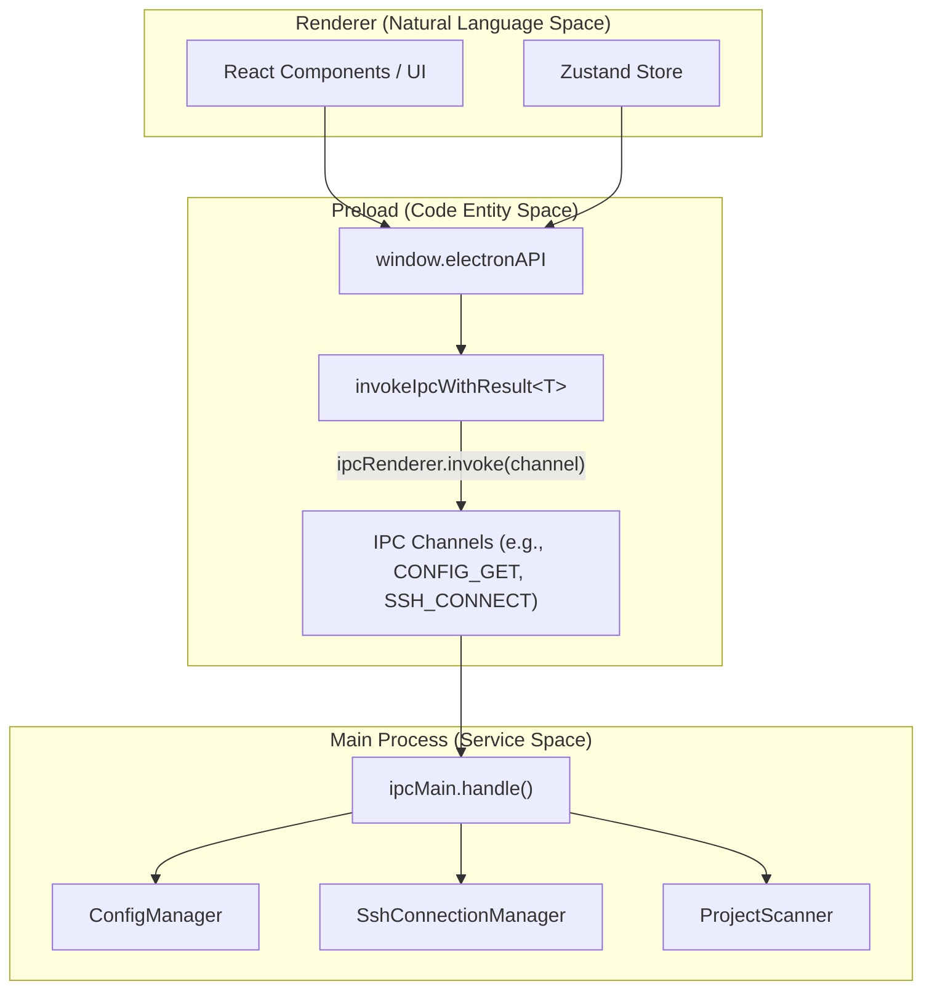
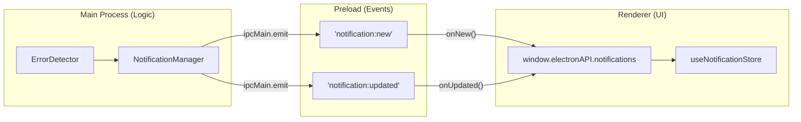

# ElectronAPI Interface

<details>
<summary>Relevant source files</summary>

The following files were used as context for generating this wiki page:

- [src/preload/index.ts](src/preload/index.ts)
- [src/renderer/api/httpClient.ts](src/renderer/api/httpClient.ts)
- [src/shared/types/api.ts](src/shared/types/api.ts)

</details>


This page provides a complete reference for the `window.electronAPI` interface exposed to the renderer process. This API serves as the primary bridge between the React UI and Node.js services in the main process, enabling secure inter-process communication through Electron's `contextBridge`.

For information about IPC handler implementation in the main process, see [IPC Handler Reference](14.2). For context management APIs, see [Service Context API](14.3).

## Purpose and Architecture

The `ElectronAPI` interface is defined in [src/shared/types/api.ts:305-412]() and implemented in [src/preload/index.ts:128-449](). It provides type-safe access to all main process functionality while maintaining Electron's security model by preventing direct access to Node.js APIs.

The application also provides an alternative implementation, `HttpAPIClient`, in [src/renderer/api/httpClient.ts:46-523](). This class implements the same `ElectronAPI` interface but uses `fetch` and Server-Sent Events (SSE) instead of Electron IPC, allowing the UI to run in a standard web browser when connected to the optional sidecar server.

The API is organized into several sub-namespaces:
- **Core methods**: Session and project data retrieval
- **`notifications`**: Error detection and notification management
- **`config`**: Application settings and configuration
- **`ssh`**: Remote SSH connection management
- **`context`**: Context switching (local/SSH)
- **`updater`**: Auto-update functionality
- **`session`**: Navigation and deep linking
- **`windowControls`**: Platform-specific window operations
- **`httpServer`**: Optional HTTP sidecar server control

**Sources:** [src/preload/index.ts:1-449](), [src/shared/types/api.ts:1-419](), [src/renderer/api/httpClient.ts:46-75]()

## API Exposure Mechanism

The following diagram illustrates how the `ElectronAPI` bridges the "Natural Language Space" (UI interactions) to the "Code Entity Space" (IPC channels and services).

### Bridge to Code Entities: IPC Mapping

**Sources:** [src/preload/index.ts:128-449](), [src/preload/constants/ipcChannels.ts:1-57]()

## IPC Result Pattern

All IPC operations that can fail use the `IpcResult<T>` wrapper for consistent error handling. This structure ensures that errors occurring in the Node.js main process are correctly propagated to the React UI as catchable JavaScript errors.

```typescript
interface IpcResult<T> {
  success: boolean;
  data?: T;
  error?: string;
}
```

The `invokeIpcWithResult<T>()` helper in the preload script automatically unwraps this structure. If `success` is false, it throws an `Error` using the string provided in the `error` field; otherwise, it returns the typed `data`.

**Sources:** [src/preload/index.ts:85-109]()

## Core Session and Project Methods

### Session Data Retrieval

| Method | Parameters | Return Type | Description |
|--------|-----------|-------------|-------------|
| `getProjects()` | none | `Promise<Project[]>` | List all discovered projects [src/preload/index.ts:130]() |
| `getSessions(projectId)` | `projectId: string` | `Promise<Session[]>` | Get all sessions for a project [src/preload/index.ts:131]() |
| `getSessionsPaginated(projectId, cursor, limit?, options?)` | `projectId: string`<br/>`cursor: string \| null`<br/>`limit?: number`<br/>`options?: SessionsPaginationOptions` | `Promise<PaginatedSessionsResult>` | Paginated session list with cursor-based pagination [src/preload/index.ts:132-137]() |
| `searchSessions(projectId, query, maxResults?)` | `projectId: string`<br/>`query: string`<br/>`maxResults?: number` | `Promise<SearchSessionsResult>` | Search sessions by content [src/preload/index.ts:138-139]() |
| `searchAllProjects(query, maxResults?)` | `query: string`<br/>`maxResults?: number` | `Promise<SearchSessionsResult>` | Global cross-project search [src/preload/index.ts:140-141]() |
| `getSessionDetail(projectId, sessionId)` | `projectId: string`<br/>`sessionId: string` | `Promise<SessionDetail \| null>` | Full session conversation detail [src/preload/index.ts:142-143]() |
| `getSessionMetrics(projectId, sessionId)` | `projectId: string`<br/>`sessionId: string` | `Promise<SessionMetrics \| null>` | Token usage and timing metrics [src/preload/index.ts:144-145]() |
| `getWaterfallData(projectId, sessionId)` | `projectId: string`<br/>`sessionId: string` | `Promise<WaterfallData \| null>` | Waterfall chart data for token usage [src/preload/index.ts:146-147]() |

**Sources:** [src/preload/index.ts:128-153](), [src/shared/types/api.ts:307-335]()

### Repository and Worktree Methods

The system supports Git worktrees by grouping projects by their underlying repository.

| Method | Parameters | Return Type | Description |
|--------|-----------|-------------|-------------|
| `getRepositoryGroups()` | none | `Promise<RepositoryGroup[]>` | Git repository grouping with worktree support [src/preload/index.ts:156]() |
| `getWorktreeSessions(worktreeId)` | `worktreeId: string` | `Promise<Session[]>` | Sessions for a specific worktree [src/preload/index.ts:157-158]() |

**Sources:** [src/preload/index.ts:156-158](), [src/shared/types/api.ts:338-339]()

## Notifications Sub-API

The `notifications` sub-API manages error detection notifications and provides real-time updates through IPC events.

### Bridge to Code Entities: Notification Flow

**Sources:** [src/preload/index.ts:179-213](), [src/shared/types/api.ts:61-73]()

### Notifications Methods

| Method | Parameters | Return Type | Description |
|--------|-----------|-------------|-------------|
| `notifications.get(options?)` | `{ limit?: number, offset?: number }` | `Promise<NotificationsResult>` | Returns paginated notifications [src/preload/index.ts:180-181]() |
| `notifications.markRead(id)` | `id: string` | `Promise<boolean>` | Mark a single notification as read [src/preload/index.ts:182]() |
| `notifications.markAllRead()` | none | `Promise<boolean>` | Mark all notifications as read [src/preload/index.ts:183]() |
| `notifications.delete(id)` | `id: string` | `Promise<boolean>` | Delete a single notification [src/preload/index.ts:184]() |
| `notifications.getUnreadCount()` | none | `Promise<number>` | Get count for badge display [src/preload/index.ts:186]() |

**Sources:** [src/preload/index.ts:179-213](), [src/shared/types/api.ts:61-73]()

## Config Sub-API

The `config` sub-API manages application settings, notification triggers, and Claude root detection.

### Configuration and Trigger Methods

| Method | Parameters | Return Type | Description |
|--------|-----------|-------------|-------------|
| `config.get()` | none | `Promise<AppConfig>` | Get complete configuration object [src/preload/index.ts:217]() |
| `config.update(section, data)` | `section: string`<br/>`data: object` | `Promise<AppConfig>` | Update specific config section [src/preload/index.ts:218]() |
| `config.addTrigger(trigger)` | `trigger: Omit<NotificationTrigger, 'isBuiltin'>` | `Promise<AppConfig>` | Add custom notification trigger [src/preload/index.ts:227]() |
| `config.testTrigger(trigger)` | `trigger: NotificationTrigger` | `Promise<TriggerTestResult>` | Test trigger against sessions [src/preload/index.ts:232]() |
| `config.getClaudeRootInfo()` | none | `Promise<ClaudeRootInfo>` | Get resolved Claude root paths [src/preload/index.ts:236]() |
| `config.pinSession(projectId, sessionId)` | `projectId: string`<br/>`sessionId: string` | `Promise<void>` | Pin session to top [src/preload/index.ts:241]() |
| `config.hideSession(projectId, sessionId)` | `projectId: string`<br/>`sessionId: string` | `Promise<void>` | Hide session from list [src/preload/index.ts:245]() |

**Sources:** [src/preload/index.ts:216-295](), [src/shared/types/api.ts:82-119]()

## SSH Sub-API

The `ssh` sub-API manages remote SSH connections. It integrates with the local `~/.ssh/config` file to provide a seamless connection experience.

| Method | Parameters | Return Type | Description |
|--------|-----------|-------------|-------------|
| `ssh.connect(config)` | `config: SshConnectionConfig` | `Promise<SshConnectionStatus>` | Establish SSH connection [src/preload/index.ts:370]() |
| `ssh.disconnect()` | none | `Promise<SshConnectionStatus>` | Close active connection [src/preload/index.ts:371]() |
| `ssh.getState()` | none | `Promise<SshConnectionStatus>` | Get current connection state [src/preload/index.ts:372]() |
| `ssh.getConfigHosts()` | none | `Promise<SshConfigHostEntry[]>` | List hosts from `~/.ssh/config` [src/preload/index.ts:374]() |
| `ssh.resolveHost(alias)` | `alias: string` | `Promise<SshConfigHostEntry \| null>` | Resolve SSH config alias [src/preload/index.ts:375]() |
| `ssh.onStatus(callback)` | `(event, status: SshConnectionStatus) => void` | `() => void` | Listen for status changes [src/preload/index.ts:380-394]() |

**Sources:** [src/preload/index.ts:368-406](), [src/shared/types/api.ts:194-277]()

## Context Sub-API

The `context` sub-API manages the application's execution environment (Local vs. SSH).

| Method | Parameters | Return Type | Description |
|--------|-----------|-------------|-------------|
| `context.list()` | none | `Promise<ContextInfo[]>` | List available contexts [src/preload/index.ts:409]() |
| `context.getActive()` | none | `Promise<string>` | Get active context ID [src/preload/index.ts:410]() |
| `context.switch(contextId)` | `contextId: string` | `Promise<{ contextId: string }>` | Switch context [src/preload/index.ts:411]() |
| `context.onChanged(callback)` | `(event, data: ContextInfo) => void` | `() => void` | Listen for context switches [src/preload/index.ts:413-426]() |

**Sources:** [src/preload/index.ts:408-431](), [src/shared/types/api.ts:183-192]()

## Real-Time Event Listeners

The `ElectronAPI` provides several listeners for real-time filesystem and application events.

| Method | Callback Signature | Description |
|--------|-------------------|-------------|
| `onFileChange(callback)` | `(event: FileChangeEvent) => void` | Fires when session files change [src/preload/index.ts:304-318]() |
| `onTodoChange(callback)` | `(event: FileChangeEvent) => void` | Fires when `TODO.md` changes [src/preload/index.ts:320-334]() |
| `onZoomFactorChanged(cb)` | `(zoomFactor: number) => void` | Fires on window zoom changes [src/preload/index.ts:342-347]() |

**Sources:** [src/preload/index.ts:304-347](), [src/shared/types/api.ts:369-375]()

## Global Type Declaration

The `ElectronAPI` interface is globally typed via declaration merging in the `Window` interface, ensuring full TypeScript support across the renderer process.

```typescript
declare global {
  interface Window {
    electronAPI: ElectronAPI;
  }
}
```

**Sources:** [src/shared/types/api.ts:414-418]()
