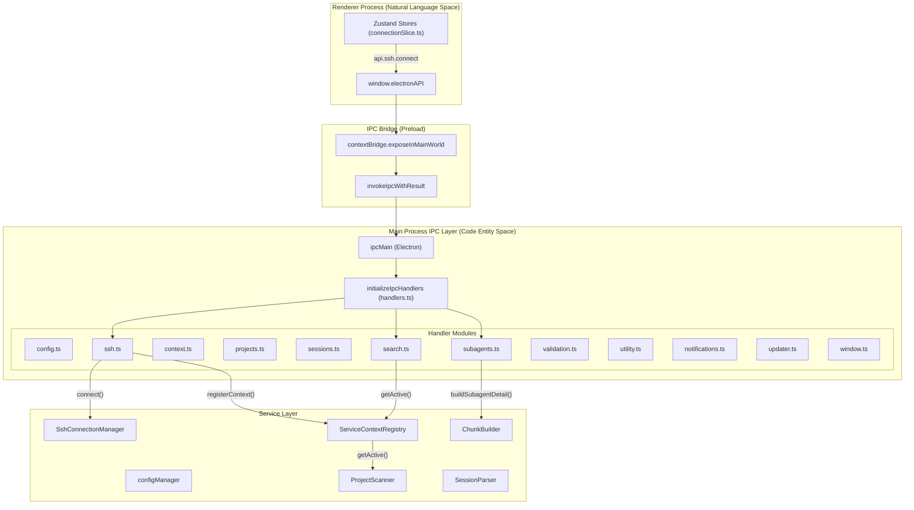
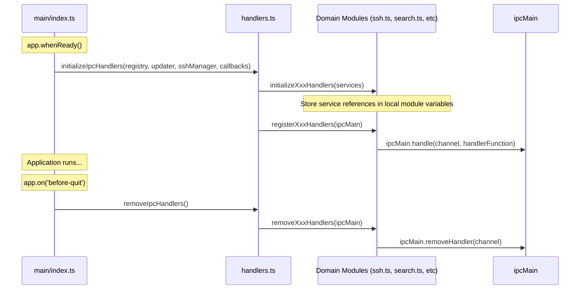

# IPC Handler Reference

Relevant source files

The following files were used as context for generating this wiki page:

- [src/main/http/search.ts](src/main/http/search.ts)
- [src/main/ipc/context.ts](src/main/ipc/context.ts)
- [src/main/ipc/handlers.ts](src/main/ipc/handlers.ts)
- [src/main/ipc/projects.ts](src/main/ipc/projects.ts)
- [src/main/ipc/search.ts](src/main/ipc/search.ts)
- [src/main/ipc/ssh.ts](src/main/ipc/ssh.ts)
- [src/main/ipc/subagents.ts](src/main/ipc/subagents.ts)
- [src/main/services/analysis/ChunkBuilder.ts](src/main/services/analysis/ChunkBuilder.ts)
- [src/main/services/analysis/SubagentDetailBuilder.ts](src/main/services/analysis/SubagentDetailBuilder.ts)
- [src/renderer/store/slices/connectionSlice.ts](src/renderer/store/slices/connectionSlice.ts)
- [src/renderer/utils/keyboardUtils.ts](src/renderer/utils/keyboardUtils.ts)
- [test/main/ipc/globalSearch.test.ts](test/main/ipc/globalSearch.test.ts)
- [test/renderer/utils/keyboardUtils.test.ts](test/renderer/utils/keyboardUtils.test.ts)

This page documents all IPC channels registered on the main process, their parameters, and return types. For the renderer-side API that invokes these handlers, see [ElectronAPI Interface](). For the service layer these handlers delegate to, see [Service Context API]().

---

## Overview

IPC handlers are organized into **domain modules** under `src/main/ipc/`, each responsible for a specific area of functionality. The `handlers.ts` orchestrator initializes and registers all handlers at application startup. [src/main/ipc/handlers.ts:1-14]()

All handlers follow a consistent pattern:
- Registered via `ipcMain.handle(channelName, handlerFunction)` [src/main/ipc/handlers.ts:87-98]()
- Return an `IpcResult<T>` object: `{ success: boolean; data?: T; error?: string }` [src/main/ipc/ssh.ts:110-114]()
- Validate input parameters before processing [src/main/ipc/subagents.ts:62-75]()
- Delegate to service layer for business logic [src/main/ipc/search.ts:75-79]()
- Handle errors gracefully and return descriptive error messages [src/main/ipc/ssh.ts:111-114]()

**Sources:** [src/main/ipc/handlers.ts:1-123]()

---

## Handler Architecture

The following diagram shows how handler modules connect IPC channels to main process services:

### IPC Data Flow and Entity Mapping

**Key Components:**
- **Handler Modules**: Domain-specific IPC handlers organized by functionality. [src/main/ipc/handlers.ts:1-14]()
- **ServiceContextRegistry**: Provides access to the active context's services (ProjectScanner, SessionParser, etc.). [src/main/ipc/handlers.ts:65]()
- **Singleton Services**: Global services not tied to a specific context, such as `SshConnectionManager` or `UpdaterService`. [src/main/ipc/handlers.ts:66-67]()

**Sources:** [src/main/ipc/handlers.ts:14-102](), [src/main/ipc/ssh.ts:41-43](), [src/main/ipc/subagents.ts:19-21]()

---

## Handler Registration Lifecycle

Handlers are registered during application initialization and removed on shutdown:

### Registration Sequence

**Initialization Steps:**

1. **Initialize** - Domain modules receive service instances and store them in module-level variables (e.g., `let registry: ServiceContextRegistry`). [src/main/ipc/ssh.ts:41-43](), [src/main/ipc/subagents.ts:25-27]()
2. **Register** - Each module registers its handlers with `ipcMain.handle()`. [src/main/ipc/ssh.ts:69-70](), [src/main/ipc/search.ts:32-35]()
3. **Cleanup** - On shutdown, all handlers are explicitly removed with `ipcMain.removeHandler()`. [src/main/ipc/handlers.ts:107-122](), [src/main/ipc/context.ts:92-96]()

**Sources:** [src/main/ipc/handlers.ts:64-122](), [src/main/ipc/ssh.ts:41-63](), [src/main/ipc/context.ts:38-44]()

---

## Common Patterns

### IpcResult Type
All handlers return a consistent result wrapper (often defined in domain types or inferred):
- **Success**: `{ success: true, data: resultData }` [src/main/ipc/ssh.ts:110]()
- **Failure**: `{ success: false, error: "Error message" }` [src/main/ipc/ssh.ts:114]()

### Error Handling Pattern
All handlers wrap operations in try-catch blocks to prevent main process crashes and provide feedback to the renderer. [src/main/ipc/search.ts:63-85](), [src/main/ipc/subagents.ts:61-121]()

### Channel Naming Convention
Channels typically follow a `domain:action` or `kebab-case` pattern:
- `ssh:connect`, `ssh:disconnect`, `ssh:getState` [src/main/ipc/ssh.ts:14-16]()
- `context:list`, `context:switch` [src/main/ipc/context.ts:13-15]()
- `search-sessions`, `search-all-projects` [src/main/ipc/search.ts:33-34]()
- `get-subagent-detail` [src/main/ipc/subagents.ts:33]()

---

## SSH Handlers

Manages SSH connection lifecycle and remote host configuration.

| Channel Name | Parameters | Return Type | Description |
|--------------|------------|-------------|-------------|
| `ssh:connect` | `config: SshConnectionConfig` | `IpcResult<SshConnectionStatus>` | Connects to SSH host, creates SSH `ServiceContext`, and switches active context. [src/main/ipc/ssh.ts:70-116]() |
| `ssh:disconnect` | None | `IpcResult<SshConnectionStatus>` | Disconnects SSH, destroys SSH context, and switches back to local. [src/main/ipc/ssh.ts:118-146]() |
| `ssh:getState` | None | `SshConnectionStatus` | Returns current connection state (connected, connecting, etc.). [src/main/ipc/ssh.ts:148-150]() |
| `ssh:test` | `config: SshConnectionConfig` | `IpcResult<TestResult>` | Tests connection without switching context. [src/main/ipc/ssh.ts:152-160]() |
| `ssh:getConfigHosts` | None | `IpcResult<SshConfigHostEntry[]>` | Parses `~/.ssh/config` and returns host entries. [src/main/ipc/ssh.ts:162-171]() |
| `ssh:resolveHost` | `alias: string` | `IpcResult<SshConfigHostEntry \| null>` | Resolves SSH config alias to full host entry. [src/main/ipc/ssh.ts:173-182]() |
| `ssh:saveLastConnection` | `config: SshLastConnection` | `IpcResult` | Persists last connection config to `configManager`. [src/main/ipc/ssh.ts:184-200]() |

**Sources:** [src/main/ipc/ssh.ts:14-21](), [src/main/ipc/ssh.ts:69-200]()

---

## Context Handlers

Manages context switching between local and SSH environments.

| Channel Name | Parameters | Return Type | Description |
|--------------|------------|-------------|-------------|
| `context:list` | None | `IpcResult<ContextInfo[]>` | Lists all registered contexts (local + any active SSH contexts). [src/main/ipc/context.ts:51-60]() |
| `context:getActive` | None | `IpcResult<string>` | Returns the active context ID (e.g., "local", "ssh-host"). [src/main/ipc/context.ts:62-71]() |
| `context:switch` | `contextId: string` | `IpcResult<{ contextId: string }>` | Switches to the specified context and re-wires file watchers. [src/main/ipc/context.ts:73-87]() |

**Sources:** [src/main/ipc/context.ts:13-15](), [src/main/ipc/context.ts:50-91]()

---

## Search Handlers

Cross-session search functionality.

| Channel Name | Parameters | Return Type | Description |
|--------------|------------|-------------|-------------|
| `search-sessions` | `projectId: string`, `query: string`, `maxResults?: number` | `SearchSessionsResult` | Searches across sessions in a specific project. [src/main/ipc/search.ts:57-85]() |
| `search-all-projects` | `query: string`, `maxResults?: number` | `SearchSessionsResult` | Searches across all discovered projects in the active context. [src/main/ipc/search.ts:91-111]() |

**Sources:** [src/main/ipc/search.ts:32-47](), [src/main/ipc/search.ts:57-111]()

---

## Subagents Handlers

Retrieves details for nested subagent sessions.

| Channel Name | Parameters | Return Type | Description |
|--------------|------------|-------------|-------------|
| `get-subagent-detail` | `projectId`, `sessionId`, `subagentId` | `SubagentDetail \| null` | Returns the full conversation and metrics for a subagent session. [src/main/ipc/subagents.ts:55-122]() |

**Implementation Detail:**
The handler uses `ChunkBuilder.buildSubagentDetail` to parse the subagent's specific JSONL file (located in the project's `subagents/` directory) and resolve any further nested subagents. [src/main/ipc/subagents.ts:97-105](), [src/main/services/analysis/SubagentDetailBuilder.ts:43-52]()

**Sources:** [src/main/ipc/subagents.ts:32-36](), [src/main/ipc/subagents.ts:55-122]()

---

## Handler Module Map

The following table maps handler modules to their primary service dependencies:

| Module | File Path | Primary Services |
|--------|-----------|------------------|
| SSH | `src/main/ipc/ssh.ts` | `SshConnectionManager`, `ServiceContextRegistry` [src/main/ipc/ssh.ts:41-43]() |
| Context | `src/main/ipc/context.ts` | `ServiceContextRegistry` [src/main/ipc/context.ts:26]() |
| Search | `src/main/ipc/search.ts` | `ProjectScanner` (via active context) [src/main/ipc/search.ts:73]() |
| Subagents | `src/main/ipc/subagents.ts` | `ChunkBuilder`, `SessionParser`, `SubagentResolver` [src/main/ipc/subagents.ts:80-81]() |
| Config | `src/main/ipc/config.ts` | `configManager` [src/main/ipc/handlers.ts:82-84]() |
| Projects | `src/main/ipc/projects.ts` | `ProjectScanner` [src/main/ipc/handlers.ts:75]() |
| Sessions | `src/main/ipc/sessions.ts` | `SessionParser` [src/main/ipc/handlers.ts:76]() |

**Sources:** [src/main/ipc/handlers.ts:74-84](), [src/main/ipc/ssh.ts:41-43](), [src/main/ipc/subagents.ts:80-81]()
