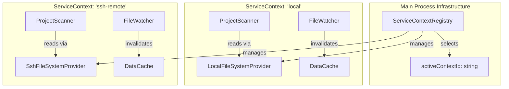
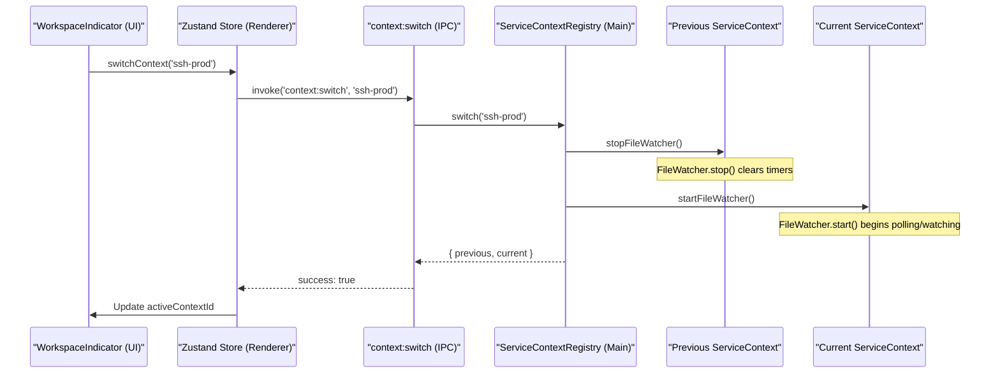

# Service Context API

<details>
<summary>Relevant source files</summary>

The following files were used as context for generating this wiki page:

- [src/main/services/discovery/ProjectPathResolver.ts](src/main/services/discovery/ProjectPathResolver.ts)
- [src/main/services/infrastructure/DataCache.ts](src/main/services/infrastructure/DataCache.ts)
- [src/main/services/infrastructure/FileSystemProvider.ts](src/main/services/infrastructure/FileSystemProvider.ts)
- [src/main/services/infrastructure/FileWatcher.ts](src/main/services/infrastructure/FileWatcher.ts)
- [src/main/services/infrastructure/ServiceContext.ts](src/main/services/infrastructure/ServiceContext.ts)
- [src/main/services/infrastructure/ServiceContextRegistry.ts](src/main/services/infrastructure/ServiceContextRegistry.ts)
- [src/main/services/infrastructure/SshFileSystemProvider.ts](src/main/services/infrastructure/SshFileSystemProvider.ts)
- [src/main/services/infrastructure/index.ts](src/main/services/infrastructure/index.ts)
- [src/renderer/components/common/WorkspaceIndicator.tsx](src/renderer/components/common/WorkspaceIndicator.tsx)

</details>


## Purpose and Scope

The **Service Context API** provides the core architectural abstraction for managing isolated execution environments in `claude-devtools`. A **Service Context** encapsulates a complete stack of services (project scanner, session parser, file watcher, etc.) bound to a specific filesystem provider.

The **ServiceContextRegistry** manages these contexts, enabling the application to switch seamlessly between local development environments and remote environments accessed via SSH. This system ensures that data caching, file watching, and project discovery remain isolated and consistent for each workspace.

**Sources:** [src/main/services/infrastructure/ServiceContext.ts:1-12](), [src/main/services/infrastructure/ServiceContextRegistry.ts:1-17]()

---

## Core Components

### ServiceContext
A `ServiceContext` is a container class that bundles all session-data services for a single workspace. It manages the lifecycle of these services, ensuring they are started, stopped, and disposed of together.

| Service | Responsibility |
| :--- | :--- |
| `ProjectScanner` | Discovers `.jsonl` session files and organizes them into projects. |
| `SessionParser` | Reads and transforms raw session data into structured messages. |
| `FileWatcher` | Monitors the filesystem for real-time updates and invalidates caches. |
| `DataCache` | An LRU cache with TTL for parsed session metadata to improve performance. |
| `SubagentResolver` | Resolves links between parent sessions and nested subagents. |
| `ChunkBuilder` | Reconstructs conversation history from incremental session logs. |

**Sources:** [src/main/services/infrastructure/ServiceContext.ts:62-77](), [src/main/services/infrastructure/ServiceContext.ts:88-119]()

### ServiceContextRegistry
The `ServiceContextRegistry` is a coordinator that tracks all registered contexts (one `local` context and potentially multiple `ssh` contexts). It enforces the rule that the `local` context is permanent and cannot be destroyed.

**Key Responsibilities:**
- **Context Tracking:** Maintains a `Map<string, ServiceContext>` of all available environments.
- **Active Context Management:** Tracks the `activeContextId` and handles the logic for switching between them.
- **Lifecycle Enforcement:** Ensures that when switching, the old context's `FileWatcher` is paused and the new one is resumed.

**Sources:** [src/main/services/infrastructure/ServiceContextRegistry.ts:31-42](), [src/main/services/infrastructure/ServiceContextRegistry.ts:119-146]()

### FileSystemProvider
This abstract interface allows services like `ProjectScanner` and `SessionParser` to operate without knowing if they are interacting with a local disk or a remote server.

- **`LocalFileSystemProvider`**: Uses standard Node.js `fs` modules.
- **`SshFileSystemProvider`**: Wraps an `ssh2` SFTP connection, providing retries for transient network failures.

**Sources:** [src/main/services/infrastructure/FileSystemProvider.ts:60-81](), [src/main/services/infrastructure/SshFileSystemProvider.ts:23-32]()

---

## Architecture Diagrams

### Context Management and Data Flow
This diagram illustrates how the `ServiceContextRegistry` bridges the gap between the high-level IPC handlers and the low-level service instances.


**Sources:** [src/main/services/infrastructure/ServiceContextRegistry.ts:31-33](), [src/main/services/infrastructure/ServiceContext.ts:62-77]()

### Context Switching Sequence
This diagram shows the "Natural Language Space" request to switch workspaces being translated into "Code Entity Space" method calls.


**Sources:** [src/main/services/infrastructure/ServiceContextRegistry.ts:119-146](), [src/renderer/components/common/WorkspaceIndicator.tsx:18-25](), [src/main/services/infrastructure/FileWatcher.ts:148-195]()

---

## FileSystem Abstraction

The `FileSystemProvider` interface ensures that all session-data services are provider-agnostic.

### Interface Definition
The interface covers basic read-only operations and stream creation required for parsing JSONL files.

| Method | Description |
| :--- | :--- |
| `exists(path)` | Checks for file/directory existence. |
| `readFile(path)` | Reads file content as a string (UTF-8). |
| `readdir(path)` | Lists directory entries as `FsDirent` objects. |
| `stat(path)` | Returns file size and modification timestamps. |
| `createReadStream(path)` | Returns a `Readable` stream for incremental parsing. |

**Sources:** [src/main/services/infrastructure/FileSystemProvider.ts:60-81]()

### SSH Implementation Details
The `SshFileSystemProvider` includes specific logic for handling the nuances of SFTP:
- **Error Classification:** Categorizes SFTP errors into `not_found`, `transient`, or `permanent`.
- **Retry Logic:** Automatically retries `transient` errors (e.g., SSH code 4) with exponential backoff.
- **Stream Wrapping:** Wraps raw SFTP streams in a Node.js `PassThrough` to ensure compatibility with standard parsing utilities.

**Sources:** [src/main/services/infrastructure/SshFileSystemProvider.ts:21-25](), [src/main/services/infrastructure/SshFileSystemProvider.ts:34-55](), [src/main/services/infrastructure/SshFileSystemProvider.ts:178-200]()

---

## Lifecycle and State Management

### Context Registration
Contexts are typically registered during application startup (for `local`) or when an SSH connection is successfully established.

[src/main/services/infrastructure/ServiceContextRegistry.ts:48-55]()
```typescript
registerContext(context: ServiceContext): void {
  if (this.contexts.has(context.id)) {
    throw new Error(`Context already registered: ${context.id}`);
  }
  this.contexts.set(context.id, context);
}
```

### FileWatcher Integration
The `FileWatcher` behavior changes based on the `FileSystemProvider` type. For `local` contexts, it uses native `fs.watch`. For `ssh` contexts, it falls back to a polling mechanism.

- **SSH Polling:** Polls the remote filesystem every 3000ms (`SSH_POLL_INTERVAL_MS`).
- **Catch-up Scan:** Periodically performs a full scan every 30s to detect events missed by the OS.

**Sources:** [src/main/services/infrastructure/FileWatcher.ts:73-82](), [src/main/services/infrastructure/FileWatcher.ts:137-141]()

### Data Caching
Each context maintains its own `DataCache`. This prevents cross-contamination of session data between different workspaces. The cache uses a composite key (e.g., `projectId/sessionId`) and is invalidated by the `FileWatcher` whenever a corresponding file change is detected.

**Sources:** [src/main/services/infrastructure/DataCache.ts:27-40](), [src/main/services/infrastructure/DataCache.ts:198-200]()

---

## Summary Table: Service Dependencies

| Service | Dependency | Reason |
| :--- | :--- | :--- |
| `ProjectScanner` | `FileSystemProvider` | To list directories and check file existence. |
| `SessionParser` | `ProjectScanner` | To resolve relative paths and project metadata. |
| `FileWatcher` | `DataCache` | To invalidate specific cache entries on file change. |
| `FileWatcher` | `FileSystemProvider` | To perform polling or stat checks on remote files. |
| `ServiceContext` | All Services | To bundle and manage the aggregate lifecycle. |

**Sources:** [src/main/services/infrastructure/ServiceContext.ts:91-116]()
