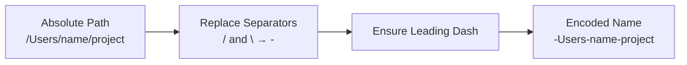
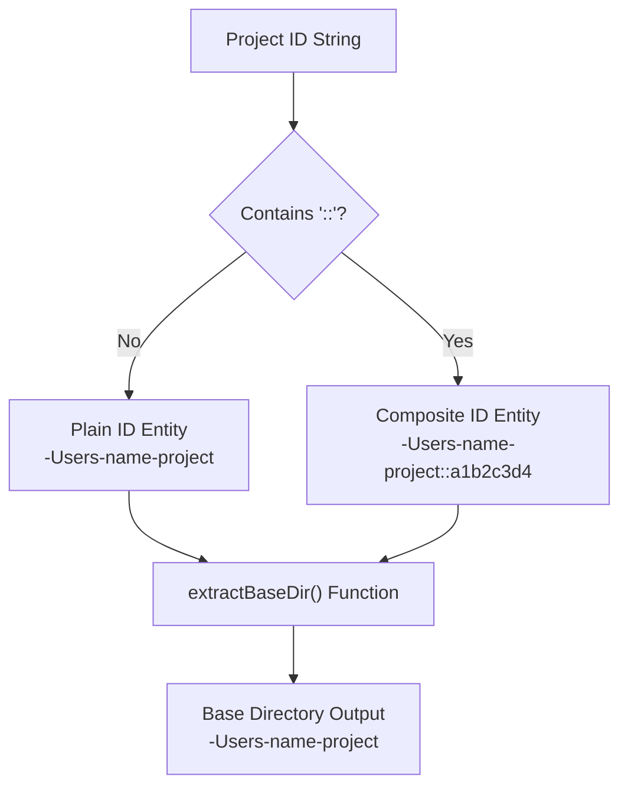
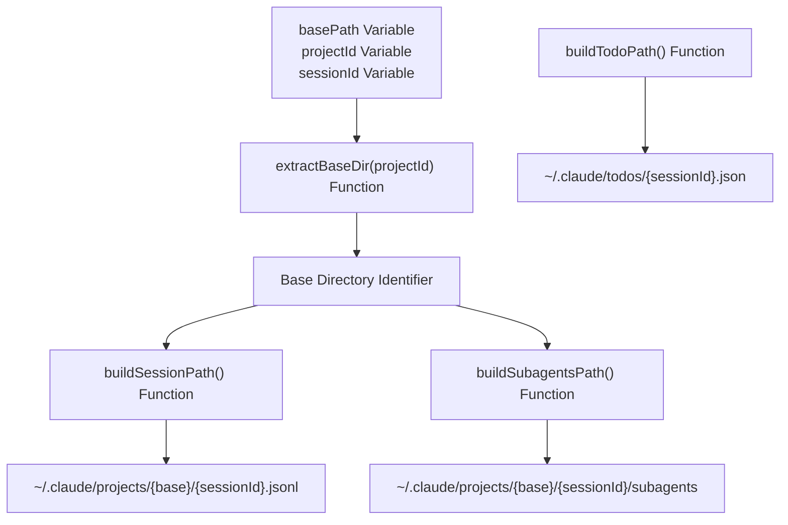
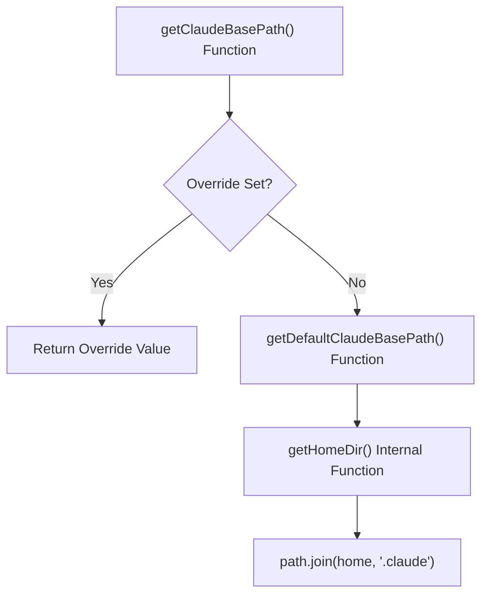
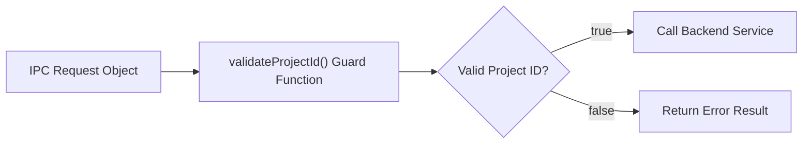

# Path Utilities

<details>
<summary>Relevant source files</summary>

The following files were used as context for generating this wiki page:

- [src/main/ipc/config.ts](src/main/ipc/config.ts)
- [src/main/services/error/ErrorTriggerChecker.ts](src/main/services/error/ErrorTriggerChecker.ts)
- [src/main/utils/pathDecoder.ts](src/main/utils/pathDecoder.ts)
- [src/main/utils/pathValidation.ts](src/main/utils/pathValidation.ts)
- [src/renderer/components/notifications/NotificationRow.tsx](src/renderer/components/notifications/NotificationRow.tsx)
- [test/main/ipc/guards.test.ts](test/main/ipc/guards.test.ts)
- [test/main/utils/pathDecoder.test.ts](test/main/utils/pathDecoder.test.ts)
- [test/mocks/electronAPI.ts](test/mocks/electronAPI.ts)

</details>


This page documents the path manipulation functions provided by `src/main/utils/pathDecoder.ts`. These utilities handle encoding/decoding Claude Code's directory naming scheme, validating project IDs, constructing file paths, and managing the Claude base directory configuration.

For conceptual understanding of how Claude Code's path encoding works and why composite project IDs exist, see [Path Encoding & Project IDs](). For usage in the context system, see [Service Context API]().

## Core Encoding and Decoding

The fundamental operations for converting between absolute filesystem paths and Claude Code's directory naming format.

### Encoding Flow

Title: Path Encoding Logic


**Sources:** [src/main/utils/pathDecoder.ts:27-36]()

### `encodePath(absolutePath: string): string`

Converts an absolute filesystem path into Claude Code's directory naming format by replacing all path separators (`/` and `\`) with dashes [src/main/utils/pathDecoder.ts:32-32]().

**Parameters:**
- `absolutePath` - The absolute path to encode (e.g., `/Users/username/projectname`) [src/main/utils/pathDecoder.ts:27-27]().

**Returns:** The encoded directory name (e.g., `-Users-username-projectname`) [src/main/utils/pathDecoder.ts:35-36]().

**Examples:**
```typescript
encodePath('/Users/username/projectname')
// Returns: '-Users-username-projectname'

encodePath('C:\\Users\\username\\projectname')
// Returns: '-C:-Users-username-projectname'
```

**Platform Support:**

| Platform | Input Example | Encoded Output |
|----------|---------------|----------------|
| macOS/Linux | `/Users/name/project` | `-Users-name-project` |
| Windows | `C:\Users\name\project` | `-C:-Users-name-project` |
| WSL | `/home/user/project` | `-home-user-project` |

**Sources:** [src/main/utils/pathDecoder.ts:20-36](), [test/main/utils/pathDecoder.test.ts:18-44]()

### `decodePath(encodedName: string): string`

Decodes a directory name back to its original path [src/main/utils/pathDecoder.ts:45-76](). **Important:** This is lossy for paths containing dashes [src/main/utils/pathDecoder.ts:11-13](). For accurate path resolution, use `extractCwd()` from the JSONL parser to read the actual working directory from session files.

**Parameters:**
- `encodedName` - The encoded directory name (e.g., `-Users-username-projectname`) [src/main/utils/pathDecoder.ts:45-45]().

**Returns:** The decoded path (e.g., `/Users/username/projectname`) [src/main/utils/pathDecoder.ts:75-76]().

**Legacy Format Support:**
The function handles legacy Windows format (`C--Users-name-project`) where the drive separator is encoded as `--` without a leading dash [src/main/utils/pathDecoder.ts:52-58]().

**Examples:**
```typescript
decodePath('-Users-username-projectname')
// Returns: '/Users/username/projectname'

decodePath('-C:-Users-username-projectname')
// Returns: 'C:/Users/username/projectname'

// Legacy Windows format
decodePath('C--Users-username-projectname')
// Returns: 'C:/Users/username/projectname'
```

**Lossy Encoding Warning:**
```typescript
// Paths with dashes are ambiguous
encodePath('/Users/name/claude-devtools')
// Returns: '-Users-name-claude-devtools'

decodePath('-Users-name-claude-devtools')
// Returns: '/Users/name/claude/devtools' (WRONG!)
```

**Sources:** [src/main/utils/pathDecoder.ts:38-76](), [test/main/utils/pathDecoder.test.ts:46-82]()

### `extractProjectName(encodedName: string, cwdHint?: string): string`

Extracts the project name (last path segment) from an encoded directory name [src/main/utils/pathDecoder.ts:84-95](). When available, prefers the `cwdHint` parameter (actual filesystem path) since `decodePath` is lossy for paths containing dashes [src/main/utils/pathDecoder.ts:87-91]().

**Parameters:**
- `encodedName` - The encoded directory name [src/main/utils/pathDecoder.ts:84-84]().
- `cwdHint` - Optional actual filesystem path from session metadata [src/main/utils/pathDecoder.ts:84-84]().

**Returns:** The project name [src/main/utils/pathDecoder.ts:94-95]().

**Examples:**
```typescript
extractProjectName('-Users-username-projectname')
// Returns: 'projectname'

// Without cwdHint, dashes are decoded as slashes (lossy)
extractProjectName('-Users-name-claude-devtools')
// Returns: 'devtools'

// With cwdHint, the actual project name is preserved
extractProjectName('-Users-name-claude-devtools', '/Users/name/claude-devtools')
// Returns: 'claude-devtools'
```

**Sources:** [src/main/utils/pathDecoder.ts:79-95](), [test/main/utils/pathDecoder.test.ts:84-117]()

## Validation Functions

### `isValidEncodedPath(encodedName: string): boolean`

Validates whether a directory name follows Claude Code's encoding pattern [src/main/utils/pathDecoder.ts:124-160]().

**Validation Rules:**
1. Must start with `-` (indicates absolute path) [src/main/utils/pathDecoder.ts:136-138]() **OR** match legacy Windows format (`C--...`) [src/main/utils/pathDecoder.ts:131-133]().
2. May only contain: alphanumeric, underscores, dots, spaces, dashes, and optional colons [src/main/utils/pathDecoder.ts:143-146]().
3. Colon (`:`) allowed only for Windows drive notation at the beginning (e.g., `-C:-Users-name`) [src/main/utils/pathDecoder.ts:150-159]().

**Examples:**
```typescript
isValidEncodedPath('-Users-username-projectname')
// Returns: true

isValidEncodedPath('-C:-Users-username-projectname')
// Returns: true (Windows drive notation)

isValidEncodedPath('C--Users-username-projectname')
// Returns: true (legacy Windows format)

isValidEncodedPath('Users-username-projectname')
// Returns: false (missing leading dash)

isValidEncodedPath('-Users-name:project')
// Returns: false (misplaced colon)
```

**Sources:** [src/main/utils/pathDecoder.ts:118-160](), [test/main/utils/pathDecoder.test.ts:119-160]()

### `isValidProjectId(projectId: string): boolean`

Validates a project ID that may be either a plain encoded path or a composite subproject ID [src/main/utils/pathDecoder.ts:169-185]().

**Composite ID Format:** `{encodedPath}::{8-char-hex}` [src/main/utils/pathDecoder.ts:164-164]().

**Examples:**
```typescript
// Plain encoded path
isValidProjectId('-Users-name-project')
// Returns: true

// Composite ID with hash
isValidProjectId('-Users-name-project::a1b2c3d4')
// Returns: true

isValidProjectId('-Users-name-project::xyz')
// Returns: false (hash must be 8 hex characters)
```

**Sources:** [src/main/utils/pathDecoder.ts:169-185]()

## Composite Project ID Handling

Title: Project ID Structure Parsing


**Sources:** [src/main/utils/pathDecoder.ts:188-198]()

### `extractBaseDir(projectId: string): string`

Extracts the base directory (encoded path) from a project ID [src/main/utils/pathDecoder.ts:192-198](). For composite IDs (`{encoded}::{hash}`), returns only the encoded part [src/main/utils/pathDecoder.ts:195-195](). For plain IDs, returns the ID as-is [src/main/utils/pathDecoder.ts:197-197]().

This is essential for path construction functions that need the base directory regardless of whether the project ID is composite.

**Examples:**
```typescript
extractBaseDir('-Users-name-project')
// Returns: '-Users-name-project'

extractBaseDir('-Users-name-project::a1b2c3d4')
// Returns: '-Users-name-project'
```

**Usage:** Called internally by `buildSessionPath` and `buildSubagentsPath` to handle both plain and composite project IDs uniformly.

**Sources:** [src/main/utils/pathDecoder.ts:192-198]()

## Path Construction

These functions build absolute paths to various Claude Code artifacts, automatically handling composite project IDs.

### Path Construction Flow

Title: Artifact Path Generation


**Sources:** [src/main/utils/pathDecoder.ts:210-234]()

### `buildSessionPath(basePath: string, projectId: string, sessionId: string): string`

Constructs the absolute path to a session JSONL file [src/main/utils/pathDecoder.ts:210-216](). Handles composite project IDs by extracting the base directory [src/main/utils/pathDecoder.ts:214-214]().

**Parameters:**
- `basePath` - The base directory (typically from `getProjectsBasePath()`)
- `projectId` - The project ID (plain or composite)
- `sessionId` - The session ID

**Returns:** Absolute path to the session file [src/main/utils/pathDecoder.ts:215-215]().

**Examples:**
```typescript
buildSessionPath('/Users/name/.claude/projects', '-Users-name-project', 'abc123')
// Returns: '/Users/name/.claude/projects/-Users-name-project/abc123.jsonl'

// Handles composite IDs
buildSessionPath('/Users/name/.claude/projects', '-Users-name-project::a1b2c3d4', 'abc123')
// Returns: '/Users/name/.claude/projects/-Users-name-project/abc123.jsonl'
```

**Sources:** [src/main/utils/pathDecoder.ts:210-216](), [test/main/utils/pathDecoder.test.ts:182-194]()

### `buildSubagentsPath(basePath: string, projectId: string, sessionId: string): string`

Constructs the absolute path to a session's subagents directory [src/main/utils/pathDecoder.ts:218-224](). Handles composite project IDs by extracting the base directory [src/main/utils/pathDecoder.ts:222-222]().

**Parameters:**
- `basePath` - The base directory (typically from `getProjectsBasePath()`)
- `projectId` - The project ID (plain or composite)
- `sessionId` - The session ID

**Returns:** Absolute path to the subagents directory [src/main/utils/pathDecoder.ts:223-223]().

**Examples:**
```typescript
buildSubagentsPath('/Users/name/.claude/projects', '-Users-name-project', 'abc123')
// Returns: '/Users/name/.claude/projects/-Users-name-project/abc123/subagents'
```

**Sources:** [src/main/utils/pathDecoder.ts:218-224](), [test/main/utils/pathDecoder.test.ts:196-202]()

### `buildTodoPath(claudeBasePath: string, sessionId: string): string`

Constructs the absolute path to a session's task list file (stored in the `todos` directory) [src/main/utils/pathDecoder.ts:226-231]().

**Parameters:**
- `claudeBasePath` - The Claude base directory (from `getClaudeBasePath()`)
- `sessionId` - The session ID

**Returns:** Absolute path to the todo file [src/main/utils/pathDecoder.ts:230-230]().

**Examples:**
```typescript
buildTodoPath('/Users/name/.claude', 'abc123')
// Returns: '/Users/name/.claude/todos/abc123.json'
```

**Sources:** [src/main/utils/pathDecoder.ts:226-231](), [test/main/utils/pathDecoder.test.ts:204-210]()

## Claude Base Path Management

The Claude base path (typically `~/.claude`) can be overridden to support custom installations or WSL environments. The override is stored in a module-level variable [src/main/utils/pathDecoder.ts:239-239]().

### Base Path Resolution Flow

Title: Claude Directory Discovery


**Sources:** [src/main/utils/pathDecoder.ts:241-319]()

### `getClaudeBasePath(): string`

Returns the currently configured Claude base directory [src/main/utils/pathDecoder.ts:309-312](). Returns the override if set, otherwise returns `~/.claude`.

**Returns:** Absolute path to the Claude base directory [src/main/utils/pathDecoder.ts:311-311]().

**Examples:**
```typescript
// Default behavior
getClaudeBasePath()
// Returns: '/Users/name/.claude'

// After setting override
setClaudeBasePathOverride('/mnt/c/Users/name/.claude')
getClaudeBasePath()
// Returns: '/mnt/c/Users/name/.claude'
```

**Sources:** [src/main/utils/pathDecoder.ts:309-312]()

### `setClaudeBasePathOverride(claudeBasePath: string | null | undefined): void`

Overrides the Claude base directory [src/main/utils/pathDecoder.ts:294-305](). Pass `null` or `undefined` to return to auto-detection.

**Parameters:**
- `claudeBasePath` - The override path, or null to clear the override

**Normalization:**
- Trims whitespace
- Normalizes path separators
- Resolves to absolute path
- Removes trailing slashes (except root)
- Rejects non-absolute paths

**Examples:**
```typescript
// Set override
setClaudeBasePathOverride('/custom/path/.claude')

// Clear override
setClaudeBasePathOverride(null)

// Invalid paths are rejected (normalized to null)
setClaudeBasePathOverride('relative/path')  // Rejected
setClaudeBasePathOverride('')               // Rejected
```

**Sources:** [src/main/utils/pathDecoder.ts:294-305]()

### `getAutoDetectedClaudeBasePath(): string`

Returns the auto-detected Claude base path (`~/.claude`) without considering overrides [src/main/utils/pathDecoder.ts:259-263](). Useful for displaying the default path in UI.

**Returns:** `~/.claude` path [src/main/utils/pathDecoder.ts:262-262]().

**Sources:** [src/main/utils/pathDecoder.ts:259-263]()

### `getProjectsBasePath(): string`

Returns the projects directory path (`~/.claude/projects`) [src/main/utils/pathDecoder.ts:314-319](). Respects the base path override.

**Returns:** Absolute path to the projects directory [src/main/utils/pathDecoder.ts:318-318]().

**Sources:** [src/main/utils/pathDecoder.ts:314-319](), [test/main/utils/pathDecoder.test.ts:212-216]()

### `getTodosBasePath(): string`

Returns the todos directory path (`~/.claude/todos`) [src/main/utils/pathDecoder.ts:321-326](). Respects the base path override.

**Returns:** Absolute path to the todos directory [src/main/utils/pathDecoder.ts:325-325]().

**Sources:** [src/main/utils/pathDecoder.ts:321-326](), [test/main/utils/pathDecoder.test.ts:218-222]()

### Home Directory Resolution

The `getHomeDir()` function (private) resolves the user's home directory across platforms [src/main/utils/pathDecoder.ts:241-251]():

**Resolution Order:**
1. `$HOME` (POSIX) [src/main/utils/pathDecoder.ts:242-242]()
2. `$USERPROFILE` (Windows) [src/main/utils/pathDecoder.ts:243-243]()
3. `$HOMEDRIVE$HOMEPATH` (Windows fallback) [src/main/utils/pathDecoder.ts:244-244]()
4. `os.homedir()` (Node.js API) [src/main/utils/pathDecoder.ts:245-245]()
5. `/` (last resort) [src/main/utils/pathDecoder.ts:250-250]()

**Sources:** [src/main/utils/pathDecoder.ts:241-251]()

## Session ID Extraction

### `extractSessionId(filename: string): string`

Extracts the session ID from a JSONL filename by removing the `.jsonl` extension [src/main/utils/pathDecoder.ts:210-212]().

**Parameters:**
- `filename` - The filename (e.g., `abc123.jsonl`) [src/main/utils/pathDecoder.ts:210-210]().

**Returns:** The session ID (e.g., `abc123`) [src/main/utils/pathDecoder.ts:211-211]().

**Examples:**
```typescript
extractSessionId('abc123.jsonl')
// Returns: 'abc123'

extractSessionId('550e8400-e29b-41d4-a716-446655440000.jsonl')
// Returns: '550e8400-e29b-41d4-a716-446655440000'

// Works even without extension
extractSessionId('session123')
// Returns: 'session123'
```

**Sources:** [src/main/utils/pathDecoder.ts:210-212](), [test/main/utils/pathDecoder.test.ts:162-180]()

## Usage in IPC Guards

The validation functions are used by IPC handlers to ensure request parameters are safe before performing filesystem operations.

### `validateProjectId` Integration

Title: IPC Request Validation


**Example from IPC guards:**
```typescript
export function validateProjectId(projectId: unknown): ValidationResult<string> {
  if (typeof projectId !== 'string' || !isValidProjectId(projectId)) {
    return { valid: false, error: 'Invalid project ID' };
  }
  return { valid: true, value: projectId };
}
```

**Sources:** [test/main/ipc/guards.test.ts:1-54]()

## Summary Table

| Function | Purpose | Input | Output |
|----------|---------|-------|--------|
| `encodePath` | Convert path to directory name | Absolute path | Encoded name |
| `decodePath` | Convert directory name to path | Encoded name | Decoded path (lossy) |
| `extractProjectName` | Get project name | Encoded name, optional cwdHint | Project name |
| `isValidEncodedPath` | Validate encoded path | Encoded name | boolean |
| `isValidProjectId` | Validate project ID | Project ID | boolean |
| `extractBaseDir` | Get base from composite ID | Project ID | Base directory |
| `buildSessionPath` | Build session file path | basePath, projectId, sessionId | Absolute path |
| `buildSubagentsPath` | Build subagents dir path | basePath, projectId, sessionId | Absolute path |
| `buildTodoPath` | Build todo file path | claudeBasePath, sessionId | Absolute path |
| `getClaudeBasePath` | Get Claude base directory | None | Absolute path |
| `setClaudeBasePathOverride` | Override base directory | Path or null | void |
| `getProjectsBasePath` | Get projects directory | None | Absolute path |
| `getTodosBasePath` | Get todos directory | None | Absolute path |
| `extractSessionId` | Extract ID from filename | Filename | Session ID |

**Sources:** [src/main/utils/pathDecoder.ts:1-326]()
