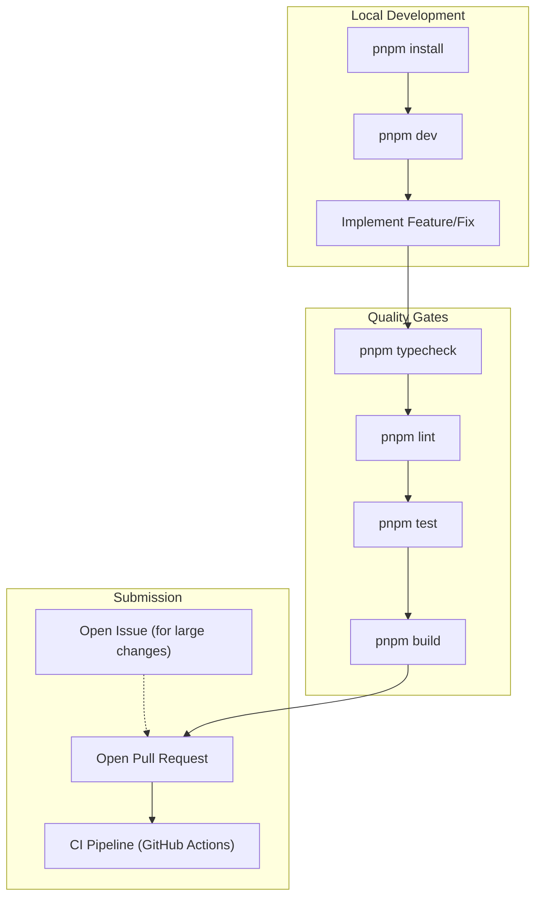

# Contributing

Relevant source files

The following files were used as context for generating this wiki page:

- [CONTRIBUTING.md](CONTRIBUTING.md)

This page provides high-level technical guidelines for contributing to `claude-devtools`. It outlines the project philosophy, development workflow, and the standards required for pull requests.

## Project Philosophy & Scope

`claude-devtools` is specifically designed to provide visibility into the "invisible" parts of Claude Code, such as token flows, context injections, and tool executions [CONTRIBUTING.md:5-7]().

**Core Priorities:**
1.  **Parity with Claude Code**: Rapidly adopting new capabilities like agent teams and context tracking [CONTRIBUTING.md:11-11]().
2.  **Context Engineering Insight**: Focusing on features that help users optimize their context window usage [CONTRIBUTING.md:12-12]().
3.  **Stability over Novelty**: Prioritizing a reliable, fast tool for professional workflows [CONTRIBUTING.md:13-13]().

**Out of Scope:**
*   Large custom features unrelated to context visibility [CONTRIBUTING.md:16-16]().
*   Speculative features that increase maintenance burden without solving concrete problems [CONTRIBUTING.md:17-17]().

**Sources:** [CONTRIBUTING.md:1-21]()

## Development Lifecycle

The following diagram illustrates the standard workflow for contributing a change, from local setup to CI validation.

### Contribution Workflow

**Sources:** [CONTRIBUTING.md:27-40](), [.github/workflows/ci.yml:1-83]()

## Technical Contribution Areas

Detailed technical guides are available for specific types of contributions:

### 1. Development Setup
Before starting, ensure you have **Node.js 20+** and **pnpm 10+** installed [CONTRIBUTING.md:23-24](). The project supports macOS and Windows [CONTRIBUTING.md:25-25]().
For detailed instructions on environment variables and running in development mode, see **[Development Setup](#15.1)**.

### 2. Extending Functionality (IPC)
Most features require coordination between the Main process (Node.js services) and the Renderer process (React UI). This is handled via a type-safe IPC layer.
For a step-by-step guide on adding new handlers, see **[Adding IPC Methods](#15.2)**.

### 3. Standards & Quality
All contributions must pass strict quality gates, including TypeScript type checking, ESLint validation, and Vitest unit tests [CONTRIBUTING.md:33-40]().
For details on coding patterns and naming conventions, see **[Code Style & Quality](#15.3)**.

## AI-Assisted Contributions

The use of AI coding tools is permitted, provided the contributor takes full responsibility for the submitted code [CONTRIBUTING.md:52-52]().

*   **Review Requirement**: Every line of AI-generated code must be read and understood by the contributor [CONTRIBUTING.md:54-54]().
*   **No Artifacts**: Do not commit AI workflow artifacts like planning documents, session logs (e.g., `.speckit/`), or step-by-step plans [CONTRIBUTING.md:55-55]().
*   **Manual Verification**: AI-generated code must be manually verified by running the application and checking edge cases [CONTRIBUTING.md:56-56]().

**Sources:** [CONTRIBUTING.md:50-58]()

## Pull Request Guidelines

*   **Focus**: Keep changes small and focused on a single purpose per PR [CONTRIBUTING.md:43-43]().
*   **Tests**: Include or adjust tests for any behavior changes [CONTRIBUTING.md:44-44]().
*   **Commits**: Prefer conventional commits (e.g., `feat:`, `fix:`, `chore:`) [CONTRIBUTING.md:66-66]().
*   **Discussion**: Large changes or new dependencies **must** be discussed in an Issue before opening a PR [CONTRIBUTING.md:47-47]().

### Prohibited Content
The following items should never be included in a repository contribution:
*   Personal planning/workflow artifacts [CONTRIBUTING.md:60-60]().
*   Large static data blobs that could be fetched at runtime [CONTRIBUTING.md:61-61]().
*   Experimental features without prior alignment [CONTRIBUTING.md:63-63]().

**Sources:** [CONTRIBUTING.md:42-68]()
