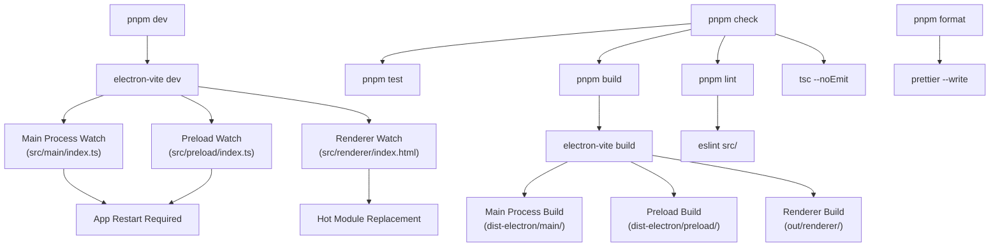
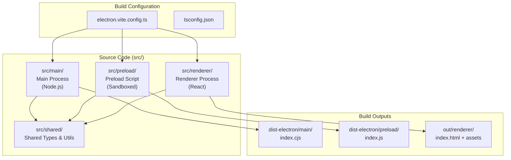
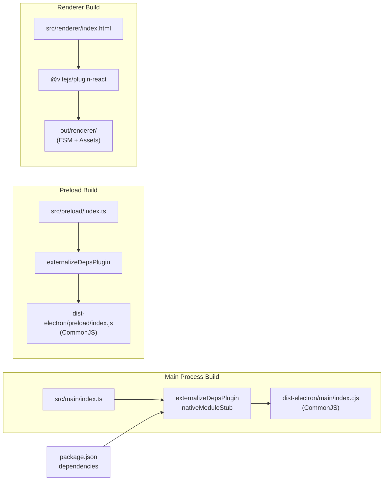

# Development Setup

<details>
<summary>Relevant source files</summary>

The following files were used as context for generating this wiki page:

- [.github/workflows/release.yml](.github/workflows/release.yml)
- [electron.vite.config.ts](electron.vite.config.ts)
- [package.json](package.json)
- [pnpm-lock.yaml](pnpm-lock.yaml)
- [resources/afterInstall.sh](resources/afterInstall.sh)
- [src/main/services/infrastructure/NotificationManager.ts](src/main/services/infrastructure/NotificationManager.ts)
- [src/main/services/infrastructure/SshConnectionManager.ts](src/main/services/infrastructure/SshConnectionManager.ts)

</details>


This document covers setting up a local development environment for contributing to `claude-devtools`. It includes prerequisites, installation steps, running the application in development mode, and an overview of the development workflow.

For build system configuration details, see [Build System](). For deployment and distribution, see [Release & Distribution](). For end-user installation instructions, see [Getting Started]().

---

## Prerequisites

`claude-devtools` requires the following tools installed on your development machine:

| Tool | Minimum Version | Purpose |
|------|----------------|---------|
| **Node.js** | 20.x | JavaScript runtime (specified in CI) |
| **pnpm** | 10.25.0 | Package manager (enforced in `package.json`) |
| **Git** | Any recent version | Version control |

The project uses **pnpm** as its package manager, enforced via the `packageManager` field in `package.json` [package.json:181-181](). Using `npm` or `yarn` will not work correctly due to workspace and dependency resolution differences.

**Sources:** [package.json:181-181](), [.github/workflows/release.yml:26-26]()

---

## Installation

### 1. Clone the Repository

```bash
git clone https://github.com/matt1398/claude-devtools.git
cd claude-devtools
```

### 2. Install Dependencies

```bash
pnpm install
```

pnpm will:
- Install all production and development dependencies [package.json:50-114]().
- Set up the environment for Electron and Vite [package.json:86-88]().
- Handle native module requirements for `ssh2` [package.json:69-69]().

The installation automatically handles native `.node` addons through the build system's stubbing mechanism to ensure cross-platform compatibility without requiring local compilation of all native dependencies.

**Sources:** [package.json:50-114](), [package.json:181-181]()

---

## Running in Development Mode

### Start the Development Server

```bash
pnpm dev
```

This command starts `electron-vite dev` [package.json:21-21](), which:

1. **Builds all three processes** (main, preload, renderer) in watch mode.
2. **Starts the Electron application** with hot reload enabled.
3. **Opens DevTools** in the renderer window automatically.
4. **Watches for file changes** and rebuilds affected processes.

The application launches with a development window. File changes in the renderer process support Hot Module Replacement (HMR), while changes in the main or preload processes trigger an application restart.

**Sources:** [package.json:21-21](), [electron.vite.config.ts:31-100]()

---

## Development Workflow

### Development Command Workflow



**Sources:** [package.json:20-49](), [electron.vite.config.ts:1-100]()

### Key Development Scripts

| Script | Command | Purpose |
|--------|---------|---------|
| **dev** | `pnpm dev` | Start development server with hot reload [package.json:21-21]() |
| **build** | `pnpm build` | Production build of all processes [package.json:22-22]() |
| **typecheck** | `pnpm typecheck` | Run TypeScript type checking without emitting files [package.json:30-30]() |
| **lint** | `pnpm lint` | Check code for linting errors [package.json:31-31]() |
| **format** | `pnpm format` | Format code with Prettier [package.json:33-33]() |
| **test** | `pnpm test` | Run all tests with Vitest [package.json:42-42]() |
| **check** | `pnpm check` | Run all quality checks (typecheck + lint + test + build) [package.json:35-35]() |
| **standalone** | `pnpm standalone` | Run the sidecar server via `tsx` [package.json:46-46]() |

**Sources:** [package.json:20-49]()

---

## Project Structure

### Electron Three-Process Architecture



**Sources:** [electron.vite.config.ts:31-100]()

### Key Directories

| Directory | Purpose | Build Output |
|-----------|---------|--------------|
| **src/main/** | Main process services (e.g., `SshConnectionManager`, `NotificationManager`), IPC handlers | `dist-electron/main/` [electron.vite.config.ts:47-47]() |
| **src/preload/** | Security boundary, exposes `window.electronAPI` | `dist-electron/preload/` [electron.vite.config.ts:71-71]() |
| **src/renderer/** | React UI components and state management | `out/renderer/` [electron.vite.config.ts:122-122]() |
| **src/shared/** | Type definitions and utilities shared across processes | (Bundled into outputs) |

### Path Aliases

The build system configures path aliases in `electron.vite.config.ts` for cleaner imports:

- `@main/*` → `src/main/*` [electron.vite.config.ts:41-41]()
- `@preload/*` → `src/preload/*` [electron.vite.config.ts:65-65]()
- `@renderer/*` → `src/renderer/*` [electron.vite.config.ts:86-86]()
- `@shared/*` → `src/shared/*` [electron.vite.config.ts:42-42]()

**Sources:** [electron.vite.config.ts:39-90]()

---

## Development Build Pipeline

### electron-vite Configuration Overview



**Sources:** [electron.vite.config.ts:31-100]()

### Native Module Handling

The `nativeModuleStub` plugin [electron.vite.config.ts:16-29]() intercepts imports ending in `.node` and replaces them with empty modules. This is critical for dependencies like `ssh2` [package.json:69-69]() which use optional native bindings but have pure JS fallbacks.

```typescript
function nativeModuleStub(): Plugin {
  const STUB_ID = '\0native-stub'
  return {
    name: 'native-module-stub',
    resolveId(source) {
      if (source.endsWith('.node')) return STUB_ID
      return null
    },
    load(id) {
      if (id === STUB_ID) return 'export default {}'
      return null
    }
  }
}
```

**Sources:** [electron.vite.config.ts:16-29]()

---

## Testing During Development

### Running Tests

```bash
# Run all tests once
pnpm test

# Run tests in watch mode
pnpm test:watch

# Generate coverage report
pnpm test:coverage
```

The test suite uses **Vitest** [package.json:113-113](). Specialized tests exist for specific subsystems:
- `test:chunks`: Chunk building logic [package.json:38-38]()
- `test:semantic`: Semantic step parsing [package.json:39-39]()
- `test:noise`: Noise filtering logic [package.json:40-40]()

**Sources:** [package.json:38-45]()

---

## Common Development Issues

### Issue: SSH Connection Failures

**Symptom:** Unable to connect to remote hosts during development.

**Solution:** `SshConnectionManager` relies on the `ssh2` library and local SSH configuration [src/main/services/infrastructure/SshConnectionManager.ts:57-71](). Ensure your `~/.ssh/config` is valid and accessible, as the `SshConfigParser` reads this file to resolve host aliases [src/main/services/infrastructure/SshConnectionManager.ts:111-113]().

### Issue: Notification Persistence

**Symptom:** Notifications are not appearing or history is lost.

**Solution:** `NotificationManager` stores data at `~/.claude/claude-devtools-notifications.json` [src/main/services/infrastructure/NotificationManager.ts:80-80](). Ensure the process has write permissions to the `~/.claude` directory. The manager prunes history to 100 entries on startup [src/main/services/infrastructure/NotificationManager.ts:199-214]().

**Sources:** [src/main/services/infrastructure/SshConnectionManager.ts:111-121](), [src/main/services/infrastructure/NotificationManager.ts:74-80](), [src/main/services/infrastructure/NotificationManager.ts:199-214]()
