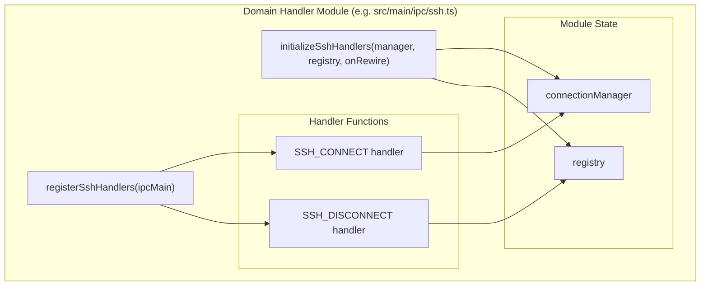

# Adding IPC Methods

<details>
<summary>Relevant source files</summary>

The following files were used as context for generating this wiki page:

- [.claude/commands/devtools/chatgroup-architecture.md](.claude/commands/devtools/chatgroup-architecture.md)
- [.claude/commands/devtools/design-system.md](.claude/commands/devtools/design-system.md)
- [.claude/commands/devtools/explain-visible-context.md](.claude/commands/devtools/explain-visible-context.md)
- [.claude/commands/devtools/markdown-search-logic.md](.claude/commands/devtools/markdown-search-logic.md)
- [.claude/commands/devtools/navigation-scroll.md](.claude/commands/devtools/navigation-scroll.md)
- [CLAUDE.md](CLAUDE.md)
- [LICENSE](LICENSE)
- [src/main/ipc/context.ts](src/main/ipc/context.ts)
- [src/main/ipc/handlers.ts](src/main/ipc/handlers.ts)
- [src/main/ipc/ssh.ts](src/main/ipc/ssh.ts)
- [src/preload/index.ts](src/preload/index.ts)
- [src/renderer/api/httpClient.ts](src/renderer/api/httpClient.ts)
- [src/renderer/store/slices/connectionSlice.ts](src/renderer/store/slices/connectionSlice.ts)
- [src/shared/types/api.ts](src/shared/types/api.ts)

</details>


This document provides a step-by-step guide for developers adding new IPC communication methods between the renderer process and main process. For general IPC architecture overview, see **3.3. IPC Communication Layer**. For the complete API reference, see **14.1. ElectronAPI Interface** and **14.2. IPC Handler Reference**.

## Overview

Adding a new IPC method involves:
1. Defining TypeScript types for request/response data.
2. Adding channel constants to the preload script.
3. Implementing the handler in the main process.
4. Registering the handler with `ipcMain`.
5. Exposing the method through `contextBridge` in the preload.
6. Using the method from the renderer via `window.electronAPI`.

The system uses a **standardized result wrapper** (`IpcResult<T>`) for consistent error handling and a **domain-based organization** for related handlers.

## IPC Communication Flow

The following diagram illustrates the data flow from a React component through the Electron security boundary to the main process services.

### System Data Flow: Renderer to Main

```mermaid
flowchart LR
    subgraph Renderer["Renderer Process"]
        Component["React Component"]
        StoreAction["Store Action (e.g. createConnectionSlice)"]
        API["window.electronAPI"]
    end
    
    subgraph Preload["Preload Script (src/preload/index.ts)"]
        ContextBridge["contextBridge.exposeInMainWorld"]
        InvokeHelper["invokeIpcWithResult&lt;T&gt;"]
        ChannelConstants["IPC Channel Constants"]
    end
    
    subgraph Main["Main Process"]
        IpcMain["ipcMain.handle()"]
        DomainHandler["Domain Handler (e.g. src/main/ipc/ssh.ts)"]
        Service["Service Layer (e.g. SshConnectionManager)"]
    end
    
    Component --> StoreAction
    StoreAction --> API
    API --> ContextBridge
    ContextBridge --> InvokeHelper
    InvokeHelper --> ChannelConstants
    ChannelConstants --> IpcMain
    IpcMain --> DomainHandler
    DomainHandler --> Service
    Service -.->|"IpcResult&lt;T&gt;"| DomainHandler
    DomainHandler -.->|"IpcResult&lt;T&gt;"| IpcMain
    IpcMain -.->|"IpcResult&lt;T&gt;"| InvokeHelper
    InvokeHelper -.->|"T (or throws)"| API
    API -.->|"T"| StoreAction
```

Sources: [src/preload/index.ts:1-128](), [src/main/ipc/handlers.ts:1-101]()

## Step 1: Define Types

Define request and response types in `src/shared/types/api.ts` so they are accessible to both main and renderer processes.

**Pattern:**
[src/shared/types/api.ts:36-39]() shows simple interface definitions like `AgentConfig`. For complex operations, define a specific result interface.

**Example from config API:**
[src/shared/types/api.ts:121-128]() defines `ClaudeRootInfo`, which is returned by the `getClaudeRootInfo` IPC call:

```typescript
export interface ClaudeRootInfo {
  defaultPath: string;
  resolvedPath: string;
  customPath: string | null;
}
```

Add the method signature to the appropriate sub-API interface, such as `ConfigAPI` [src/shared/types/api.ts:82-119]() or `NotificationsAPI` [src/shared/types/api.ts:61-73]().

Sources: [src/shared/types/api.ts:1-157]()

## Step 2: Add Channel Constants

Add the IPC channel name to `src/preload/constants/ipcChannels.ts`. This ensures consistency between the invoker and the handler.

**Example Constants:**
[src/preload/index.ts:1-31]() imports constants like `SSH_CONNECT` and `CONTEXT_SWITCH`.
[src/preload/index.ts:32-57]() imports constants like `CONFIG_GET` and `CONFIG_UPDATE`.

**Naming convention:** Use the pattern `DOMAIN:OPERATION` (e.g., `ssh:connect`, `config:getClaudeRootInfo`).

Sources: [src/preload/index.ts:1-57]()

## Step 3: Implement the Handler

Create or update a handler module in `src/main/ipc/`. Handlers are organized by domain (e.g., `ssh.ts`, `context.ts`, `sessions.ts`).

### Handler Module Structure

Sources: [src/main/ipc/ssh.ts:41-116](), [src/main/ipc/context.ts:26-50]()

### IpcResult Pattern
All handlers must return an `IpcResult<T>` object [src/preload/index.ts:85-89]():
```typescript
interface IpcResult<T> {
  success: boolean;
  data?: T;
  error?: string;
}
```

**Example Implementation:**
[src/main/ipc/ssh.ts:70-116]() shows the `SSH_CONNECT` handler. It wraps the service call in a try-catch and returns a success object or an error message.

Sources: [src/main/ipc/ssh.ts:70-116](), [src/preload/index.ts:85-89]()

## Step 4: Register with Main Orchestrator

The `src/main/ipc/handlers.ts` file acts as the central registry. Add your initialization and registration calls here.

[src/main/ipc/handlers.ts:64-101]() shows the `initializeIpcHandlers` function:
1. Call your `initializeDomainHandlers` with required services.
2. Call your `registerDomainHandlers` passing `ipcMain`.

[src/main/ipc/handlers.ts:107-122]() shows the `removeIpcHandlers` function. Ensure you call your domain's remove function to prevent memory leaks or duplicate handlers during development hot-reloads.

Sources: [src/main/ipc/handlers.ts:64-122]()

## Step 5: Expose via Preload

In `src/preload/index.ts`, add the method to the `electronAPI` object. Use the `invokeIpcWithResult<T>` helper [src/preload/index.ts:103-109]() to automatically unwrap the `IpcResult` and throw errors if the call fails.

**Example implementation for SSH:**
[src/preload/index.ts:369-381]() demonstrates wrapping the IPC call:
```typescript
ssh: {
  connect: async (config: SshConnectionConfig): Promise<SshConnectionStatus> => {
    return invokeIpcWithResult<SshConnectionStatus>(SSH_CONNECT, config);
  },
  // ...
}
```

For event listeners (Main to Renderer), use `ipcRenderer.on` and return a cleanup function:
[src/preload/index.ts:187-198]() shows the `onNew` notification listener.

Sources: [src/preload/index.ts:103-109](), [src/preload/index.ts:187-198](), [src/preload/index.ts:369-381]()

## Step 6: Use from Renderer

The exposed methods are available on `window.electronAPI`. In the renderer process, these are typically accessed via the `api` alias [src/renderer/store/slices/connectionSlice.ts:8]().

### Usage in Zustand Store
Store actions call the API and update the application state based on the result.

[src/renderer/store/slices/connectionSlice.ts:65-73]() shows the `connectSsh` action calling `api.ssh.connect(config)`.

### HTTP Sidecar Support
If the application is running in browser mode (via the HTTP sidecar), the `HttpAPIClient` must also implement the new method to maintain parity.
[src/renderer/api/httpClient.ts:46-175]() contains the HTTP-based implementation of the `ElectronAPI` interface, using `fetch` instead of `ipcRenderer.invoke`.

Sources: [src/renderer/store/slices/connectionSlice.ts:8-73](), [src/renderer/api/httpClient.ts:46-175]()

## Summary of Best Practices

| Rule | Reason |
| :--- | :--- |
| **Always use `invokeIpcWithResult`** | Ensures consistent error throwing in the renderer [src/preload/index.ts:103](). |
| **Use Domain Namespaces** | Keeps the `electronAPI` organized (e.g. `api.ssh.*`, `api.config.*`) [src/preload/index.ts:216](). |
| **Return Cleanup Functions** | For all `onEvent` listeners to prevent memory leaks [src/preload/index.ts:192](). |
| **Implement HTTP Parity** | Update `HttpAPIClient` if the method is needed in browser mode [src/renderer/api/httpClient.ts:46](). |

Sources: [src/preload/index.ts:103-216](), [src/renderer/api/httpClient.ts:46]()
