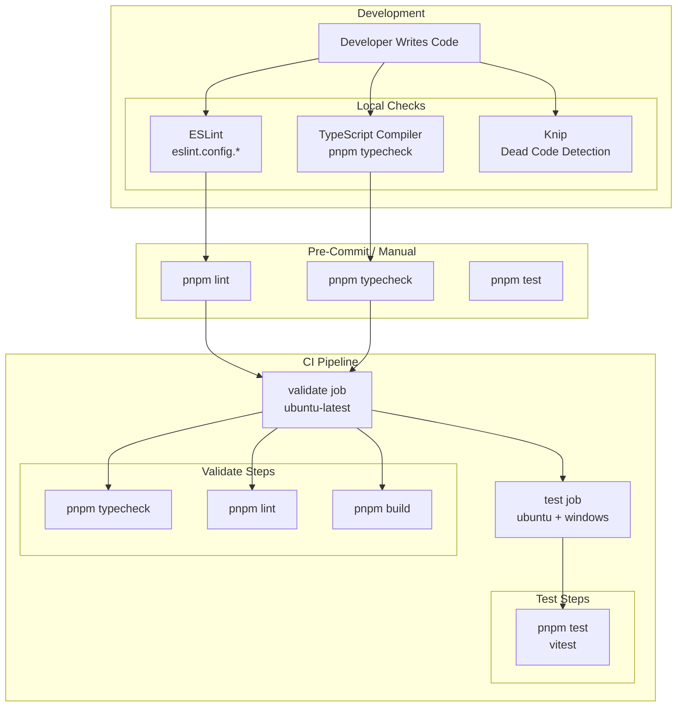
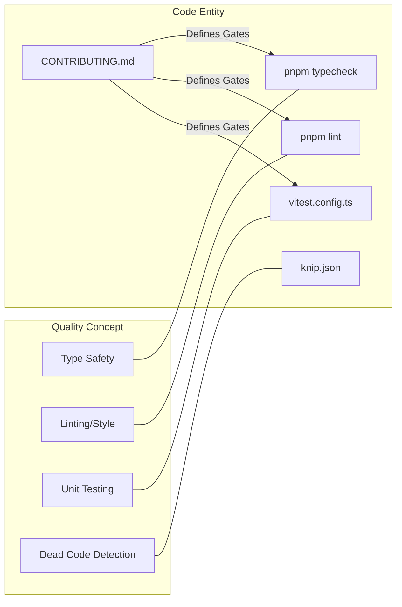

# Code Style & Quality

Relevant source files

The following files were used as context for generating this wiki page:

- [CONTRIBUTING.md](CONTRIBUTING.md)
- [vitest.config.ts](vitest.config.ts)

This page documents the code quality standards, tooling, and conventions used in the `claude-devtools` codebase. It covers linting, formatting, type checking, testing practices, and CI validation gates.

## Quality Toolchain Overview

The codebase enforces quality through multiple layers of automated validation, primarily orchestrated via `pnpm` scripts and GitHub Actions.

**Sources:** [CONTRIBUTING.md:33-40](), [vitest.config.ts:1-17]()

## Quality Gates

Before opening a Pull Request, contributors are required to run the following quality gates locally:

1.  `pnpm typecheck`: Validates TypeScript types across the project [CONTRIBUTING.md:36]().
2.  `pnpm lint`: Runs ESLint to enforce coding standards [CONTRIBUTING.md:37]().
3.  `pnpm test`: Executes the Vitest suite [CONTRIBUTING.md:38]().
4.  `pnpm build`: Ensures the `electron-vite` build process completes without errors [CONTRIBUTING.md:39]().

**Sources:** [CONTRIBUTING.md:33-40]()

## Testing Standards

The project uses **Vitest** for unit testing with a `happy-dom` environment for renderer-side compatibility.

### Test Configuration

The `vitest.config.ts` file defines the testing environment and coverage requirements:

| Feature | Configuration | File:Line |
| :--- | :--- | :--- |
| **Environment** | `happy-dom` | [vitest.config.ts:7]() |
| **Global APIs** | Enabled (`globals: true`) | [vitest.config.ts:6]() |
| **Timeout** | 15,000ms | [vitest.config.ts:8]() |
| **Coverage Provider** | `v8` | [vitest.config.ts:12]() |
| **Setup File** | `./test/setup.ts` | [vitest.config.ts:9]() |

### Coverage Exclusion

Certain entry points and type definitions are excluded from coverage metrics to focus on logic:
*   `src/**/*.d.ts` (Type definitions) [vitest.config.ts:15]()
*   `src/main/index.ts` (Main process entry) [vitest.config.ts:15]()
*   `src/preload/index.ts` (Preload bridge entry) [vitest.config.ts:15]()

**Sources:** [vitest.config.ts:1-25]()

## Code Organization & Path Aliases

The project utilizes path aliases to maintain a clean import structure and strictly separate process concerns. These are defined in both the build configuration and the test runner.

### Path Mapping

| Alias | Target Directory | Purpose |
| :--- | :--- | :--- |
| `@shared` | `src/shared` | Code used by both Main and Renderer [vitest.config.ts:20]() |
| `@main` | `src/main` | Main process logic and services [vitest.config.ts:21]() |
| `@renderer` | `src/renderer` | React UI and frontend state [vitest.config.ts:22]() |

**Sources:** [vitest.config.ts:18-24]()

## AI-Assisted Contribution Standards

While AI tools are permitted, the project enforces strict quality standards for AI-generated code to prevent "hallucinated" logic or technical debt.

### Requirements for AI Code
*   **Human Review:** Every line of AI-generated code must be read and understood by the contributor [CONTRIBUTING.md:52-54]().
*   **No Artifacts:** AI workflow files (e.g., `.speckit/`, `docs/plans/`, or session logs) must **not** be committed to the repository [CONTRIBUTING.md:55]().
*   **Intentionality:** Contributors must be able to explain the rationale for every line in their PR [CONTRIBUTING.md:57]().
*   **Manual Verification:** AI code must be manually tested in the app, checking edge cases beyond what the AI might have predicted [CONTRIBUTING.md:56]().

**Sources:** [CONTRIBUTING.md:50-58]()

## Commit & PR Guidelines

To maintain a high-quality git history, the project follows these conventions:

*   **Commit Style:** Conventional commits are preferred (`feat:`, `fix:`, `chore:`, `docs:`) [CONTRIBUTING.md:66]().
*   **Rationale:** Non-trivial changes must include a rationale in the commit body [CONTRIBUTING.md:67]().
*   **PR Scope:** Keep PRs focused on a single purpose. Large changes or new dependencies require prior discussion in an Issue [CONTRIBUTING.md:43-47]().

**Sources:** [CONTRIBUTING.md:42-49](), [CONTRIBUTING.md:65-68]()

## Code Entity Space Mapping

The following diagram maps high-level quality concepts to specific configuration entities in the codebase.

**Sources:** [CONTRIBUTING.md:33-40](), [vitest.config.ts:1-25]()
