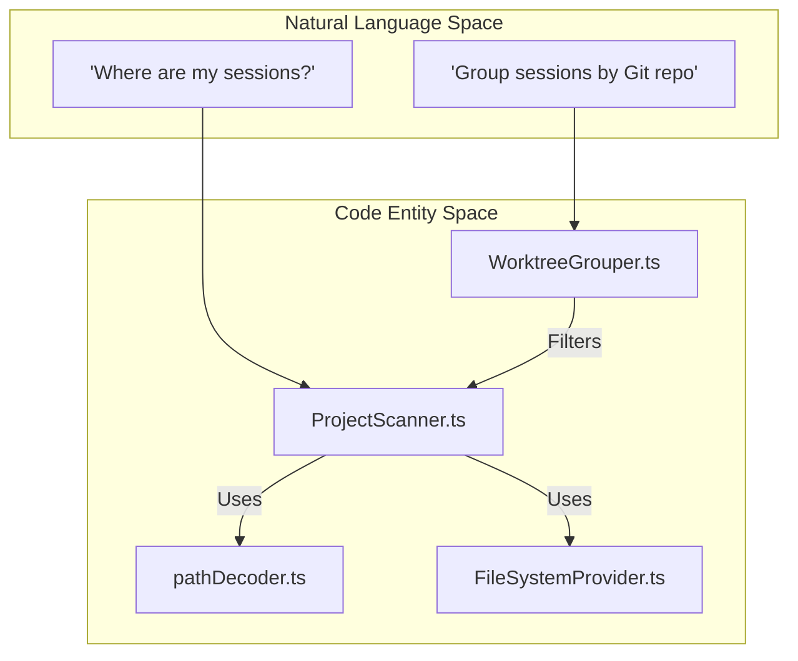
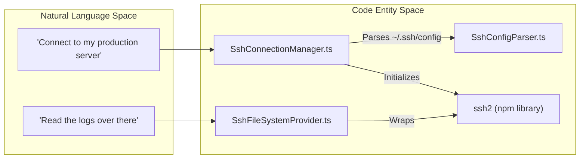

# Glossary

Relevant source files

The following files were used as context for generating this wiki page:

- [.github/workflows/release.yml](.github/workflows/release.yml)
- [README.md](README.md)
- [package.json](package.json)
- [pnpm-lock.yaml](pnpm-lock.yaml)
- [resources/afterInstall.sh](resources/afterInstall.sh)
- [src/main/services/discovery/ProjectScanner.ts](src/main/services/discovery/ProjectScanner.ts)
- [src/main/services/infrastructure/SshConnectionManager.ts](src/main/services/infrastructure/SshConnectionManager.ts)
- [src/main/types/messages.ts](src/main/types/messages.ts)
- [src/main/utils/jsonl.ts](src/main/utils/jsonl.ts)
- [src/preload/index.ts](src/preload/index.ts)
- [src/renderer/api/httpClient.ts](src/renderer/api/httpClient.ts)
- [src/renderer/components/chat/ChatHistoryItem.tsx](src/renderer/components/chat/ChatHistoryItem.tsx)
- [src/renderer/components/chat/ContextBadge.tsx](src/renderer/components/chat/ContextBadge.tsx)
- [src/renderer/components/chat/SessionContextPanel/components/FlatInjectionList.tsx](src/renderer/components/chat/SessionContextPanel/components/FlatInjectionList.tsx)
- [src/renderer/components/common/UpdateDialog.tsx](src/renderer/components/common/UpdateDialog.tsx)
- [src/renderer/components/settings/sections/AdvancedSection.tsx](src/renderer/components/settings/sections/AdvancedSection.tsx)
- [src/renderer/components/sidebar/SessionItem.tsx](src/renderer/components/sidebar/SessionItem.tsx)
- [src/renderer/store/slices/sessionSlice.ts](src/renderer/store/slices/sessionSlice.ts)
- [src/renderer/types/contextInjection.ts](src/renderer/types/contextInjection.ts)
- [src/renderer/utils/contextTracker.ts](src/renderer/utils/contextTracker.ts)
- [src/shared/types/api.ts](src/shared/types/api.ts)

This page provides definitions for codebase-specific terms, jargon, and domain concepts used throughout the `claude-devtools` project. It serves as a technical reference for onboarding engineers to understand how abstract concepts map to specific code entities.

## Core Concepts

### Session
A **Session** represents a single execution instance of Claude Code. It is backed by a `.jsonl` file stored in the user's `.claude/projects/` directory. Each session contains a sequence of messages (user, assistant, system) and tool calls.

*   **Code Entity:** `Session` interface [src/main/types/index.ts:23-28]().
*   **Data Flow:** The `ProjectScanner` reads these from disk [src/main/services/discovery/ProjectScanner.ts:5-9](), and the `parseJsonlFile` utility transforms the raw lines into structured objects [src/main/utils/jsonl.ts:52-55]().

### Project
A **Project** is a logical grouping of sessions associated with a specific directory on the user's machine. Claude Code encodes the project path into the directory name within `~/.claude/projects/`.

*   **Code Entity:** `Project` interface [src/shared/types/api.ts:21-21]().
*   **Implementation:** Projects are identified by a `projectId`, which is often a base64-encoded path of the working directory [src/main/utils/pathDecoder.ts:38-44]().

### Context Reconstruction
The process of reading raw JSONL logs to rebuild the state of the conversation, including hidden system prompts, tool outputs, and token usage that are typically hidden in the Claude Code CLI.

*   **Key Logic:** `analyzeSessionFileMetadata` [src/main/utils/jsonl.ts:30-33]() and `sessionAnalyzer` [src/main/services/analysis/SessionAnalyzer.ts]().

---

## Technical Jargon & Abbreviations

| Term | Definition | Code Pointer |
| :--- | :--- | :--- |
| **JSONL** | JSON Lines. The storage format for Claude Code logs where each line is a valid JSON object. | [src/main/utils/jsonl.ts:4-8]() |
| **IPC** | Inter-Process Communication. The mechanism Electron uses to send data between the Main and Renderer processes. | [src/preload/index.ts:128-154]() |
| **Sidechain** | A secondary conversation thread spawned by Claude (e.g., for subagents) that runs parallel to the main chat. | [src/main/types/index.ts:124-125]() |
| **SFTP** | SSH File Transfer Protocol. Used by the app to read session logs from remote servers. | [src/main/services/infrastructure/SshConnectionManager.ts:6-10]() |
| **SSE** | Server-Sent Events. Used by the HTTP Sidecar to push updates to the browser-based renderer. | [src/renderer/api/httpClient.ts:4-7]() |
| **Worktree** | A Git feature allowing multiple working trees attached to the same repository. The app groups these together. | [src/main/services/discovery/WorktreeGrouper.ts:13-16]() |

---

## Domain Mapping: Natural Language to Code

The following diagrams bridge the gap between how a user describes a feature and how that feature is implemented in the codebase.

### Session Discovery Mapping
*How "Finding my Claude logs" maps to the Scanning subsystem.*

**Sources:** [src/main/services/discovery/ProjectScanner.ts:11-16](), [src/main/utils/pathDecoder.ts:41-44](), [src/main/services/infrastructure/FileSystemProvider.ts:57-58]()

### Remote Access Mapping
*How "Connecting to my server" maps to the SSH subsystem.*

**Sources:** [src/main/services/infrastructure/SshConnectionManager.ts:1-10](), [src/main/services/infrastructure/SshFileSystemProvider.ts:22-23](), [src/main/services/infrastructure/SshConfigParser.ts:21-22]()

---

## System Abbreviations

*   **`CSC`**: Code Signing Certificate. Used in the release pipeline for macOS notarization [ .github/workflows/release.yml:108-109]().
*   **`UNC`**: Universal Naming Convention. Used specifically for resolving WSL paths on Windows (e.g., `\\wsl$\Ubuntu\...`) [src/shared/types/api.ts:103-104]().
*   **`JSONL Line`**: A single `ChatHistoryEntry` which is then parsed into a `ParsedMessage` [src/main/utils/jsonl.ts:88-95]().

---

## Implementation Details: Data Flow

### The Lifecycle of a Message
1.  **Read:** `LocalFileSystemProvider` or `SshFileSystemProvider` reads a line from the `.jsonl` file.
2.  **Parse:** `parseJsonlLine` converts the string to a `ChatHistoryEntry` [src/main/utils/jsonl.ts:88-95]().
3.  **Refine:** `parseChatHistoryEntry` extracts tool calls, token usage, and identifies if it's a "Sidechain" message [src/main/utils/jsonl.ts:104-194]().
4.  **Deduplicate:** For streaming assistant responses, `deduplicateStreamingMessages` ensures only the final chunk (with complete token counts) is kept [src/main/utils/jsonl.ts:224-233]().
5.  **Store:** The message is sent via IPC to the Renderer and stored in the `sessionSlice` of the Zustand store [src/renderer/store/slices/sessionSlice.ts:85-105]().

**Sources:** [src/main/utils/jsonl.ts:1-233](), [src/renderer/store/slices/sessionSlice.ts:1-105](), [src/main/services/infrastructure/FileSystemProvider.ts:1-30]()
