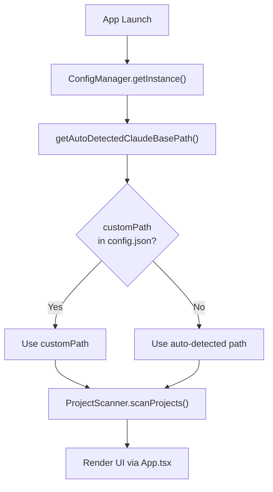
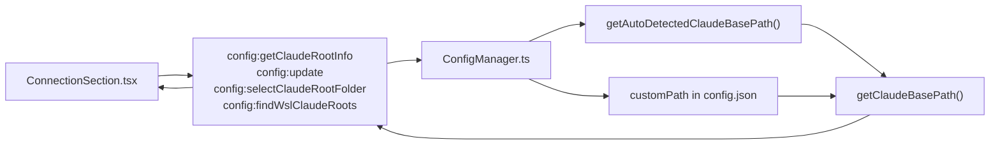
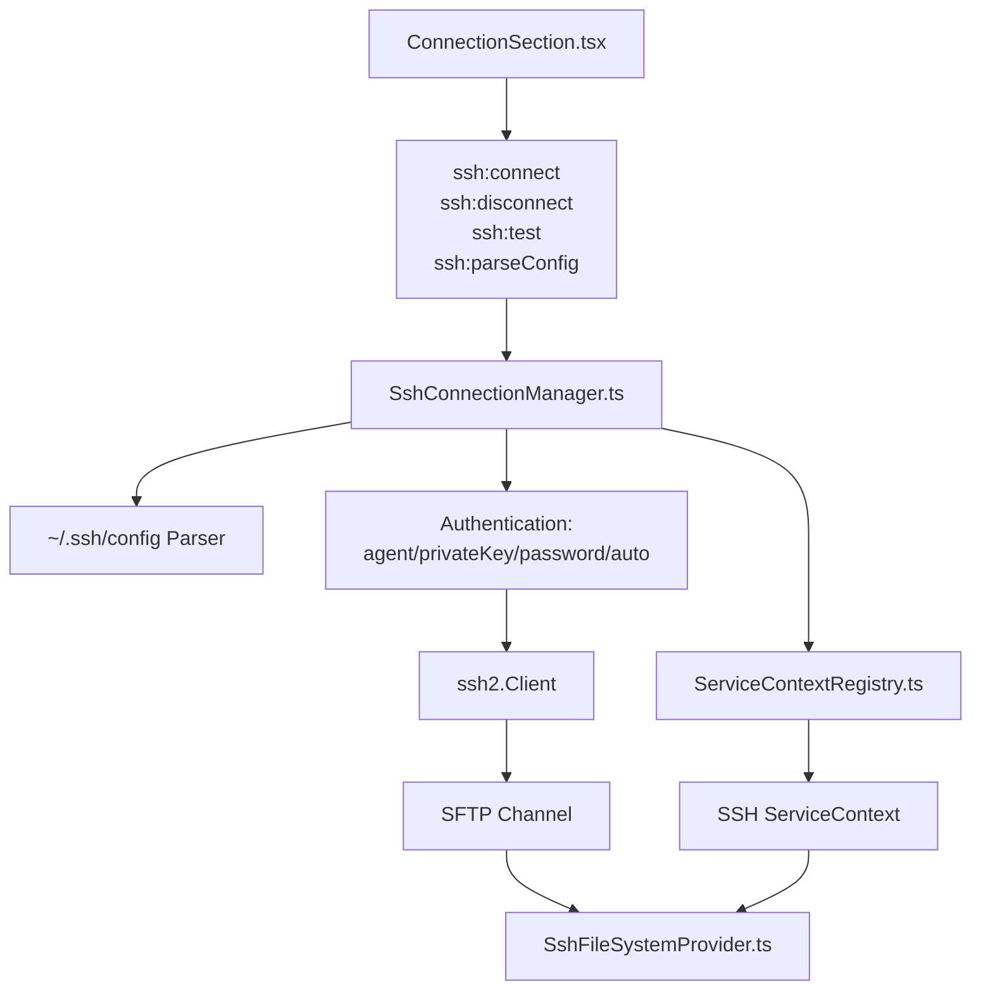

# Getting Started

<details>
<summary>Relevant source files</summary>

The following files were used as context for generating this wiki page:

- [.dockerignore](.dockerignore)
- [Dockerfile](Dockerfile)
- [README.md](README.md)
- [SECURITY.md](SECURITY.md)
- [docker-compose.yml](docker-compose.yml)
- [src/renderer/components/common/UpdateDialog.tsx](src/renderer/components/common/UpdateDialog.tsx)
- [src/renderer/components/settings/sections/AdvancedSection.tsx](src/renderer/components/settings/sections/AdvancedSection.tsx)
- [vite.standalone.config.ts](vite.standalone.config.ts)

</details>


This document covers installation, initial configuration, and basic usage of `claude-devtools`. It explains how to configure the local Claude root directory, set up SSH remote connections, and navigate the application interface.

For architectural details about the underlying systems, see [Architecture](). For SSH connection internals, see [SSH Remote Access](). For configuration management details, see [Configuration Management]().

---

## Prerequisites

`claude-devtools` reads session logs from Claude Code's data directory. No API keys or additional configuration is required beyond pointing the application to the correct directory.

**System Requirements:**
- Claude Code installed with session data in `~/.claude/`
- macOS (10.13+), Windows (10+), or Linux
- For SSH remote access: SSH server on target machine with SFTP support

**Sources:** [README.md:84-85](), [README.md:26-26]()

---

## Installation

Download the appropriate installer from the [latest release](https://github.com/matt1398/claude-devtools/releases/latest):

| Platform | Package Format | Installation Notes |
|----------|---------------|-------------------|
| **macOS (Apple Silicon)** | `.dmg` (arm64) | Drag to Applications folder. Right-click → Open on first launch (bypasses Gatekeeper). [README.md:78-78]() |
| **macOS (Intel)** | `.dmg` (x64) | Same as Apple Silicon. [README.md:79-79]() |
| **Windows** | `.exe` | Standard installer. May trigger SmartScreen — click "More info" → "Run anyway". [README.md:81-81]() |
| **Linux** | `.AppImage`, `.deb`, `.rpm`, `.pacman` | AppImage is portable. Package formats integrate with system package managers. [README.md:80-80]() |
| **Homebrew (macOS)** | Cask | `brew install --cask claude-devtools`. [README.md:70-72]() |
| **Docker** | Image | `docker compose up`. Open `http://localhost:3456`. [README.md:82-82]() |

The application is unsigned, which triggers security warnings on macOS and Windows. This is expected for open-source applications distributed outside official stores.

---

## First Launch: Auto-Detection

### Initialization Flow

On first launch, the application automatically detects the Claude root directory using platform-specific heuristics.

**Natural Language to Code Entity Mapping: Initialization**



**Auto-Detection Logic:**
1. Check `CLAUDE_HOME` environment variable.
2. Fall back to `~/.claude` (expanded to user home directory).
3. On Windows: resolve to `C:\Users\<username>\.claude`.
4. On macOS/Linux: resolve to `/Users/<username>/.claude` or `/home/<username>/.claude`.

**Sources:** [Dockerfile:49-49](), [SECURITY.md:19-22]()

---

## Configuring Local Claude Root

### Configuration System Architecture

The local Claude root is managed by `ConfigManager` and can be queried or overridden via IPC handlers.

**Natural Language to Code Entity Mapping: Configuration IPC**



### Viewing Current Configuration

The Settings panel (⌘ + , or Cmd+Comma) shows the current Claude root configuration under **Connection → Local Claude Root**.

### Manual Override

To override the auto-detected path:

1. Open Settings (⌘ + ,).
2. Navigate to **Connection → Local Claude Root**.
3. Click **Select Folder**.
4. Choose a directory (validation checks for `.claude` name and `projects/` subdirectory).

The folder picker is implemented via Electron's native `dialog.showOpenDialog` [vite.standalone.config.ts:58-58]().

After selection, the configuration is persisted to `~/.claude/claude-devtools-config.json` [SECURITY.md:21-21]() and the workspace is reset to re-scan projects from the new root.

### WSL Support (Windows Only)

On Windows, if the auto-detected path is a Windows-style path (e.g., `C:\Users\...`) and you're using Claude Code inside WSL, the app can scan for WSL distributions and their `~/.claude` directories.

---

## Setting Up SSH Remote Access

### SSH Connection Architecture

The SSH system uses `SshConnectionManager` to establish connections and `ServiceContextRegistry` to manage isolated contexts.



### Connection Methods

Four authentication methods are supported:

| Method | Description | Configuration |
|--------|-------------|---------------|
| **Auto** | Reads from `~/.ssh/config` | Host alias must exist in SSH config |
| **Agent** | Uses SSH agent forwarding | Agent must be running with keys loaded |
| **Private Key** | Direct key file | Path to private key file (e.g., `~/.ssh/id_rsa`) |
| **Password** | Interactive password prompt | Password not stored (prompted at connection time) |

**Sources:** [SECURITY.md:10-10]()

---

## Docker / Standalone Mode

For environments where Electron is not available (e.g., headless servers, remote development containers), `claude-devtools` can run in standalone mode.

### Running with Docker

```bash
docker compose up
```

This starts a Fastify-based HTTP server on port `3456` [docker-compose.yml:19-19](). By default, it mounts `${CLAUDE_DIR:-~/.claude}` to `/data/.claude` as read-only [docker-compose.yml:21-21]().

### Security and Isolation

- **No Outbound Calls**: In standalone mode, the auto-updater and SSH features are disabled [SECURITY.md:15-15]().
- **Network Isolation**: For maximum security, run with `--network none` [SECURITY.md:29-31]().
- **Read-Only**: Volume mounts use `:ro` to ensure the app never modifies your session logs [SECURITY.md:20-20]().

**Sources:** [Dockerfile:1-56](), [docker-compose.yml:1-34](), [vite.standalone.config.ts:1-116]()

---

## Auto-Updates (Electron Only)

The application checks for updates using the `GitHub Releases API` [SECURITY.md:9-9]().

1. **Update Check**: Triggered on launch or manually via **Settings → About → Check for Updates** [src/renderer/components/settings/sections/AdvancedSection.tsx:157-172]().
2. **Notification**: If an update is available, `updateStatus` changes to `available` [src/renderer/components/settings/sections/AdvancedSection.tsx:72-81]().
3. **Dialog**: The `UpdateDialog` component displays release notes parsed from HTML to Markdown [src/renderer/components/common/UpdateDialog.tsx:20-39]().
4. **Action**: Click **Download** to trigger `downloadUpdate` via the store [src/renderer/components/common/UpdateDialog.tsx:45-45]().

**Sources:** [src/renderer/components/common/UpdateDialog.tsx:41-181](), [src/renderer/components/settings/sections/AdvancedSection.tsx:56-90]()

---

## Advanced Configuration Management

In **Settings → Advanced**, users can manage the application's internal configuration state:

- **Reset to Defaults**: Clears all custom settings [src/renderer/components/settings/sections/AdvancedSection.tsx:97-107]().
- **Export/Import Config**: Allows portability of settings and SSH profiles [src/renderer/components/settings/sections/AdvancedSection.tsx:109-131]().
- **Open in Editor**: Directly opens the `claude-devtools-config.json` file in the system's default editor (Electron only) [src/renderer/components/settings/sections/AdvancedSection.tsx:133-144]().

**Sources:** [src/renderer/components/settings/sections/AdvancedSection.tsx:94-145](), [SECURITY.md:21-21]()
