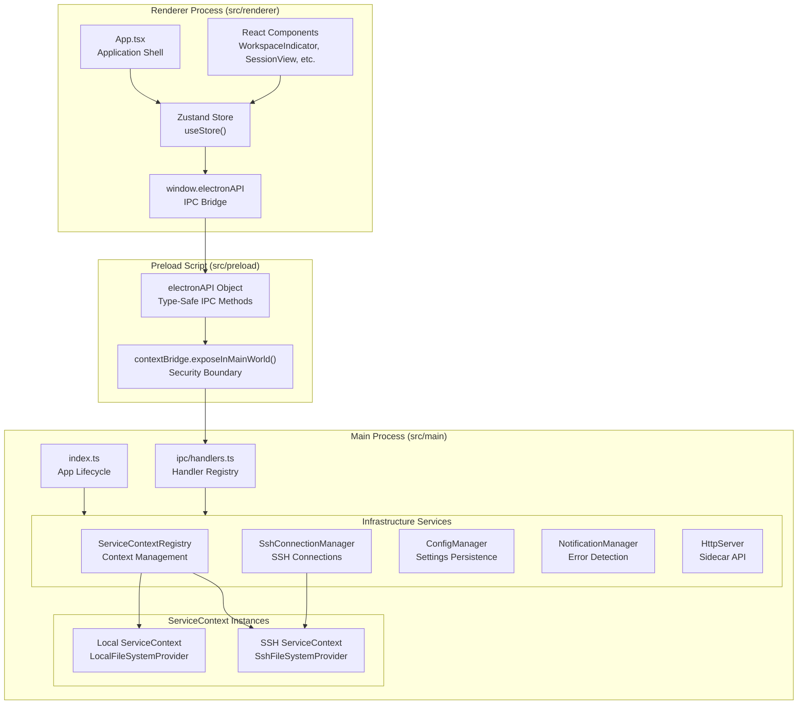
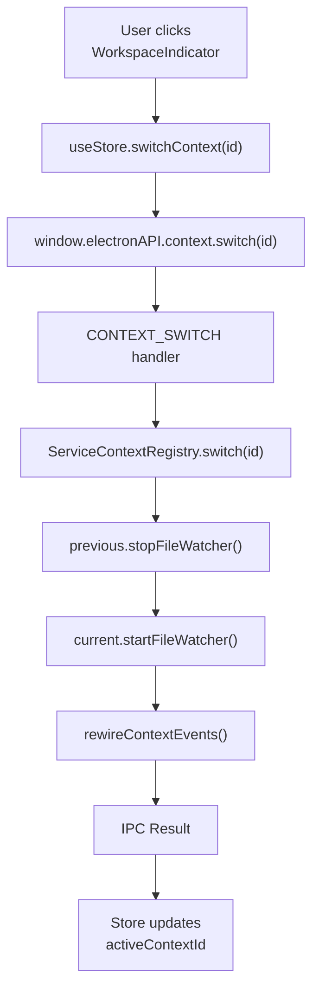

# Architecture

Relevant source files

The following files were used as context for generating this wiki page:

- [src/main/index.ts](src/main/index.ts)
- [src/main/services/infrastructure/ServiceContext.ts](src/main/services/infrastructure/ServiceContext.ts)
- [src/main/services/infrastructure/ServiceContextRegistry.ts](src/main/services/infrastructure/ServiceContextRegistry.ts)
- [src/main/services/infrastructure/index.ts](src/main/services/infrastructure/index.ts)
- [src/preload/constants/ipcChannels.ts](src/preload/constants/ipcChannels.ts)
- [src/renderer/components/common/WorkspaceIndicator.tsx](src/renderer/components/common/WorkspaceIndicator.tsx)

## Purpose and Scope

This page provides a high-level overview of claude-devtools' system architecture and design philosophy. It covers the major architectural patterns, component organization, and data flow through the application. For detailed information about specific subsystems, see:

- [Electron Process Model](#3.1) — How the three-process Electron architecture is structured: main process services, preload security boundary, and renderer UI
- [Multi-Context System](#3.2) — `ServiceContextRegistry`, context switching, and how the application supports both local and SSH remote environments
- [IPC Communication Layer](#3.3) — Inter-process communication patterns, the `electronAPI` bridge, handler registration, and type-safe IPC abstractions
- [State Management](#3.4) — Zustand store architecture, slice organization, real-time event handling, and context snapshots

## Design Philosophy

Claude-devtools follows Electron's security model with strict process separation and uses a service-oriented architecture in the main process. The application is designed for extensibility, supporting both local and remote (SSH) data sources through a unified abstraction layer.

### Core Principles

| Principle | Implementation |
|-----------|---------------|
| **Security First** | Context isolation, no Node.js in renderer, `contextBridge` API exposure |
| **Abstraction** | `FileSystemProvider` interface for local/SSH transparency |
| **Service-Oriented** | Domain services with clear responsibilities |
| **Type Safety** | TypeScript throughout, type-safe IPC with `IpcResult<T>` pattern |
| **Real-Time** | Event-driven updates via file watchers and IPC broadcasts |

Sources: [src/main/index.ts:1-10](), [src/main/services/infrastructure/FileSystemProvider.ts:1-21]()

## High-Level Architecture

The application follows Electron's three-process model with a service layer in the main process and a React-based UI in the renderer.

### Process Boundaries and Service Layer

**Key Components:**

- **Main Process** ([src/main/index.ts:1-10]()): Initializes services, manages window lifecycle, and coordinates context switching via the `ServiceContextRegistry`.
- **Preload Script**: Exposes the `electronAPI` via `contextBridge`, providing a secure, type-safe interface for the renderer to communicate with the main process.
- **Renderer Process**: A React application using Zustand for state management. It interacts with the backend solely through the `window.electronAPI` bridge.
- **Service Layer**: A collection of singleton infrastructure services ([src/main/services/infrastructure/index.ts:1-33]()) handling cross-cutting concerns like SSH, configuration, and notifications.
- **Context System**: `ServiceContext` instances ([src/main/services/infrastructure/ServiceContext.ts:62-80]()) encapsulate the full parsing and scanning stack for a specific environment (local or remote).

Sources: [src/main/index.ts:62-83](), [src/main/services/infrastructure/index.ts:1-33](), [src/main/services/infrastructure/ServiceContext.ts:62-80]()

## Service Architecture

The main process organizes functionality into domain services that are initialized at startup and accessed through IPC handlers.

### Core Services

| Service | Responsibilities | Lifecycle |
|---------|-----------------|-----------|
| `ServiceContextRegistry` | Manages multiple `ServiceContext` instances and tracks the active one. | Singleton, [src/main/services/infrastructure/ServiceContextRegistry.ts:31-220]() |
| `ServiceContext` | Bundles `ProjectScanner`, `SessionParser`, and `FileWatcher` for a specific workspace. | Per-context, [src/main/services/infrastructure/ServiceContext.ts:62-80]() |
| `SshConnectionManager` | Manages SSH connection lifecycle and SFTP access. | Singleton, [src/main/services/infrastructure/SshConnectionManager.ts:1-50]() |
| `ConfigManager` | Persists application settings and handles Claude root detection. | Singleton, [src/main/services/infrastructure/ConfigManager.ts:1-40]() |
| `NotificationManager` | Detects errors in sessions and delivers native/UI notifications. | Singleton, [src/main/services/infrastructure/NotificationManager.ts:1-25]() |
| `HttpServer` | Fastify-based sidecar for external API access and SSE events. | Singleton, [src/main/services/infrastructure/HttpServer.ts:1-23]() |

Sources: [src/main/services/infrastructure/index.ts:1-33](), [src/main/index.ts:78-83]()

## Data Flow Patterns

### Session Discovery and Display Pipeline

```mermaid
graph LR
    FS["File System<br/>~/.claude/projects/"]
    FSProvider["FileSystemProvider<br/>Local or SSH"]
    Scanner["ProjectScanner<br/>scanProjects()"]
    Parser["SessionParser<br/>parseSessionFile()"]
    Cache["DataCache<br/>LRU Storage"]
    IPC["IPC Handler<br/>get-sessions"]
    Store["sessionSlice<br/>Zustand State"]
    UI["SessionList Component"]
    
    FS --> FSProvider
    FSProvider --> Scanner
    Scanner --> Parser
    Parser --> Cache
    Cache --> IPC
    IPC --> Store
    Store --> UI
```

Each `ServiceContext` contains its own stack of discovery and parsing services ([src/main/services/infrastructure/ServiceContext.ts:81-119]()). By abstracting the file system through the `FileSystemProvider` interface, the rest of the stack remains agnostic to whether data is local or remote.

Sources: [src/main/services/infrastructure/ServiceContext.ts:81-119](), [src/main/services/infrastructure/FileSystemProvider.ts:1-21]()

### Real-Time Update Flow

File watchers are context-specific. When a file change is detected by a `FileWatcher` ([src/main/services/infrastructure/FileWatcher.ts:1-26]()), the event is wired through `wireFileWatcherEvents` ([src/main/index.ts:105-139]()) to notify both the Electron renderer and any connected HTTP SSE clients.

Sources: [src/main/index.ts:105-139](), [src/main/services/infrastructure/ServiceContext.ts:144-160]()

## Context Switching Mechanism

The application supports switching between local and SSH environments at runtime. The `ServiceContextRegistry` ([src/main/services/infrastructure/ServiceContextRegistry.ts:119-146]()) manages this by stopping the `FileWatcher` of the previous context and starting it for the new one.

### Context Registry and Switching

The `WorkspaceIndicator` component ([src/renderer/components/common/WorkspaceIndicator.tsx:17-138]()) provides the UI for this transition, allowing users to jump between different configured environments.

Sources: [src/main/services/infrastructure/ServiceContextRegistry.ts:119-146](), [src/renderer/components/common/WorkspaceIndicator.tsx:17-138](), [src/main/index.ts:164-175]()

## IPC Handler Organization

IPC handlers are centralized in the main process and organized by domain. They use constants from `@preload/constants/ipcChannels` to ensure consistency between the main and renderer processes.

| Domain | Channel Prefix | Purpose |
|--------|----------------|---------|
| Config | `config:` | Settings, ignore lists, triggers |
| SSH | `ssh:` | Connections, host resolution, status |
| Context | `context:` | Switching and listing environments |
| Updater | `updater:` | Update checks and installation |
| Window | `window:` | Custom title bar controls |

Sources: [src/preload/constants/ipcChannels.ts:1-180](), [src/main/index.ts:24-25]()

## State Management Architecture

The renderer uses Zustand for global state management, organized into modular slices. This state includes data fetched from the main process (sessions, projects) and UI state (active tabs, search filters).

The store is responsible for:
1.  **Data Fetching**: Invoking IPC methods via `window.electronAPI`.
2.  **Event Listening**: Subscribing to real-time events like `file-change` or `ssh:status`.
3.  **Context Snapshots**: Saving and restoring the UI state when switching between local and SSH contexts.

Sources: [src/renderer/store/index.ts:1-20](), [src/renderer/components/common/WorkspaceIndicator.tsx:18-25]()
