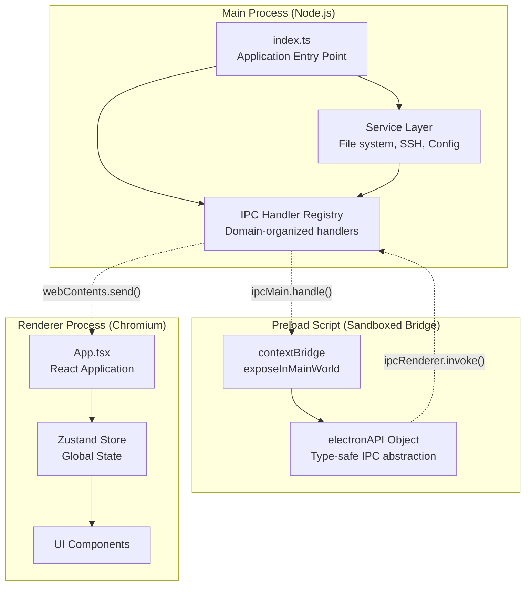
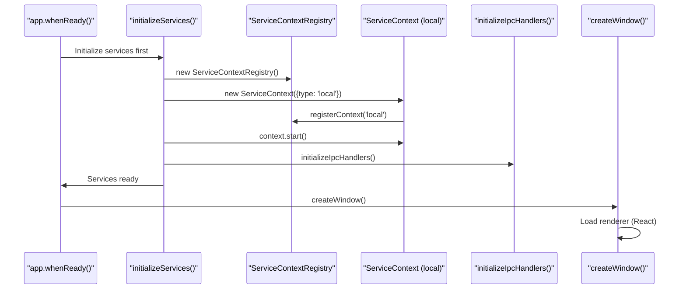
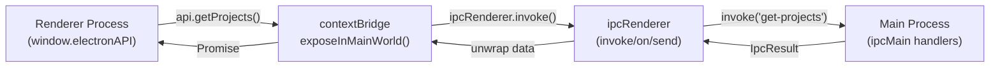
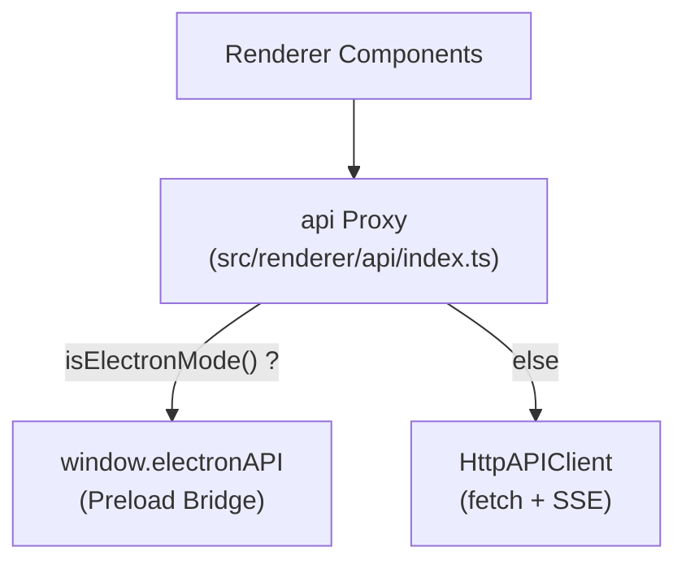
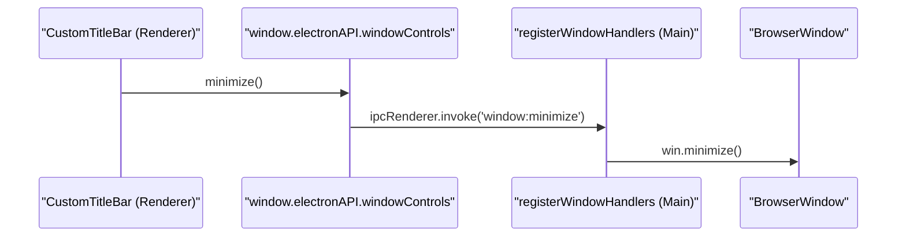

# Electron Process Model

<details>
<summary>Relevant source files</summary>

The following files were used as context for generating this wiki page:

- [src/main/index.ts](src/main/index.ts)
- [src/main/ipc/window.ts](src/main/ipc/window.ts)
- [src/preload/constants/ipcChannels.ts](src/preload/constants/ipcChannels.ts)
- [src/preload/index.ts](src/preload/index.ts)
- [src/renderer/api/httpClient.ts](src/renderer/api/httpClient.ts)
- [src/renderer/api/index.ts](src/renderer/api/index.ts)
- [src/renderer/components/common/UpdateBanner.tsx](src/renderer/components/common/UpdateBanner.tsx)
- [src/renderer/components/layout/CustomTitleBar.tsx](src/renderer/components/layout/CustomTitleBar.tsx)
- [src/renderer/components/layout/SidebarHeader.tsx](src/renderer/components/layout/SidebarHeader.tsx)
- [src/renderer/components/layout/TabbedLayout.tsx](src/renderer/components/layout/TabbedLayout.tsx)
- [src/shared/types/api.ts](src/shared/types/api.ts)

</details>


## Purpose and Scope

This page documents the three-process Electron architecture used by `claude-devtools`: the **main process** (Node.js environment with privileged access), the **preload script** (security boundary), and the **renderer process** (sandboxed browser environment running React UI). It also covers the unified API adapter that allows the renderer to function in both Electron and standalone browser modes via an HTTP sidecar.

For information about the specific services and contexts managed by the main process, see [Multi-Context System](). For details on IPC communication patterns and handler implementation, see [IPC Communication Layer](). For renderer-side state management patterns, see [State Management]().

---

## Three-Process Architecture Overview

Claude-devtools follows Electron's security-first architecture with strict process separation. Each process has distinct responsibilities and capabilities:

Title: Process Architecture Overview


**Process Isolation Guarantees:**
- Main process has full Node.js API access and filesystem privileges [src/main/index.ts:1-10]().
- Preload script runs with `contextIsolation: true` and limited API exposure [src/main/index.ts:436-437]().
- Renderer process cannot access Node.js APIs directly and must use the `window.electronAPI` bridge [src/renderer/api/index.ts:1-13]().

**Sources:** [src/main/index.ts:1-60](), [src/preload/index.ts:1-31](), [src/renderer/api/index.ts:1-13]()

---

## Main Process: Privileged Service Layer

The main process (`src/main/index.ts`) serves as the application orchestrator, managing lifecycle, services, and system-level operations.

### Core Responsibilities

| Responsibility | Implementation | Key Classes / Functions |
|---------------|----------------|-------------|
| **Application Lifecycle** | Window creation, app ready/quit handlers | `BrowserWindow`, `app` [src/main/index.ts:20-20]() |
| **Service Registry** | Context-scoped service instances | `ServiceContextRegistry` [src/main/index.ts:67-67]() |
| **SSH Management** | Remote connection lifecycle | `SshConnectionManager` [src/main/index.ts:68-68]() |
| **File Watching** | Real-time session updates | `wireFileWatcherEvents` [src/main/index.ts:105-139]() |
| **Configuration** | Settings persistence | `configManager` [src/main/index.ts:63-63]() |
| **Notifications** | Native OS notifications | `NotificationManager` [src/main/index.ts:65-65]() |
| **HTTP Server** | Optional sidecar API | `HttpServer` [src/main/index.ts:61-61]() |
| **Auto-Updates** | Update checking/installation | `UpdaterService` [src/main/index.ts:69-69]() |

### Service Initialization Flow

Title: Main Process Initialization Sequence


**Sources:** [src/main/index.ts:229-342](), [src/main/index.ts:540-585]()

### Global Service Instances

The main process maintains singleton or registry-managed service instances to coordinate state across the application:

```typescript
// Global service state (src/main/index.ts:76-83)
let mainWindow: BrowserWindow | null = null;
let contextRegistry: ServiceContextRegistry;
let notificationManager: NotificationManager;
let updaterService: UpdaterService;
let sshConnectionManager: SshConnectionManager;
let httpServer: HttpServer;
```

**Service Lifecycle:**
1. **Initialization**: Services are created and the local context is started before the window opens [src/main/index.ts:229-277]().
2. **Operation**: File watcher events from the active `ServiceContext` are wired to the renderer via `webContents.send` [src/main/index.ts:105-139]().
3. **Shutdown**: Clean disposal of contexts and connections occurs during the `before-quit` event [src/main/index.ts:375-407]().

**Sources:** [src/main/index.ts:76-83](), [src/main/index.ts:229-342](), [src/main/index.ts:375-407]()

---

## Preload Script: Security Boundary

The preload script (`src/preload/index.ts`) is the **only** bridge between the renderer process and Node.js APIs. It uses Electron's `contextBridge` to expose a controlled API surface.

### contextBridge Architecture

Title: Preload Bridge Data Flow


**Security Principles:**
- Renderer cannot access `require()`, `fs`, or `child_process` directly [src/main/index.ts:435-437]().
- All capabilities must be explicitly exposed via `contextBridge.exposeInMainWorld('electronAPI', ...)` [src/preload/index.ts:448-448]().
- Type-safe API interfaces are defined in shared code to ensure consistency [src/shared/types/api.ts:61-119]().

**Sources:** [src/preload/index.ts:448-448](), [src/shared/types/api.ts:128-200](), [src/main/index.ts:435-437]()

### ElectronAPI Interface

The preload script exposes a comprehensive `electronAPI` object. Key functional areas include:

| Area | Example Methods | File Reference |
|---------|---------|-----------------|
| **Core Data** | `getProjects()`, `getSessions()` | [src/preload/index.ts:130-131]() |
| **Notifications** | `notifications.get()`, `notifications.onNew()` | [src/preload/index.ts:179-187]() |
| **Config** | `config.get()`, `config.update()` | [src/preload/index.ts:218-219]() |
| **SSH** | `ssh.connect()`, `ssh.getStatus()` | [src/preload/index.ts:382-392]() |
| **Updater** | `updater.check()`, `updater.install()` | [src/preload/index.ts:434-436]() |
| **Window** | `windowControls.minimize()`, `windowControls.close()` | [src/preload/index.ts:333-338]() |

**Sources:** [src/preload/index.ts:128-445](), [src/shared/types/api.ts:61-119]()

### Type-Safe IPC Wrapper

Many IPC operations use a standard `IpcResult<T>` structure to handle errors gracefully across the process boundary:

```typescript
// src/preload/index.ts:85-89
interface IpcResult<T> {
  success: boolean;
  data?: T;
  error?: string;
}

// src/preload/index.ts:103-109
async function invokeIpcWithResult<T>(channel: string, ...args: unknown[]): Promise<T> {
  const result = (await ipcRenderer.invoke(channel, ...args)) as IpcResult<T>;
  if (!result.success) {
    throw new Error(result.error ?? 'Unknown error');
  }
  return result.data as T;
}
```

**Sources:** [src/preload/index.ts:85-109]()

---

## Renderer Process: Unified API Adapter

The renderer process supports two modes: **Electron Mode** (native app) and **Browser Mode** (via HTTP sidecar). This is managed by a unified API adapter in `src/renderer/api/index.ts`.

### Unified API Architecture

Title: Renderer API Abstraction


**Key Entities:**
- `isElectronMode()`: Checks for the existence of `window.electronAPI` [src/renderer/api/index.ts:57-57]().
- `HttpAPIClient`: Implements the `ElectronAPI` interface using `fetch` for requests and `EventSource` (SSE) for real-time events [src/renderer/api/httpClient.ts:46-55]().
- `api`: A Proxy object that lazily resolves the implementation on first access [src/renderer/api/index.ts:59-68]().

**Sources:** [src/renderer/api/index.ts:37-68](), [src/renderer/api/httpClient.ts:1-55]()

### Real-Time Event Handling

Real-time updates (like file changes or SSH status) are delivered differently based on the mode:
- **Electron**: `ipcRenderer.on` listeners set up in the preload script [src/preload/index.ts:318-325]().
- **Browser**: `EventSource` (SSE) listeners in `HttpAPIClient` [src/renderer/api/httpClient.ts:61-86]().

**Sources:** [src/preload/index.ts:318-325](), [src/renderer/api/httpClient.ts:61-86]()

---

## Window Controls and Platform Adaptations

For platforms where the native title bar is hidden (Windows/Linux), the renderer provides custom window controls.

### Custom Title Bar Flow

Title: Window Control IPC Flow


**Key Components:**
- `CustomTitleBar`: React component that renders minimize/maximize/close buttons [src/renderer/components/layout/CustomTitleBar.tsx:23-96]().
- `registerWindowHandlers`: Main process handlers for window manipulation [src/main/ipc/window.ts:19-49]().
- `needsCustomTitleBar()`: Logic to determine if the custom bar should be shown based on OS and configuration [src/renderer/components/layout/CustomTitleBar.tsx:17-21]().

**Sources:** [src/renderer/components/layout/CustomTitleBar.tsx:17-96](), [src/main/ipc/window.ts:19-49]()

### Platform-Specific UI
- **macOS**: Uses native traffic lights. The layout reserves space using the `--macos-traffic-light-padding-left` CSS variable [src/renderer/components/layout/TabbedLayout.tsx:27-34]().
- **Windows/Linux**: Renders the `CustomTitleBar` component at the top of the `TabbedLayout` [src/renderer/components/layout/TabbedLayout.tsx:36-36]().

**Sources:** [src/renderer/components/layout/TabbedLayout.tsx:23-52](), [src/renderer/components/layout/SidebarHeader.tsx:198-200]()
