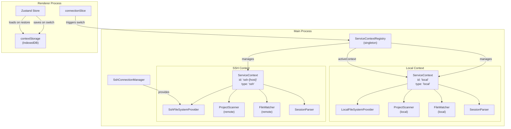
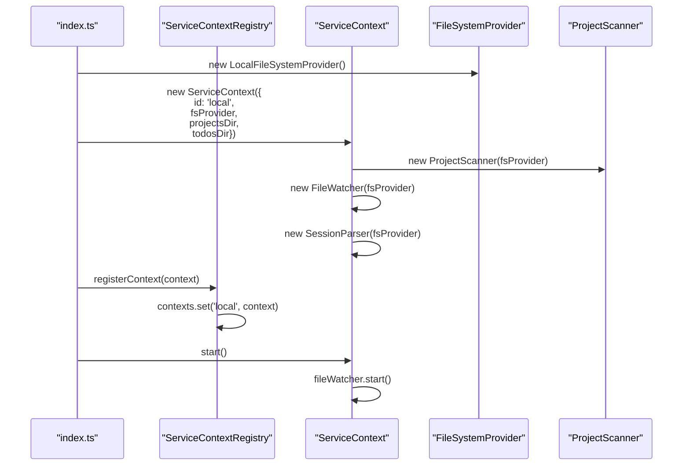
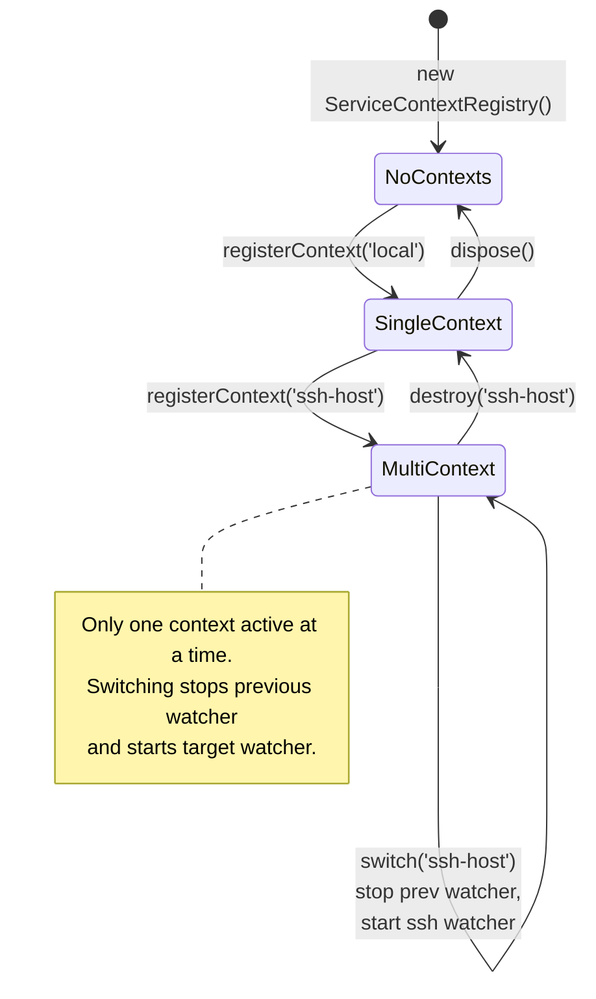
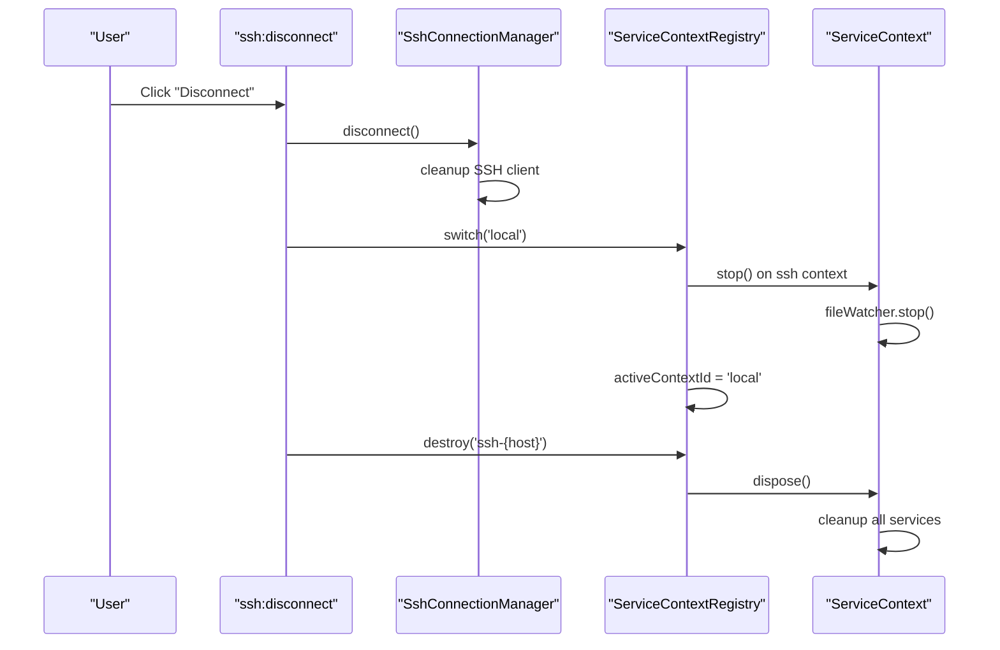
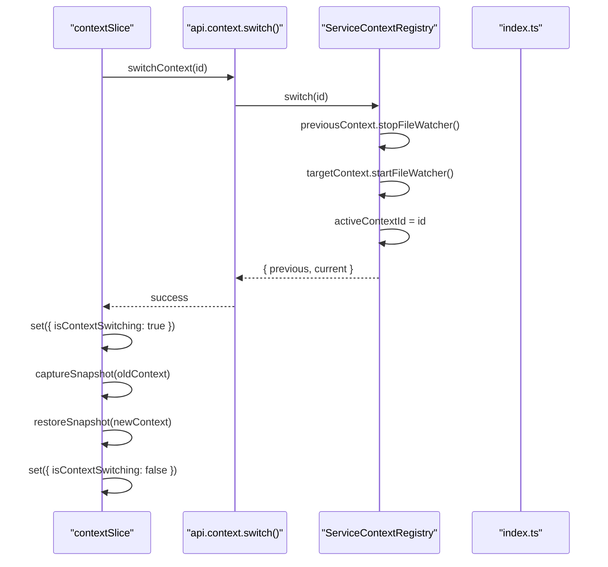

# Multi-Context System

<details>
<summary>Relevant source files</summary>

The following files were used as context for generating this wiki page:

- [src/main/services/infrastructure/ServiceContext.ts](src/main/services/infrastructure/ServiceContext.ts)
- [src/main/services/infrastructure/ServiceContextRegistry.ts](src/main/services/infrastructure/ServiceContextRegistry.ts)
- [src/main/services/infrastructure/index.ts](src/main/services/infrastructure/index.ts)
- [src/renderer/components/common/ConnectionStatusBadge.tsx](src/renderer/components/common/ConnectionStatusBadge.tsx)
- [src/renderer/components/common/ContextSwitchOverlay.tsx](src/renderer/components/common/ContextSwitchOverlay.tsx)
- [src/renderer/components/common/WorkspaceIndicator.tsx](src/renderer/components/common/WorkspaceIndicator.tsx)
- [src/renderer/services/contextStorage.ts](src/renderer/services/contextStorage.ts)
- [src/renderer/store/slices/contextSlice.ts](src/renderer/store/slices/contextSlice.ts)
- [src/renderer/store/types.ts](src/renderer/store/types.ts)

</details>


## Purpose and Scope

The Multi-Context System enables claude-devtools to seamlessly switch between local and remote SSH execution environments without restarting the application. Each context maintains its own isolated service stack (filesystem provider, project scanner, file watcher, session parser) while sharing the same renderer process. This page covers the `ServiceContextRegistry`, `ServiceContext` lifecycle, context switching mechanics, and snapshot-based workspace restoration.

For SSH connection management details, see [SSH Connection Manager](). For context snapshot IndexedDB schema, see [State Management]().

---

## Architecture Overview

The system consists of three layers: the **ServiceContextRegistry** (singleton manager), individual **ServiceContext** instances (isolated execution environments), and pluggable **FileSystemProvider** implementations.

### Multi-Context System Architecture



**Sources:** [src/main/services/infrastructure/ServiceContextRegistry.ts:31-33](), [src/main/services/infrastructure/ServiceContext.ts:62-77](), [src/main/services/infrastructure/index.ts:14-15]()

---

## ServiceContext Structure

A `ServiceContext` encapsulates all services needed to scan, parse, and monitor Claude sessions in a specific environment. Each context has its own:

| Component | Purpose | Interface |
|-----------|---------|-----------|
| `fsProvider` | Filesystem abstraction | `FileSystemProvider` [src/main/services/infrastructure/FileSystemProvider.ts:1-20]() |
| `projectScanner` | Session discovery | `ProjectScanner` [src/main/services/discovery/ProjectScanner.ts:1-30]() |
| `fileWatcher` | Real-time file changes | `FileWatcher` [src/main/services/infrastructure/FileWatcher.ts:1-20]() |
| `sessionParser` | JSONL parsing | `SessionParser` [src/main/services/parsing/SessionParser.ts:1-20]() |
| `subagentResolver` | Nested session detection | `SubagentResolver` [src/main/services/discovery/SubagentResolver.ts:1-20]() |
| `chunkBuilder` | Conversation structure | `ChunkBuilder` [src/main/services/analysis/ChunkBuilder.ts:1-20]() |
| `dataCache` | Multi-tier caching | `DataCache` [src/main/services/infrastructure/DataCache.ts:1-20]() |

### ServiceContext Creation



**Sources:** [src/main/services/infrastructure/ServiceContext.ts:81-120](), [src/main/services/infrastructure/ServiceContextRegistry.ts:48-55]()

---

## ServiceContextRegistry

The `ServiceContextRegistry` is a singleton that manages all registered contexts and enforces single-active-context semantics. It tracks the `activeContextId` which defaults to `'local'` [src/main/services/infrastructure/ServiceContextRegistry.ts:33]().

### Core Methods

```typescript
// Key methods from ServiceContextRegistry
class ServiceContextRegistry {
  registerContext(context: ServiceContext): void // [src/main/services/infrastructure/ServiceContextRegistry.ts:48]()
  get(id: string): ServiceContext | undefined // [src/main/services/infrastructure/ServiceContextRegistry.ts:100]()
  getActive(): ServiceContext // [src/main/services/infrastructure/ServiceContextRegistry.ts:88]()
  getActiveContextId(): string // [src/main/services/infrastructure/ServiceContextRegistry.ts:201]()
  list(): Array<{ id: string; type: 'local' | 'ssh' }> // [src/main/services/infrastructure/ServiceContextRegistry.ts:191]()
  switch(targetId: string): { previous: ServiceContext; current: ServiceContext } // [src/main/services/infrastructure/ServiceContextRegistry.ts:119]()
  destroy(id: string): void // [src/main/services/infrastructure/ServiceContextRegistry.ts:156]()
  dispose(): void // [src/main/services/infrastructure/ServiceContextRegistry.ts:209]()
}
```

### Context Registry State Machine



**Sources:** [src/main/services/infrastructure/ServiceContextRegistry.ts:119-146](), [src/main/services/infrastructure/ServiceContextRegistry.ts:156-185]()

---

## Context Lifecycle

### Context Registration and Activation

When the application starts, a local context is created and registered. When an SSH connection is established, a new SSH context is registered and made active.

1. **Creation** - `new ServiceContext(config)` initializes all internal services [src/main/services/infrastructure/ServiceContext.ts:81-119]().
2. **Registration** - `registry.registerContext(context)` adds it to the internal Map [src/main/services/infrastructure/ServiceContextRegistry.ts:53]().
3. **Start** - `context.start()` activates the file watcher and cache auto-cleanup [src/main/services/infrastructure/ServiceContext.ts:125-138]().
4. **Switch** - `registry.switch(id)` pauses the old watcher and resumes the new one [src/main/services/infrastructure/ServiceContextRegistry.ts:135-141]().

### Context Destruction Flow



**Sources:** [src/main/services/infrastructure/ServiceContextRegistry.ts:156-185](), [src/main/services/infrastructure/ServiceContext.ts:166-189]()

---

## Context Switching Flow

Context switching is a coordinated operation between the main and renderer processes. The renderer uses the `contextSlice` to manage the lifecycle, including displaying a `ContextSwitchOverlay` [src/renderer/components/common/ContextSwitchOverlay.tsx:12-38]().

### Switching Sequence Diagram



**Sources:** [src/renderer/store/slices/contextSlice.ts:33-36](), [src/main/services/infrastructure/ServiceContextRegistry.ts:119-146]()

---

## Context Snapshots

To enable instant workspace restoration when switching contexts, the renderer persists state snapshots to IndexedDB via `contextStorage` [src/renderer/services/contextStorage.ts:81-93]().

### Snapshot Schema

The `ContextSnapshot` interface captures persistable state [src/renderer/services/contextStorage.ts:30-63]():

| Field | Type | Purpose |
|-------|------|---------|
| `projects` | `Project[]` | Project list |
| `sessions` | `Session[]` | Session list |
| `openTabs` | `Tab[]` | Open session tabs |
| `paneLayout` | `PaneLayout` | Multi-pane layout |
| `notifications` | `DetectedError[]` | Notification inbox |
| `sidebarCollapsed` | `boolean` | Sidebar state |

Snapshots have a **5-minute TTL** (`SNAPSHOT_TTL_MS`) [src/renderer/services/contextStorage.ts:18]().

### Snapshot Save/Restore Flow

When switching, the `contextSlice` captures the current state before updating the store with data from the target context [src/renderer/store/slices/contextSlice.ts:186-215](). If a valid snapshot exists in IndexedDB, it is used to restore the UI state (tabs, scroll positions, selections) [src/renderer/store/slices/contextSlice.ts:77-180]().

**Sources:** [src/renderer/services/contextStorage.ts:1-201](), [src/renderer/store/slices/contextSlice.ts:42-180]()

---

## Local vs SSH Contexts

### Comparison Table

| Aspect | Local Context | SSH Context |
|--------|---------------|-------------|
| **ID** | `'local'` | `'ssh-{host}'` |
| **Type** | `'local'` | `'ssh'` |
| **FileSystemProvider** | `LocalFileSystemProvider` | `SshFileSystemProvider` |
| **Lifecycle** | Permanent; cannot be destroyed [src/main/services/infrastructure/ServiceContextRegistry.ts:157]() | Ephemeral; destroyed on disconnect |
| **File Watching** | Native OS events via Chokidar | SFTP polling/stat monitoring |

### Visual Indicators

The `WorkspaceIndicator` component shows the active workspace and allows switching via a dropdown [src/renderer/components/common/WorkspaceIndicator.tsx:17-138](). The `ConnectionStatusBadge` provides visual feedback on the health of the connection [src/renderer/components/common/ConnectionStatusBadge.tsx:20-53]().

**Sources:** [src/main/services/infrastructure/ServiceContext.ts:35-46](), [src/renderer/components/common/ConnectionStatusBadge.tsx:30-52]()

---

## Summary

The Multi-Context System provides:

1. **Service Isolation** - Each context has its own `ProjectScanner`, `FileWatcher`, and `DataCache` [src/main/services/infrastructure/ServiceContext.ts:71-76]().
2. **Registry Management** - `ServiceContextRegistry` coordinates registration and switching [src/main/services/infrastructure/ServiceContextRegistry.ts:31]().
3. **State Persistence** - `contextStorage` saves UI snapshots to IndexedDB for instant restoration [src/renderer/services/contextStorage.ts:81]().
4. **UI Coordination** - `contextSlice` manages the transition states and snapshot lifecycle [src/renderer/store/slices/contextSlice.ts:24]().
